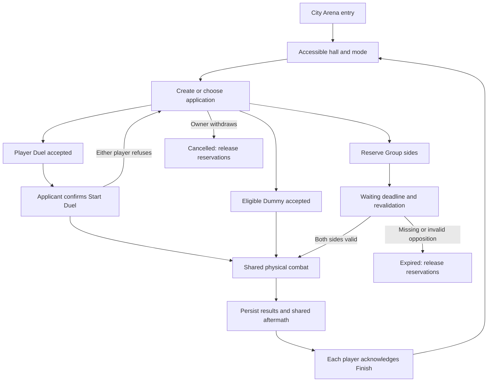

# Arena Book

Reviewed against the local working tree on **2026-09-15**. This is the complete
area guide to Arena entry, halls, Duel/Group applications, training opponents,
admission, match assembly, fighting, results, presentation and editing. It
describes authored baseline content and current code; it is not a live room
inventory or a new Neverlands capture.

Arena organizes fights. [COMBAT](COMBAT.md) explains the shared engine used by
Arena, wilderness encounters and scroll attacks. [FORMULAS](FORMULAS.md) owns
the numerical reference; [NPC](NPC.md) owns training creatures and drops;
[ITEMS](ITEMS.md) owns equipment; [WORLD](WORLD.md) owns location/return context;
[SCROLLS](SCROLLS.md) owns targeted entry/intervention; [ARTWORK](ARTWORK.md)
owns image specifications and exact production prompts.

The [Combat domain](domains/combat.md) connects the
[source registry](design/reference/combat/README.md),
[Arena design](design/areas/arena.md), [shared combat design](design/features/combat.md),
[MVP plan](design/launch_mvp_plan.md) and
[Arena Combat runtime handbook](features/arena_combat.md). That handbook retains
precise acceptance history and implementation gaps. Read and update the affected
owners together under [DOCUMENTATION's change triggers](DOCUMENTATION.md#22-change-triggered-documentation-updates).

## Contents

- [1. Scope and evidence](#1-scope-and-evidence)
- [2. City entry, halls and presence](#2-city-entry-halls-and-presence)
- [3. Applications and admission rules](#3-applications-and-admission-rules)
- [4. Duel and Group lifecycle](#4-duel-and-group-lifecycle)
- [5. Training Dummy and NPC supply](#5-training-dummy-and-npc-supply)
- [6. Shared combat, formulas and outcomes](#6-shared-combat-formulas-and-outcomes)
- [7. UI, logs and artwork](#7-ui-logs-and-artwork)
- [8. Server ownership, HTTP and recovery](#8-server-ownership-http-and-recovery)
- [9. Worked player flows](#9-worked-player-flows)
- [10. Editing and extension recipes](#10-editing-and-extension-recipes)
- [11. Verification, limitations and maintenance](#11-verification-limitations-and-maintenance)
- [Use cases and cross-feature effects](#use-cases-and-cross-feature-effects)

## 1. Scope and evidence

Only **Duels / Дуэли** and **Groups / Групповые** are launch mode tabs.
Help, Training, Trial and the other halls are locations, not additional modes.
Training NPCs appear as ordinary Duel applications. Sacrificial, Tactical and
Totalizator modes are excluded. The persisted enum's old `sacrifice` value does
not make it available: new application validation allows only `duel` and
`team_battle`.

| Evidence layer | What it establishes |
|---|---|
| [September 12 live Arena observation](design/reference/combat/observations/2026-09-12_arena_duels_and_groups.md) | City entry, ten-hall scheme/gates, Duel/Group controls, posting/withdrawing, waiting navigation lock, Group 1×1 becoming 1×2, empty-opposition expiry |
| Earlier starter captures indexed in [Arena design](design/areas/arena.md#observed-arena-flow) | Dummy applications, their side gates and immediate eligible NPC acceptance into shared combat |
| Preserved official-wiki reading in the September 12 observation | Unarmed means no clothing as well as no weapons; group side selection/limits, closed non-intervention and timeout options; live Patrons minimum 16 overrides the older article's 9 |
| Authorized local interpretation | Groups wait until their deadline even when full and may start underfilled with both sides present; fitted artifact/XP rules |
| [Final local Arena acceptance](features/arena_combat.md#final-physical-arena-acceptance) | Player Duel/Group and eligible Dummy flows, shared physical turns, result recovery, Finish, logs, chat, artwork and responsive controls |

The September 12 source cycle completed **zero new Arena fights**: no human
opponent was available and the level-17 character could not accept the starter
Dummy. The prior 10+10+2 fights remain wilderness evidence. Local multiplayer
fixtures and formula fits must not be relabeled source PvP observations.

All new Arena matches are **physical-only**. Existing bounded magic support in
the common engine is not enabled by an Arena form or an injected Dummy spell
profile. Clan group modes, clan admission and a lobby action for joining an
already-running fight are not delivered.

## 2. City entry, halls and presence

The player enters through the Arena hotspot in Forpost's city square. Opening
an Arena URL alone does not establish City entry. The
[entry gate](../app/controllers/concerns/arena_entry_gate.rb) uses authenticated
character state and [ResumeContext](../app/services/game/world/resume_context.rb)
to validate the current location, prior authorized entry, saved accessible hall
or existing reservation. An active fight or unfinished result takes priority.

### Authored hall catalog

[Room seeds](../db/seeds/arena_rooms.rb) identify rooms by stable `slug`.
Database IDs are local identities and must not be hard-coded into links or
game rules. These are the ten current baseline definitions:

| Slug | Local label / source hall | Inclusive levels | Alignment |
|---|---|---|---|
| `help` | Help Hall / Зал Помощи | 0–5 | Any |
| `training` | Training Hall / Тренировочный зал | 5–10 | Any |
| `trial` | Trial Hall / Зал Испытаний | 5–33 | Any |
| `initiation` | Initiation Hall / Зал Посвящения | 9–33 | Any |
| `patron` | Patrons Hall / Зал Покровителей | 16–33 | Any |
| `law` | Law Hall / Зал Закона | 0–33 | Law |
| `light` | Light Hall / Зал Света | 0–33 | Light |
| `balance` | Balance Hall / Зал Равновесия | 0–33 | Balance |
| `chaos` | Chaos Hall / Зал Хаоса | 0–33 | Chaos |
| `dark` | Dark Hall / Зал Тьмы | 0–33 | Dark |

[ArenaRoom](../app/models/arena_room.rb) also requires `active: true`, no active
airship journey and, when `zone_id` is set, the character's current persisted
zone. Unbound rooms still require authorized City Arena entry at the HTTP
boundary. The authored seed does not bind these rooms to a zone.

`max_concurrent_matches` defaults to **10** in the schema. Capacity is
`pending + matching + live < maximum`; completed matches and waiting
applications are not active fights. This is local infrastructure policy, not a
captured Neverlands hall population limit. Player application creation, player
Duel acceptance, Group settlement and NPC acceptance check it under the room
lock. NPC supply also checks it while creating an offer. A full room rejects
NPC acceptance without consuming the waiting offer or creating participations.

### Saved context and audience

Actual HTML hall entry saves the integer room ID after access validation; JSON
preview does not select it. Login/reload restores an accessible selection.
Invalid, missing, inactive or foreign-city selections fall back through the
World/City context owner. Moving to another node clears the old room context.
The UI does not select a hall automatically from the character's level.

Ordinary chat and player presence use the persisted selected hall, keeping
different halls separate even in the same city cell. Application totals in the
lobby are **offer counts**, not online-player counts. The underlying presence
freshness interval is a local technical policy; no source inactivity timeout is
claimed. See [World context](WORLD.md#5-travel-context-and-return-behavior) and
the [Shell event catalog](features/game_shell.md#gameplay-event-catalog).

## 3. Applications and admission rules

An application saves terms for a prospective fight. A Group membership reserves
a particular side. Neither is an active combat turn. The server revalidates
submitted IDs, enums, terms, character state and target application; disabled
controls and browser number-field limits are only presentation.

### Terms the player can choose

| Term | Allowed values and behavior |
|---|---|
| Mode | `duel` or `team_battle`; room tabs use `ft=1` / `ft=2` |
| Duel equipment kind | `no_weapons`, `no_artifacts`, `limited_artifacts`, `free` |
| Additional Group kinds | `alignment_vs_alignment`, `alignment_vs_all`, `closed` |
| Turn timeout | 120 / 180 / 240 / 300 seconds |
| Trauma | 10 / 30 / 50 / 80 percent injury probability on ordinary defeat |
| Group wait | 5 / 10 / 15 / 30 / 45 / 60 minutes |
| Own side A | `team_count`, `team_level_min`, `team_level_max`; creator occupies A |
| Opposing side B | `enemy_count`, `enemy_level_min`, `enemy_level_max` |
| Capacity per side | Integer 1–30; closed limits each side to 1–10 |
| Level range per side | Integer 0–33, minimum ≤ maximum; creator must fit A |
| Group 1×1 | Normalizes to saved capacity 1×2; not a separate Duel |

The visible new form has blank required choices. Handler defaults for omitted
values are Duel/free, timeout **180**, trauma **30**, wait **10** minutes; blank
invalid values are not permission to bypass validation. The Duel UI has no wait
selector and uses the default. Group fields are independent but each participant
must also pass their hall's gate: a 0–33 Group range cannot admit level 2 into
Trial Hall. Scrolls' ±3 target-level rule is not an Arena application rule;
Arena uses its hall and posted side ranges. These terms cannot be edited through a posted-application UI;
withdraw and repost to change them.

### Equipment and alignment

[EquipmentRule](../app/services/arena/equipment_rule.rb) reads actual equipped
inventory and authored `artifact_grade` on the character and items:

- **Unarmed:** every equipment slot must be empty, including clothing. Arena
  rejects equipped entrants; it does not automatically strip them.
- **No artifacts:** all grades must be `none`.
- **Limited artifacts:** only recognized grades with configured multipliers
  at most **1.1**. Unknown grades fail restricted admission. This classification
  is fitted, configured in [combat calibration](../config/gameplay/combat_calibration.yml),
  and never inferred from price, rarity, name or the drawn image.
- **Free:** no equipment-category restriction; ordinary eligibility still
  applies. Closed and alignment kinds are separate enum choices, not switches
  that can be combined with an unarmed/limited kind.

Alignment-vs-alignment requires a non-neutral creator; A matches the creator,
B has a different non-neutral alignment, and subsequent B members match that
side's first alignment. Alignment-vs-all keeps A aligned with the creator and
allows any alignment on B, including neutral. Hall alignment restrictions still
apply, so a restricted hall can make some opposition impossible.

### Health, reservation and failure

Exact HP admission, shared by creation/acceptance and Group start checks:

```text
maxHP > 0
currentHP × 100 >= maxHP × 50
```

Thus **100/201 fails**, while **101/201 passes**. Rounded display percentages
are not authoritative. Full HP is not required and combat does not heal the
entrant to full. These calculations use saved character HP/maxHP at admission;
combat's effective equipment-aware values remain with its profile owner.

Players cannot create/join another application while reserved, already fighting
or holding an unacknowledged result. A Duel cannot accept itself. Group join
requires an open, unexpired offer, a valid `a`/`b` side, available capacity,
matching levels/HP/equipment/alignment and no existing membership.

Waiting disables Character, Inventory and City controls. The
[reservation concern](../app/controllers/concerns/arena_reservation.rb) also
guards direct Character/Inventory/equipment, Shop, World/City, Medical and
airship requests under the character lock. A forged request cannot escape
the waiting state just because its browser control was enabled. The read-only
World player list remains allowed. Own cancellation or expiry releases the
reservation; an active match or unfinished result redirects to that match.

Failures return errors without constructing partial teams, matches or rewards.
Visible eligibility is a preview; mutation-time validation remains decisive.
For complete equations and tuning boundaries, use
[ARENA-01](FORMULAS.md#arena-01--admission-and-deadlines).

## 4. Duel and Group lifecycle



### Player Duel

The applicant posts one open offer. Another eligible player accepts it under
room → application → ordered character locks. The handler rechecks both
players, current room capacity, health and equipment, then creates one pending
match and two participations: applicant A, acceptor B. It records paired
matched applications and the original applicant id. Both players remain reserved.

The original applicant must click **Start Duel**. Acceptance has no automatic
start schedule. Either participant may **Refuse Duel**, cancelling the unused
match and reopening the original offer (or expiring it if its deadline passed).
The acceptor can then accept the same offer again. Start/refusal lock room,
match, applications and ordered players. Start rechecks room access, HP,
equipment and application expiry; a failed or repeated command cannot start
another fight or settle rewards. Jobs and reloads cannot bypass confirmation.
The accepted lobby is rendered at the reserved match URL; its shared polling
recovers start/refusal when a broadcast is missed.

An unaccepted Duel expires at its waiting deadline. Cancellation is restricted
to its owner and open state. A matched offer cannot be cancelled like a waiting
application; use the explicit Refuse Duel transition before combat.

### Group assembly

Creation also persists the creator's A membership. Every additional player
chooses a side and joins the same application. A member may leave their own
place; if the creator withdraws, the entire application becomes cancelled.
Historical memberships may remain attached to that closed application, but no
longer reserve players.

At **`now >= expires_at`**, settlement locks room, application and roster
characters in ID order. It requires both sides, counts within saved capacities,
room capacity and valid access/health/equipment/levels/alignment for every
remaining member, with none already in combat or holding an unfinished result.
It then creates a participation for every member and starts the common engine
immediately. Groups do not use the applicant-confirmed Duel transition.

An invalid roster expires safely; the service does not silently drop invalid
members or fill places with invented NPCs. A 3×3 application with valid 2×1
membership may start at the deadline. Filling 3×3 early does not start early.
Those two policies are authorized local interpretations pending source evidence.

### Separate clocks and closed fights

| Clock | Purpose | Boundary |
|---|---|---|
| Application wait | Assemble opponents before any fight | `now >= expires_at`; absent opposition expires |
| Player-Duel confirmation | Applicant decides when accepted Duel starts | Persisted applicant id and confirmation flag; Start rechecks admission |
| Turn timeout | Allow response to the current combat round | Common engine's turn deadline and claim validation |
| Global fight limit | Bound the whole live match | **300 seconds from combat start**, independent of selected turn timeout |

Closed limits sides to ten and prevents scroll intervention. Ordinary Arena
applications also have no lobby button for late join. However, the later
[Permit I scroll](SCROLLS.md#5-shared-combat-entry-and-aftermath) can intervene
in an eligible non-closed ongoing fight against a living target in the same
location. It preserves receiving rules/deadlines and enters the current living
player commitment barrier. Fist Attack rejects an already-fighting target.
These are Inventory entry rules, not a second Arena assembly path.

## 5. Training Dummy and NPC supply

The only authored Arena NPC is `arena_training_dummy`, displayed as **Training
Dummy** (source Манекен). Its baseline is in
[arena_npcs.yml](../config/gameplay/arena_npcs.yml):

| Field | Current definition |
|---|---|
| Role / level / HP | `arena_bot` / 1 / 30 |
| Attack / defense / agility | 1 / 0 / 1; these are inputs, not guaranteed damage |
| AI behavior | `passive` |
| Authored XP reward | 5, subject to the shared reward contract |
| Allowed halls | `help`, `training` |
| Acceptor levels | **0–5**, independently of hall access |
| Application | Duel/free; 300-second turns, trauma 30%, waiting 5 minutes |
| Source row marker | `neverlands_rule_value: 10`; does not enable another fight mode |
| NPC-side display range | 0–33; does not override the player's 0–5 acceptance range |
| Loot | One Wood Chips item, typed material, quantity 1, weight 1, configured chance 1.0; successful inventory delivery still obeys the shared award rules |
| Portrait | [scarecrow.png](../app/assets/images/npc/scarecrow.png), complete 690×1530 composition |

Both hall and opponent gates apply: Help admits levels 0–5 against the Dummy;
Training Hall admits levels 5–10, but **only level 5** can accept this Dummy
there. A level-17 player needs another player application in an accessible hall,
not a bypass of the starter gate.

Accepting an eligible NPC offer immediately creates and starts the same match:
the player is participation A, the NPC B, regardless of how the lobby row was
drawn. NPC HP is persisted with the participation. Authored legacy spell keys
do not bypass this new match's `physical_only` flag. The portrait's visible props
are not equipment, defenses or loot.

### Configuration and replenishment

[ArenaNpcConfig](../app/services/game/world/arena_npc_config.rb) loads and caches
the YAML, validates typed loot and optional integer acceptance bounds, and
collects room membership without mutating another room's list. Its current
`sample_npc` returns the first eligible definition; there is no weighted Arena
NPC lottery and the default fallback list is empty.

[NpcApplicationService](../app/services/arena/npc_application_service.rb) finds
or creates the template by stable key, synchronizes configured metadata, then
creates its offer. Explicit NPC acceptance bounds are copied into a new offer;
absent bounds use the hall range. Already-posted terms are not rewritten when
configuration changes. It rejects an existing open offer for the same NPC/room;
a room lock plus the partial unique `one_open_npc_offer_per_room` index protect
concurrent creation. Expired offers are retired before replacement, including
exactly at their deadline. Broadcasts occur after the outermost commit.

[NpcSpawnerJob](../app/jobs/arena/npc_spawner_job.rb) targets **Training** in its
default loop, replenishes when fewer than **one** open NPC offer exists and
reschedules itself after **60 seconds**. Expired rows do not count as supply.
Help remains content-eligible for explicit supply, outside the default list.
A room-specific job does not reschedule itself. Authorized Training entry or
refresh also restores missing supply through the same service before acquiring
the character lock. This bounded fallback needs no live worker and cannot
duplicate an offer when delayed jobs later run. The default loop still needs
an initial enqueue; it is optional for player-triggered recovery. Never infer
production worker health from a local test.

See the [NPC Arena section](NPC.md#arena-dummy-and-player-side-reuse) for the
creature/portrait/loot handoff. Do not add generic stronger training bots just
because a higher hall has no opponents.

## 6. Shared combat, formulas and outcomes

Arena produces `ArenaMatch` and `ArenaParticipation` records. From there it
uses the same profiles, action validation, resolution, NPC AI, damage credit,
XP, injuries, wear, events and UI as wilderness and scroll combat. `ArenaMatch`
is a shared model name; it does not mean every fight occurs in an Arena hall.

### What levels, equipment and selections change

| Input | Effect on Arena combat | Full maintained reference |
|---|---|---|
| Level and allocated stats | Hall/application admission, progression grants, HP/MP/AP, reward inputs; level alone does not replace effective stats with an automatic damage curve | [Progression and grants](FORMULAS.md#2-experience-levels-and-grants), [combat inputs](COMBAT.md#4-levels-skills-equipment-and-combat-inputs) |
| Strength, mastery, weapon family, artifact grade | Attack power, action cost and calibrated damage | [Physical cost](FORMULAS.md#combat-01--physical-action-cost-and-package-validation), [damage](FORMULAS.md#combat-03--physical-damage) |
| Dexterity, Luck, accuracy/evasion and opposing ratings | Hit, dodge, critical and opposed defense probabilities | [Hit/dodge/block](FORMULAS.md#combat-02--hit-dodge-critical-and-physical-block) |
| Health, armor, resistance and penetration | Health adds the hidden physical armor factor; these inputs reduce connected damage; high defenses can produce a genuine zero-damage hit | [Damage order](COMBAT.md#6-hit-block-dodge-critical-and-damage-formulas) |
| Shield and body selection | Shield/normal block table, protected regions, AP cost and penetration chance | [AP and defense](COMBAT.md#5-complete-turns-ap-and-defense) |
| Subscription | NPC search level window and fight-XP cap; not a direct attack multiplier | [Premium limits](FORMULAS.md#reward-02--premium-limits) |
| Injury and recovery | Temporary effective-stat penalties and subsequent eligibility/vitals | [Injuries](FORMULAS.md#injury-01--defeat-injury-and-stat-penalty), [recovery](FORMULAS.md#recovery-01--elapsed-hpmp-regeneration) |

Base AP is `80 + 10 if level >= 5 + 10 if level >= 10 + Extra AP`.
Physical cost uses equipped weapon/mastery inputs, or the unarmed baseline;
aimed attacks cost the simple attack cost plus **20**. Attack-count penalties
and the selected **40/70/90 AP** block are added to the package. Read the full
formula before tuning: those AP values are costs, not block percentages.

The player submits a **whole turn package**, not an immediate standalone hit.
The server validates participant ownership, life state, current round, living
enemy target, supported action keys/body zones, package shape, AP and pending
submission. New Arena spell submissions reject. In player fights it waits for
every living player to commit; in a solo Dummy exchange, the selected NPC's
response is computed with the player turn.

If A attacks the head and B has a head-protecting block, the matching region
makes that defense applicable. It does **not** guarantee a block: the common
hit/dodge/block/penetration/damage formulas decide and log the outcome. Submitted
defense applies to that exchange, not a permanent stance across all later rounds.

Defeated players/NPCs leave active cards, targeting and readiness. They remain
in statistics, XP attribution and history. An already-committed return can
resolve in its current exchange even after a lethal hit; that is different
from letting a defeated fighter submit another round. Manual target switches
have the shared finite budget; automatic handoff after defeat is separate.

### End, reward and return

The shared engine handles victory, draw, surrender and validated timeout claims.
A surrender defeats that participant; living teammates can continue. The global
300-second deadline produces the shared timeout result, not a winner chosen by
remaining HP. A claimant must have committed a pending turn and satisfy the
server's timeout rule. Decisive timeout injury is a distinct exception below.

| Outcome | Current behavior and owner |
|---|---|
| XP | [Shared reward formula](FORMULAS.md#reward-01--shared-npc-and-player-experience) uses defeated NPCs or damaged player opponents, snapshotted level/HP, cumulative credited damage, team contribution, trauma factor and level/premium cap. Draws and untouched surrender grant zero. Credit is bounded by HP available per strike; restored HP can be damaged again for XP. Raw overkill remains log-only. |
| Group reward | Each recipient's calculated gross reward is weighted by `0.2 / team player count + 0.8 × credited damage share` before applicable caps/rounding. Gross depends on that recipient's level; it is not one common level-independent pool. Defeated winning contributors remain eligible. |
| Trauma and severity | Ordinary defeat first rolls selected 10/30/50/80% trauma, then conditional severity light 80%, medium 18%, heavy 2%. At 10% trauma: 90% no injury, 8% light, 1.8% medium, 0.2% heavy, absent exceptions. |
| Exceptions/treatment | Decisive timeout can impose heavy injury; combat-category injury is a separate guaranteed path. Named injuries and treatment belong to [Medical Care](features/medical_care.md). Doctor bag skill thresholds are enforced at request and paid acceptance. |
| Wear | Arena win/draw 0%, defeat 1% per eligible equipped item; Careful Fighter halves it. [WEAR-01](FORMULAS.md#wear-01--durability-after-a-fight) owns the roll, decrement and zero-durability behavior. |
| Drops | Dummy/NPC typed loot goes through the common inventory/NV awarders. Player defeat does not create NPC loot or permit taking another player's inventory. |
| Finish | Each participant independently acknowledges the completed result. It returns an ordinary Arena entrant to the accessible original hall and Duel/Group tab; an invalid hall falls back through Arena/World entry validation. |

Finalization persists results and rewards once. Finish is acknowledgement, not
a fresh XP/drop roll. Reload/login restores an unacknowledged physical result,
including when opponents finished while the player was offline. An old Finish
cannot clear a newer active fight. A scroll entrant returns to Inventory under
its own entry contract, even if the receiving match originated in Arena.

The shared winning-player XP coefficient is **1.9**, calibrated from the
[September 15 Permit fight](design/reference/inventory/observations/2026-09-15_successful_attack_scroll.md):
300 credited HP at low trauma yielded 570 XP. It applies to Arena player
opponents too, without an Arena-specific reward pipeline. NPC and PvP-loss
coefficients remain 0.85. This outside-Arena observation does not resolve the
earlier level-24 Arena winner's 566 XP; [REWARD-01](FORMULAS.md#reward-01--shared-npc-and-player-experience)
records that approximation and the remaining level/trauma/cap factors.

Full mechanics and exact calculator/configuration links remain in
[COMBAT](COMBAT.md#8-injuries-wear-recovery-and-finish) and [FORMULAS](FORMULAS.md);
Arena changes must keep those shared descriptions synchronized.

## 7. UI, logs and artwork

### Lobby and application rows

The local screen preserves the persistent game shell and compact source
hierarchy: character/vitals and navigation, hall heading, filters/count/Refresh,
scheme toggle, Duels/Groups tabs, inline form or waiting message, application
rows, active-fight links. The entry overview also lists five recent participant
matches with public-log links.

The room's default filter is own level; `level=all` shows all fetched rows.
Own applications stay visible. For Groups either side's level range can make
a row visible; visibility is not proof of complete eligibility. Room reads are
bounded to **100** open applications ordered oldest first and **20** active
matches. The level filter is applied to that fetched application slice. The
overview's total counts open room offers, independently of a room's filtered
display. Explicit room Refresh currently returns to the default level filter.

Rows show original rule/time/trauma icons, creation time, saved side sizes and
level ranges, bold names/levels, side radios and Accept. Ineligible radios and
buttons are disabled; server errors remain authoritative. Groups show a
remaining-start label, own Cancel Application or member Leave Group. The
waiting form becomes a red status message, with restricted navigation disabled.
Controls use Rails forms and target the full shell (`_top`) so URLs, presence
and fight state advance together.

Current [Arena CSS](../app/assets/stylesheets/arena.css) uses an 11px
Verdana/Arial base on white; 90% inner width, a 3px blue `#4a6795` tab rule,
gray tabs and cream `#faf9f3` form rows. Selects/buttons use compact 10px text.
At ≤600px the inner width becomes 98%, the room-page scheme becomes two columns,
buttons reach 30px minimum height and fields 28px. Inputs wrap and keyboard
focus has a visible outline. The overview has its own table-based hall scheme;
do not assume the two-column rule applies to every table.

### Fight, history and chat

Fight cards, equipment, living-only rosters, AP controls, pending/defeated states
and result panels are the shared [combat UI](COMBAT.md#9-ui-realtime-delivery-logs-and-artwork).
Names and meaningful damage/outcome fragments use structured emphasis in logs.
The public `/log/:id` page provides history/statistics outside the gameplay
shell, with its own access contract. Participant turns/Finish remain protected;
being able to watch or read history does not authorize mutation.

Private completion/XP and successful NPC item/NV messages join the shell chat
timeline. Detailed attacks/blocks remain in the fight log. Room chat is still
ordinary player communication, not a replacement combat ledger. See the
[event catalog](features/game_shell.md#gameplay-event-catalog) for producer,
recipient, wording, persistence and retry ownership.

### Asset inventory and production references

| Consumer | Original project asset / delivery | Production owner |
|---|---|---|
| Application equipment symbol | [rule.png](../app/assets/images/arena/rule.png), 64×64, contained at 16×16 CSS px | [Three Arena icons: exact prompts and packaging](ARTWORK.md#september-12-arena-application-icons) |
| Application turn timer | [timeout.png](../app/assets/images/arena/timeout.png), same delivery | Same Arena icon record |
| Application trauma | [trauma.png](../app/assets/images/arena/trauma.png), same delivery | Same Arena icon record |
| Training portrait | [scarecrow.png](../app/assets/images/npc/scarecrow.png), 690×1530, whole silhouette contained | [Dummy correction and exact prompt](ARTWORK.md#september-12-training-dummy-portrait-correction) |
| Player portraits/equipped slots | Shared character and item artwork consumed by fight cards | [Combat artwork](COMBAT.md#9-ui-realtime-delivery-logs-and-artwork), [item images](ITEMS.md#5-artwork-and-presentation) |
| Arena building on City square | Part of the authored City composition/hotspot | [World scenes](WORLD.md#6-map-and-location-artwork), [City scene production](ARTWORK.md#2026-09-10--central-square-complete-2512-composition) |

The source lobby has no large illustration. The standalone project
[arena.png](../app/assets/images/arena.png) is a building reference; its existence
does not authorize placing a banner above applications. Forms, borders, labels,
disabled state and focus are HTML/CSS. Neverlands bitmaps are not runtime assets.
Keep full canvases, aspect ratio and containment; exact prompts stay in ARTWORK,
with links here rather than separately maintained prompt copies.

## 8. Server ownership, HTTP and recovery

### Persisted records and transactions

| Owner | Responsibility |
|---|---|
| [ArenaRoom](../app/models/arena_room.rb) | Hall identity, gates, optional zone binding and active-match capacity |
| [ArenaApplication](../app/models/arena_application.rb) | Immutable posted terms, expiry, applicant-or-NPC identity, eligibility and state |
| [ArenaApplicationMembership](../app/models/arena_application_membership.rb) | Actual Group side reservations; [migration](../db/migrate/20260912120000_create_arena_application_memberships.rb) adds foreign keys, unique application/character and `a`/`b` constraint |
| [ArenaMatch](../app/models/arena_match.rb) | Common pending/live/completed state, current round, deadlines, metadata and result |
| [ArenaParticipation](../app/models/arena_participation.rb) | Player/NPC side, profile, pending turn, defeat/result/credit and Finish marker |
| [ApplicationHandler](../app/services/arena/application_handler.rb) | `create(character:, room:, params:)`, `accept(application:, acceptor:, team:)`, `cancel(application:, character:)`, `confirm_duel(match:, character:, refuse: false)`; result contains success/application/match/errors; owns Duel reservation/start/refusal and NPC entry transactions/presentation |
| [GroupAssembly](../app/services/arena/group_assembly.rb) | `join`, `withdraw` return a result; `settle(application:)` starts one valid due Group or expires it; accepts publisher/clock collaborators |
| [CombatProcessor](../app/services/arena/combat_processor.rb) | Common start, intent/timeout, resolution/finalization; downstream profiles/calculators/awarders are indexed in [COMBAT's implementation map](COMBAT.md#11-implementation-and-editing-map) |

Player create locks room then character; Duel/NPC accept locks room then
application then involved characters (ordered for multiple players); Group
mutations follow room → application → ordered characters. The membership
constraint prevents joining both sides of one offer. Character locking and
reservation checks prevent competing applications through supported services;
this is not a database-wide unique active-reservation constraint.

Application states include `open`, `matched`, `started`, `expired`, `cancelled`.
Supported accepted paths persist `matched` and link the actual match; do not
infer current fight state from the legacy `started` enum alone. Match state and
participations own combat. NPC supply uses the same room-first lock order and
a partial unique index for open room/NPC pairs. The September 15 migration
retains the earliest duplicate offer and cancels only extra unclaimed NPC
rows, preserving their history; rollback removes the index, not those decisions.

### HTTP surfaces

Routes are defined in [routes.rb](../config/routes.rb), not in the JavaScript:

| Route | Contract |
|---|---|
| `GET /arena` | City-gated overview; existing fight/result/reservation takes precedence |
| `GET /arena_rooms/:id` | Accessible hall/tab/filter; HTML saves authorized room context, JSON previews |
| `GET /arena_rooms/:id/arena_applications` | Bounded open application list; current room access required |
| `POST /arena_rooms/:id/arena_applications` | Create validated terms and, for a Group, creator membership |
| `POST /arena_rooms/:room_id/arena_applications/:id/accept` | Accept player/NPC Duel or reserve selected Group side; nested ID must belong to that room |
| `DELETE /arena_rooms/:room_id/arena_applications/:id` | Owner cancellation or own Group withdrawal |
| `POST /arena_applications/:id/accept`, `DELETE /arena_applications/:id/cancel` | Unnested aliases through the same handler and authorization |
| `GET /arena_matches/:id` | Shared match UI/state and due-start/result recovery |
| `POST /arena_matches/:id/action`, `/switch_opponent`, `/claim_timeout`, `/finish` | Participant-authorized intents through the shared pipeline |
| `GET /arena_matches/:id/log`, `GET /log/:id` | Match log projection / separate public history and statistics |

Controllers authenticate, resolve records and choose responses. Create succeeds
with an HTML room redirect or JSON 201; accept returns match/countdown/redirect
or a Group room destination. Invalid terms/state produce HTML feedback or JSON
422; inaccessible entry/list returns JSON 403; protected reservation requests
return JSON 409 or a redirect. Match mutation authorization is owned by
[ArenaMatchPolicy](../app/policies/arena_match_policy.rb). Rails CSRF protection
and locked server checks remain necessary even for native forms.

`GET /arena/lobby` redirects to `/arena` through the existing City entry gate.
The canonical overview then restores an active reservation/fight/result or
renders rooms; no duplicate lobby template is maintained.

### Jobs, realtime and reconnect

- [ApplicationDeadlineJob](../app/jobs/arena/application_deadline_job.rb) settles
  Groups from persisted expiry; missing, early or repeated settlement is safe.
- [ApplicationRecovery](../app/services/arena/application_recovery.rb) handles at
  most 100 due open offers from a supplied scope. It settles Groups or expires
  ordinary offers on relevant lobby/owner requests, before controller character
  locks. Enqueue failure does not erase the persisted deadline.
- [MatchStarterJob](../app/jobs/arena/match_starter_job.rb) and `start_due?` retain
  compatibility for older pending matches. New human Duels require applicant
  Start; a delayed job or reload cannot bypass that confirmation.
- [RealtimePublisher](../app/services/arena/realtime_publisher.rb) delivers
  presentation best-effort. A Cable/Redis failure must not roll back committed
  gameplay. Application/Group transitions publish after commit.
- [ArenaChannel](../app/channels/arena_channel.rb) carries lobby/room notifications;
  [arena_controller.js](../app/javascript/controllers/arena_controller.js) uses
  them to refresh or navigate participants. The room stream currently checks
  room existence, not gameplay admission; HTTP actions still perform admission.
  Do not treat channel subscription as proof of access or a private-room ACL.
- Stimulus updates deadline labels each second; a waiting page retries every
  five seconds **only once due**, avoiding ordinary pre-deadline refresh churn.
  It suppresses refresh for 30 seconds after form editing and while forms are
  busy, and disconnects timers/subscriptions. Display clocks never start a
  fight or grant a result independently of the server.

The [Sidekiq queue list](../config/sidekiq.yml) includes `arena` and `default`.
Running source code, a persisted schedule or a passing job spec does not prove
the worker is delivering on time. Reload must restore persisted state when a
notification is missed; it must not create a replacement fight.

## 9. Worked player flows

These examples explain current local rules; they are not new source captures.

| Scenario | Expected local flow |
|---|---|
| Level 5 training | City → Help or Training → eligible Dummy row → Accept → immediate player/NPC combat → result → own Finish → same hall/Duels. Level 6 can enter Training but cannot accept this Dummy. |
| Player 1×1 | Two eligible level-17 players enter Trial. A posts free/120s/10%; B accepts. One pending match waits for A to click Start Duel; B may refuse and reaccept. Both commit attack/block packages; the common engine resolves them together. Each later finishes independently. |
| Player 1×2 | Creator posts Group capacities 1 and 2 with appropriate level ranges. Two opponents join B. All three wait until the application deadline; every living player must submit in each live round. Killing one B leaves only the survivor participating actively. |
| Player 3×3 | Creator and two allies occupy A; three opponents occupy B. Filling the roster early does not skip the wait. At the deadline six valid memberships become six participations. A defeated teammate remains in history/reward contribution but is removed from new-round readiness. |
| Requested Group 1×1 | The saved capacities become 1×2. If one eligible player joins B, the two-person fight may start underfilled at the deadline; its mode/return tab remain Groups. |
| Failed admission | A carries a shield while accepting unarmed, or has 100/201 HP. The server rejects; no match/partial membership/reward is created. Remove all equipment or recover, then submit again if the offer remains valid. |
| Empty opposition | Creator waits alone until expiry. Recovery expires the offer and releases navigation; there is no fight, XP or injury. |
| Offline result | A loses and goes offline while teammates continue. On return, the unfinished completed result is restored; A reads statistics and presses Finish. Teammates' acknowledgements cannot acknowledge A's result for them. |

For combat-package examples, mixed player/NPC exchanges and head-block outcomes,
continue with [COMBAT worked flows](COMBAT.md#10-worked-fight-flows).

## Use cases and cross-feature effects

[Worked player flows](#9-worked-player-flows) explain Duel/Group assembly and
return; this table identifies inputs and downstream effects. Examples apply
current local rules, without claiming an additional live human Arena capture.

| Preconditions / use case | Action and authoritative result | Related effects and boundaries |
|---|---|---|
| Two eligible players accept a Duel's terms | Reservation/admission builds a match | [COMBAT](COMBAT.md) resolves both real players through the shared pipeline; hall terms constrain admission, not a separate damage equation |
| Eligible sides fill a3×3 Group | Assemble six participants and begin | Only living members can act/be targeted after defeats; group capacity is distinct from physical attack capacity |
| Player has Extra AP 100 or More Strength | Start with the resulting ordinary profile/effective stats | [SKILLS](SKILLS.md), [PERKS](PERKS.md), [ITEMS](ITEMS.md) and [FORMULAS](FORMULAS.md) supply inputs; eligibility checks still apply |
| Eligible low-level player accepts a training Dummy | NPC application hands off to shared match assembly | [NPC](NPC.md#arena-dummy-and-player-side-reuse) owns Dummy stats/portrait. Level 17 cannot bypass the training admission gate |
| Arena loser owns Careful Fighter | Finalization rolls 0.5% item wear rather than 1% | Injury/treatment remains independent; [PERKS](PERKS.md) does not promise a damage reduction |
| Finished player acknowledges own result | Restore appropriate Arena/City context | Another participant's Finish cannot acknowledge their result; [WORLD](WORLD.md) and the shell own subsequent navigation/presence |
| Change a lobby icon or application layout | Render updated presentation | Does not change hall capacity, turn AP, deadlines, injuries or rewards; update [ARTWORK](ARTWORK.md) and actual admission owners only where their facts change |

## 10. Editing and extension recipes

### Change a hall or its availability

1. Locate its stable slug in [room seeds](../db/seeds/arena_rooms.rb), runtime
   [ArenaRoom](../app/models/arena_room.rb), and labels in
   [ArenaHelper](../app/helpers/arena_helper.rb). Record the source basis for
   changing levels, alignment or ordering.
2. Change the smallest responsible definition. Seeds synchronize existing
   records by slug, overwrite authored gates/name/type/metadata and reactivate
   them. They do not set `zone_id` or `max_concurrent_matches`, so those persisted
   settings are not reset by this seed. Removing a seed row does not delete or
   disable its existing database record.
3. Apply supported content changes deliberately to the intended database;
   catalog edits are not proof live records changed. There is no documented
   Arena-room `/manage` editor. The existing
   [content guide](guides/managing_game_content.md) describes actual managed
   resources, not a fictional Arena admin screen.
4. Check entry, saved-room restore, chat audience, waiting/current fights and
   Finish fallback. Sync this catalog, Arena design and affected World/handbook
   descriptions; add focused room/content/context coverage.

### Change application terms or admission

Edit allowed values/validation in `ArenaApplication`, the responsible
`ApplicationHandler` or `GroupAssembly` transition, and `EquipmentRule` for
equipment restrictions. Update [room forms](../app/views/arena_rooms/show.html.erb),
[application rows](../app/views/arena_applications/_application.html.erb) and
labels only where they consume the changed rule. Enforce bounds server-side;
do not merely change an HTML `max` or option label.

Update [ARENA-01](FORMULAS.md#arena-01--admission-and-deadlines), this book,
the affected COMBAT/SCROLLS summaries and runtime handbook in the same task.
Test valid/invalid/edge values, foreign IDs, duplicate acceptance and competing
final places. Define what happens to already-posted terms and pending matches
when tightening a rule; do not silently reinterpret their saved contract.

### Change a training NPC, drop or portrait

Edit the stable definition in `arena_npcs.yml`; use
`Game::World::ArenaNpcConfig.reload!` or restart affected processes to refresh
its cache. Template synchronization occurs when the service obtains that
definition; existing offers keep their copied gates. `create_with_template`
uses the supplied template rather than importing changed YAML automatically.

Check room membership, acceptor bounds, stats/HP, typed loot, portrait and
physical-only behavior together. Help eligibility alone does not add Help to
the default replenishment loop. Do not assume the first-NPC selector becomes
weighted by adding a second YAML row. Update NPC/ITEMS when content changes,
FORMULAS when calculations change, and ARTWORK for exact prompts/specifications
and asset mapping changes. Preserve existing combat snapshots/history.

### Change combat, reward or UI behavior

Combat math belongs in existing profiles/calculators/configuration and awarders,
as indexed by [COMBAT](COMBAT.md#11-implementation-and-editing-map). Test Arena,
NPC and other affected entry consumers; avoid an Arena-only damage/reward
pipeline. Group size alone must not create another turn resolver.

Lobby changes belong in the Arena views/helper/CSS and narrow Stimulus
enhancement; fight rendering stays shared. New/revised images follow ARTWORK
before integration. Verify actual forms, waits, cancellation, result/return,
reload, keyboard focus and supported narrow/zoom states after automated checks.
Do not generate a decorative lobby banner to fill an empty application list.

## 11. Verification, limitations and maintenance

### Focused verification map

| Boundary | Existing evidence/tests |
|---|---|
| Ten halls, gates, seed content | [Room content](../spec/models/arena_room_content_spec.rb), [room context](../spec/requests/arena_room_context_spec.rb), [room presence](../spec/system/arena_room_presence_spec.rb) |
| Exact HP/equipment gates | [HP boundary](../spec/models/arena_application_hp_gate_spec.rb), [equipment rules](../spec/services/arena/equipment_rule_spec.rb) |
| Applications, expiry and concurrency | [Application service](../spec/services/arena/application_handler_spec.rb), [Group assembly](../spec/services/arena/group_assembly_spec.rb), [application requests](../spec/requests/arena_applications_spec.rb) |
| Dummy content and immediate start | [NPC config](../spec/services/game/world/arena_npc_config_spec.rb), [NPC applications](../spec/services/arena/npc_application_service_spec.rb), [NPC browser entry](../spec/system/arena_npc_immediate_start_spec.rb) |
| Shared player/team lifecycle | [PvP requests](../spec/requests/arena_pvp_lifecycle_spec.rb), [team requests](../spec/requests/arena_team_combat_lifecycle_spec.rb), [team UI](../spec/system/arena_team_combat_spec.rb) |
| Deadline start, broadcasts, recovery | [Starter job](../spec/jobs/arena/match_starter_job_spec.rb), [notifications](../spec/system/arena_match_notification_spec.rb), [result recovery](../spec/requests/arena_result_recovery_spec.rb) |
| Rewards, history, artwork | [PvP XP](../spec/services/arena/pvp_experience_spec.rb), [log statistics](../spec/services/combat/fight_log_statistics_spec.rb), [Arena asset dimensions](../spec/assets/arena_lobby_artwork_spec.rb) |

The [final physical acceptance record](features/arena_combat.md#final-physical-arena-acceptance)
documents actual Chrome forms, Duel/Group/Dummy fights, separate Finish, logs,
private chat, reload and artwork. It includes desktop, tablet and phone-sized
viewports, keyboard/pointer and native 200% zoom; it is not physical touch-device
evidence. Starts recovered through Refresh/navigation when worker delivery was
not demonstrated on time. Historical test counts and screenshots belong there.

Use focused checks while implementing and the applicable `bin/verify combat`
or broader profile from [AGENTS](../AGENTS.md). Final local browser acceptance
is required for changed player flows after automated checks pass. The original
book was a documentation-only review; the September14 update below adds live
source evidence and links its separate implementation/browser acceptance.

The September15 [NPC replenishment job specs](../spec/jobs/arena/npc_spawner_job_spec.rb)
cover expiry, replay and scheduling failure. Its
[unique-offer migration](../db/migrate/20260915090000_guard_open_npc_arena_applications.rb)
retains the earliest open room/NPC offer and cancels duplicate unclaimed history
before adding the index. Rollback removes the index without reopening duplicates.
The [latest acceptance](features/arena_combat.md#september-15-verification-and-manual-acceptance)
records actual worker pause/restart and final native-zoom/browser evidence.

### Explicit boundaries

- **[EVIDENCE]** Successful source human Group fights, exact hidden combat
  coefficients and exact artifact/group-XP classifications remain incomplete.
  The September14 unarmed human Duel is now captured.
  Authorized local fits are implemented and separately verified.
- **[EVIDENCE]** Group early/full/underfilled start behavior and exact source
  group settlement details remain interpretations. The September14 human Duel confirms applicant-controlled start/refusal.
- **[IMPL]** Clan modes, complete Doctor growth/quests and broader magic remain
  outside this delivery; excluded Sacrificial/Tactical/Totalizator tabs must
  not be added by inference. Doctor bag thresholds, NPC capacity/uniqueness and
  the legacy lobby URL are repaired in the September 15 follow-up.
- **Operational evidence:** [current local verification](features/arena_combat.md#september-15-recovery-and-qualification)
  separates worker execution, retries, reload recovery and browser acceptance
  from production health and unobserved source behavior.

When room gates, application terms, reservation, timing, NPC supply, UI/assets,
logs, outcomes or implementation/editing ownership change, update this book and
the affected owners under [the mandatory change triggers](DOCUMENTATION.md#22-change-triggered-documentation-updates).
Link the relevant sections of COMBAT, FORMULAS, NPC, ITEMS, WORLD, SCROLLS and
ARTWORK where their inputs/outcomes are consumed. Update the runtime handbook
and design/evidence only where their facts changed, and retain provenance.
Verify both file paths and section anchors; a passing link audit does not prove
the formulas, examples or current runtime claims are correct.

## September 14 live human Duel

[Live evidence](design/reference/combat/observations/2026-09-14_arena_fist_duel.md) now confirms accepted lobby → applicant Start,
refusal/reacceptance, physical exchange and opponent magic, result/Finish and
low-HP recovery. The accepted UI uses existing original16px rule/time/trauma
icons; the fight URL is a local routing detail. The public profile keeps city,
room and the public log link through unacknowledged completion.
Intentional profile inspection during an existing fight no longer immediately
redirects back to combat; the log link opens the full public history outside
the profile frame. Public log paragraphs omit internal submission/stance rows,
which remain in storage and raw JSON for reconstruction.
Unarmed is an equipment restriction in Neverlands, not a magic prohibition.
Physical-only remains the explicitly approved local MVP scope. Snowball pocket
admission is a bounded historical observation, not an implemented unrestricted
exception. Snowball and unarmed pocket research/implementation are explicitly
outside launch MVP and cancelled from the active primary-list on September 16;
see the [scope decision](design/launch_mvp_plan.md#september-16-primary-list-scope).

### Character-state audit follow-up

All active matches now block owner allocation through the shared reservation
guard, including old matches without physical-only metadata. Unarmed AP/cost
budgets persist after admission like armed budgets. Live numeric gear/injury
expiry remains separate; the source's exact mid-fight expiry is unobserved.
See [Character](CHARACTER.md#6-implementation-and-state-ownership) and
[September16 audit](design/reference/character/observations/2026-09-16_primary_list_audit.md).
