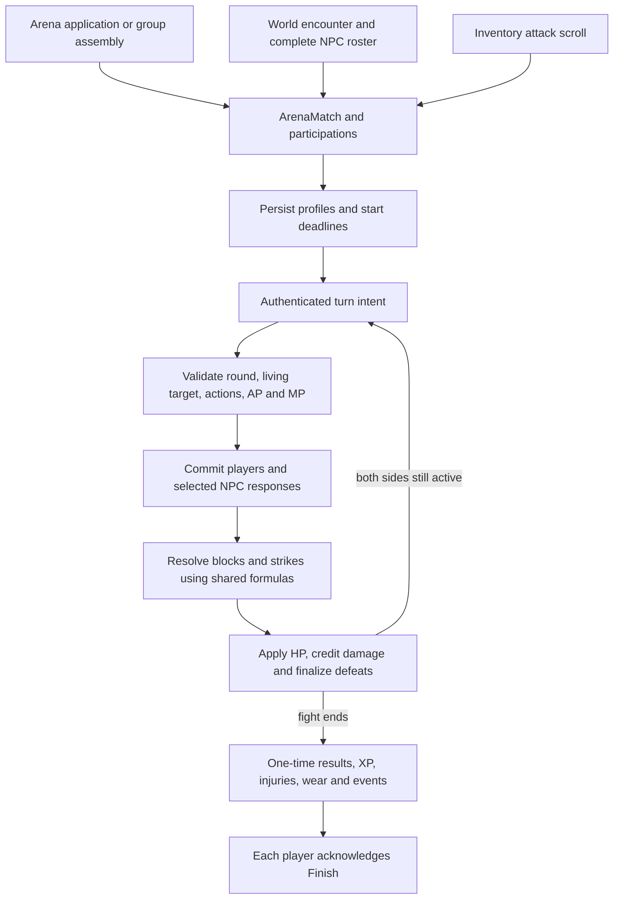

# Combat and Fight Mechanics Book

Reviewed against the local working tree on **2026-09-14**. This is the general
guide to entering, playing, resolving and finishing fights: Arena, wilderness,
PvP, NPCs, mixed groups and unarmed combat. **All use the shared combat engine.**
`ArenaMatch` is the common persistence name even when the fight starts outside
the Arena. This book explains current behavior and how to change it safely;
it does not claim access to Neverlands' private formulas.

[ARENA](ARENA.md) explains halls, application admission/assembly, training supply
and lobby UI/editing; [SCROLLS](SCROLLS.md) owns targeted entry and scroll variants;
[NPC](NPC.md) owns creatures, profiles, mixed rosters and drops;
[ITEMS](ITEMS.md) owns equipment and item effects; [WORLD](WORLD.md) owns
locations, passive encounter timing and return context. [FORMULAS](FORMULAS.md)
maintains the full cross-domain numeric reference. [ARTWORK](ARTWORK.md) owns
original images, dimensions and exact prompts.

[CHARACTER](CHARACTER.md) traces the build/level inputs consumed by combat;
[STATS](STATS.md) details primary parameters and resource boundaries, and
[MODIFIERS](MODIFIERS.md) details the four ratings and opposed consumers;
[MEDICAL](MEDICAL.md) follows injuries through penalties, expiry or treatment.
[ECONOMY](ECONOMY.md) explains NV reward settlement and the sale/license uses
of awarded loot without introducing another reward pipeline.

The [Combat domain](domains/combat.md) connects source observations,
[combat design](design/features/combat.md), [Arena design](design/areas/arena.md),
[calibration](design/features/combat_calibration.md), the
[MVP completion matrix](design/launch_mvp_plan.md) and the
[runtime/acceptance handbook](features/arena_combat.md). `doc/features/` remains
the detailed contract/verification layer; this book is the complete explanatory
entry point across those owners. Follow [DOCUMENTATION](DOCUMENTATION.md#21-required-context-and-update-map)
when changing any of them.

## Contents

- [1. Scope, evidence and terminology](#1-scope-evidence-and-terminology)
- [2. Entry paths and fight rules](#2-entry-paths-and-fight-rules)
- [3. Shared state and server pipeline](#3-shared-state-and-server-pipeline)
- [4. Levels, skills, equipment and combat inputs](#4-levels-skills-equipment-and-combat-inputs)
- [5. Complete turns, AP and defense](#5-complete-turns-ap-and-defense)
- [6. Hit, block, dodge, critical and damage formulas](#6-hit-block-dodge-critical-and-damage-formulas)
- [7. Experience, NPC search and premium](#7-experience-npc-search-and-premium)
- [8. Injuries, wear, recovery and Finish](#8-injuries-wear-recovery-and-finish)
- [9. UI, realtime delivery, logs and artwork](#9-ui-realtime-delivery-logs-and-artwork)
- [10. Worked fight flows](#10-worked-fight-flows)
- [11. Implementation and editing map](#11-implementation-and-editing-map)
- [12. Verification, known gaps and maintenance](#12-verification-known-gaps-and-maintenance)
- [Use cases and cross-feature effects](#use-cases-and-cross-feature-effects)

## 1. Scope, evidence and terminology

| Term | Meaning here |
|---|---|
| Fight/match | One `ArenaMatch` with sides A/B, participants, round/deadlines, log and one finalization |
| Participant | Player `Character` or NPC instance represented by `ArenaParticipation` |
| 1×N / 3×3 | Side sizes, not different combat formulas; a group may contain different identities/levels |
| PvE | A player's opposing side consists of NPCs |
| PvP | Opposing players, including scroll attacks outside a city or inside a valid shared room |
| Physical-only | No magic attacks/barriers/action slots accepted; this is independent of armed/unarmed |
| Turn package | One player's submitted target, attacks, one block selection and permitted action slots |
| Exchange/round | Committed packages resolve together, then new living participants may submit again |
| Defeated | Terminal participant state in this fight; later HP regeneration cannot make them active again |
| Trauma | Injury occurrence risk; also an input to calibrated player-opponent XP, not attack damage |

The [source index](design/reference/combat/README.md) preserves **10 low-level,
10 stronger-NPC and 2 Ogre fights**, plus earlier timing, magic and log captures.
These establish mixed NPC profiles, shield/dagger variants, committed lethal
returns, target handoff, raw versus credited damage, search, rewards and losses.
The [Arena observation](design/reference/combat/observations/2026-09-12_arena_duels_and_groups.md)
captures lobby/room/application behavior, but no new completed human Arena
fight. The later [September14 Duel](design/reference/combat/observations/2026-09-14_arena_fist_duel.md)
adds the first completed human source fight. Local multiplayer was explicitly
authorized despite opponent scarcity.

Source UI/wiki values are **captured**. Hidden coefficients fitted to those
observations are **calibrated**, not recovered source code. Location/content
decisions such as remote starter habitats are **authored**. Old helpers with no
active entry point are **compatibility**, not playable features. The
[scroll evidence](design/reference/inventory/observations/2026-09-14_attack_scrolls.md)
contains two failed submissions. The [September 15 Permit fight](design/reference/inventory/observations/2026-09-15_successful_attack_scroll.md)
adds immediate armed entry, a lethal committed exchange, 300 credited damage,
570 XP, one charge and attacker Finish to Inventory. The later
[Fist capture](design/reference/inventory/observations/2026-09-15_successful_fist_attack.md)
confirms stripping, 21 exchanges, defeat XP and persistent unequipping after Finish.

## 2. Entry paths and fight rules

### Arena Duels and Groups

For the complete hall catalog, application fields, supply/recovery and editing
recipes, use the [Arena book](ARENA.md). This section summarizes the handoff
into the common engine.

Only **Duels / Дуэли** and **Groups / Групповые** are delivered here. Sacrificial,
Tactical and Totalizator tabs are explicitly excluded. Select an accessible
room in the current city, then create/accept an application. Room access,
level/alignment/capacity, current location and reservations are server-owned.
Room selection also partitions chat/presence and is preserved for return.

| Application setting | Current rule |
|---|---|
| Equipment mode | Unarmed, no artifacts, limited artifacts or free; Groups additionally support alignment-vs-alignment, alignment-vs-all and closed |
| Turn timeout | 120 / 180 / 240 / 300 seconds; ordinary default 180 |
| Trauma | 10 / 30 / 50 / 80%; ordinary default 30 |
| Waiting period | 5 / 10 / 15 / 30 / 45 / 60 minutes; default 10 |
| Group capacity | Each side 1–30, or 1–10 for closed; group-form 1×1 normalizes to 1×2 |
| Group levels | Integer ordered ranges within 0–33 per side; creator fits side A |
| HP | Saved maximum must be positive; exact `currentHP * 100 >= maxHP * 50`; do not round a displayed percentage |
| Existing activity | No other reserved application, active fight or unacknowledged result; recheck equipment/admission at mutation/start |
| New match | Shared physical-only engine, explicit global 300-second deadline |

Equipment restrictions use authored `artifact_grade` on the character and
equipped items. No-artifact fights require every grade to be `none`; limited
fights allow recognized grades with multipliers at most **1.1**, as configured
in [combat calibration](../config/gameplay/combat_calibration.yml). Unknown grades
fail restricted admission. Unarmed applications require all equipment removed.
[EquipmentRule](../app/services/arena/equipment_rule.rb) validates these rules;
it does not silently strip gear. Free mode still applies ordinary admission
checks. Scroll-initiated Fist fights have their own explicit stripping step
before entering this same combat engine.

**Duels:** create a waiting application; another eligible player accepts;
the locked transition creates one pending reservation. The applicant must
click Start Duel; either player can refuse before start. This survives
participant reload. Training NPC applications are also handled by the existing
application owner; they use authored NPC data, 300-second turns, trauma 30 and
a five-minute waiting expiry. Local support does not prove the level-17 source
character could join the disabled Dummy rows. Accepting an eligible NPC training
application starts combat immediately; explicit confirmation above belongs
to player Duels.

**Groups:** creator occupies side A. Other players join a chosen eligible side;
joining reserves a place. The application waits until its deadline, even if
full. At settlement, both sides must contain members and every remaining member
must still qualify. Counts are **maximum capacities**, not a requirement that
every slot be filled: an eligible underfilled group can start with both sides
represented. Invalid/missing opponents expire the application without a match
or rewards. A member can withdraw; creator withdrawal cancels the application.
Group settlement starts the match directly; it does not require Duel confirmation.

Alignment-vs-alignment requires a non-neutral creator, same-alignment side A
and a consistent different alignment on side B. Alignment-vs-all permits any
alignment on B. Closed prevents ordinary scroll intervention. These are terms
inside Groups, not the excluded Arena rooms.

### Wilderness NPC encounters

[PassiveEncounterCheck](../app/services/game/world/passive_encounter_check.rb)
and [StartNpcFight](../app/services/game/world/start_npc_fight.rb) admit an
authored cell encounter to the same engine. The browser's timer is a check
request, not authority to roll encounters or choose NPCs. A persisted due time
survives refresh; accepted entry consumes that pending schedule. A movement or
local-action interruption uses the same fight starter.

[EncounterRosterSelector](../app/services/game/world/encounter_roster_selector.rb)
selects one fixed roster or one complete sample, preserving each member's
template, level, HP, stats/equipment and authored rewards/trauma. It does not
mix individual sample members arbitrarily. Outdoor content allows **1–10 NPCs**;
invalid/oversized rosters fail before partial match creation. Exact pools,
weights and universal timing remain bounded by evidence/configuration.

Low-level groups belong near Forpost gates; higher-level groups belong farther
out. Current remote Bandit/Robber 13–15 and dark Ogre 16–18 habitats are detailed
in [NPC placement](NPC.md#4-locations-cells-and-complete-groups) and
[WORLD habitats](WORLD.md#4-npc-habitats-and-resources). This is a content rule,
not an automatic equation that levels monsters to the approaching player.
Higher source Ogre levels are not automatically authored local NPCs.

### Targeted PvP and unarmed differences

[SCROLLS](SCROLLS.md) covers Permit I and Fist acquisition, nickname targeting,
exact cell/room co-location, ±3 level admission, atomic charge and intervention.
They can enter combat in wilderness, village and valid city locations.
There is no separate generic map-player Attack button/pipeline implied by this.

Arena **Unarmed** requires both players to remove all equipment before admission;
it does not silently strip them. **Fist Attack** explicitly strips both on
successful entry. Both then use the same `no_weapons` combat profile. Permit I
keeps gear; new Permit/Fist matches have trauma 10/80 respectively and start
immediately. An intervening Permit preserves the receiving match's rules.

## 3. Shared state and server pipeline



| Durable state | Role |
|---|---|
| [ArenaMatch](../app/models/arena_match.rb) | Status, sides/winner, current round, start/end, turn/global deadlines, source, equipment/physical flags and reward guard |
| [ArenaParticipation](../app/models/arena_participation.rb) | Player or NPC identity, side, pending package/AP, selected enemy/switches, NPC snapshot/vitals, credited damage, result, Finish acknowledgement |
| [ArenaApplication](../app/models/arena_application.rb) / [membership](../app/models/arena_application_membership.rb) | Waiting terms, reservations, group side membership and transition into a match |
| [CombatLogEntry](../app/models/combat_log_entry.rb) | Ordered round/sequence, structured outcome/payload and historical presentation |
| Character / InventoryItem | Player vitals, progression, equipment/durability and injuries through existing owners |
| WorldActionOffer / world records | Scroll receipt or cell encounter input/return/schedule, not a second fight store |

`CombatProcessor#process_player_intent(character, action_type, **params)` accepts
only **turn** and **surrender**. Internal attack/defend primitives are not public
shortcuts. A turn requires a canonical positive round number. The match lock
rejects old rounds, duplicate current submissions, ended matches and defeated
actors before allowing another valid package. HTTP authorization resolves
targets within the match; client ids/costs/labels never establish ownership or
available actions.

**One player against NPCs:** validate the full package; the selected NPC commits
its response and defense before strikes resolve. Other remaining NPCs do not
automatically all attack in every selected-opponent exchange.

**Multiple living players, including mixed fights:** persist each player's
current-round package. Wait for **every living player participant**, across
both sides; do not resolve just because one attacker clicked first. Install
committed blocks before strikes. Each selected NPC commits once per round,
against the first player targeting it in the round's ordered set. NPC targeting
and all strike resolution use the same engine.

At exchange start the engine records who was alive. A lethal strike can be
followed by the victim's **already committed return strikes** from that exchange.
After this boundary, defeat is terminal: no new input, target selection,
readiness requirement or active roster slot. Regenerating the underlying
Character cannot revive its defeated participation. Keep defeated participants
only for results, XP contribution, statistics, logs and history.

Manual target-switch allowance is
`max(original opposing participation count - 1 - switches used, 0)`. Switching
needs multiple living enemies and a living valid target. Automatic handoff
after a defeat costs no manual switch and never replenishes spent switches.

## 4. Levels, skills, equipment and combat inputs

**Level currently affects progression, eligibility, AP, wilderness group limits
and rewards.** Neverlands also publishes a hidden combat level-difference
coefficient. That input is not yet implemented because its equation/magnitude
are unknown; see the [stat audit](design/reference/character/observations/2026-09-15_levels_stats_and_modifiers.md). A
stronger player normally has more allocated stats, mastery and better equipment;
the actual values enter the equations. An NPC's authored level/profile provides
its inputs instead of receiving an invented player-like stat curve.

| Input | How it changes combat |
|---|---|
| Level grants | [Progression table](FORMULAS.md#2-experience-levels-and-grants) awards row-specific stat/combat-skill/peace-skill/perk points and fight XP caps; grants differ by level |
| Strength | Main physical attack term; More Strength, when owned, adds `floor(level/2)` before injury adjustment |
| Dexterity | Opposed hit, dodge and block calculations |
| Luck | Accuracy with Dexterity; opposed critical attack/resistance with Crushing/Fortitude |
| Health | Base maximum HP = `5 * base Health`; equipped HP adds to saved maximum; hidden physical armor factor described below |
| Knowledge | Base maximum MP = `7 * base Knowledge`; equipment adds MP; magic/healer inputs where active |
| Mastery | Equipped weapon-family mastery increases damage and reduces AP cost; no weapon uses unarmed mastery |
| Weapon damage | Equipped min/max midpoint contributions plus supported attack modifiers; actual effect fields, not rarity/name/art |
| Armor / penetration / resistance | Remaining armor subtracts from attack; penetration reduces armor, physical resistance reduces remaining damage |
| Accuracy / Evasion / Crushing / Fortitude | Opposed ratings, not direct probabilities; 680 Crushing does not mean 680% critical chance |
| Extra Action Points | Added to the level's 80/90/100 AP budget |
| Fatigue | Above 50, scales attack and effective armor down, reaching a 50% factor at 100 |
| Injury | Saved active penalties reduce primary stats; summed penalty caps at 90%, affected stats floor at 1 |
| Artifact grade | Trusted grade multiplier none/small/medium/large = 1/1.1/1.2/1.3; suppressed to 1 in unarmed matches |
| Subscription tier | NPC drop level window and maximum fight-XP cap; separate from artifact grade and no direct damage bonus |

Primary stats start at `1 + allocated points`, then equipment/perk inputs are
added. Template effects merge with owned instance modifiers/effects before
summing distinct equipped, unbroken, unexpired items. Temporary gear/injury effects do not
rewrite base allocations. Exact aliases and vital calculations are in
[FORMULAS stats](FORMULAS.md#3-character-stats-and-equipment) and
[ITEMS effective properties](ITEMS.md#3-fields-slots-and-effective-properties).

[CombatProfile](../app/services/arena/combat_profile.rb) persists available actions,
AP costs/budget, shield table and magic ceiling. Reload uses that profile.
Unarmed admission derives AP/physical costs and normal blocks without character
preview gear overrides; its stored budget is then retained like armed fights. See
[CHARACTER's state boundary](CHARACTER.md#6-implementation-and-state-ownership).
[CombatAttributes](../app/services/arena/combat_attributes.rb) adapts player
effective values and immutable NPC participation snapshots into the same
numeric inputs. Player stats are not all immutable match-start snapshots;
The shared reservation guard blocks normal gear changes and progression during
all active matches. Timed item/injury effects expire on live reads without
rewriting saved AP, inventory or current vitals. Exact source mid-fight expiry
remains unobserved. NPC equipment
illustrations are descriptive metadata, not player inventory grants or automatic
stat additions. Editing a creature image cannot change its damage.

Progression uses cumulative XP: level 17 starts at 25,000,000 and level 18 at
50,000,000. At 29,983,385 XP, 20,016,615 remains. Awarding XP calls the same
level-up service once per crossed threshold; it does not subtract lifetime XP.

## 5. Complete turns, AP and defense

Body keys are **head, torso, stomach (abdomen), legs**. The accepted profile
defines each action and block selector. A physical package allows at most four
attacks and one block; it cannot attack both head and legs in the same turn.
The captured shape requires at least two attacks, or attack+block; where magic
is enabled, attack+action or block+action also qualifies. Empty, one-attack-only
and block-only packages do not bypass that rule.

Current AP rules, from [COMBAT-01](FORMULAS.md#combat-01--physical-action-cost-and-package-validation):

```text
turn AP = 80 + (level >= 5 ? 10 : 0) + (level >= 10 ? 10 : 0) + Extra AP
weapon cost = declared item AP (default 45) - floor(matching mastery / 15)
unarmed cost = 45 - floor(unarmed mastery / 15)
simple AP = max(round(mean weapon costs) + (two weapons ? 5 : 0)
                + sum(signed equipped attack-cost bonuses), 1)
aimed AP = simple AP + 20
package AP = attacks + attack-count penalty + selected block/action AP
attack-count penalty for 0/1/2/3/4/5 = 0/0/25/75/150/250
```

Five appears in the inherited cost table, but public turn validation caps attacks
at four. Trusted profile overrides and declared item attack seeds have explicit
precedence; client-submitted costs do not. Simple has damage multiplier 1;
Aimed has 1.2 plus hit/critical modifiers. The package must fit its profile AP,
current MP and per-action magic ceiling. AP is restored for the next round;
submitted current-round packages cannot be replaced by repeated clicks.

| Block table | Accepted physical selectors and AP |
|---|---|
| Normal | Head 35; torso 30; abdomen 30; legs 35; head+torso 50; head+abdomen 60; torso+abdomen 50; torso+legs 60; abdomen+legs 50; legs+head 80 |
| Shield 40 | Each single zone 40; head+torso / torso+abdomen / abdomen+legs 85; legs+head 100 |
| Shield 70 | Head 45; head+torso / torso+abdomen / abdomen+legs 70; legs+head+abdomen 130 |
| Shield 90 | Head+torso+abdomen or torso+abdomen+legs 90 |

Do not invent symmetry in these captured tables. The item explicitly declares
its table; a shield name alone does not. Conflicting equipped table identities
fall back to normal. A multi-zone block is **one declared selector**, not a list
of arbitrarily combined cheap single blocks. A block applies to its committed
exchange, then is cleared; it is not a permanent defense toggle.

Example: level 17, no Extra AP, knife simple cost 40. Head attack plus a normal
head block costs `40+35=75`, within 100 AP. Two such attacks plus that block cost
`40+40+25+35=140`, so the server rejects the package. Selecting enough controls
in the browser does not grant enough AP to execute them.

NPC [AI](../app/services/arena/npc_combat_ai.rb) normally selects the lowest-HP
living opponent when no explicit target is supplied. Authored response attack
counts/block keys preserve captured behavior; otherwise the profile budget and
configured maximum constrain packages. Conditional defense needs both its
HP-threshold and chance metadata; an “aggressive” label is not a formula.

## 6. Hit, block, dodge, critical and damage formulas

These are the **current calibrated equations**. Their full numeric catalog,
rounding and rationale remain at [COMBAT-02/03](FORMULAS.md#combat-02--hit-dodge-critical-and-physical-block)
and [calibration design](design/features/combat_calibration.md). Changes here
must synchronize FORMULAS and the implementation rather than establish another
formula authority.

Let A attack D. Dex = Dexterity, Acc = Accuracy, Eva = Evasion, Crush = Crushing,
Fort = Fortitude, Pen = penetration rating, Armor = armor rating.

```text
opposed(a,b,s) = s*(a-b)/(abs(a)+abs(b)+100)
hit% = clamp(85 + opposed(3*DexA+2*LuckA+AccA, 2*DexD+EvaD,15)
                  + action hit bonus + body hit, 5,95)
dodge% = clamp(5 + opposed(5*DexD+EvaD, 3*DexA+2*LuckA+AccA,35)
                 + body dodge - (aimed ? 5 : 0), 0,60)
crit% = clamp(10 + opposed(5*LuckA+CrushA, 5*LuckD+FortD,75)
                 + (aimed ? 10 : 0) + (head ? 5 : 0), 1,85)
block% = clamp(45 + opposed(ArmorD+3*DexD, AccA+2*PenA+3*DexA,35)
                  + body block - 4*max(covered zones-1,0), 5,95)
```

| Zone | Hit offset | Dodge offset | Block offset | Damage factor |
|---|---:|---:|---:|---:|
| Head | -10 | +3 | -5 | 1.3 |
| Torso | 0 | 0 | +5 | 1.0 |
| Abdomen | +5 | -2 | +2 | 1.1 |
| Legs | -5 | -5 | -3 | 0.9 |

Roll `rand(100) < unrounded chance`; displayed one-decimal chances are
diagnostics, not a second calculation. Physical resolution order is hit →
dodge → covering block → critical → damage. A dodged critical attempt can be
logged because that branch also rolls the attempted critical. Successful
block means zero damage from that strike. Failed shield coverage can log a
shield breakthrough; its resulting damage can still be zero due to armor.

**Head attack against a committed head block is not an automatic hit or block.**
The attack may miss, be dodged, be blocked, or break through and then use armor
and damage rules. A torso block offers no physical block roll for a head hit.
Submitting earlier does not skip the opponent's valid committed defense.

Physical damage, with W = weapon damage and M = mastery:

```text
fatigueFactor(F) = 1 - clamp(F-50,0,50)/50 * 0.5
attack = (1.5*Strength + W) * (1+M/100) * damageMultiplier * fatigueFactor(A)
penetrationFraction = clamp(PenA/200,0,0.75)
remainingArmor = ArmorD * armorMultiplierD * healthArmorFactor(D) * fatigueFactor(D) * (1-penetrationFraction)
resistanceFraction = clamp(physicalResistanceD/200,0,0.75)
variance = 1 + (rand(1..5)-3)/2.0 * 0.18
rawDamage = round(max(attack-remainingArmor,0) * actionMultiplier * bodyMultiplier
                  * (1-resistanceFraction) * variance * (critical ? 2 : 1))
creditedDamage = min(rawDamage, target HP before strike)
newHP = max(oldHP-rawDamage,0)
```

Variance is one of **0.82, 0.91, 1, 1.09, 1.18**. Armor subtraction precedes
action/body multiplication; penetration and resistance cap independently.
Player artifact grade supplies the damage multiplier. NPC family constants
currently use W=3 Orc, 2 Goblin, 5 Skeleton, 19 Bandit, 23 Robber, 40 Ogre;
ordinary families have damage/armor multipliers 1/1, Ogre 2.55/3. An NPC with
no positive Strength uses its explicit fallback `stats.attack` base instead.
Its numeric profile, not level alone or decorative worn gear, supplies defense.

Illustration: Strength 20, W10, mastery100, no fatigue/artifact gives attack
80. Defender armor60 with penetration50 leaves45 armor; zero physical
resistance, simple torso, variance1 and no crit gives **35 damage**. With armor
120 the remaining armor90 exceeds attack80, so the same connection gives
**0 damage**. These are equation examples, not observed source hits.

Raw -1693 against 65 HP credits at most 65. Further committed hits against
already lost HP cannot earn it again or duplicate defeat/search. Result
statistics distinguish physical, magical and total credited damage and defeated
opponents; the parenthesized result number is not attack count.

### Existing magic boundary

New physical Arena/scroll fights filter magic out server-side. Earlier bounded
wilderness/profile-injected magic code still exists; do not advertise full MVP
magic, infer a spell from a catalog row, or remove the distinction.
The [magic formula reference](FORMULAS.md#combat-04--magic-attacks-and-barriers)
documents Spirit Arrow (50 AP/5 MP), Mind Blast (90/5) and Magic Shield,
Rainbow Barrier, Crystal Sphere (45/20, 60/40, 90/65).

Where explicitly available, magic uses shared hit/crit but bypasses physical
dodge/block/armor. Damage is spell MP cost times Knowledge and matching elemental
skill factors, then resistance and committed magic-barrier reduction; Mind
Blast adds 1.35. Barriers reduce by 20/45/65%. It does not use physical variance
or body-damage factors. Current free-form `magic_types` is empty; profile
availability/current MP/per-action ceiling remain mandatory.

```text
K = max(effective Knowledge,1)
base = spell MP cost * (1+(K-1)/20.0) * (1+matching elemental skill/100.0)
base *= (Mind Blast ? 1.35 : 1)
R = matching resistance skill + equipped elemental resistance ratings
magicDamage = round(base * (1-clamp(R/200.0,0,0.75))
                   * (1-barrierReduction) * (critical ? 2 : 1))
```

Current arcane/mind learned skill keys are absent from the allocatable registry,
so ordinary learned contribution for those actions is zero. Resistances and
barriers are explicit inputs; a physical shield image supplies neither.

## 7. Experience, NPC search and premium

**More/higher-HP enemies can increase reward potential; a larger initial roster
alone does not guarantee XP.** [ExperienceAwarder](../app/services/arena/experience_awarder.rb)
uses defeated NPCs or damaged player opponents and the recipient's level, credited contribution, result,
trauma when applicable, and the level's cap. Draws, invalid winners and no
eligible damaged/defeated enemies award zero. PvP loss can earn XP without a kill. Untouched player surrender earns zero XP.

An explicit applicable encounter win/loss total takes precedence for exactly
one player, before cap; explicit zero/invalid values suppress fallback. An NPC loss
award still requires a defeated NPC. Otherwise the calibrated fallback is:

```text
n = defeated NPCs plus defeated/damaged opposing players
levelFactor = 0.75^max(recipientLevel-enemyLevel-2,0)
NPC contribution = enemy maxHP * 0.85 * levelFactor
Player contribution = max(enemy credited damage taken, 0)
                      * (victory ? 1.9 : 0.85) * levelFactor
single defeated NPC with positive template XP: use that template XP instead
risk = 1 for NPC-only enemies; otherwise trauma 10/30/50/80 => 1/1.1/1.2/1.35
lossFactor = 1 on victory; on defeat: 1 for player enemies, otherwise 0.1
gross = round(sum(contributions) * (1+0.45*(n-1)) * risk * lossFactor)
```

For a team with p players: 20% equal participation, 80% credited damage share.
Dead contributors remain in this reward calculation, although excluded from
active combat. With D = team's credited damage:

```text
share = 0.2/p + 0.8*(ownDamage/D), or 1/p when D=0
earned = floor(gross * share); a solo player receives gross directly
awarded = min(earned, floor(level fight cap * premium cap multiplier))
```

Each recipient's gross uses their own snapshotted level/maxHP inputs before
anyone levels up. This is not one level-independent pot split among everyone.
All details/edge cases: [REWARD-01](FORMULAS.md#reward-01--shared-npc-and-player-experience).
Credited HP accumulates across the fight, including HP removed again after
restoration; only each strike is bounded by available HP. The
[September 15 wiki audit](design/reference/combat/observations/2026-09-15_wiki_experience_rules.md)
also identifies average NPC-group level, equipment and strength peaks as source
inputs missing from the generic fallback. Larger groups do not universally earn
more in Neverlands. XP buffs and direct-spell eligibility remain separate slices
in [FORMULAS](FORMULAS.md#published-inputs-outside-the-current-approximation).
The winning-player rate **1.9** fits September 15's **300 → 570 XP** at low
trauma and level 17→19. The retained loss fit gives 181 versus the earlier
observed 177. Neither is a recovered general equation; the earlier level-24
winner's 566 and unknown alignment/level/gear factors remain unexplained.
Example: gross1000, three players with half/quarter/quarter of team damage
receive floors466/266/266 before their individual caps, if each has that same
gross. Rounding does not redistribute the remaining two points.

### NPC search and item/NV drops

Search occurs at an eligible **NPC defeat**, including before an eventual
player loss, and is processed once for that NPC. It requires a defeating
player, enabled search, premium level eligibility and any narrower NPC limit.
It is not PvP corpse-looting and does not drop the NPC's pictured outfit.

| Effective tier | NPC level window | Fight-XP cap multiplier |
|---|---|---:|
| Standard / Worker | ±2 | 1 |
| Premium | ±2 | 1.5 |
| Gold | ±4 | 2 |
| VIP | ±6 | 2.5 |

Expiry/unknown tiers fall back to standard; narrower NPC rules win. These are
total windows, not additions to ±2. Level17 standard can search15–19, Gold13–21,
VIP11–23. Premium raises the **cap**, not earned XP; 50 earned stays50 even if
the cap doubles. None of these windows changes scroll attack eligibility.

[NpcLootAwarder](../app/services/arena/npc_loot_awarder.rb) uses explicit loot
tables when present. Calibrated fallback rolls NV12%, health elixir3%, weapon1%
independently; multiple or no results are valid. Observation multiplies a
chance by `1 + skill/(skill+100)`, capped at100%; at skill100,12% becomes18%.
Chance input `1` means100%, `0.01` means1%, with a 0–9999 roll. Fallback NV is
`max(npcLevel + rand(8..12),1)`; weapon is Assassin Dagger from13, otherwise
Penknife. Skeleton search is disabled; Orc/Goblin have difference≤2. Exact
templates/pools and exceptions are in [NPC](NPC.md) and
[REWARD-03](FORMULAS.md#reward-03--search-probabilities-and-amounts).

Inventory capacity, wallet/ledger, processed marker and personal item/NV
events remain authoritative. Capacity failure does not let repeated requests
reroll the same defeated NPC. A failure or empty search is not a successful
item-found notice.

## 8. Injuries, wear, recovery and Finish

### Ending a fight and timers

Side defeat is resolved after the committed exchange. Mutual defeat can draw.
Surrender records that player's defeat; group teammates can continue. Match
completion/reward processing is guarded once; retries cannot grant XP, injuries,
wear, counters or events again.

New current entry paths explicitly use **300 seconds globally**, the user's
five-minute policy. Legacy matches without a positive configured limit fall
back to twice their turn timeout. Global expiry is `now >= start+limit` and
draws; do not choose a timeout winner by HP comparison. Turn expiry is strictly
`now > roundStart+turnTimeout`. A player who already committed and is waiting
can claim victory or a draw after eligible turn expiry, subject to the global
deadline. A 300-second round normally meets the global boundary first.

[Source Fist fight771309274](design/reference/inventory/observations/2026-09-15_successful_fist_attack.md)
continued from17:17:57 through17:30 with a five-minute icon. That display cannot
be a global five-minute cap for this sample. The user's suggested per-action
reset is consistent with an inactivity timer, but exact reset/expiry remains
unobserved. Local global termination is an intentional policy difference.

[ArenaTurnTimeoutJob](../app/jobs/arena_turn_timeout_job.rb) also has an
unclaimed-turn recovery path: advance/log the timeout, allow applicable NPC
response, and increment the inactivity counter. Its inherited fallback ends
when the previous counter is already≥3 (the fourth processed timeout), usually
superseded by current five-minute global limits. Jobs/load-time recovery read
persisted state; a client countdown is not the clock of record.

### Injuries and treatment

[InjuryAwarder](../app/services/arena/injury_awarder.rb) considers defeated
players only, at most once per player/match and below99 active injuries.
Ordinary occurrence is `rand(100) < trauma`; independently select light/medium/
heavy with fitted weights **80/18/2**. Thus10% trauma gives90% no injury,8%
light,1.8% medium,0.2% heavy. At80%,20% still receive no ordinary injury.
Explicit combat injury is guaranteed; a decisive timeout with positive trauma
uses the separate guaranteed-heavy path. These exceptions bypass ordinary weights.

| Severity | Base duration | Stat penalty | Extension per existing active injury |
|---|---|---:|---|
| Light | 30 min | 5% | 7.5 min |
| Medium | 2 h | 15% | 30 min |
| Heavy | 6 h | 30% | 1.5 h |
| Combat | 24 h | 40% | 6 h |

Durations/penalties and conditional rarity are calibrated. Named injury,
expiry and healing persist for history. Heavy/combat block movement; combat
also blocks Inventory. Expiry removes active penalties without deleting logs.
The light “Chest muscle hematoma” has captured source evidence.

[Medical Care](features/medical_care.md) uses the same injury records. Healer
perk, active Doctor license, same cell, no movement/combat, matching usable bag
and Knowledge gates apply. Free treatment completes immediately; a paid quote
needs patient acceptance within five minutes. Price ceilings are80/150/500/7000
NV by severity; combat injury cannot be self-treated. Effective Doctor
proficiency must meet the bag requirement at request and paid acceptance.
The saved profession counter plus usable equipment bonuses supplies it. [FORMULAS recovery/medical](FORMULAS.md#7-recovery-wear-and-injuries)
and [SCROLLS licenses](SCROLLS.md#7-peace-scrolls-and-purchased-licenses) explain
qualification, expiry and edit points.

### Durability, recovery and result acknowledgement

Each worn durable unbroken item independently loses one durability point with
these result probabilities; Careful Fighter halves each chance:

| Context | Win | Draw | Loss |
|---|---:|---:|---:|
| World NPC (`source: world_npc`) | 2% | 30% | 50% |
| Arena / other sources, including scroll entry | 0% | 0% | 1% |

Zero durability unequips the item. Wear is result-based, not damage-per-hit.
Fist-stripped items are not worn at settlement. Scroll charge consumption is
independent of equipment wear.

After finalization, active combat stops and recovery is anchored to server time,
without an invented resurrection refill. HP full recovery basis is600 seconds,
MP900, multiplied by `1+recoverySkill/100` and fatigue factor. Elapsed-time
fractional remainders persist; refresh frequency cannot manufacture HP. Active
matches block regeneration. Injury penalties/maximum-vital rules still apply.

Each participant's **Finish** acknowledges an already completed result; it does
not calculate damage or distribute XP again. World returns to the saved cell;
sampled encounters can schedule again, fixed NPC anchors use their defeated/
respawn lifecycle. Physical Arena returns to its valid original hall/tab.
Scroll entrants return to Inventory; new scroll defenders resume their saved
accessible context. Replaying old Finish cannot clear a newer active fight.
Solo-NPC personal completion notice and each newly initiated scroll-match
participant’s notice are delivered on their own Finish. Other multiplayer
completion notices are published at finalization through the shell owner.
Scroll Finish uses already recorded XP and the same idempotent event key;
one player’s acknowledgement never clears another player’s result.

## 9. UI, realtime delivery, logs and artwork

The shared fight view presents the player's paper doll/vitals and selected
living opponent, sides, action/defense controls, profile AP, timers, actual
trauma, target switching and compact log. Waiting submissions remain committed
on reload. While waiting, the right paper doll is absent, with the selected
target still stored and the living roster intact; it returns on the next
actionable round. Defeated NPC/player cards leave active selection; results/statistics
still contain them. Finished fights show results and independent Finish.

[CombatBroadcaster](../app/services/arena/combat_broadcaster.rb) and
[ArenaMatchChannel](../app/channels/arena_match_channel.rb) deliver server-owned
state through the shared HTML/Turbo/Stimulus flow. Broadcast order is not combat
authority. Page reload recovers persisted profiles/turns/results; room recovery
and match-start/timeout jobs handle their bounded deadlines. Ordinary ground
pages use `/combat_status` for incoming PvP; outdoor passive checks keep their
existing encounter owner. Neither client can submit the other player's block.

Detailed [CombatLogRecorder](../app/services/arena/combat_log_recorder.rb) and
[presenter](../app/services/arena/combat_log_presenter.rb) preserve attack
zone, raw/credited outcome, shield block/breakthrough, dodge/critical attempt,
defeat, XP and injury. The UI uses structured data to emphasize names and
damage; dynamic values remain escaped. Public logs support pages/statistics
and keep historical participants. Personal chat events summarize fight XP,
injuries and successful item/NV finds; they do not replace the detailed log or
wallet/inventory state. See the [event catalog](features/game_shell.md#gameplay-event-catalog)
for audiences, wording and deduplication keys.

Runtime UI: [fight view](../app/views/arena_matches/show.html.erb),
[arena.css](../app/assets/stylesheets/arena.css),
[Arena helper](../app/helpers/arena_helper.rb). Exact templates/controllers and
public-log ownership are indexed in the Combat handbook. Original player/NPC
portraits, worn item images, Arena icons and Ogre habitat scenes follow
[ARTWORK](ARTWORK.md), [NPC portraits](NPC.md#5-equipment-and-artwork) and
[WORLD scenes](WORLD.md#6-map-and-location-artwork). Portrait dimensions and
containment are contracts; an oversized Skeleton image is not acceptable merely
because it resembles the source. Screenshots under design/reference are evidence,
not assets to copy into the runtime.

## 10. Worked fight flows

These describe the existing algorithm, not newly observed source matches.

**Player 1×1:** A and B enter through an Arena application or a successful
scroll. A submits head attack/head block and waits. B submits their valid
package. Both defenses are installed, then strikes resolve. A's earlier click
does not land before B's block. If both survive, AP resets and the next round
opens. A stale round/repeated click is rejected; Finish appears after settlement.

**Player 1×2 players:** A faces B+C. All three living players commit once. A
selects B or C; B and C can both select A. One block package from A covers its
chosen zones for this exchange; it is not guaranteed defense against two
attackers. If B dies, B's already committed return may complete, then future
rounds wait only for A and C. Dead B stays in the final statistics/XP history.

**Player 1×2 NPCs:** A faces an Orc and Goblin. A targets Orc; only that selected
NPC's response is prepared for the ordinary solo exchange. Lethal committed
returns can occur, then Orc leaves active play and its eligible search is
processed once. The next target becomes the living Goblin without spending a
manual switch. Finish after victory returns to the encounter context.

**Player 3×3:** six living players each commit against one living enemy. Resolve
all committed blocks and strikes at the shared barrier. If two participants
are defeated, the next round requires four submissions, not six. Several
attacks against one victim cannot credit more than its remaining HP. Reward
shares still include defeated contributors; each player's level/cap is applied.

**Mixed group:** complete NPC rosters preserve unlike member types and levels.
If players join an eligible existing fight through Permit intervention, they
use the same sides/profiles/readiness rules. A selected NPC answers once per
round, and defeated members never become new targets. No additional NPC-only
or player-only damage formula is selected by group composition.

**Fist fight:** source admission aside, the local scroll atomically removes both
outfits, clamps vitals, spends one use and starts `no_weapons`. The fight uses
unarmed mastery/AP, normal blocks, no artifact damage multiplier and the usual
hit/dodge/block/crit calculation. Maximum ordinary trauma increases injury
occurrence; it does not guarantee a heavy injury or victory for a higher level.

## Use cases and cross-feature effects

[Worked fight flows](#10-worked-fight-flows) cover complete exchanges; this map
connects their inputs and outcomes to the other guides. Examples are current
rule applications, not additional Neverlands observations.

| Preconditions / use case | Action and authoritative result | Related effects and boundaries |
|---|---|---|
| Same build admitted through Arena or a weapon-using attack scroll | Assemble participants and submit complete turns | [ARENA](ARENA.md)/[SCROLLS](SCROLLS.md) own admission; shared combat owns resolution. There is no second PvP damage engine |
| Level 17, Extra AP 100 | Ordinary profile receives 200 AP | [SKILLS](SKILLS.md) affects the budget; each attack/block package must still fit the server's profile and living target set |
| Knife learned 100 and usable equipment bonus 10 | Effective 110 feeds matching mastery | [ITEMS](ITEMS.md) and [SKILLS](SKILLS.md) alter AP/damage inputs; learned cap is not a universal effective cap or hit guarantee |
| More Strength owned, level 17, no injury | Effective Strength gains 8 | [PERKS](PERKS.md) changes attack/capacity/requirements; armor, hit/dodge/block, critical and resistance remain separate calculations |
| One participant dies in a mixed group | Remove from actionable roster while fight continues for survivors | Retain history/statistics/reward attribution; [NPC](NPC.md) or player identity does not change this rule |
| Eligible NPC defeated with Observation 100 |12% loot row becomes 18% before rolling | [SKILLS](SKILLS.md), [NPC](NPC.md) and premium determine distinct chance/eligibility inputs. PvP opponents do not automatically drop NPC loot |
| Defeated player owns Careful Fighter | Result/source wear chance is halved | [PERKS](PERKS.md) affects equipment wear only; injury rolls remain separate. After Finish, [WORLD](WORLD.md) resumes context and recovery/medical rules apply |
| Increase Fire Magic for the current injected arcane attack | Allocation saves, but element key does not match | Elemental schools/perks remain partial; physical-MVP delivery does not establish complete magic parity |

## 11. Implementation and editing map

| Change / entry point | Owner and important output/side effects |
|---|---|
| Arena create/accept/cancel | [ApplicationHandler](../app/services/arena/application_handler.rb): validates/locks room, character and application; creates/reserves one match and schedules start after commit |
| Group join/withdraw/settle | [GroupAssembly](../app/services/arena/group_assembly.rb): side membership under room/application/ordered-character locks; revalidate at deadline, start or expire |
| Wilderness timing/roster/start | PassiveEncounterCheck, EncounterRosterSelector, StartNpcFight; config and managed NPC/cell inputs in NPC/WORLD |
| Scroll entry | [AttackScroll](../app/services/game/inventory/attack_scroll.rb); SCROLLS owns its ordered locks, charge/receipt and intervention rules |
| Turn, surrender, switch, timeout, start/end | [CombatProcessor](../app/services/arena/combat_processor.rb); shared match transitions, committed turns, HP, defeat and one-time settlement |
| Action/profile budgets | CombatProfile and [combat_actions.yml](../config/gameplay/combat_actions.yml), [ActionCatalog](../app/lib/game/combat/action_catalog.rb) |
| Numeric attributes | CombatAttributes, Character, NPC snapshots; edit actual fields rather than UI text |
| One strike | [CombatResolver](../app/services/arena/combat_resolver.rb), RNG passed into the resolution boundary; returns structured outcome/roll/damage data |
| Fitted coefficients | [combat_calibration.yml](../config/gameplay/combat_calibration.yml), [Calibration](../app/lib/game/combat/calibration.rb); pure numeric damage/XP/recovery helpers |
| Experience | ExperienceAwarder → [LevelUpService](../app/services/players/progression/level_up_service.rb), [progression table](../config/gameplay/character_progression.yml) |
| Loot and entitlements | NpcLootAwarder, [LootEntry](../app/services/game/loot_entry.rb), [combat_benefits.yml](../config/gameplay/combat_benefits.yml); inventory/wallet/event transaction and eligibility |
| Injury/wear/recovery | InjuryAwarder, [EquipmentWearResolver](../app/services/arena/equipment_wear_resolver.rb), [VitalsService](../app/services/characters/vitals_service.rb), [TreatInjury](../app/services/characters/treat_injury.rb) |
| HTTP and Finish | [ArenaMatchesController](../app/controllers/arena_matches_controller.rb), policies, ResumeContext/CombatReturnContext; no client outcome authority |
| Log and realtime | CombatLogRecorder/Presenter, CombatBroadcaster, channel and shell EventPublisher; derive presentation from committed records |

Editing recipes:

1. **Make an NPC stronger:** adjust its authored level-specific stats/HP and
   family/equipment metadata in the NPC owner; inspect reward/search/placement
   consequences and update portrait/item links. Raising a label or painting
   more armor cannot supply the stats. New habitats follow near-city safety.
2. **Tune player attacks/defense:** identify whether the difference comes from
   item data, mastery/AP, opposed chance or damage. Edit only that owner;
   update this book's summary plus the full FORMULAS equation and calibration
   evidence/tolerances. Test both player and NPC consumers with deterministic
   RNG and zero/critical/overkill boundaries.
3. **Change a level grant:** edit progression rows; evaluate base stats, AP
   thresholds, item eligibility, injury penalties and XP caps. Preserve prior
   awarded grants and existing saved allocations; do not regrant on reload.
4. **Add a fight mode:** use the existing match/participation/turn pipeline.
   Model admission/start/return terms explicitly; prove group readiness,
   living-only targets, replay and after-commit UI. A second resolver for a
   location or participant kind violates the shared contract.
5. **Change rewards/injuries/premium:** use their exact config/owner, validate
   ranges and expiry, and preserve settlement guards. Review Inventory,
   Medical Care, event and progression consumers. Do not rewrite past results.
6. **Change UI/art:** update shared templates/styles/mappings and ARTWORK's
   exact prompt/spec record. Verify actual actions/return/reload, keyboard and
   relevant reflow; a screenshot alone is not behavioral acceptance.

Cached gameplay configuration requires relevant app/worker restart. New profile
rules affect newly prepared profiles; persisted profiles/receipts/history are
not silently regenerated. NPC snapshots protect existing fights from later
template profile edits, although some current reward/catalog reads remain
live; inspect the affected owner before editing managed content mid-fight.
Use [Managing game content](guides/managing_game_content.md) for supported
catalog/seed/managed-state procedures and preserve user-managed changes.

## 12. Verification, known gaps and maintenance

The [linked stat definitions](STATS.md) also preserve source low-HP combat
degradation without a known coefficient; current injury/fatigue factors do not
implement it. The [published technique level-chance table](FORMULAS.md#source-only-level-sensitive-techniques)
is likewise not wired up, and its scope is some techniques/abilities/spells,
not every physical hit. [MODIFIERS](MODIFIERS.md) explains the existing opposed
rating pipeline. These source findings do not change the physical MVP or make
universal hidden level coefficients known.

Key behavior coverage:

- [Committed exchanges](../spec/services/arena/committed_exchange_spec.rb),
  [resolver](../spec/services/arena/combat_resolver_spec.rb),
  [profile](../spec/services/arena/combat_profile_spec.rb),
  [calibration](../spec/lib/game/combat/calibration_spec.rb).
- [PvP HTTP lifecycle](../spec/requests/arena_pvp_lifecycle_spec.rb),
  [team lifecycle](../spec/requests/arena_team_combat_lifecycle_spec.rb),
  [World lifecycle](../spec/requests/world_npc_combat_lifecycle_spec.rb),
  [scroll admission](../spec/services/game/inventory/attack_scroll_spec.rb).
- [Group assembly](../spec/services/arena/group_assembly_spec.rb),
  [HP boundary](../spec/models/arena_application_hp_gate_spec.rb),
  [participation](../spec/models/arena_participation_spec.rb),
  [timeouts](../spec/models/arena_match_timeout_spec.rb).
- [PvP XP](../spec/services/arena/pvp_experience_spec.rb),
  [NPC XP](../spec/services/arena/npc_experience_awarder_spec.rb),
  [loot](../spec/services/arena/npc_loot_awarder_spec.rb),
  [injury](../spec/services/arena/injury_awarder_spec.rb),
  [wear](../spec/services/arena/equipment_wear_resolver_spec.rb),
  [elapsed recovery](../spec/services/characters/vitals_elapsed_recovery_spec.rb).
- [Team browser flow](../spec/system/arena_team_combat_spec.rb),
  [fight lifecycle UI](../spec/system/arena_match_lifecycle_ui_spec.rb),
  [scroll UI](../spec/system/attack_scroll_spec.rb). Manual screenshots/runs
  remain in the owning Combat and Inventory acceptance sections.

Run focused specs while changing a boundary. `bin/verify combat` covers
Arena/formula work; broader cross-domain transitions can require `fast`/`full`
under [AGENTS](../AGENTS.md). For browser-visible changes, final agent-performed
local interaction follows passing automated checks. This documentation-only
book does not represent another browser run, CI result or Neverlands fight.

Retain these explicit boundaries:

- **[EVIDENCE]** Exact hidden Neverlands coefficients, complete encounter
  distributions, defender-side controls, exact scroll timeout expiry and
  intervention remain incomplete. Fist attacker aftermath and later defender
  public recovery are captured on September 15. Human Arena now has the September 14 completed Duel evidence;
  authorized local fits and local multiplayer checks are separate.
- **[IMPL]** Doctor growth/qualification quests, Workshop
  repair, other scroll activation, broad spell/profession/Quest mechanics and
  broader content are separate unfinished scopes, not solved by this book.
- **Scope:** no excluded Arena tabs, automatic NPC level scaling, arbitrary
  post-MVP spells or unobserved premium combat powers are implied. NPC search
  is not player-item looting. The source Fist fight continued for about13 minutes; local five-minute
  global termination remains a deliberate policy, not verified source parity.

For every relevant change, update this guide's flow/examples/edit impact,
FORMULAS' numerical details, affected NPC/ITEMS/SCROLLS/WORLD entries, design
and the responsible runtime handbook. Update the event catalog or ARTWORK only
when their owned behavior changes. Keep links reciprocal where one area supplies
an input, invariant or outcome; do not copy historical evidence into a new claim
of implementation. Use `bin/verify docs` and inspect links/tables after edits.

## September 14 live human Duel

[Six-exchange evidence](design/reference/combat/observations/2026-09-14_arena_fist_duel.md) confirms the common AP/one-block rules,
physical block/dodge outcomes and credited overkill. The opponent also used
Spirit Arrow, Chaos Mirror, Iris weakening and HP restoration; these effects
must not be fitted as physical damage. The new full spell set remains outside
the physical MVP. Shared public history now groups adjacent actor outcomes,
uses minute stamps with exact timestamps available, colored bold names with
levels, critical damage and gray body zones; page1 and Statistics remain
reachable for short logs. The profile's city/room/log-through-Finish behavior
is confirmed against this source sample. Public HTML omits internal turn
submission/stance rows while retaining them in durable storage and raw JSON.
Its pagination counts visible outcomes. Profiles intentionally opened during
an existing fight stay readable; their in-combat link opens the complete public
log outside the profile Turbo frame. Incoming-attack polling remains enabled
when a profile is opened without an existing fight.

### September 15 stat and modifier interpretation

The [wiki audit](design/reference/character/observations/2026-09-15_levels_stats_and_modifiers.md) distinguishes published dependencies
from fitted coefficients. Accuracy now uses `3*Dex + 2*Luck + item Accuracy`;
3:2 is a local fit, preserving the former rating for equal Dex/Luck builds.
Crushing/Evasion/Fortitude are modifier ratings, not final percentages. Their
respective Luck/Dex/Luck dependencies are published; the wiki leaves Fortitude's
possible additional primary stat uncertain.

Physical damage uses:

```text
healthArmorFactor = 1 + 0.05 * floor(clamp(effective Health, 0, 150) / 30)
```

The Health page gives approximately 5% per 30 Health in the 30–150 range.
Complete steps and saturation above150 are local interpretations. This factor
multiplies the armor used for physical damage before fatigue/penetration;
displayed armor and the separate block rating remain unchanged. Armor100 at
Health29/30/150 becomes effective armor100/105/125. Zero armor stays zero.
Player effective Health includes applicable injury penalties. NPC Health must
be explicitly authored in `stats.health`; HP alone
never supplies it. The shared adapter/resolver applies this to every physical
Arena, scroll and wilderness match.

Known source-only rules: Knowledge's combat HP-restoration threshold is
`base Knowledge >= 2*(level+3)` (level17 requires40); perks/buffs are excluded,
gear treatment is uncertain. The source describes automatic mana spending to
restore HP, limited by fatigue, but gives no mana-to-HP coefficient. This is not
Doctor injury treatment. Full combat healing remains outside physical MVP.
The Armor page additionally says elemental magic uses10% armor plus elemental
resistance. The bounded legacy magic resolver currently ignores armor: this is
an explicit implementation gap, not a Neverlands rule. General magic armor
interaction/order and the hidden level coefficient need further calibration.
