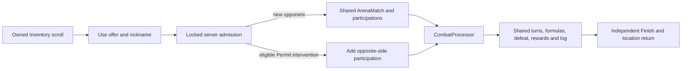

# Scroll Book

Reviewed against the local working tree on **2026-09-15**. This is the general
guide to scroll definitions, acquisition, activation, target rules, combat
entry, permissions, presentation and editing. It describes current local
behavior, including implemented paths that have not yet completed a successful
Neverlands capture. It is not a claim that every scroll in Neverlands exists here.

Start here for scroll work. [COMBAT](COMBAT.md) explains the fight after entry;
[ARENA](ARENA.md#4-duel-and-group-lifecycle) explains receiving match terms,
closed fights and the distinction between application assembly and intervention;
[ITEMS](ITEMS.md) explains definitions, owned instances, equipment and stock;
[FORMULAS](FORMULAS.md) maintains numerical rules across the game; [WORLD](WORLD.md)
explains cell/room identity. [ARTWORK](ARTWORK.md) owns image specifications and
exact prompts. [DOCUMENTATION](DOCUMENTATION.md#410-game-reference-books)
defines how these books stay synchronized.

Detailed runtime acceptance remains in [Inventory](features/player_inventory.md#september-14-attack-scrolls),
[Shop](features/shop_economy.md) and [Combat](features/arena_combat.md).
[Scroll design](design/features/scrolls.md) separates source rules from local
interpretations; the [MVP plan](design/launch_mvp_plan.md) owns delivery scope.
The books explain the complete area across those owners; `doc/features/`
contains their implementation contracts, checks and remaining gaps.

## Contents

- [1. Evidence and delivery boundary](#1-evidence-and-delivery-boundary)
- [2. Complete local scroll catalog](#2-complete-local-scroll-catalog)
- [3. Buying and using an attack scroll](#3-buying-and-using-an-attack-scroll)
- [4. Server admission rules](#4-server-admission-rules)
- [5. Shared combat entry and aftermath](#5-shared-combat-entry-and-aftermath)
- [6. Numerical rules and examples](#6-numerical-rules-and-examples)
- [7. Peace scrolls and purchased licenses](#7-peace-scrolls-and-purchased-licenses)
- [8. Persistence, transactions and recovery](#8-persistence-transactions-and-recovery)
- [9. UI and artwork](#9-ui-and-artwork)
- [10. Editing and adding scrolls](#10-editing-and-adding-scrolls)
- [11. Verification, gaps and maintenance](#11-verification-gaps-and-maintenance)
- [Use cases and cross-feature effects](#use-cases-and-cross-feature-effects)

## 1. Evidence and delivery boundary

The [September 14 observation](design/reference/inventory/observations/2026-09-14_attack_scrolls.md)
contains the live item rows, both nickname forms, preserved screenshots and the
wiki rules. The earlier [Shop observation](design/reference/inventory/observations/2026-06-01_inventory_items_and_shop_rows.md)
supplies the permit assortment. Keep these distinctions:

| Area | What is established |
|---|---|
| Live Permit I / Fist inventory | Prices, requirements, descriptions, durability, owned quantity, actions and target forms observed |
| Live execution | Level-17 Permit I then Fist submissions against co-located zMey [5] both rejected with the same generic error; no scroll spent or equipment removed |
| Level window | Inclusive ±3 comes from the preserved wiki. The 12-level rejection is compatible with it, but does not establish the exact boundary or rejection cause |
| Local successful entry | Both variants bought/used and shared player fights completed through local browser acceptance, independently of the source rejection |
| Successful source Permit fight | [September 15, fight 771285270](design/reference/inventory/observations/2026-09-15_successful_attack_scroll.md): immediate 17→19 armed entry at 285/1375 HP, completed exchange, one charge, 570 XP and Finish to Inventory; gear retained |
| Successful source Fist fight | [September 15, fight 771309274](design/reference/inventory/observations/2026-09-15_successful_fist_attack.md): immediate17→17 unarmed entry,375→225 HP,21 exchanges, loss93 XP, consumed scroll and gear still unequipped after Finish |
| Remaining source scroll boundary | Fist entry/attacker persistence and later defender public recovery are captured below; defender controls, intervention and exact scroll timeout expiry remain unobserved |
| Injury percentages | Low/maximum ordinary trauma map to captured Arena categories 10/80; these are not measured scroll injury rates |

Neverlands' premium multi-use Fist bundle is a different variant from the owned
250 NV single-use item. Its DNV price and 10/50/100/500 uses must not overwrite
this local definition. Ordinary scroll attacks are also distinct from the wiki's
special attack that guarantees a combat injury.

## 2. Complete local scroll catalog

Catalog means repository baseline, not a live database or current stock count.
Attack definitions are in [starter_shop.json](../db/seeds/data/starter_shop.json).
All five are `consumable`, slot `none`, mass 1, Things → Scrolls, with empty
ordinary `stat_modifiers`. Only two stable keys are enabled by `AttackScroll`.

| Key / English and source name | Base NV | Level / effective Stealth | Max durability / stack limit | Executable effect and art |
|---|---:|---|---|---|
| `duel_permit_i` — Duel Permit I / Разрешение на поединок I | 16 | 5 / 20 | 1 / 10 | Armed low-trauma entry or ordinary intervention; [image](../app/assets/images/items/duel_permit_i.png) |
| `duel_permit_ii` — Duel Permit II / Разрешение на поединок II | 30 | 5 / 30 | 2 / 10 | Catalog only; no attack activation; [image](../app/assets/images/items/duel_permit_ii.png) |
| `duel_permit_iii` — Duel Permit III / Разрешение на поединок III | 54 | 5 / 40 | 4 / 10 | Catalog only; no attack activation; [image](../app/assets/images/items/duel_permit_iii.png) |
| `duel_permit_iv` — Duel Permit IV / Разрешение на поединок IV | 84 | 5 / 60 | 7 / 10 | Catalog only; no attack activation; [image](../app/assets/images/items/duel_permit_iv.png) |
| `fist_attack` — Fist Attack / Кулачное нападение | 250 | 10 / none | 1 / 1 | Both players stripped, unarmed maximum ordinary trauma; personal use; [image](../app/assets/images/items/fist_attack.png) |

Authored Shop stock baselines are Permit I 192/500, II–IV 0/500 and Fist
500/500. Fist's initial 500 is local starter availability, not an observed
Neverlands Shop quantity. `shop.sold: true` permits listing; a real stock row
with sufficient quantity and the normal purchase gates still controls purchase.
Higher permit durability does not enable their missing effect.

Two more carried scroll-family definitions are in
[shop_inventory.rb](../db/seeds/shop_inventory.rb):

| Key / name | Requirements | Base NV / mass / durability / stack | Actual effect / availability |
|---|---|---|---|
| `reset_scroll` — Reset Scroll / Свиток Обнуления | Level 5, Health 10 | 1000 / 1 / 1 / 1 | Existing `reset_allocation` handler; supplemental/fixture content, no ordinary current Shop acquisition or mapped image |
| `imp_helper_summon` — Imp Helper Summon / Призыв импа-помощника | Level 8, Linguistics 60 | 1000 / 1 / 1 / 1 | `production_speed_percent: 10` is stored but has no usable effect handler; supplemental/fixture content, no mapped image |

There are therefore **seven carried scroll-family definitions**, of which two
have targeted attack entry, one has an existing reset handler, and four have no
executable effect. The six typed licenses below are related merchandise, not
carried attack scrolls. No other wiki scroll family becomes implemented through
a similar image, name or description.

## 3. Buying and using an attack scroll

1. Enter a supported Shop and open **Scrolls & Potions**. Buy one unit through
   the normal server-issued Shop offer and confirmation. Server price, stock,
   funds, capacity and current location are checked; successful purchase updates
   stock, Shop funds, wallet/ledger and Inventory atomically.
2. Open Inventory → Things → Scrolls. Requirements govern the enabled Use
   action. Permit I can use the ordinary transfer/gift/sale rules; Fist has
   **Use and Delete only**. Personal-use enforcement is also server-side.
3. Use opens **Ordinary attack** or **Fist attack** above the category strip.
   Enter the target nickname. Opening/cancelling the form costs nothing.
4. Execute submits the owned action key and nickname. The server resolves the
   target case-insensitively after trimming surrounding whitespace and checks
   the current state in section 4. The browser cannot supply a valid replacement
   side, price, trauma, equipment rule or match id.
5. Success enters the shared match and consumes exactly one use. Failure returns
   to Inventory without charge. Out-of-window levels display **Error using item.
   Scroll use failed.**, the translation of the generic captured source error.
   The nickname panel closes; reopening Use clears the previous message.

Permit II–IV do not use this entry path. Their absent generic effect cannot
start a fight or spend an item successfully. A Shop-visible catalog row is not
a promise that its activation is delivered.

## 4. Server admission rules

Owner: [AttackScroll](../app/services/game/inventory/attack_scroll.rb), with
[RequirementChecker](../app/services/game/inventory/requirement_checker.rb).
The form validates the actor/item; Execute revalidates mutable state.

| Boundary | Current local check / consequence |
|---|---|
| Actor | Authenticated current character; active ground position, positive HP, no movement or airship journey |
| Actor availability | No active fight/combat flag, unacknowledged physical result, waiting Arena application, active combat injury or local timed action |
| Target identity | Existing nickname, not self or another character owned by the same account; the online account's playable character |
| Target availability | Positive HP, active ground position, no movement/airship; recent session; no waiting Arena application or unacknowledged result |
| Co-location | Exact validated `Presence.context_key`: same outdoor cell, village interior, city district/building or Arena room; identical city coordinates alone do not suffice |
| Level | `abs(actor.level - target.level) <= 3`; shared by these two variants; subscription drop windows do not change it |
| Item | Owned `InventoryItem`, exact enabled consumable key, usable expiry/durability, current level/effective skill requirements |
| Offer | Owned `scroll_attack` offer, still offered, not expired, same item identity and current location; an already completed offer replays its stored match |
| Concurrent target change | Recheck target's current match against the locked expected match; reject a changed fight rather than entering stale state |
| Busy target | Permit may join an eligible existing fight; Fist rejects without charge or stripping anyone |

Inventory retains the location from which it was opened. A defender's timed
local activity can be interrupted by successful entry; the attacker's own
activity prevents Use. These rules do not create a universal safe-city ban or
automatically apply the Arena application's 50%-HP gate to scrolls.

Recent-session, health, reservation and room rules describe the local runtime;
not every exact source rejection has been observed. Only the captured generic
17-to-5 message is asserted as source wording. Other errors remain explicit
local diagnostics.

## 5. Shared combat entry and aftermath

**Permit I, new fight:** create a physical open duel with the attacker on side A
and target on B. Keep equipment. `fight_kind: free`, trauma 10, turn timeout
300 seconds and global deadline 300 seconds. Start immediately through
`CombatProcessor#start_match`; there is no Arena application/countdown or
defender acceptance screen in this local entry flow.

**Fist, new fight:** first unequip every item on both players into their existing
inventories. Recalculate maximum vitals and clamp current HP/MP downward if
needed; do not heal. Create the same physical match with `fight_kind: no_weapons`
and trauma 80. Its profile uses derived unarmed costs and normal blocks, ignoring
old shield/weapon preview overrides. Artifact damage multiplier is 1.0 in this
mode. Gear stays unequipped after Finish, matching the September 15 successful
Fist attacker aftermath. Defender-owned Finish/Inventory remains unobserved.

**Permit intervention:** the target must be living in a live, non-stale,
non-closed match with fewer than 60 participants. The attacker must satisfy
the receiving equipment rule. Add them opposite the target; preserve existing
trauma, physical/magic restriction, current round commits and deadlines.
Prepare the new participant profile and mark the match as a team battle.
Previously submitted turns stay submitted; the new living player joins the
same readiness barrier. This also works with an existing mixed NPC/player
roster. Fist intervention remains an explicit unsupported case.

All attacks, blocks, AP validation, damage, death, injury, XP, search, wear,
statistics and chat/log delivery remain in [COMBAT](COMBAT.md). No NPC is
fabricated to stand in for an attacked player. Defeated participants cannot
be targeted or revived by scroll intervention.

Each player acknowledges Finish separately. A scroll entrant returns to
Inventory; the original defender of a new `scroll_pvp` match resumes the saved
accessible location. Participants already in another kind of fight retain its
normal return behavior. Incoming-player checks on ordinary ground pages and
login/reload recover active combat or an unacknowledged result.

The new scroll fight's opening log names both participants and includes
**started (attack)** with its full start timestamp. XP settles once at combat
completion; its private completion notice is projected separately on each
player's Finish, using that participant's recorded XP and the existing event
key. Repeated Finish cannot duplicate the notice. Arena and intervention into
an existing non-scroll match retain that match's original notification timing.
The source attacker independently finished while the defender's fresh profile
still linked the old fight at zero HP.

## 6. Numerical rules and examples

Full maintained entry equations: [SCROLL-01](FORMULAS.md#scroll-01--attack-entry).

| Input | Current value / effect |
|---|---|
| Enabled entry definitions | `AttackScroll::RULES`: Permit I 10% trauma/armed; Fist 80%/unarmed |
| Target difference | `LEVEL_DIFFERENCE = 3`, inclusive |
| Form lifetime | `WorldActionOffer::OFFER_TTL`, 10 minutes; reject at `expires_at <= now` |
| New fight and turn time | 300 seconds each; intervention preserves existing limits |
| Incoming ground-page check | 5000 ms suggested retry through `/combat_status`; no NPC roll at that endpoint. An intentionally opened profile suppresses this check while the viewer already has a fight/result, so its public log link remains usable. Ordinary profile browsing still receives new attacks. |
| Target online freshness | Open session with `last_seen_at > now - 300 seconds`; [configured local presence policy](../config/gameplay/world_rules.yml), not a captured Neverlands inactivity interval |
| Charge | Decrement durability; when zero, remove one stacked unit and reset next unit durability, or destroy the last unit; only removed units reduce mass |
| Unarmed vitals | `HP = min(current HP, effective naked max HP)` and the same rule for MP |

Examples of local behavior, not additional source observations:

- A level-17 player may target levels **14–20** when other gates pass. Level 5
  fails without cost for either scroll. The live rejection did not reveal why.
- Permit I stack `quantity=2, durability=1` becomes `quantity=1, durability=1`
  after one successful entry. Replaying the same completed key returns that
  match; it cannot spend the other scroll or initiate a second fight.
  The first charge and one-unit mass loss are now source-confirmed; replay
  protection remains local verification.
- Fist removal from `HP=180, naked maximum=120` leaves 120. Starting at 80
  leaves 80; removal never refills the player to 120.
- An ordinary Permit defeat has fitted injury probabilities 90% none, 8%
  light, 1.8% medium, 0.2% heavy. Fist's 80%-trauma ordinary defeat gives
  20% none, 64% light, 14.4% medium, 1.6% heavy. Special timeout/combat-injury
  exceptions belong to [COMBAT aftermath](COMBAT.md#8-injuries-wear-recovery-and-finish).
- More Stealth qualifies use; it does not add attack damage or bypass the
  target window. Weapon mastery, gear, stats and body choices affect the
  subsequent fight through the same formulas as Arena. Premium loot windows
  concern NPC search, not attack-scroll eligibility.

## 7. Peace scrolls and purchased licenses

[ECONOMY](ECONOMY.md#licenses) explains qualification, timed-license purchase
and settlement; [MEDICAL](MEDICAL.md) follows Doctor permission into treatment,
with independent bag, Knowledge and proficiency checks.

### Existing carried effects

The ordinary [Manager](../app/services/game/inventory/manager.rb) supports
healing, mana restoration and reset effects. Attack scrolls bypass that generic
effect dispatcher and enter their dedicated transaction.

`reset_scroll` clears `allocated_stats` and `passive_skills`, refunds the sum
of allocated stat values, and currently refunds **one point per positive
registered skill in each pool**. It does not reconstruct the accumulated
nonlinear cost of learning that skill. This is the existing compatibility
handler, not a newly verified complete Neverlands respec contract; the stored
description alone must not be used as proof of correct historical refunds.
See [formula compatibility](FORMULAS.md#11-compatibility-and-absent-formulas)
and [Inventory](features/player_inventory.md) before extending it.

`imp_helper_summon` stores a 10% production-speed property, but no current
production helper is created by Use. An otherwise qualified call has no usable
effect and therefore does not consume it. Professions/production are a separate
delivery boundary, not an implicit scroll feature.

### Typed licenses

Shop → Licenses activates [CharacterLicense](../app/models/character_license.rb)
on purchase, instead of placing a scroll into Inventory. They are explicitly
typed `misc` definitions with mass/durability/stack 1. All six have original
images linked in [ITEMS licenses](ITEMS.md#licenses).

| Key | NV | Active days | Required local qualification |
|---|---:|---:|---|
| `trading_license_i` | 300 | 3 | Merchant perk and Merchant unlock |
| `trading_license_ii` | 800 | 10 | Same |
| `trading_license_iii` | 2000 | 30 | Same |
| `doctor_license_i` | 300 | 5 | Healer perk |
| `doctor_license_ii` | 550 | 10 | Healer and Traumatologist unlock |
| `doctor_license_iii` | 800 | 15 | Same |

[LicenseRules](../app/services/game/shop/license_rules.rb) validates exact
kind/tier/duration combinations and rejects another active license of that
kind. Activity is `starts_at <= now < expires_at`; stored grant dates and tier
are snapshots. Later catalog edits do not extend an existing license.
Trading permits sale/transfer workflows; Doctor permits treatment. License
tier changes duration, not permitted injury severity. General Traumatologist
quest completion remains outside delivered Quest functionality. Bag Knowledge
and effective Doctor proficiency gates are enforced; Doctor growth and the
qualification quest remain separate [Medical Care gaps](features/medical_care.md#1-authority-and-scope).

## 8. Persistence, transactions and recovery

| Owner / entry point | Responsibility and output |
|---|---|
| [InventoriesController](../app/controllers/inventories_controller.rb), GET Inventory with `scroll_item_id` | Resolve owned item and render its Use offer |
| `AttackScroll#offer_for(item:)` | Return/reuse an unexpired offer for owned item/current context; cancel other pending scroll forms; no charge |
| [ScrollUsesController](../app/controllers/scroll_uses_controller.rb), POST `/inventory/scroll_use` | Authenticated action key/nickname; 303 to match or Inventory error |
| `AttackScroll#call(action_key:, target_name:)` | Return an `ArenaMatch` or raise `Unavailable`; own admission, charge and durable entry records |
| [WorldActionOffer](../app/models/world_action_offer.rb) | Offer state/expiry/context and completed receipt with match, target, before quantity/durability and remaining quantity |
| [Manager.consume_item_unit!](../app/services/game/inventory/manager.rb) | Shared durability/stack/mass decrement under caller's transaction and locks |
| [CombatStatusesController](../app/controllers/combat_statuses_controller.rb), POST `/combat_status` | Read authenticated player's active fight/result; ignore client attempts to select someone else |
| [ResumeContext](../app/services/game/world/resume_context.rb) | Prefer persisted fight/result to ordinary saved destination |

Execute locks **existing target match → characters ordered by id → offer →
inventories ordered by id → owned item**. This deliberately does not run under
Inventory's outer single-character lock. Same-key races replay one receipt;
competing attacks cannot create two active fights for a target. Item/equipment
changes, match/participations, local-action interruption, charge, receipt,
shared entry log and two personal entry events commit together. A failure rolls
back all of them. UI broadcasts follow committed state.

The entry event is `actor used item to attack target`, with a per-offer/player
deduplication key. Detailed combat events and rewards use their existing guards;
the scroll receipt does not become a second combat event store. The server
keeps ownership, state and money authority even if the client bypasses buttons.

## 9. UI and artwork

The Inventory paper doll, item grid, properties/requirements, mass and category
strip remain visible around the compact cream target form. The labelled
nickname field has autofocus and a 25-character HTML limit; Execute/Cancel
support keyboard operation and wrap on narrow layouts. The server still
resolves the nickname rather than trusting HTML limits or client capability flags.

The dedicated `scroll_error` flash is rendered once in Inventory with
`role="alert"`, bold 12px #c00 text above categories; the global shell excludes
it from duplicate flashes. Source failed-use panels disappear after Execute.
Successful entry uses the same combat paper dolls, controls, logs and statistics.

Runtime form/styles: [partial](../app/views/inventories/_scroll_form.html.erb),
[Inventory view](../app/views/inventories/show.html.erb),
[inventory.css](../app/assets/stylesheets/inventory.css).
Artwork mapping: [InventoriesHelper](../app/helpers/inventories_helper.rb).
The [September 14 production record](ARTWORK.md#september-14-attack-scroll-artwork)
records Fist's exact prompt and final **384 × 384 PNG**, plus reused Permit art.
Source screenshots are evidence only. Error text/forms need HTML/CSS, not
copied source art or text baked into an image.

## 10. Editing and adding scrolls

| Change | Edit point | Consequences to check |
|---|---|---|
| Price, requirement, mass, durability, stack or source identity | `starter_shop.json` / relevant supplemental seed | Shop offers and affordability, current owned-item requirements, capacity, stacking and future acquisitions; preserve existing instance overrides |
| Availability | Shop stock/account plus explicit `shop.sold` rules | A template alone grants no stock; use the [content-management guide](guides/managing_game_content.md) and existing catalog updater |
| Personal use | `enhancement_rules.personal_only` and `InventoryItem#tradable?` | UI, Transfer/Gift and Shop resale must agree; do not replace it with binding that also prevents Delete |
| Enabled attack type, trauma or stripping | `AttackScroll::RULES` and its entry methods | New match metadata, requirements, return, shared injury/XP behavior; intervention preserves receiving rules |
| Level window | `AttackScroll::LEVEL_DIFFERENCE` | Both supported variants and admission tests; not premium drop policy |
| Fight damage or AP | COMBAT/FORMULAS owners | Every participant/type using that formula, not just this item |
| Peace effect | `Manager` or the existing responsible domain workflow | Need source evidence, atomic effect/charge and real acquisition; a descriptive modifier is insufficient |
| License | `LicenseRules`, typed definition and permission consumer | Exact duration/tier validation, active duplicates, expiry, purchased snapshots and abilities display |
| Picture/form/error | Artwork record, mapping, ERB/CSS | Dimensions, original art, keyboard/reflow and final local UI acceptance |

To add a scroll: preserve the source variant and its actual actions first;
classify it as carried activation, typed purchase permission, or catalog-only;
add the stable definition and real acquisition; extend the smallest existing
owner with atomic success/failure/replay behavior; add public-boundary tests;
update this catalog, ITEMS, affected formulas, design, handbook and artwork;
then run the required gate and actual local UI flow. Add no parallel combat
resolver. Restart relevant app/workers after Ruby/cached configuration changes;
do not rewrite past receipts, purchased licenses or completed matches.

## Use cases and cross-feature effects

Read [numerical examples](#6-numerical-rules-and-examples) for exact charges,
windows and injury probabilities. These are illustrative local behaviors;
successful live attack-scroll entry remains bounded by the evidence recorded
above.

| Preconditions / use case | Action and authoritative result | Related effects and boundaries |
|---|---|---|
| Stealth 18 and one peace point | [Skills allocation](SKILLS.md#4-allocation-and-business-rules) raises it to 20 | Permit I's skill threshold can pass. Target level, location, HP and presence gates still apply; skill is not extra damage |
| Armed Permit admission succeeds | Consume charge and hand participants to shared combat | [COMBAT](COMBAT.md) reads effective stats/masteries/gear; [PERKS](PERKS.md) More Strength can influence physical damage, while the scroll does not implement a separate attack formula |
| Fist admission with equipment contributing HP | Strip equipped contributions and clamp current vitals to naked maxima | Uses numeric Unarmed Combat; does not require the unavailable unarmed perk or refill HP. See [ITEMS](ITEMS.md) and [SKILLS](SKILLS.md) |
| Completed offer replayed | Recover the same recorded match | Does not consume another charge, roll fresh entry or duplicate participants |
| Healer owned, matching bag but expired Doctor license | Attempt treatment →reject | Profession perk, numeric proficiency, quest qualification and timed license are distinct; see [PERKS](PERKS.md#healer) |
| Linguistics requirement present on unsupported catalog content | Requirement text can be displayed | It does not implement a portal/summon/study effect, move the character or start a new combat pipeline |

## 11. Verification, gaps and maintenance

Executable evidence is in [AttackScroll specs](../spec/services/game/inventory/attack_scroll_spec.rb),
[HTTP specs](../spec/requests/scroll_uses_spec.rb) and the
[browser path](../spec/system/attack_scroll_spec.rb). They cover acquisition,
admission, ownership/location, requirements/expiry, rejection preservation,
replay/concurrent use, unarmed stripping, intervention and shared combat.

Historical exact runs and manual screenshots belong to
[initial local acceptance](features/player_inventory.md#september-14-local-acceptance)
and [rejection acceptance](features/player_inventory.md#september-14-rejection-acceptance).
Writing this book adds documentation, not another live fight or new runtime gate.

Open boundaries: defender-side entry/Finish controls, intervention and exact
scroll timeout expiry/reset, other
permit activation, other wiki scroll types/premium bundles, complete reset
semantics and production summons. Keep known code absences separate from hidden
source behavior. [The successful Permit capture](design/reference/inventory/observations/2026-09-15_successful_attack_scroll.md)
closes that variant's immediate entry, charge and attacker-Finish evidence gap.

Update this book whenever a scroll's definition, action, permission, formula,
acquisition, artwork, validation, state transition or evidence status changes.
Update the specific owning handbook and direct consumers in the same task.
Use `bin/verify docs` for documentation-only changes; runtime changes follow
[AGENTS](../AGENTS.md), including appropriate tests and final browser acceptance.

## September 15 Snowball research boundary

The [source review](design/reference/combat/observations/2026-09-15_arena_medical_gap_review.md)
records published Snowball prerequisites and armor/block/dodge bypass. Its
damage/AP and general unarmed pocket eligibility remain unconfirmed; it is
not an active local scroll. Later the same day, the user supplied a target and
both the Permit capture above and the subsequent Fist capture below succeeded.

## September 15 successful Fist follow-up

[The source capture](design/reference/inventory/observations/2026-09-15_successful_fist_attack.md)
confirms direct entry, the **(fist attack)** opening marker, empty equipment
slots, normal block/AP tables, one-use consumption, both contributors in
statistics and Inventory return with gear still removed. It ended in defeat
without an injury line; very-high trauma is not guaranteed injury. Completion
chat appeared on Finish. A later defender public card showed recovery on the
same cell; the defender's own UI was not observed.

The fight continued for about13 minutes despite the five-minute icon. An
inactivity timeout that resets with action is consistent with this; its exact
reset/expiry was not exercised. The local global300s limit remains the approved
MVP policy. The new93/9835 XP samples do not match the present calibrated rate;
[FORMULAS](FORMULAS.md#reward-01--shared-npc-and-player-experience) records that
limit explicitly. No source-specific reward constant or second resolver is added.
