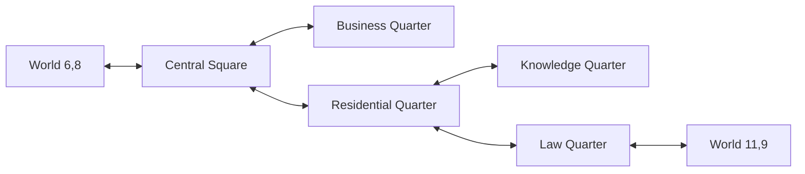

# World and Location Book

Reviewed against repository catalogs, seed declarations and runtime owners on
**2026-09-12**. This guide describes the current world's geography, cells,
city districts, entrances, services, habitats, resources and artwork, with
instructions for editing them. It catalogs the baseline; managed database
content may differ. It is not a new source survey or a live position report.

Companion books: [NPC](NPC.md), [ITEMS](ITEMS.md), [FORMULAS](FORMULAS.md) and
[ARTWORK](ARTWORK.md). Canonical design remains in
[World map](design/areas/world_map.md), [Movement](design/features/movement.md)
and [Cities/buildings](design/areas/cities_and_buildings.md). Runtime and
acceptance belong to [World](features/world.md), [City](features/city.md) and
[Airship](features/airship_travel.md). Start source research at the
[World evidence index](design/reference/world/README.md) and
[City evidence index](design/reference/city/README.md); delivery scope is the
[MVP plan](design/launch_mvp_plan.md).

Before changing existing geography/actions or adding a location, follow the
[context/update map](DOCUMENTATION.md#21-required-context-and-update-map).
Read the affected City/World/Airship handbook plus NPC, item, timing and
[Shell audience/event](features/game_shell.md#gameplay-event-catalog) handoffs;
update the affected owners together with the location entry.

## Contents

- [1. World structure and identities](#1-world-structure-and-identities)
- [2. Forpost city and services](#2-forpost-city-and-services)
- [3. Outdoor cells and locations](#3-outdoor-cells-and-locations)
- [4. NPC habitats and resources](#4-npc-habitats-and-resources)
- [5. Travel, context and return behavior](#5-travel-context-and-return-behavior)
- [6. Map and location artwork](#6-map-and-location-artwork)
- [7. Editing existing content](#7-editing-existing-content)
- [8. Adding a location or region](#8-adding-a-location-or-region)
- [9. Verification and maintenance](#9-verification-and-maintenance)

## 1. World structure and identities

The current baseline has **one outdoor zone and five city district Zones**.
Those five records represent one Forpost city, not five independent cities.
Wilderness uses coordinates and timed movement; the city uses a directed graph
of illustrated districts; linked outdoor interiors preserve their outside cell.

| Concept | Authoritative owner | Identity / meaning |
|---|---|---|
| Region/district | [Zone](../app/models/zone.rb) | Stable zone name/ID, dimensions, location type and city metadata |
| Player position | [CharacterPosition](../app/models/character_position.rb) | Persisted zone ID and local x/y; the server decides movement |
| Authored outdoor cell | [MapTileTemplate](../app/models/map_tile_template.rb) | Exact **zone name** plus x/y; terrain, passability, labels, actions, resources and art reference |
| Outdoor entrance | [TileBuilding](../app/models/tile_building.rb) | Stable building key plus exact zone/x/y; destination or linked-location data |
| Hostile encounter | [TileNpc](../app/models/tile_npc.rb) | One cell anchor with NPC roster/lifecycle; see NPC book |
| City route/service/exit | [CityHotspot](../app/models/city_hotspot.rb) | Zone and stable hotspot key; action type, target, availability and geometry |
| Movement/action intent | [MovementCommand](../app/models/movement_command.rb), [WorldActionOffer](../app/models/world_action_offer.rb) | Short-lived server-authorized action with current-state/deadline checks |
| Cell image identity | [CellArtCatalog](../app/services/game/world/cell_art_catalog.rb) | Stable art key plus sheet column/row; does not grant passability/actions |

### Coordinates

`Outpost Surroundings` has logical dimensions **1000×1000**, local coordinates
`0..999`. The authored starter survey covers **x=0..20, y=2..14**: 273 cells.
The source origin is `[994,992]`:

```text
local x = source x - 994
local y = source y - 992
source map identity = m_<source x>_<source y>
```

Example: source `m_1007_1002` is local `[13,10]`, the Pond. Atlas IDs and its
own coordinate offset are a separate evidence namespace; do not copy atlas
coordinates into CharacterPosition. Keep source and local coordinates together
when documenting a new cell.

The [starter survey YAML](../config/gameplay/starter_world_cells.yml) owns all
273 source rows, including atlas ID, coordinates, labels, activity, water/fish
flags, herb groups and NPC annotations. The
[StarterCellCatalog](../app/services/game/world/starter_cell_catalog.rb)
validates complete bounds/unique identities and translates those facts before
seeding. The survey is not a live second cell database.

Missing in-bounds MapTileTemplate rows currently use the deterministic passable
outdoor default in [TileProvider](../app/services/game/movement/tile_provider.rb).
Thus “outside the 273-cell survey” does not mean automatically blocked. The
logical million-cell grid does not imply that a million cells have researched
terrain, content or art. Deleting a blocked override can expose that passable
default; deactivate/retain the appropriate explicit content rather than assume
deletion closes an area.

## 2. Forpost city and services

[CityCatalog](../app/services/game/world/city_catalog.rb) owns five nodes,
eight directed district links, five service entries and two exits: **15 active
baseline hotspot declarations**. [world_zones.rb](../db/seeds/world_zones.rb)
creates city Zones with 10×10 bookkeeping dimensions. They are not walking
grids. The default spawn is Central Square at its city coordinate `[0,0]`.

| Node key | Zone name / displayed district | District links | Active services / exit | Scene |
|---|---|---|---|---|
| `main` | `Outpost` / Central Square | `forpost1`, `forpost3` | Arena, Shop, Hospital; west gate | [Central Square](../app/assets/images/city/central-square.png) |
| `forpost1` | `Outpost Residential Quarter` | `main`, `forpost2`, `forpost4` | Market, Airship Station | [Residential](../app/assets/images/city/residential-quarter.png) |
| `forpost2` | `Outpost Knowledge Quarter` | `forpost1` | No active service entries | [Knowledge](../app/assets/images/city/knowledge-quarter.png) |
| `forpost3` | `Outpost Business Quarter` | `main` | No active service entries | [Business](../app/assets/images/city/business-quarter.png) |
| `forpost4` | `Outpost Law Quarter` | `forpost1` | East gate | [Law](../app/assets/images/city/law-quarter.png) |



### What entering a service actually provides

| Service | Shipped boundary | Guide |
|---|---|---|
| Arena | Room selection, applications and shared combat; room restrictions/presence remain authoritative | [Combat](features/arena_combat.md) |
| Shop | Current stock, one-unit purchases, eligible sales and typed licenses; normal inventory/ledger transactions | [Shop economy](features/shop_economy.md), [ITEMS](ITEMS.md) |
| Hospital | Four stocked medical tools and entry to Medical care; rest-room/bed/pharmacy content does not imply their full treatment/processing loops | [Medical Care](features/medical_care.md) |
| Market | Captured market presentation and bounded Merchant qualification; generic player listings/rented-stall transactions are not implemented by the visible tier table | [Shop economy](features/shop_economy.md) |
| Airship Station | Fares and configured transport capability; current baseline lacks complete dated routes/destinations/paths for boarding | [Airship](features/airship_travel.md) |

Painted landmarks remain visual/contextual: Central Square's Tavern, Workshop
and Guard Tower; Residential's City Hall, Clan Hall and Post Office; Knowledge's
Magic School, Library, General School and Military School; Business's Dealer
House, Souvenir Shop, Auction, Obelisk, Bank and Temple of Ilana; Law's Law
Abode, Prison and Gallows. Their silhouettes/labels do not create entrances.
Likewise, a `CityBuildingCatalog` entry for Junk Dealer or Numismatics does not
make it reachable without an authorized hotspot in the current district.

## 3. Outdoor cells and locations

All local cells below are in `Outpost Surroundings`. Entrance declarations
come from [world_locations.rb](../db/seeds/world_locations.rb); explicit cell
actions/labels come from
[WorldContentSupport](../db/seeds/world_content_support.rb). The table lists
gameplay landmarks/anchors, not every generic surveyed terrain tile.

| Local cell | Source map | Content / return contract |
|---|---|---|
| `[6,8]` | `m_1000_1000` | `outpost_gate`: west gate ↔ Central Square; presence “Outpost, West Gate” |
| `[11,9]` | `m_1005_1001` | `outpost_east_gate`: east gate ↔ Law Quarter; presence “Outpost, East Gate” |
| `[4,6]` | `m_998_998` | `frontier_village_entrance`: Frontier Village, required level 1; Trading Post and Leave actions; outside cell retained |
| `[4,5]` | `m_998_997` | `podgorny_mine`: Podgorny Mine lobby, required level 0; Mine entrance/Shop tabs; Nature returns to the same cell |
| `[4,7]` | `m_998_999` | `forpost_resource_exchange`: exchange lobby, required level 0; Sell/Buy/Storage tabs; Nature returns to same cell |
| `[5,7]` | `m_999_999` | Frontier Village **presence label only**; not a second village entrance |
| `[7,7]` | `m_1001_999` | Paired Plague Rat anchor and Look action |
| `[12,10]` | `m_1006_1002` | Eastern intermediate cell, empty Look action; no authored Drink/Fish |
| `[13,10]` | `m_1007_1002` | Pond: Look, Drink and missing-bait Fish entry; evidenced bot-free pond |
| `[4,12]` | `m_998_1004` | Orc/Goblin complete sample anchor |
| `[4,11]` | `m_998_1003` | Skeleton complete sample anchor |
| `[14,15]` | `m_1008_1007` | Independent captured Bandit/Robber anchor, just outside starter survey's y bound |
| `[19,9]`, `[19,10]` | Local placement adaptation | Two remote stronger habitats reusing the ten level-13–15 samples; source fight coordinates were not observed |
| `[20,6]`, `[20,7]` | `m_1014_998`, `m_1014_999` | Two remote Ogre habitats with level-16–18 samples and dedicated dark artwork |

The Mine's helmet/license rows are read-only source descriptions. They are not
ItemTemplate definitions or a working Mine Shop. Descend is unavailable. The
Exchange's categories/tabs do not grant storage, trading or processing; Processing
Point is unavailable. Frontier Village's Trading Post uses its own resolved
shop context; it does not automatically clone Forpost's funds/assortment.

### Complete survey access

For every surveyed coordinate, the exact data remains in the starter YAML.
For a current managed cell, use `/manage/world_cells` or the corresponding
World Cell entry linked from Manage. The read-only example below resolves an
authored baseline cell without changing a player or importing seeds:

```bash
bundle exec rails runner 'cell = Game::World::StarterCellCatalog.default.at(13, 10); puts({x: cell.x, y: cell.y, passable: cell.passable, metadata: cell.metadata}.inspect)'
```

The returned atlas flags annotate the survey. They are distinct from current
managed records and from the effective state assembled by
[TileStateResolver](../app/services/game/world/tile_state_resolver.rb).

## 4. NPC habitats and resources

**Weaker encounters belong near Forpost; stronger groups and Ogres belong in
remote/darker parts of the map.** This is authored placement policy, not a
universal equation that scales every NPC with distance. The two calibrated
strong habitats additionally validate passability and a minimum Manhattan
distance of eight from both gates. NPC exact stats, equipment and rewards are
in [NPC.md](NPC.md#4-locations-cells-and-complete-groups).

The encounter baseline has four explicit anchors and 44 bootstrap declarations:
40 atlas-compatible Bandit cells, two Ogre cells and two strong habitats.
Bootstrap checks existing content, entrances and suitability; the declaration
count is not a live count of active database encounters. Reuse complete groups
with source/local placement provenance. A water image or empty atlas annotation
alone cannot establish that a cell is safe from bots.

| Data | What it means | What it does not supply |
|---|---|---|
| Atlas NPC annotation | Surveyed type/level range | A full roster, HP/stat curve, spawn weight or attack timer |
| `TileNpc` / roster metadata | Actual hidden eligible encounter source | A visible attack-NPC marker/button on the map |
| Atlas herb group | Captured group identity, imported as resource metadata | A successful gathering action, item yield or profession XP |
| `resource_groups` | Authored active group identity/labels under the cell owner | Automatic loot or arbitrary resource-generation formulas |
| `has_water` / `has_fish` | Survey facts | Automatic Drink/Fish capability without a supported local action |
| `local_actions` | Explicit supported type, stable source ID, activation and result/context metadata | Permission for a browser to choose its own timing, resource quantity or reward |

Current supported local action examples:

- `resource_search`, source ID `look`: Look Around, 28-second empty-result
  flow; Pond uses “Nothing found.” Other authored cells preserve their own
  empty-result wording. No plant item/profession gain is implied.
- `drinking`, source ID `dri`: Drink, immediately removes two fatigue points
  and holds the 60-second lock.
- `fishing`, source ID `fis`: Fish, captured missing-bait outcome with a
  30-second lock; successful catch/tool/yield progression remains absent.

Those values are explained in [FORMULAS](FORMULAS.md#8-world-movement-and-encounter-timing).
Registered resource categories and future profession design do not enable an
action merely by adding an unfamiliar metadata key.

## 5. Travel, context and return behavior

[Movement design](design/features/movement.md) owns grounded travel and
[Airship design](design/features/airship_travel.md) owns paid region handoffs;
their handbooks linked above record current implementation and acceptance.

World movement accepts an offered adjacent direction, revalidates position,
passability, current action/fight/injury/fatigue constraints and deadline, then
persists a command. Completion updates position from authoritative state.
The normal fallback duration is 24–30 seconds through Wanderer; an authored
positive cell duration can override it. City district changes are immediate
graph actions, not timed wilderness steps.

Outdoor Enter binds the exact eligible building/cell. City gate entry changes
to the linked district; its reciprocal exit returns to the configured outside
cell. Linked Village/Mine/Exchange interiors retain the exterior coordinate
and validate stored interior context. Buildings within a city return to their
parent district. Actual movement/room changes update chat/presence context;
same-context refresh preserves it. Labels do not select an audience.

[ResumeContext](../app/services/game/world/resume_context.rb) and
[CombatReturnContext](../app/services/game/world/combat_return_context.rb)
own restoration. Login/reload rechecks persisted location/interior/Arena
selection; finishing combat restores the existing source context and can
schedule the next sampled encounter. Defeat does not imply an invented
teleport-to-city rule.

The current baseline contains no operational second outdoor region, inferred
walking border map or repeating airship timetable. Forpost fares to Khalgan
Fair/Telior/Oktal are known but route destination, dated departure and complete
path must be authored before boarding. Accepted transport snapshots its fare
and route; it shares the ordinary position/context ownership.

## 6. Map and location artwork

Gameplay metadata and illustration are independent. `cell_art` stores a stable
key plus zero-based `column` and `row`; asset paths, dimensions, slice folders
and painted landmarks live in
[world_cell_art.yml](../config/gameplay/world_cell_art.yml).

| Art key / surface | Native geometry | Coverage / asset |
|---|---|---|
| `forpost_starter` | 21×13 cells; 2100×1300 sheet; 273 base 100×100 slices and 32 optional 200×200 city-detail slices | Local `[0..20,2..14]`; [landscape](../app/assets/images/world/forpost-starter-landscape.png) |
| `forpost_starter_west` | 3×13 cells; 300×1300 sheet; base slices | Scenery-only x `-3..-1`, y `2..14`; [western margin](../app/assets/images/world/forpost-starter-west-landscape.png) |
| `forpost_ogre_habitat` | 1×2 cells; 100×200 sheet; base/density slices | Local `[20,6]`, `[20,7]`; [Ogre habitat](../app/assets/images/world/forpost-ogre-habitat.png) |
| `forpost_terrain` | 10×10 cells; 1000×1000 sheet | Retained original tile catalog; [terrain](../app/assets/images/world/forpost-terrain.png) |
| `forpost_pond` | 5×5 cells; 500×500 sheet | Retained pond neighborhood catalog; [pond](../app/assets/images/world/forpost-pond-landscape.png) |
| City districts | 1250×600 scene plane | Five original scenes linked in the city table |
| Linked locations | 760×255 authored logical scene | Village uses the existing CSS scene in [world.css](../app/assets/stylesheets/world.css); [Mine](../app/assets/images/world/locations/forpost-mine.png) and [Exchange](../app/assets/images/world/locations/forpost-exchange.png) use raster art |

The 273 starter tiles plus 39 western scenery tiles form 312 visible survey
images. Negative-x scenery stays outside playable bounds; adding an image
does not enlarge the zone. Starter art normally uses `column=x`, `row=y-2`;
the Ogre pair uses column 0 and row `y-6`. Map cells display at 100 CSS pixels;
higher-density slices retain the same logical coordinates.

Starter density coverage is deliberately limited to sheet columns `6..13`,
rows `5..8` (local x `6..13`, y `7..10`). It is not a full-map 2× illustration.
Missing optional 2× art uses the 1× image. Missing mandatory base slices make
the catalog reference unavailable and preserve the renderer's per-cell CSS
recovery; an existing 2× file alone does not repair it. Both Ogre cells have
their own base and density slices. See the
[World cell-art contract](features/world.md#72-cell-art-schema)
and the exact production record in ARTWORK.

Painted entrances are explicitly mapped: starter sheet `[6,6]` west gate,
`[11,7]` east gate, `[4,4]` Village, `[4,3]` Mine, `[4,5]` Exchange. These are
**sheet** coordinates, not the local cells in section 3. A moved entrance must
still match its allowed painted landmark or receive corresponding new art.
Avoid doubled drawn-building overlays on artwork that already contains them.

City hotspots use native scene boxes and box-local polygon percentages. Linked
location feature polygons use their declared scene coordinates. Do not paste
one coordinate system into the other. Artwork and hit regions must scale
together, with reachable labels/controls and the acceptance requirements in
[game client layout](design/areas/game_client_layout.md#adaptive-ui-acceptance).
Exact generation/edit prompts, framing and packaging remain in ARTWORK.

## 7. Editing existing content

The [content-management guide](guides/managing_game_content.md) is the detailed
operator procedure. This book provides the location context and change impact.

| Desired change | Correct owner | Recheck |
|---|---|---|
| Block/reopen a cell | MapTileTemplate passability via World Cells | Existing offers, adjacency/return path, default if a row is removed |
| Change displayed place name | Cell/building presence label or city title | Exterior/interior distinction, chat/presence display; preserve stable identity |
| Change cell art | `cell_art` reference plus art catalog | Bounds, required base/declared optional density, painted entrance identity, clipping |
| Move a Village/Mine/Exchange | TileBuilding zone/x/y | Destination passability/occupancy, artwork, preserved bootstrap key, old offers and saved context |
| Move a city gate | CityCatalog reciprocal gate declaration and both handoff owners | Outside cell, destination city, return coordinate, art and stale actions |
| Add/change local action | Cell's structured local action controls | Supported type/source ID, activation, exact server effect/lock and interruption |
| Change resource groups | Cell structured resource metadata | Stable group IDs, labels, activation; no unsupported yield assumption |
| Change NPC group | TileNpc and the reusable NpcTemplate/profile | Distance/atlas eligibility, complete roster, HP/stats, rewards and NPC book |
| Change city service or district route | CityHotspot and explicit city node/action target | Correct district, level/capability checks, return and scene geometry |
| Change Shop availability | That location's ShopAccount/ShopStock and eligible ItemTemplate | Funds/stock, purchase/sale behavior and ITEMS book; do not clone another merchant silently |

Open `/manage` as an administrator and follow its World Cells, Outdoor
Buildings, Cell NPCs, Cities and City Hotspots links. Structured editors preserve
unmodified advanced metadata; inspect the saved result and management audit.
Deactivation is normally preferable to deleting a referenced identity. Do not
edit player coordinates, NPC defeat HP or merchant balances as a content-preview
shortcut. Direct database/template names are not browser capabilities.

### Seeds and existing managed content

The first survey import materializes MapTileTemplate records. Already
atlas-backed cells preserve managed passability/actions/resources; existing
independent artwork survives the bounded starter-art upgrade. Ogre art upgrades
only the unchanged starter reference. Linked locations preserve existing rows,
including moves and disabling. NPC bootstrap also preserves its original
source identity after a managed move.

Explicit Forpost gates and city catalog content follow their declared baseline
reconciliation rules; not every managed edit survives a full seed. Zone seeding
also writes dimensions/metadata and resets the declared spawn entries. Read the
specific seed before any operator sync. The bounded gate-repair workflow is
documented in the management guide; a full seed or database recreation is not
the default response to one broken entrance.

## 8. Adding a location or region

For another building in an existing area:

1. Capture its actual Neverlands location, eligibility, entry/return behavior,
   actions and art composition. Separate missing evidence from an authorized
   local placement/calibration choice.
2. Reuse the current Zone/MapTileTemplate/TileBuilding or CityHotspot owner.
   Choose a stable key and valid location; define destination/return and
   required level explicitly. A painted landmark alone is not a service.
3. Provide original artwork and matching geometry under ARTWORK. Declare only
   implemented feature/action types; describe read-only or unavailable parts.
4. Author NPCs, resources and merchant stock separately if actually supported.
   Validate saved-state restoration and affected offers when content changes.
5. Update this book, the owning design/handbook and companion catalogs, then
   exercise the full local entry → action → return → reload flow.

For another outdoor region, additionally author the Zone's exact identity and
bounds, evidence-backed source/local mapping, surveyed cells, original terrain
art, spawn/entry policy and explicit connections. There is no generic outdoor
region creation UI or inferred edge-to-edge coordinate map. If connecting by
airship, provide a real destination, dated schedule, full duration and validated
timed waypoints. If connecting by walking, establish the source transition
before implementing the crossing. A second region is outside the current
one-zone MVP until its scope is explicitly changed.

## 9. Verification and maintenance

Useful existing checks include [open-world seeds](../spec/models/open_world_seed_spec.rb),
[NPC bootstrap](../spec/models/outdoor_npc_seed_bootstrap_spec.rb),
[linked-location preservation](../spec/models/world_location_seed_preservation_spec.rb),
[habitats](../spec/services/game/world/calibrated_habitats_spec.rb), World/City
request/system specs and the artwork tests referenced by their handbooks.
For a gameplay/art edit, follow [AGENTS](../AGENTS.md): verify the final local
UI after automated checks, including actual entry/action/return, reload,
applicable narrow viewport/zoom and hotspot behavior.

**Update this book in the same task** when regions, cells, routes, services,
entrances, supported resources/actions, habitat placement, coordinate mappings,
asset references or editing procedures change. Keep source coordinates distinct
from local placement and art coordinates. Link NPC rosters to NPC.md, item stock
and content to ITEMS.md, calculations to FORMULAS.md, event/audience behavior to
[Game Shell](features/game_shell.md#gameplay-event-catalog), and image prompts to
ARTWORK.md. Do not mark a visible label or an unconfigured route as playable.

The documentation maintenance contract is in
[DOCUMENTATION](DOCUMENTATION.md#410-game-reference-books). This guide does not
constitute a seed run, new Neverlands observation or browser acceptance.

## Arena reservation and future outdoor PvP

A posted or joined Arena offer reserves the player: City/world travel, Inventory/equipment, Character and other location-changing requests return to the reserved room. Due offers recover before this guard; cancelled/expired offers release navigation. Active physical Arena fights and each player's unfinished result return to their match, including after login. Finish restores the accessible original hall/tab. [Arena](design/areas/arena.md) owns this contract and [Arena Combat](features/arena_combat.md) its acceptance. Future same-cell PvP should authorize the attacker and target at the world boundary then create participations in the shared engine; this stage adds no outdoor attack endpoint.
