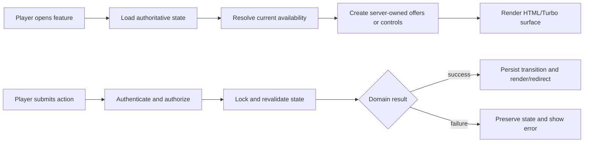

# frozen_string_literal: true
---
title: [Feature Name] Feature
description: Implementation handbook for [one-sentence description of the player-visible feature and its principal runtime responsibilities].
status: Fully Implemented
updated: YYYY-MM-DD
owners: [Owning domain, subsystem, or team]
template: feature-v1
---

# [Feature Name]

> Template instruction: copy this file to `doc/features/<feature_name>.md`, replace every bracketed placeholder, and remove all template-instruction blockquotes. Preserve the 18 numbered sections and their order. If a section does not apply, keep it and explain why.

This document is the implementation contract for the current [Feature Name] feature. It explains [player-visible behavior], [authoritative state], [principal flows], UI ownership, integration boundaries, persistence, security, authored content, failure behavior, and test coverage.

It describes what exists now. It does not turn deferred Neverlands mechanics, observations, or possible future work into shipped requirements by implication.

## 1. Design authority and related documents

Neverlands is the sole game-design and visual reference for this feature. The local implementation adapts observed behavior to Rails, HTML/Turbo, Stimulus, and the current client; it must not be expanded with generic RPG conventions.

When behavior is uncertain or conflicts with this document:

1. Re-observe Neverlands and record the evidence in `doc/design/reference/`.
2. Update the relevant design record.
3. Change implementation and coverage together.
4. Update this feature contract last so it continues to describe shipped behavior.

Supporting documents:

- `doc/design/reference/[neverlands_observation].md` — [what was directly observed].
- `doc/design/areas/[feature_area].md` — [area-level design responsibility].
- `doc/design/features/[related_design].md` — [supporting mechanic or rule].
- `doc/design/launch_mvp_plan.md` — [relevant MVP boundary or milestone].
- `doc/features/[related_feature].md` — [runtime integration boundary].

### 1.1 Cross-feature relationships

| Related feature | Relationship | Ownership and handoff |
|---|---|---|
| `doc/features/[upstream_feature].md` | [What this feature receives from the related feature] | [Where upstream authority ends and this feature begins] |
| `doc/features/[downstream_feature].md` | [What this feature provides to the related feature] | [Where this feature's authority ends and downstream authority begins] |

Every cross-feature relationship must be reciprocal: the related handbook must link back and describe the same boundary from its side. Include only real runtime, persistence, authorization, presentation, or content handoffs; do not create an all-to-all link graph.

> Template instruction: include only relevant existing documents. State what each document contributes; do not provide an unexplained link dump. Replace the relationship rows with every directly related feature, verify the reciprocal references, and remove any row that does not represent a shipped integration boundary. If no direct feature relationship exists, replace the table with an explicit sentence saying so; keep the subsection.

## 2. Feature summary

[Explain the complete feature in two to four paragraphs. Begin with what the player can do. Then identify the authoritative server state, the principal UI surface, and the most important implementation boundary. Include concrete limits, counts, coordinates, timing, or states where they define behavior.]

The MVP currently contains:

- [implemented capability];
- [implemented capability];
- [implemented integration];
- [explicit persistence/security behavior].

> Template instruction: this must be understandable without opening the code. Avoid history, aspirations, and implementation trivia that belongs in later sections.

## 3. MVP goals and non-goals

### Goals

- [Implemented player outcome.]
- [Implemented authoritative-state outcome.]
- [Implemented Neverlands UI/interaction outcome.]
- [Implemented integration outcome.]
- [Implemented security or persistence outcome.]

### Non-goals

- [Observed but deliberately deferred behavior.]
- [Generic RPG behavior that must not be invented.]
- [Adjacent feature owned elsewhere.]
- [Unsupported API/client mode.]
- [Future scale or content not present in MVP.]

> Template instruction: non-goals are mandatory. They prevent a reader or AI agent from treating visible placeholders, captured data, or familiar RPG conventions as implemented requirements.

## 4. Player experience

### 4.1 Entry conditions

[Explain how an authenticated player reaches the feature, prerequisites, bootstrap behavior, and what authoritative state selects the initial screen.]

### 4.2 Primary surface

[Describe the visible layout, dimensions, controls, labels, images, and Neverlands-specific interaction language. State which surrounding shell elements belong to shared features.]

### 4.3 Player actions and feedback

[Describe each currently available action, how availability is communicated, what success looks like, and how failure is shown. Distinguish interactive controls from read-only captured presentation.]

### 4.4 Exit and integration behavior

[Explain how the player leaves or returns, which state persists, and which adjacent feature takes ownership after handoff.]

> Template instruction: rename third-level subsections only when a more precise player-facing label is needed. Do not change the purpose or order of the four subsections.

## 5. Feature topology and authored content

[Describe the feature's authored structure: nodes, cells, screens, states, catalogs, gates, content records, or other fixed topology. Use exact Neverlands-backed data.]

| Key or location | Player-facing name | Connections or actions | Implemented content |
|---|---|---|---|
| `[source_or_runtime_key]` | [Name] | [Exact authored connections/actions] | [What currently works] |
| `[source_or_runtime_key]` | [Name] | [Exact authored connections/actions] | [What currently works] |

### 5.1 Coordinate, key, or identity terminology

- **[Term]** — [where it comes from and where it is stored].
- **[Term]** — [how it differs from the previous term].

[State which relationships are explicit and which must never be inferred from geometry, naming, ordering, or generic game conventions.]

> Template instruction: if the feature has no spatial topology, use this section for its authored state graph, catalog, or capability structure. Do not delete the section.

## 6. Feature surfaces and contained behavior

### 6.1 Implementation status

| Surface or behavior | Entry point | MVP status | Owning implementation |
|---|---|---|---|
| [Surface] | [Route/action/state] | Interactive | [Controller/service/feature] |
| [Surface] | [Route/action/state] | Read-only capture | [Catalog/view] |
| [Surface] | [Route/action/state] | Deferred | No mutation is exposed |

### 6.2 [Primary contained behavior]

[Document exact implemented rules, values, states, and presentation.]

### 6.3 [Secondary contained behavior]

[Document exact implemented rules, values, states, and presentation.]

### 6.4 Deferred behavior boundary

[Explain what is visible or observed but intentionally not implemented. State which controls, records, rewards, or mutations do not exist.]

> Template instruction: add more third-level subsections when the feature has multiple meaningful surfaces. Keep the section focused on what is inside the feature, not its request lifecycle.

## 7. Authoritative data and presentation model

| Record or component | Responsibility | Important contract |
|---|---|---|
| `[ModelOrCatalog]` | [Single responsibility] | [Validation, ownership, scope, or invariant] |
| `[ModelOrCatalog]` | [Single responsibility] | [Validation, ownership, scope, or invariant] |
| `[PolicyOrOffer]` | [Authorization/capability responsibility] | [Trust boundary and expiry/ownership rule] |
| `[ResumeOrPresentationComponent]` | [Persistence/presentation responsibility] | [What it may and may not decide] |

### 7.1 Source of truth

[Name the authoritative record for current state. Explain how derived presentation state is built and what happens when an optional record is absent.]

### 7.2 Validation and state lifecycle

[List valid states, transitions, uniqueness constraints, boundary validation, TTLs, locks, or other invariants.]

### 7.3 Presentation versus authority

[State which catalogs, metadata, DOM attributes, CSS geometry, images, or browser state are presentation only. Explain what the server revalidates.]

> Template instruction: use exact class names and state names. Do not call browser or catalog data authoritative unless it actually controls persisted state under server validation.

## 8. Runtime architecture



> Template instruction: replace this generic flow with the actual feature lifecycle. Keep one compact Mermaid diagram that shows ownership across at least the request, validation, persistence, and response boundaries.

### 8.1 Load and render

[Describe controller entry, prerequisite resolution, service calls, queries, offer/control creation, and rendered surface.]

### 8.2 Accept or execute action

[Describe submitted identifiers, authorization, transaction/locking, revalidation, service call, and state transition in execution order.]

### 8.3 Complete, redirect, or hand off

[Describe delayed completion if present, success/failure response behavior, Turbo versus HTML handling, and ownership after integration handoff.]

### 8.4 Concurrency behavior

[Describe locks, idempotency, replay prevention, uniqueness, stale-state handling, or why concurrency is not applicable.]

## 9. HTTP and Turbo contract

| Method and path | Purpose | Success | Failure |
|---|---|---|---|
| `GET /[route]` | [Render purpose] | [Template/frame/redirect] | [Authentication or unavailable behavior] |
| `POST /[route]` | [Mutation purpose] | [State change and response] | [Status/redirect/message; confirm no invalid mutation] |
| `PATCH /[route]` | [Mutation purpose, if applicable] | [State change and response] | [Failure behavior] |

[State whether the feature is HTML, Turbo, JSON, or a combination. Identify any internal JSON integration response. If no separately versioned public API exists, say so explicitly. Explain why Swagger/rswag and blueprint coverage are or are not applicable.]

> Template instruction: list only real routes from `config/routes.rb`. Do not invent REST endpoints to make the table symmetrical.

## 10. Client-side and CSS ownership

`[stimulus_controller].js` owns only:

- [presentation responsibility];
- [interaction/submission responsibility];
- [timer/tooltip/accessibility responsibility];
- [response/reload responsibility].

It must not:

- [make authoritative availability decisions];
- [invent server identifiers/capabilities];
- [persist or finalize domain state];
- [bypass server validation].

`[stylesheet].css` owns [feature-specific visual rules]. `[asset]` is [the source-backed visual asset and its role]. Shared shell styles/controllers remain owned by [shared feature or files].

Accessibility behavior:

- [keyboard interaction];
- [screen-reader semantics];
- [focus/tooltip/status behavior];
- [reduced-motion or responsive behavior, if applicable].

> Template instruction: if the feature has no JavaScript, say so and document why server-rendered behavior is sufficient. Do not delete the section.

## 11. Persistence and login resume

[Name every persisted record or safe context used by the feature. Explain what survives reload, logout/login, delayed completion, and navigation to another feature.]

On login or return:

- [valid saved state resumes here];
- [valid interior/subsurface context resumes here];
- [invalid or removed context falls back here];
- [authoritative position/state is preserved or deliberately reset under this exact rule].

[Explain allowlists and parameter normalization. State that arbitrary browser-provided or persisted URLs/state are not trusted, where applicable.]

> Template instruction: if no feature-specific resume context exists, document the shared context that returns the player to the feature and state what is not persisted.

## 12. Authorization, trust boundaries, and concurrency

- [Authentication mechanism] protects every feature route.
- `[CurrentContext]` scopes behavior to [signed-in user's authoritative resource].
- `[Policy]` authorizes [record/capability ownership].
- `[Service]` revalidates [state, position, type, target, status, expiry].
- [Database locks/transactions] protect [concurrent mutation].
- [Allowlist] prevents arbitrary [redirect/template/action/config] selection.
- [Presentation data] never confers authority.
- [Cross-feature handoff] rechecks [entry/access invariant].

> Template instruction: include authorization even when all players may use the feature. “Authenticated and scoped to the current character” is still a security boundary.

## 13. Failure and boundary behavior

| Condition | Required behavior |
|---|---|
| Anonymous request | [Redirect/status]; no state mutation. |
| Missing or null required state | [Bootstrap, unavailable response, or rejection]. |
| Invalid or out-of-range value | [Reject]; preserve authoritative state. |
| Expired, stale, cancelled, or consumed capability | [Reject]; prevent replay. |
| Foreign user's/character's record | [Reject without applying or leaking capability]. |
| State changes after render | [Revalidate and fail safely]. |
| Unsupported/deferred action | [Do not render control or reject without invented behavior]. |
| Integration destination unavailable | [Fallback/redirect]; preserve current feature state. |

> Template instruction: add feature-specific zero, maximum, negative, empty, duplicate, timing, and concurrency boundaries. Describe the observable result, not merely the exception class.

## 14. Acceptance criteria

- [Concrete player success criterion.]
- [Exact topology/content/state criterion.]
- [Server-authoritative transition criterion.]
- [Neverlands UI/CSS criterion.]
- [Persistence/resume criterion.]
- [Integration criterion.]
- [Read-only/deferred-boundary criterion.]
- [Failure/boundary criterion.]
- [Authorization criterion.]

> Template instruction: every criterion must be testable against the current implementation. Move aspirations to non-goals or the MVP plan.

## 15. Test strategy and required coverage

Tests are part of the feature contract. Changes must cover the applicable model, request, policy, service, factory, view/system, seed/config, and asset layers. Blueprint and Swagger/rswag coverage are required only when the feature actually exposes those API surfaces.

| Coverage category | Representative guarantees |
|---|---|
| Success | [Primary flow, persisted result, rendered result, and integration handoff]. |
| Failure | [Invalid state, unavailable target, service rejection, and safe response]. |
| Edge/null/boundary | [Zero, maximum, negative/out-of-range, null/empty, expiry/timing, and sparse/missing state]. |
| Authorization | [Anonymous request, foreign record/capability, policy ownership, and current-resource scoping]. |

Factories must retain edge traits for [statuses], [expiry], [boundary values], [active/inactive state], and [ownership] when those states are exercised.

Focused verification command:

```bash
bundle exec rspec \
  spec/models/[model]_spec.rb \
  spec/policies/[policy]_spec.rb \
  spec/services/[feature]/ \
  spec/requests/[feature]_spec.rb \
  spec/routing/[feature]_routing_spec.rb \
  spec/views/[feature]/ \
  spec/system/[feature]_spec.rb
```

Run the complete suite before release when the feature integrates shared persistence, authentication, shell, combat, inventory, economy, chat, or another player-facing feature.

> Template instruction: replace the example command with existing responsible specs. Do not list a nonexistent spec merely because the category appears in the normative strategy; state why a layer is not applicable instead.

## 16. Responsible for Implementation Files

> Template instruction: this section is mandatory and must be exhaustive for the feature itself. Use repository-relative paths. Separate directly owned files from cross-feature integration entry points so ownership remains clear.

### Requirements and design evidence

- `doc/features/[feature_name].md`
- `doc/design/areas/[area].md`
- `doc/design/features/[design].md`
- `doc/design/reference/[neverlands_observation].md`
- `doc/design/launch_mvp_plan.md`

### Routes and controllers

- `config/routes.rb`
- `app/controllers/[feature]_controller.rb`
- `app/controllers/concerns/[feature_concern].rb`

### Models and policies

- `app/models/[model].rb`
- `app/models/[state_or_offer].rb`
- `app/policies/[policy].rb`

### Services

- `app/services/[domain]/[service].rb`
- `app/services/[domain]/[validator].rb`
- `app/services/[domain]/[resume_or_catalog].rb`

### Views, helpers, client behavior, styling, and assets

- `app/helpers/[feature]_helper.rb`
- `app/views/[feature]/[template].html.erb`
- `app/views/[feature]/_[partial].html.erb`
- `app/javascript/controllers/[feature]_controller.js`
- `app/assets/stylesheets/[feature].css`
- `app/assets/images/[feature_asset].png`

### Content, configuration, seeds, and schema

- `config/[feature_config].yml`
- `db/seeds.rb`
- `db/schema.rb`
- `db/migrate/[migration].rb`

### Integrated feature entry points

- `app/controllers/[integrated_feature]_controller.rb`
- `app/services/[integrated_feature]/[handoff_service].rb`

[State exactly where this feature's ownership ends and the integrated feature's ownership begins. Remove this subsection only when there is genuinely no cross-feature handoff.]

### Factories

- `spec/factories/[models].rb`
- `spec/factories/[offers_or_states].rb`

### Specs

- `spec/models/[model]_spec.rb`
- `spec/policies/[policy]_spec.rb`
- `spec/services/[domain]/[service]_spec.rb`
- `spec/requests/[feature]_spec.rb`
- `spec/routing/[feature]_routing_spec.rb`
- `spec/views/[feature]/[view]_spec.rb`
- `spec/system/[feature]_spec.rb`
- `spec/assets/[feature_assets]_spec.rb`

## 17. Safe extension checklist

Before extending [Feature Name]:

1. Capture the corresponding Neverlands behavior and UI.
2. Identify which existing authoritative state and lifecycle the change affects.
3. Add only the model/service/presentation behavior needed for the captured requirement.
4. Keep authorization and server-side revalidation for every new mutation.
5. Do not place game authority in CSS geometry, Stimulus state, submitted labels, or arbitrary URLs.
6. Keep unimplemented behavior read-only or unavailable; do not expose controls that imply nonexistent mutations.
7. Preserve accessibility and the Neverlands visual language.
8. Add success, failure, edge/null/boundary, and authorization coverage where applicable.
9. Update both handbooks when a direct cross-feature relationship or ownership boundary changes.
10. Update non-goals, acceptance criteria, responsible files, focused checks, and version history in this document.

## 18. Version history

| Date | Change |
|---|---|
| YYYY-MM-DD | Created the implementation handbook for [implemented feature scope]. |
| YYYY-MM-DD | [Describe a material contract, behavior, topology, ownership, or coverage change.] |

> Template instruction: record meaningful feature-contract changes, not copy edits. Remove the example second row until a second material change exists.
