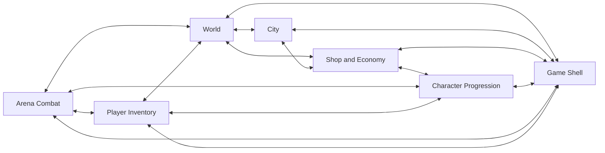

# Feature documentation

`doc/features/` contains implementation handbooks for player-facing game features. A feature document is the bridge between Neverlands observations, the shipped Rails implementation, and the tests that protect it. It should let an engineer or AI agent understand what the player can do, where authority lives, which files own the behavior, what is intentionally deferred, and how to verify a change without reconstructing the feature from the repository.

These documents describe fully implemented behavior within an explicit feature or area boundary. Product planning remains in `doc/design/launch_mvp_plan.md`; raw live-game evidence remains in `doc/design/reference/`; broader system design remains in `doc/design/areas/` and `doc/design/features/`.

## Fully implemented eligibility gate

`Fully Implemented` is the only green status for creating or retaining a canonical handbook in this directory. The handbook may own either one bounded player-facing feature or one coherent feature area, but every behavior it describes as active must exist, be integrated, and have all applicable tests passing before the handbook is created or promoted.

Fully implemented means complete for the handbook's declared MVP boundary; it does not mean every future Neverlands mechanic is shipped. Source-observed behavior outside that boundary belongs under non-goals or in `doc/design/**`. If a material in-scope path remains partly implemented, read-only, untested, or unavailable, keep its contract in design/planning documents until the gap is closed. Do not create a narrower duplicate handbook merely to make a partial slice look complete when an existing feature or area already owns the behavior.

The older `Implemented MVP` and `Partially Implemented` metadata values are transitional, non-green states. They may remain only while an existing handbook is audited, completed, merged into the correct owner, or retired. They must not be copied into a new handbook. `bin/feature-doc-audit` reports either value as a warning.

## Directory contents

| Document | Purpose |
|---|---|
| `FEATURE_TEMPLATE.md` | Canonical structure for every new feature implementation handbook. Copy it; do not write a new format from scratch. |
| `world.md` | Completed handbook for the open world, sparse cells, movement, outdoor actions, gates, NPC handoff, and exact-location persistence. |
| `city.md` | Completed handbook for the Forpost node graph, illustrated navigation, gates, buildings, captured interiors, and resume behavior. |
| `character_progression.md` | Completed handbook for level-0 startup, source-table XP/grants, primary stats and exact derived values, numeric skills, the launch perk subset, locked allocation, and public progression display. |
| `player_inventory.md` | Completed bounded handbook for authoritative carried/equipped state and the fresh Neverlands-matched equipment-family Inventory surface. |
| `arena_combat.md` | Completed bounded handbook for Arena applications, shared player/NPC turn combat, active-fight presentation, completion, and public fight logs. |
| `shop_economy.md` | Transitional handbook for the City Shop, catalog modes, NV wallet, buying, inventory selling, stock, and transaction persistence; it is not green until its declared boundary is fully implemented. |
| `game_shell.md` | Transitional handbook for the persistent game frame, compact vitals, exact-cell presence, global chat, and shell preferences; it is not green until its declared boundary is fully implemented. |

`world.md` and `city.md` are the canonical area-level `feature-v1` examples. `character_progression.md`, `player_inventory.md`, and `arena_combat.md` are green examples for bounded features whose broader source taxonomy remains explicitly deferred. The remaining transitional handbooks use the canonical layout but are not completion examples while their status remains non-green. `FEATURE_TEMPLATE.md` defines the required layout for subsequent features.

## Creating a feature document

1. Confirm the bounded feature or area is fully implemented and its applicable model, request, policy, service, factory, and UI coverage is green.
2. Confirm an existing handbook does not already own the behavior; update that owner instead of creating an overlapping slice.
3. Copy `doc/features/FEATURE_TEMPLATE.md` to a descriptive lowercase `snake_case` filename such as `doc/features/player_inventory.md`.
4. Replace every bracketed placeholder and remove every `Template instruction` blockquote.
5. Preserve all 18 numbered second-level sections and their order.
6. Keep a section even when it is not applicable; explain why instead of deleting it.
7. Use exact routes, class names, states, limits, coordinates, timing, labels, and repository-relative file paths from the current implementation.
8. Separate interactive behavior, read-only source captures, and deferred mechanics explicitly.
9. Keep `status: Fully Implemented` and the copied `template: feature-v1` metadata entry.
10. Verify every listed responsible file and focused spec path exists.
11. Run applicable focused coverage and update the version-history row.
12. Run `bin/feature-doc-audit doc/features/<feature_name>.md`.

Suggested command:

```bash
cp doc/features/FEATURE_TEMPLATE.md doc/features/<feature_name>.md
```

Do not leave placeholder text or template instructions in a completed feature document.

## Automated audit

Run the focused audit after creating or materially updating a feature handbook:

```bash
bin/feature-doc-audit doc/features/<feature_name>.md
```

Run the repository-wide audit through either:

```bash
bin/feature-doc-audit
bin/verify docs
```

The audit validates required metadata, canonical section ordering for `template: feature-v1`, the required cross-feature relationship subsection, reciprocal feature references, unresolved template content, trailing whitespace, responsible-file existence, duplicate feature titles, and the green completion status. Transitional statuses emit a warning.

Use `--strict` only when intentionally checking a pre-template document against the canonical 18-section layout:

```bash
bin/feature-doc-audit --strict doc/features/city.md
```

## Required layout

Every new feature document follows this exact second-level structure:

1. Design authority and related documents
2. Feature summary
3. MVP goals and non-goals
4. Player experience
5. Feature topology and authored content
6. Feature surfaces and contained behavior
7. Authoritative data and presentation model
8. Runtime architecture
9. HTTP and Turbo contract
10. Client-side and CSS ownership
11. Persistence and login resume
12. Authorization, trust boundaries, and concurrency
13. Failure and boundary behavior
14. Acceptance criteria
15. Test strategy and required coverage
16. Responsible for Implementation Files
17. Safe extension checklist
18. Version history

Third-level subsections may use precise feature terminology only where the template explicitly permits it. The purpose and order of the content must remain unchanged.

## Documentation rules

### Cross-reference related features

Every feature handbook must cross-reference each directly related feature in section 1 and explain the boundary in both directions. A relationship is justified when the features share a runtime handoff, authoritative record, persisted resume path, authorization boundary, rendered surface, or authored-content entry point.

Cross-references are reciprocal. If Feature A says it hands control or data to Feature B, Feature B must link back and describe what it accepts and what remains owned by A. Do not link every document to every other document: indirect adjacency, shared Rails infrastructure, or thematic similarity is not a feature relationship.

Current direct relationships:



When a boundary changes, update both handbooks in the same change. The owning handbook remains the sole primary contract; a cross-reference summarizes the handoff and must not duplicate the other feature's full behavior.

### Neverlands is the design authority

Neverlands remains the only source of game-design truth. A familiar MMORPG pattern is not evidence. When behavior has not been observed or documented, list it as deferred or a non-goal instead of inventing it.

If implementation and observation disagree, update them in this order:

1. capture or correct the evidence in `doc/design/reference/`;
2. update the relevant design record;
3. change implementation and tests;
4. update the feature handbook to describe the shipped result.

### Describe current implementation

Use present tense only for behavior that exists. Planned mechanics belong in goals/planning documents or must be explicitly labeled deferred. Read-only captured screens must not be described as functional transactions.

The document must identify:

- the player-visible entry, primary actions, feedback, and exit;
- authoritative records and state transitions;
- server/client ownership boundaries;
- exact authored topology or content;
- routes and HTML/Turbo/JSON behavior;
- persistence and safe login resume;
- authorization, locking, expiry, allowlists, and replay behavior;
- failure, null, edge, and boundary outcomes;
- cross-feature handoff ownership;
- implemented versus deferred behavior.

### Keep Responsible for Implementation Files exhaustive

Section 16 is mandatory. It must list every file that directly owns the documented feature, grouped by responsibility:

- requirements and design evidence;
- routes and controllers;
- models and policies;
- services;
- views, helpers, JavaScript, CSS, and assets;
- content/configuration, seeds, schema, and feature migrations;
- integrated feature entry points;
- factories;
- specs.

Do not list an entire broad directory when a small explicit file list is clearer. A directory is acceptable for a cohesive service or spec family. Distinguish files directly owned by the feature from files that take ownership after a handoff.

For authored gameplay content, a file inventory alone is not sufficient. The
owning handbook must also provide an operational lifecycle that identifies:

- the declaration source, such as `db/seeds.rb` or an existing gameplay config;
- the persisted/materialized records produced from that declaration;
- the resolver and capability/transition services that consume those records;
- how to add, adjust, move, deactivate, and permanently remove one exact piece
  of content;
- whether removing a seed/config declaration also removes already-persisted
  state, and the scoped reconciliation required when it does not;
- the model, seed/config, service, request, and system coverage that protects
  the lifecycle.

Extend the listed owner before creating a new catalog, registry, resolver, or
content pipeline. A new abstraction is justified only when the handbook first
shows that none of the existing owners can represent the captured behavior
without violating its current responsibility. Never treat a second source of
truth as an easier authoring shortcut.

### Tests are part of the contract

Every feature change must include applicable model, request, policy, service, factory, view/system, seed/config, and asset coverage. The feature document must explain the following categories:

- success;
- failure;
- edge, null, and boundary;
- authorization.

Blueprint and Swagger/rswag specs are applicable only to a feature that actually exposes those API surfaces. They are not required for the current authenticated HTML/Turbo World and City features.

Never invent a nonexistent spec path to satisfy the template. If a layer does not apply, say why. If the layer applies but coverage is missing, add the test as part of the feature change.

## Status values

Use `status: Fully Implemented` for every new or promoted feature/area handbook. Every active behavior must be shipped and covered; deferred behavior must be outside the declared boundary and clearly separated under non-goals.

`Implemented MVP` and `Partially Implemented` are transitional legacy values, not green completion states. Do not use them for a new handbook, and do not create a handbook containing planned, read-only, unavailable, or materially untested in-scope behavior.

## Keeping documents current

Update the responsible feature document whenever a change affects:

- player-visible behavior or Neverlands fidelity;
- routes, state transitions, validation, authorization, or timing;
- authored topology, catalog data, seeds, or assets;
- client-side ownership or accessibility;
- persistence or login resume;
- integration ownership;
- failure behavior or coverage;
- responsible implementation files.

Small internal refactors that do not change the contract still require the responsible-file inventory and implementation notes to remain correct.

## Review checklist

Before considering a feature document complete, confirm:

- all template placeholders and instructions are removed;
- `status: Fully Implemented` is justified by the declared feature or area boundary;
- `template: feature-v1` remains in frontmatter;
- all 18 sections remain in order;
- the summary is understandable without opening code;
- non-goals prevent generic or speculative expansion;
- interactive, read-only, and deferred states are unambiguous;
- the runtime diagram matches controller/service ownership;
- every direct cross-feature relationship is linked reciprocally with a consistent ownership boundary;
- every route and response mode exists;
- authority never depends on DOM, CSS geometry, or arbitrary client values;
- persistence and invalid-resume fallback are documented;
- all four required coverage categories are addressed;
- all responsible paths exist;
- `bin/feature-doc-audit doc/features/<feature_name>.md` passes;
- version history records the material contract change.
