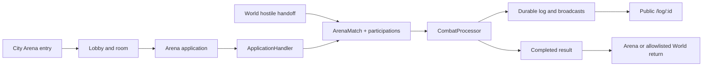

# frozen_string_literal: true
---
title: Arena Combat Runtime Feature
description: Implementation handbook for arena applications, shared player and NPC turn combat, combat presentation, completion, and public fight logs.
status: Fully Implemented
updated: 2026-07-28
owners: Arena and Combat
template: feature-v1
---

# Arena Combat Runtime

This document is the shipped implementation contract for the bounded Arena and
shared Fight runtime. It covers city-gated Arena entry, fight applications,
player/NPC match creation, server-authoritative turn resolution, the active
fight surface, explicit completion, and the shell-free public fight log.
Measurable desktop UI/UX parity is tracked separately in the launch matrix and
is not implied by functional completion of this runtime.

## 1. Design authority and related documents

Neverlands is the sole game-design and presentation authority. The normalized
Arena contract lives in `doc/design/areas/arena.md`; turn rules live in
`doc/design/features/combat.md`; the measured active-fight and public-log
captures live in `doc/design/reference/neverlands_live_game_shell_ui.md`.
`doc/design/launch_mvp_plan.md` is the visual-parity completion authority.

### 1.1 Cross-feature relationships

| Related feature | Relationship | Ownership and handoff |
|---|---|---|
| `doc/features/city.md` | Central Square exposes the current level-zero Arena hotspot and validates the building handoff. | City owns node availability and entry capability; Arena Combat owns lobby, applications, matches, and return after handoff. |
| `doc/features/game_shell.md` | Authenticated Arena and active fights render in the persistent game frame; the public log deliberately does not. | Game Shell owns shared framing, navigation, chat, and presence; Arena Combat owns its central surface and public-log layout. |
| `doc/features/world.md` | A source-backed wilderness interruption creates a shared Arena match and supplies an allowlisted return context. | World owns encounter eligibility, creation handoff, and return destination; Arena Combat owns the match after creation and its finish result. |
| `doc/features/player_inventory.md` | Equipped items supply combat presentation and profile inputs. | Player Inventory owns equipment state and requirements; Arena Combat reads preloaded equipment and owns combat wear/resolution. |
| `doc/features/character_progression.md` | Combat reads effective values and a completed eligible solo NPC fight may award capped XP. | Character Progression owns saved stats, formulas, and level grants; Arena Combat owns match finalization and the idempotent award call. |

## 2. Feature summary

The player enters Arena through the City-owned arena hotspot, selects a room,
creates or accepts a compact fight application, and enters the shared match
runtime. Player-versus-player applications use a short start countdown; an
eligible NPC training application starts immediately. Wilderness NPC fights
use the same match, participation, turn, result, and log records.

During a live fight the authenticated player sees two equipment-style fighter
rails and a fluid center composer. The center shows AP/mana limits, five action
slots, attack and block selectors, Turn/reset controls, the selected opponents,
and the chronological combat log. The server validates participant, target,
action catalog, AP, MP, body parts, current match state, and timeout. Completion
requires the participant to finish the result before the stored Arena or World
destination is restored.

Every fight also has `/log/:id`: a public, shell-free, paginated chronological
log with team-colored names, participant totals, and an optional statistics or
JSON representation.

## 3. MVP goals and non-goals

### Goals

- Keep Arena entry and applications server-gated and room-aware.
- Use one turn processor for player, team, Arena NPC, and wilderness NPC fights.
- Preserve captured AP, attack, block, target, timeout, surrender, and result
  semantics without trusting the browser preview.
- Render the captured desktop fight hierarchy and adapt it at tablet/mobile
  widths without introducing horizontal page overflow.
- Keep durable public logs readable outside the authenticated game shell.
- Preload participant, NPC, inventory, item, and template records required by
  the active fight renderer.

### Non-goals

- Copying Neverlands equipment art, icons, logos, crests, ornamental frames,
  branding, administration text, or project/service prose into runtime UI.
- Claiming exact active-fight control states or public-log geometry before they
  have been freshly compared using project-owned presentation primitives.
- Inventing uncaptured spells, items, arena rooms, fight kinds, group rules,
  rewards, or AI behavior.
- Treating CSS geometry, selected options, displayed AP, or Stimulus state as
  permission to mutate combat.
- Replacing server-rendered Rails/Hotwire surfaces with a client game engine.
- Declaring every unobserved waiting, timeout, multi-target, and completed
  visual variant 1:1; those remain explicit launch-matrix evidence gaps.

## 4. Player experience

### 4.1 Entry conditions

Arena lobby, room, application, and participant actions require Devise
authentication and a current playable character. The Arena entry gate accepts
either a City-established arena session or an already active Arena match.
Creating or accepting an application also rechecks room access, capacity,
level/alignment rules, HP threshold, active application, and combat state.

The public fight log requires only a valid match ID and always uses the minimal
application layout, including when an authenticated session exists.

### 4.2 Primary surface

At desktop widths the active fight is a full-width three-zone composition:
fixed equipment-style participant rails on the left and right, and a flexible
center composer/log. Name, level, HP/MP, equipment silhouette, and visible
opponent stats stay attached to the owning rail. The center orders the budget,
five quick slots, two selector columns, Turn/reset controls, target/HP line,
and chronological log as observed in the clearer Neverlands capture.

At `721..940px`, participant rails compact while the center remains fluid. At
`<=720px`, both rails share the first row and the center occupies the full row
below them. At `<=420px`, paper dolls scale further. Controls keep native
semantics, text remains readable, and the page itself does not overflow.

The public log uses a flat light field, source-like decorative header band,
gray time column, continuous messages, team-colored names, participant divider,
and plain pagination. It reflows at tablet and mobile widths.

### 4.3 Player actions and feedback

The player selects zero or more attacks, one legal block package, supported
skills, and an opponent, then submits Turn. Reset clears only the browser
selection. PvP participants may wait for the opposing submitted turn; eligible
waiting participants can claim a timeout victory or draw after expiry. A live
participant may surrender. Every accepted action appends durable log entries
and broadcasts the resulting state.

Validation failures preserve authoritative state and return alert feedback or
an unprocessable HTML/Turbo/JSON response. The client AP counter is preview
only; the processor calculates and rechecks the submitted package.

### 4.4 Exit and integration behavior

Live participants remain in combat. When the match completes, Finish records
that the participant viewed the result, clears the character combat flag, and
returns Arena fights to Arena. A World-created match resolves only the
World-authored allowlisted Character, Inventory, or World destination; invalid
metadata falls back to World. Public-log navigation never changes match state.

## 5. Feature topology and authored content

The shipped topology is:

- Arena lobby and source-backed room ladder;
- room-local applications in `open`, `matched`, `started`, `expired`, or
  `cancelled` states;
- matches in `pending`, `matching`, `live`, `completed`, or `cancelled` states;
- player and NPC participations assigned to named teams;
- ordered durable combat-log entries;
- configured Arena and wilderness NPC templates;
- public log/statistics projection over the durable match.

### 5.1 Coordinate, key, or identity terminology

- **Arena room ID** — persisted room and access boundary.
- **Application ID** — persisted offer identity, never a client capability.
- **Match ID** — shared combat and public-log identity.
- **Participation ID** — player or NPC membership in one match.
- **Team** — persisted side key such as `a` or `b`.
- **Action key** — allowlisted `combat_actions.yml` catalog identity.
- **Return context** — World-authored logical destination metadata, never a URL.

## 6. Feature surfaces and contained behavior

### 6.1 Implementation status

| Surface or behavior | Entry point | Runtime status | Owning implementation |
|---|---|---|---|
| Arena lobby and rooms | `GET /arena`, `/arena/lobby`, `/arena_rooms/:id` | Interactive | Arena controllers, room/application views |
| Application create/accept/cancel | Nested and member application routes | Interactive | `Arena::ApplicationHandler` plus models/controllers |
| Active shared fight | `GET /arena_matches/:id` | Interactive | Match controller, processor, fight views/Stimulus/CSS |
| Turn/timeout/finish | Match member POST routes | Interactive | Policy, controller, combat processor, return context |
| Incremental match log | `GET /arena_matches/:id/log` | Authenticated HTML/JSON | Presenter and match controller |
| Public durable log | `GET /log/:id` | Public HTML/JSON | Public controller/helper/view and statistics service |
| Measured fight UI and uncaptured states | Launch parity matrix | Not part of runtime completion | `[EVIDENCE]` and project-owned presentation work |

### 6.2 Arena applications and match start

`Arena::ApplicationHandler` owns player application creation, acceptance,
cancellation, transactionally-created matches/participations, countdown jobs,
and broadcasts. NPC applications use the same visible list and validation but
enter the shared fight immediately after an accepted open side.

### 6.3 Turn combat and completion

`Arena::CombatProcessor` owns profile preparation, AP/MP validation, attacks,
blocks, skills, seeded resolution, NPC responses, surrender, timeout claim,
match completion, participation results, equipment wear, reward finalization,
and log recording. `finish` is a later presentation/result acknowledgement and
does not rerun rewards.

### 6.4 Deferred behavior boundary

Unobserved fight variants, the full Neverlands spell/item action catalog,
complete group/sacrifice rules, and uncaptured Arena-room presentation states
remain outside this bounded runtime contract. They must be observed before
implementation. Source artwork is documentation evidence and must not be
copied into runtime assets.

## 7. Authoritative data and presentation model

| Record/component | Responsibility | Important contract |
|---|---|---|
| `ArenaRoom` | Access, level/alignment boundary, capacity | City-gated room authority |
| `ArenaApplication` | Offer parameters and lifecycle | Only eligible open applications can be accepted |
| `ArenaMatch` | Match state, timers, teams, return metadata | Active state gates actions and completion |
| `ArenaParticipation` | Player/NPC side, result, combat metadata | Exactly one player character or NPC template |
| `CombatLogEntry` | Ordered durable event | Source for active and public logs |
| `Character`/`InventoryItem` | Vitals, combat flag, equipment/wear | Owned outside Arena; mutated only by server services |
| Stimulus/CSS | Composer preview and responsive presentation | Never authoritative |

### 7.1 Source of truth

Database records, the combat action catalog, configured NPCs, and server
services are authoritative. Rendered costs, select values, target IDs, timers,
equipment slots, and body geometry are untrusted intent/presentation.

### 7.2 Validation and state lifecycle

Applications validate room/access/rule values and expire on server time.
Acceptance creates the match and participations inside a transaction. Starting
persists combat profiles and marks player characters in combat. Turn processing
revalidates live state, participant, target, body parts, action keys, AP, MP,
and defeat state. Match finalization locks the match so rewards/results are
written once; Finish records per-participant acknowledgement afterward.

### 7.3 Presentation versus authority

The browser can select options, preview AP, reset fields, subscribe to updates,
and reflow the UI. It cannot start a match, resolve a hit, choose NPC output,
advance a timeout, grant rewards, damage equipment, or choose a return URL.

## 8. Runtime architecture



### 8.1 Load and render

Lobby/room controllers enforce City entry and load bounded applications. The
match controller authorizes viewing, auto-ends a stale/defeated live match when
needed, and preloads participations, NPC templates, character inventories,
inventory items, and item templates before rendering the fight.

### 8.2 Accept or execute action

Application commands delegate to `ApplicationHandler`. Match commands resolve
only targets inside the loaded match and delegate submitted intent to
`CombatProcessor`. The processor normalizes and validates turn packages before
any persisted combat effect.

### 8.3 Complete, redirect, or hand off

Completion persists winner/draw results, reward markers, wear, and durable log
entries under the match finalization boundary. Finish clears the current
participant's combat flag and redirects to Arena or `CombatReturnContext`.
Public log reads the same ordered entries without mutation.

### 8.4 Concurrency behavior

Application match creation is transactional. Combat finalization locks the
match and returns false if another worker already completed it. Pending PvP
turns are stored per participation and resolve only when the required live
players have submitted. Timeout jobs recheck current match/turn state instead
of trusting their scheduled time, and reward markers prevent duplicate XP.

## 9. HTTP and Turbo contract

| Route | Purpose | Response |
|---|---|---|
| `GET /arena` and `/arena/lobby` | Arena entry/list | Authenticated HTML/JSON where supported |
| `GET /arena_rooms/:id` | Room and applications | Authenticated HTML/JSON |
| `GET/POST /arena_rooms/:arena_room_id/arena_applications` | List/create room applications | HTML partial/redirect or JSON |
| `POST /arena_rooms/:arena_room_id/arena_applications/:id/accept` | Accept nested application | Match redirect or JSON payload |
| `POST /arena_applications/:id/accept` | Accept direct application | Match redirect or JSON payload |
| `DELETE /arena_applications/:id/cancel` | Cancel own open application | Redirect or JSON |
| `GET /arena_matches/:id` | Active/waiting/result fight | Authenticated HTML/JSON |
| `POST /arena_matches/:id/action` | Submit turn or surrender intent | Redirect, Turbo status, or JSON |
| `POST /arena_matches/:id/claim_timeout` | Claim eligible timeout result | Redirect or JSON |
| `POST /arena_matches/:id/finish` | Acknowledge completed result | Redirect only |
| `GET /arena_matches/:id/log` | Authenticated incremental log | HTML partial or JSON |
| `GET /log/:id` | Public durable log/statistics | Minimal-layout HTML or JSON |

All mutation forms retain CSRF protection. No versioned public combat API is
introduced, so Swagger/rswag and serializer coverage do not apply.

## 10. Client-side and CSS ownership

`arena_controller.js` owns room/application live updates and participant
redirect presentation. `arena_match_controller.js` owns select interactions,
AP preview, reset, target choice, subscriptions, timer display, and reload of
server-rendered match state. Neither controller resolves combat.

`arena.css` owns Arena rows and the active fight composition. It fixes source
geometry at desktop, compacts the rails for tablet, and moves the center below
two fighter rails on mobile. `fight_logs.css` owns only the public log. Shared
paper-doll markup remains in `_equipment_paperdoll.html.erb`; Inventory owns the
actual equipped state. The flat SRP-by-domain stylesheet structure has no
Tailwind dependency and no nested `nl/` folder.

Keyboard-native selects, buttons, links, and forms retain labels. Name, HP/MP,
budget, timer, target, and log text remain available without color alone. The
responsive layouts avoid whole-page horizontal overflow; the World map is the
separate intentional internal-pan exception.

## 11. Persistence and login resume

Applications, matches, participations, profiles, turn metadata, results, and
combat logs persist in the database. A character's `in_combat` flag allows the
authenticated resume flow to return to an active or unfinished match. Arena
matches return to Arena after Finish. Wilderness matches retain only a
server-authored logical return context and fall back to World if it is invalid.

Public logs remain readable after match completion and do not require or alter
resume state. Browser AP previews, reset state, selected options, and viewport
layout do not persist as gameplay state.

## 12. Authorization, trust boundaries, and concurrency

- Devise protects Arena and participant match actions.
- `ArenaEntryGate` requires City entry or an already active match.
- `ArenaMatchPolicy` permits authenticated viewing but restricts live actions
  and completed Finish to actual participants in the correct match state.
- Controllers resolve the current user's participation and targets only within
  the requested match.
- Application identity, room, level gates, HP, target, body parts, action keys,
  AP, MP, timeout, and match state are all rechecked on the server.
- Public log is intentionally read-only and escapes log content while safely
  coloring known participant names.
- Match finalization and idempotent reward markers protect valuable outcomes;
  browser disabling and Action Cable delivery are never concurrency controls.

## 13. Failure and boundary behavior

| Condition | Required behavior |
|---|---|
| Arena opened without City entry | Redirect to World or return JSON forbidden |
| Missing current character | Redirect without creating an application/match |
| Closed, foreign, own, inaccessible, level-invalid, or low-HP application | Reject without match creation |
| Character already in combat | Reject NPC acceptance without partial records |
| Missing/foreign target or action key | Reject the turn without combat mutation |
| Insufficient AP/MP or illegal selector combination | Reject and preserve current authoritative turn |
| Non-participant action/timeout/finish | Policy/controller denial |
| Action after completion | Reject because the fight is not live |
| Finish before completion | Redirect back with `The fight is still active.` |
| Stale live match | Auto-end once from current authoritative state |
| Duplicate finalization/job | Match lock/state and reward markers prevent duplicate outcome |
| Invalid World return metadata | Clear combat through normal Finish and fall back to World |
| Missing public match | Return `404` text/JSON without exposing another record |
| Malicious log text | Escape content; only known participant-name fragments receive color spans |
| Narrow viewport | Reflow rails/center/log without whole-page horizontal overflow |

## 14. Acceptance criteria

- Arena entry is rejected unless City established the gate or the character
  already has an active match.
- Eligible applications create the expected player/NPC participations and
  enter the shared combat lifecycle.
- Turn submission validates target, body parts, action catalog, AP, MP, state,
  and participant on the server.
- PvP pending turns, NPC responses, surrender, timeout, defeat, wear, logs, and
  final rewards use the shared processor and persist once.
- The active fight renders two equipment-style rails, five quick slots, the
  compact two-column composer, target line, and chronological log.
- Desktop uses source-derived fixed rails with a fluid center; tablet/mobile
  reflow preserves controls and prevents page overflow.
- Finish clears participant combat state and resolves only Arena or a
  World-authored allowlisted return destination.
- `/log/:id` is public, shell-free, ordered, paginated, escaped, team-colored,
  and responsive.
- Unmeasured control states and unobserved visual variants remain Not Done in
  the launch matrix rather than being presented as 1:1 evidence; source
  fight/log artwork is not runtime completion work.

## 15. Test strategy and required coverage

Model, service, request, policy, job, helper, and system specs protect the
runtime boundary. Combat tests inject seeded RNG or deterministic stubs where
outcomes matter. Public-log request coverage verifies shell removal, ordering,
safe coloring/escaping, and responsive system behavior.

| Coverage category | Representative guarantees |
|---|---|
| Success | Application lifecycle, match start, turn resolution, NPC response, finish return, public log, and responsive surface |
| Failure | Entry gate, invalid application/action, insufficient AP/MP, premature finish, missing log, and escaped content |
| Edge/null/boundary | Empty slots, zero HP, multi-NPC side, timeout boundary, stale match, page boundaries, 940/720/420 layouts |
| Authorization | Anonymous Arena, non-participant mutation, participant-only finish, public read-only log |
| Retry/concurrency | Duplicate finalization/reward marker, stale timeout job, competing PvP turns, transactional match creation |

Focused verification command:

```bash
bundle exec rspec \
  spec/models/arena_match_lifecycle_spec.rb \
  spec/policies/arena_match_policy_spec.rb \
  spec/services/arena/combat_processor_spec.rb \
  spec/requests/arena_applications_spec.rb \
  spec/requests/arena_matches_spec.rb \
  spec/requests/public_fight_logs_spec.rb \
  spec/system/arena_match_ui_layout_spec.rb \
  spec/system/responsive_neverlands_ui_spec.rb
```

The full profile is required after broad UI changes because Arena integrates
World, Inventory, Progression, the game shell, jobs, and Action Cable.

## 16. Responsible for Implementation Files

### Requirements and design evidence

- `doc/features/arena_combat.md`
- `doc/design/areas/arena.md`
- `doc/design/features/combat.md`
- `doc/design/reference/neverlands_live_game_shell_ui.md`
- `doc/design/launch_mvp_plan.md`

### Routes and controllers

- `config/routes.rb`
- `app/controllers/arena_controller.rb`
- `app/controllers/arena_rooms_controller.rb`
- `app/controllers/arena_applications_controller.rb`
- `app/controllers/arena_matches_controller.rb`
- `app/controllers/public_fight_logs_controller.rb`
- `app/controllers/concerns/arena_entry_gate.rb`

### Models and policies

- `app/models/arena_room.rb`
- `app/models/arena_application.rb`
- `app/models/arena_match.rb`
- `app/models/arena_participation.rb`
- `app/models/combat_log_entry.rb`
- `app/models/npc_template.rb`
- `app/policies/arena_match_policy.rb`

### Services

- `app/lib/game/combat/action_catalog.rb`
- `app/services/arena/application_handler.rb`
- `app/services/arena/combat_broadcaster.rb`
- `app/services/arena/combat_log_presenter.rb`
- `app/services/arena/combat_log_recorder.rb`
- `app/services/arena/combat_processor.rb`
- `app/services/arena/combat_profile.rb`
- `app/services/arena/combat_resolver.rb`
- `app/services/arena/equipment_wear_resolver.rb`
- `app/services/arena/matchmaker.rb`
- `app/services/arena/npc_application_service.rb`
- `app/services/arena/npc_combat_ai.rb`
- `app/services/arena/npc_experience_awarder.rb`
- `app/services/combat/fight_log_statistics.rb`
- `app/services/game/combat/log_writer.rb`

### Views, helpers, client behavior, styling, and assets

- `app/views/arena/index.html.erb`
- `app/views/arena_rooms/show.html.erb`
- `app/views/arena_applications/_application.html.erb`
- `app/views/arena_applications/_list.html.erb`
- `app/views/arena_matches/show.html.erb`
- `app/views/arena_matches/_combat_log.html.erb`
- `app/views/arena_matches/_fighter_card.html.erb`
- `app/views/arena_matches/_opponent_stats.html.erb`
- `app/views/arena_matches/_participant.html.erb`
- `app/views/public_fight_logs/show.html.erb`
- `app/views/shared/_equipment_paperdoll.html.erb`
- `app/helpers/arena_helper.rb`
- `app/helpers/public_fight_logs_helper.rb`
- `app/javascript/controllers/arena_controller.js`
- `app/javascript/controllers/arena_match_controller.js`
- `app/assets/stylesheets/arena.css`
- `app/assets/stylesheets/fight_logs.css`
- `app/assets/images/arena.png`
- `app/assets/images/npc`

### Content, configuration, seeds, and schema

- `config/gameplay/arena_npcs.yml`
- `config/gameplay/combat_actions.yml`
- `db/seeds.rb`
- `db/schema.rb`

### Integrated feature entry points

- `app/services/game/world/start_npc_fight.rb`
- `app/services/game/world/combat_return_context.rb`
- `app/controllers/world_context_actions_controller.rb`
- `app/services/game/inventory/manager.rb`
- `app/services/characters/vitals_service.rb`

World owns encounter creation eligibility and return context. Inventory owns
equipment persistence. Character Progression owns effective values and grants.
Arena Combat owns the match after those handoffs.

### Factories

- `spec/factories/arena_rooms.rb`
- `spec/factories/arena_applications.rb`
- `spec/factories/arena_matches.rb`
- `spec/factories/arena_participations.rb`
- `spec/factories/combat_log_entries.rb`
- `spec/factories/npc_templates.rb`

### Specs

- `spec/models/arena_application_hp_gate_spec.rb`
- `spec/models/arena_match_auto_end_spec.rb`
- `spec/models/arena_match_lifecycle_spec.rb`
- `spec/models/arena_match_timeout_spec.rb`
- `spec/models/combat_log_entry_spec.rb`
- `spec/policies/arena_match_policy_spec.rb`
- `spec/services/arena`
- `spec/jobs/arena`
- `spec/requests/arena_spec.rb`
- `spec/requests/arena_rooms_spec.rb`
- `spec/requests/arena_applications_spec.rb`
- `spec/requests/arena_matches_spec.rb`
- `spec/requests/arena_matches_auto_end_spec.rb`
- `spec/requests/arena_npc_combat_spec.rb`
- `spec/requests/public_fight_logs_spec.rb`
- `spec/helpers/arena_helper_spec.rb`
- `spec/system/arena_match_lifecycle_ui_spec.rb`
- `spec/system/arena_match_notification_spec.rb`
- `spec/system/arena_match_ui_layout_spec.rb`
- `spec/system/arena_npc_combat_spec.rb`
- `spec/system/responsive_neverlands_ui_spec.rb`

## 17. Safe extension checklist

1. Capture the exact Neverlands Arena/fight/log state before changing design.
2. Add stable action/NPC/content keys at the server catalog boundary.
3. Keep target, AP/MP, body parts, timeout, match state, rewards, and return
   context server-authoritative.
4. Preserve match locks, transaction boundaries, deterministic RNG tests, and
   idempotent reward markers.
5. Preload every association used by fighter/equipment rendering.
6. Keep Arena, active fight, and public log CSS in their domain owners; do not
   add Tailwind or a nested stylesheet subsystem.
7. Verify desktop parity and 820px/390px adaptation independently.
8. Add success, failure, boundary, authorization, and retry coverage.
9. Update source evidence, launch matrix, reciprocal handbooks, and this
   contract only after implementation verification.

## 18. Version history

| Date | Change |
|---|---|
| 2026-07-28 | Created the canonical bounded Arena Combat runtime handbook after implementing the full-width source fight hierarchy, shared player/NPC equipment rails, public shell-free fight log, eager-loaded equipment rendering, and responsive tablet/mobile adaptation. |
