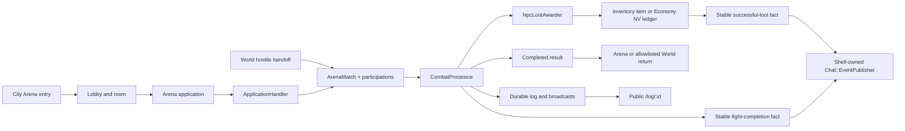

# frozen_string_literal: true
---
title: Arena Combat Runtime Feature
description: Implementation handbook for arena applications, shared player and NPC turn combat, combat presentation, completion, and public fight logs.
status: Partially Implemented
updated: 2026-09-15
owners: Arena and Combat
template: feature-v1
---

# Arena Combat Runtime

[ARENA](../ARENA.md) is the complete area guide to halls, applications,
admission/assembly, training supply, presentation and editing.
[COMBAT](../COMBAT.md) is the general guide to modes, shared turns, input/formula
effects, outcomes, UI and editing. [SCROLLS](../SCROLLS.md) explains targeted
entry and licenses. This handbook retains the detailed runtime/acceptance contract.

### September 15 recovery and qualification

The prior documentation audit identified a broken legacy lobby URL, a missing
NPC capacity recheck and concurrent NPC supply without a durable unique guard.
This follow-up repairs those boundaries:

- `/arena/lobby` redirects through the existing entry gate to `/arena`.
- NPC acceptance rechecks capacity under room → application → character locks.
- `NpcApplicationService` holds the room lock, retires expired offers and creates
  one replacement. A partial unique index protects open room/NPC pairs even
  outside the service. The migration preserves duplicate history as cancelled
  offers. Publication waits for outermost commit.
- The Training job counts only unexpired supply. Authorized Training entry/
  refresh restores an absent offer before the character-locked controller flow;
  later queued work is idempotent. Help still requires explicit supply. Default
  scans recur after 60 seconds once bootstrapped; room-specific jobs are one-shot.
- [Medical Care](medical_care.md) now enforces effective Doctor proficiency at
  both quotation and paid acceptance, using the existing shared item checker.

[Source review](../design/reference/combat/observations/2026-09-15_arena_medical_gap_review.md)
records the published bag thresholds, Group waiting period and unresolved
percentage/Snowball/XP details. No new source PvP fight is claimed.

Verification and final manual acceptance are recorded in the September 15
acceptance section at the end of this handbook.

### September 14 scroll entry

The fight header renders authoritative `trauma_percent` for every entry path.
It no longer displays the unused metadata default “normal” for all matches.

[Attack scrolls](../design/features/scrolls.md) reuse this match, participation,
profile, processor, resolver, injury/XP/wear, chat/log and fight UI pipeline.
[Inventory](player_inventory.md#september-14-attack-scrolls) owns admission and
the use receipt. New matches carry `source: scroll_pvp`, `physical_only: true`
and the existing 300-second global deadline. Fist Attack unequips both players
before profile preparation; unarmed profiles ignore old shield/weapon preview
overrides and use no equipment artifact multiplier. Permit intervention adds
a player opposite the living target, retaining existing trauma/deadline and
pending turns; the new player joins the same current-round commitment barrier.
Closed fights and defeated targets reject intervention.

Each participant finishes independently. The scroll entrant returns to
Inventory; a newly attacked defender resumes their saved accessible location.
Successful source scroll entry is still pending; both 17-to-5 submissions
rejected without consumption. The observation separates local
interpretations from live proof. No separate PvP combat resolver exists.

This document describes the bounded Arena and shared Fight runtime, including
the locally accepted physical Duel/Group applications and stronger-NPC changes. It covers city-gated Arena entry, fight applications,
player/NPC match creation, server-authoritative turn resolution, the active
fight surface, explicit completion, and the shell-free public fight log.
Measurable desktop UI/UX parity and overall delivery completion are tracked in
the Combat Completion Matrix under Pillar 3 of
`doc/design/launch_mvp_plan.md`. Earlier bounded acceptance remains recorded
below; the September 14 human Duel and September 15 follow-up sections own
the latest relevant acceptance.

### September 12 physical Arena applications

The [fresh Arena observations](../design/reference/combat/observations/2026-09-12_arena_duels_and_groups.md)
and [normalized contract](../design/areas/arena.md#september-12-physical-arena-contract)
own this stage. Only Duels/Groups are exposed; four equipment kinds plus Group
alignment/closed variants feed server admission. Clan/intervention features are
outside this basic PvP scope. New Arena matches are physical-only with a
300-second global deadline, while historical bounded magic remains available
to existing wilderness profiles. Forged spell keys cannot spend MP or advance a turn.

`ApplicationHandler#create/accept/cancel` owns offers and Duels. It returns
success/application/match/errors, locks room then character and schedules the
applicant-confirmed human Duel reservation after commit. `GroupAssembly#join/withdraw`
returns that same shaped result after room→application→character locks;
`settle(application:)` locks all roster characters in id order, creates real
participations and starts `CombatProcessor` once at the deadline. Invalid or
empty opposition expires without combat. Underfilled sides may start; full
sides wait until deadline. These start details are authorized local inference.

`ArenaApplicationMembership` has foreign keys, unique application/character and
an a/b team constraint. A waiting member cannot create/join another offer or
mutate equipment/location through protected controllers. Cancel by owner
releases all reservations; member withdrawal releases one. `ApplicationDeadlineJob`
is safe for missing/early/repeated runs. `ApplicationRecovery.call(scope:)`
recovers at most100 due offers on relevant requests, before character locks;
lost enqueue can therefore recover on lobby/owner navigation. Broadcasts follow
commits and reload reads authoritative state. No unused auto-matchmaker remains.

The compact white lobby uses native Rails forms, blue links/gray tabs, cream
controls, side radios, exact saved terms, waiting navigation lock, level/all
filters and an inline ten-hall scheme. Stimulus only enhances scheme/deadlines,
room refresh and committed match transitions; it cleans up timers/subscriptions.
Automatic five-second recovery refreshes begin only once the application's
deadline is due; ordinary waiting preserves the expanded scheme and focus.
Committed roster changes and the explicit Refresh control still reload state.
[ARTWORK](../ARTWORK.md#september-12-arena-application-icons) records the three
original painted icons at16px, complete-canvas64px delivery. No source bitmaps
or oversized lobby illustration were introduced.

PvP and mixed teams use `ExperienceAwarder`: defeated NPCs/damaged players, credited HP,
snapshotted level/HP, group contribution, fitted trauma factor and the existing
premium/level cap. Untouched surrender and draws grant zero XP. Defeated
contributors remain in results, while active cards/targets/readiness exclude
them. Existing finalization supplies named results, bold structured fight logs,
recipient chat events, wear, injuries and Finish through the common owners.
`Character#unfinished_arena_result` restores each physical Arena participant's
unacknowledged result on login or protected navigation, even when another player
finished the battle while they were offline. New offer/join requests reject that
reservation until their own Finish. Finish returns to the accessible original
hall and Duel/Group tab; replay cannot clear a newer active fight. Historical
and wilderness return contracts remain with their existing context owners.
Public credited statistics treat absent positive counters as zero after shared
reward finalization, preserving raw post-lethal hits only in log diagnostics.
[Medical Care](medical_care.md) remains responsible for healing.

The subsequent injury-rarity correction makes ordinary severity independent
of fight risk: light80%, medium18%, heavy2% among successful injury rolls.
Low10%-risk defeats remain uninjured90% of the time. The shared awarder applies
this to player and NPC opponents alike; the numeric table and configuration
live in [INJURY-01](../FORMULAS.md#injury-01--defeat-injury-and-stat-penalty).
Guaranteed combat/decisive-timeout exceptions remain separate. Existing saved
injuries and the earlier browser examples retain their historical outcomes.

Focused coverage for this stage: `spec/services/arena/group_assembly_spec.rb`
(real sides, alignment/closed admission, exact deadlines, equipment/HP
revalidation, duplicate joins, concurrent final-place contenders),
`spec/services/arena/equipment_rule_spec.rb`,
`spec/services/arena/pvp_experience_spec.rb`,
`spec/requests/arena_applications_spec.rb` (HTTP terms, reservations and recovery),
`spec/requests/arena_pvp_lifecycle_spec.rb` (physical-only forged intent and the
shared two-player lifecycle), `spec/system/arena_match_notification_spec.rb`
(native forms, Group side join/leave), and
`spec/system/arena_npc_immediate_start_spec.rb` (full-page NPC acceptance).
`spec/models/arena_room_content_spec.rb` checks ten halls and room-local Dummy
lookup. `spec/services/arena/npc_application_service_spec.rb` also proves the
Dummy open-side0–5 gate independently of Training Hall5–10; optional NPC bounds
are authored/validated in the Arena NPC configuration and copied at creation.
`spec/assets/arena_lobby_artwork_spec.rb` checks icon and Dummy portrait dimensions.
`spec/requests/arena_result_recovery_spec.rb` covers login, navigation, admission,
room fallback and old-Finish replay; `spec/services/combat/fight_log_statistics_spec.rb`
checks zero-credit simultaneous overkill. The browser spec also follows recent
log → Statistics outside the shell frame and preserves the waiting scheme.

The reservation lock preserves existing wilderness Inventory access; its active
match guard applies to new physical Arena profiles. The local-action transaction
uses its own savepoint so a rescued combat-start failure rolls back the offer
under that outer lock (`spec/requests/world_spec.rb`). A persisted waiting offer
can restore a missing old room context only after current city/hall access is
revalidated. New forms target the full shell so fight URL and presence advance
with rendered content.

The [final physical Arena acceptance](#final-physical-arena-acceptance) below
records this stage's automated and browser results; earlier sections retain
their historical check counts.

#### Physical Arena browser findings

The first local Chrome pass used four isolated level10 players and actual forms
to post/join a free2×2 Group: own levels9–11, opposing8–12, turn240 seconds,
trauma10%, wait5 minutes. One member withdrew and rejoined the other side.
The offer posted at16:37:02 and became match44 at16:42:07 through deadline
recovery. Three shared rounds completed at16:45:24 with sideB winning.
Target switching and a waiting submission survived reload. Two defeated players
left all active cards/targets/readiness; logging in as one showed only the two
survivors and “You are defeated. Waiting for fight result.”, without Turn.

Credited result rows (damage/defeats/XP) were A190/1/9, B0/0/1, C115/0/143,
D125/2/152. A defeated winning contributor retained XP. PlayerB received the
named light Chest muscle hematoma injury and private chat notices. These are
local development RNG results, not source formula measurements. The pass found
and drove fixes for zero-credit public statistics, the recent-log Turbo frame,
offline result recovery, original-hall Finish, alignment access labels, and
pre-deadline refresh resetting the room scheme. Final acceptance of those fixes
is recorded below; this preliminary pass alone does not certify them.

#### Final physical Arena acceptance

The agent exercised the final local app in a separate Chrome tab with seven
isolated development players. Setup created players and normal configured NPC
offers; posting, joining, leaving, attack/block selection, target switching,
Finish and navigation all used actual UI controls. These are local fixtures,
not Neverlands observations. No new source login or completed Arena fight was
part of this pass; the source wilderness register remains22.

| Actual local UI path | Observed result |
|---|---|
| City → Arena → Trial Hall → unarmed Duel application → second player Accept | Match45 retained timeout2 minutes and trauma30%, entered the ten-second waiting state, then started through the visible Refresh recovery at17:17:34. Two submitted packages resolved together at17:18:19: 166 raw damage credited120 HP, with the defeated opponent's committed64-damage return. Winner XP112; loser XP0 and a named light chest injury. Each player independently used Finish and returned to Trial/Duels. |
| Group form → submit1×1 → opposite-side join → deadline recovery | Match46 displayed the source-normalized1×2 capacities with range0–33, timeout2, trauma10%, wait5. With one real player on each side it started when navigation recovered the due offer at17:21:16. Two shared rounds ended with sideB winning: credited damage120/64 and XP102/0. Pending intent survived reload; each Finish returned to Trial/Groups. |
| Completed Group44 → separate defeated-player logins → Finish | All four participants recovered their own unacknowledged result, including the defeated winning contributor. Public Statistics retained B's credited damage0 and defeats0, and C's defeats0; raw post-lethal hits remained only in diagnostics. Later HP regeneration did not change historical defeated HP0. The recent-log link opened outside the shell frame without a missing-content error. |
| Help Hall → level-eligible Dummy Accept → physical turns → Finish | Match47 used the same composer with90 AP and no magic inputs. Dodges, a shield-free block pierce and a miss preceded the lethal140 raw/30 credited hit. The result awarded5 XP; Finish returned to Help/Duels and emitted one private XP row, retained after reload. |
| Fresh Dummy48 after final artwork checks → responsive physical turn → timeout → Finish | The complete690×1530 Dummy portrait fit its narrow paper doll. Its first exchange dodged the player's attack and dealt2 HP. The five-minute global deadline ended the match in a draw at17:36:27 (displayed duration5m1s), with no XP. Finish/reload returned to Help/Duels without adding another reward notice. |

The local worker did not establish timely Duel/Group background starts during
these manual runs: visible Refresh or later navigation exercised persisted
deadline recovery. Match46's due time was17:18:49; its observed start at17:21:16
must not be reported as an exact-deadline start. Deterministic job/service
specs separately cover before/at/after deadlines, retries and competing joins.

Visual/input acceptance covered desktop1366×768 and1920×1080, tablet820×900,
phone390×844 and320×740, and landscape844×390. The four final Dummy viewport
measurements had document width equal to viewport width. At390px its native
690×1530 image rendered66.7×147.9 with contain fit and the complete silhouette.
The [portrait correction](../ARTWORK.md#september-12-training-dummy-portrait-correction)
and [three original icons](../ARTWORK.md#september-12-arena-application-icons)
record dimensions, provenance and exact generation prompts.

At320px, keyboard focus reached waiting controls and the two-column hall
scheme; the focused public-statistics region scrolled horizontally to XP and
Defeated without widening the document. Actual Chrome200% zoom was confirmed
in native browser controls (864×426 CSS viewport), and Tab scrolled Leave Group
into view. The waiting scheme remained expanded for more than30 seconds before
its deadline. Zoom was restored to100% and the viewport override cleared.
These are pointer/keyboard and responsive-viewport checks, not physical touch
device evidence. Inspected screenshots: `/tmp/arena-physical-group-acceptance.png`
and `/tmp/arena-dummy-portrait-acceptance.png`.

Final runtime gate: `bin/verify full`, `/tmp/arena-full-9.log`, passed with
**613 Ruby files lint-clean, 3,001 non-system examples and300 system examples,
zero failures**; Brakeman reported0 errors/0 warnings, dependency audits were
clean, and12 feature/88 architecture documents passed. After the image-only
correction, the artwork spec passed **2 examples** and `bin/verify combat`
passed **481 examples**, lint and documentation audits
(`/tmp/arena-final-art-spec.log`, `/tmp/arena-final-art-verification.log`).
Dummy48 was exercised after those final artwork checks. These are local checks,
not CI results; earlier failed/intermediate logs remain historical.

Cleanup readback found all five local matches44–48 completed, with **zero
active matches, waiting offers or unacknowledged results** across all seven
fixture players. Their separate histories remain for inspection. Final
evidence-only documentation synchronization is verified with `bin/verify docs`
and `git diff --check`.

### September 12 calibrated completion work

The user authorized evidence-grounded approximations after the22-fight register.
[Combat calibration v1](../design/features/combat_calibration.md) now owns the
complete fitted equations, numerical anchors and content assumptions. Shared
resolution uses effective weapon mastery, Strength, armor/penetration,
resistance, opposed Accuracy/Evasion and Crushing/Fortitude, artifact grades and
fatigue. Explicit AP captures still override derived weapon costs. Magic uses
MP/Knowledge/resistance and temporary barriers, with separate credited buckets.
General NPC XP and player-group shares retain capped, guarded finalization;
actual recipient awards drive result, public statistics and chat. Typed loot
adds authored calibrated pools and Observation. Named injuries now persist
and hand off to [Medical Care](medical_care.md).

Ogre declarations are enabled under `calibrated_v1`; the old
`unverified_damage_coefficients` bootstrap hold is upgraded without rewriting
custom managed disabled/moved placements. Defeated fighters remain terminal.
The [September 12 final acceptance](#september-12-final-calibrated-acceptance)
owns the new checks; September 11 records below remain historical.

### September 12 final calibrated acceptance

Local acceptance used a separate Chrome tab and three isolated development
players. The fighter reproduced the source level-17 primary/equipment inputs
through named composite fixtures; this is not a claim that the fixture gear is
a captured source loadout. No source login, source-account move or new source
fight is part of this implementation pass. The source register remains 22.

| Actual local UI path | Observed outcome |
|---|---|
| World → passive Orc 4/3 fight → two turns → log/statistics → Finish | Raw critical 1636 removed only 110 HP; the dead Orc left cards, roster and switching. A later committed overkill strike remained in the log without extra credit. Result 175 damage, two defeats, 1 XP; Finish/reload retained location and chat reward. |
| Inventory action interrupted by paired Goblins → fight → Finish | The action interruption entered the same engine, with 190 credited damage/two defeats/1 XP. Finish resumed Inventory. |
| Inventory → wear dagger → reload → wear shield → reload | The same profile derived 65 AP with dual weapons and 62 AP with the mace/shield, armor 528. The preview no longer displays the legacy constant 45 AP. |
| Remote [19,10] → Bandit 14 → Spirit Arrow → physical finish | Spirit Arrow cost 5 MP and critically dealt 10; the physical strike removed the remaining 825 HP. Result and public statistics split 825 physical +10 magic =835 total, one defeat, 631 XP. |
| Remote [20,6] → Ogre 16/16/17 → shield exchanges and keyboard target switch | Connected physical hits dealt zero. Shield pierces returned 231 and 327, then a critical 709. The player lost after the next 273 raw hit; zero credited damage/XP omitted the personal result table. Original full-body Ogre and independently mapped equipment remained visible. |
| Hospital → purchase → Inventory → Medical care → free/paid treatment | See [Medical Care](medical_care.md#6-acceptance-and-tests) for actual balances, bag consumption, injury restrictions, header updates and reload checks. |

The browser pass found and corrected stale Turbo header/flash navigation,
the hard-coded profile AP preview, missing magic in the final result columns,
a missing defeated-player name, a passive deadline surviving action-triggered
combat, and profile loss counters that stayed zero. Focused regressions cover
the corrected ownership, actual persisted outcomes and retry behavior.

Final local `bin/verify full` passed: **601 Ruby files lint-clean, 2,972
non-system examples and 298 system examples, zero failures**; Brakeman,
Bundler Audit and Importmap audit found no issues; 12 feature handbooks and
87 architecture documents passed. Log: `/tmp/mmorpg-final-combat-accepted.log`.
This is local validation, not CI. Earlier failed/intermediate runs are retained
in temporary logs; only this run includes the final counter correction.

After that final gate, the agent repeated the affected UI flow with another
four-Ogre encounter. The isolated fixture started at 200 HP to shorten the
loss check; stats and combat RNG were unchanged. A real shield exchange produced
a zero-damage critical attack, 246 incoming raw damage and the correctly named
defeat sentence. Finish returned to **[20,6]**, and reload kept the player there
without reusing the old pending encounter timer. Header HP recovered **0→19→47**
from server time. Inventory then showed **NPC wins 3, NPC losses 1, AP 62**;
reload retained the result. The prior losses predated the counter fix and were
not silently backfilled. Separate public-log navigation still displayed the
historically defeated fighter at **0/1375** after current HP recovered.

The corrected mixed-damage result and public Statistics were revisited after
the final gate: **825 physical +10 magic =835**, one defeat, 631 XP. Chrome's
actual **200%** zoom gave an **864×416** CSS viewport; the result row remained
readable through the main pane's scrolling, and Fight log → Statistics → back
→ Return controls worked. The already-finished result correctly offers Return
instead of another Finish action. Zoom was restored to 100%, **1728×833**.
At **320×780**, the public table's focused horizontal region responded to
keyboard arrows and exposed the final XP/Defeated columns without document
overflow. At **390×844**, the active Ogre portrait retained its 690×1530
native source and contain fit; the complete body and gear stayed visible and
the turn was submitted through the responsive controls. Earlier medical checks
cover 320/390 widths. These are pointer/keyboard and viewport checks, not
physical touch-device evidence. Screenshots were inspected in the task.

Local fixture setup and shortened waits are separate from gameplay acceptance:
all purchases, equipment changes, treatment requests/acceptance, attack/block
submissions, switches, Finish and navigation above used real UI controls.
Cleanup kept isolated QA players and histories, parked the fighter safely in
the city, and restored exactly the three QA Hospital purchases to shared stock
and funds. Original player data and source sessions were not changed by these
fixtures. Evidence-only documentation synchronization followed the browser pass.
Cleanup readback confirmed zero active fixture fights or pending encounter waits,
Hospital NV restored to 0 and bag stock restored to 33/28/143/1. The isolated
Chrome tab was closed; the existing source and user tabs remain open. Final
`bin/verify docs` and `git diff --check` passed after evidence synchronization.

## 1. Design authority and related documents

Read the [combat formulas](../FORMULAS.md#5-combat),
[NPC lifecycle and groups](../NPC.md#7-encounter-and-fight-lifecycle),
[item inputs](../ITEMS.md#3-fields-slots-and-effective-properties),
[world return context](../WORLD.md#5-travel-context-and-return-behavior) and
[event catalog](game_shell.md#gameplay-event-catalog) when changing this shared
pipeline. Use [ARTWORK](../ARTWORK.md) for fight images and
[Medical Care](medical_care.md) for injury treatment. Follow the
[context/update map](../DOCUMENTATION.md#21-required-context-and-update-map)
to synchronize affected reference entries and handoffs in the same task.

### Historical September 11 Ogre and terminal-defeat follow-up

The [final two source fights](../design/reference/combat/observations/2026-09-11_ogre_combat_cycle.md)
complete the 22-fight observation register. Original Ogre portrait/equipment
assets and independent 16–18 profiles use the existing paper doll and
`ArenaParticipation#npc_combat_data` snapshots. The captured three/four-member
rosters are authored for the two compatible starter habitats. Their initial
World placements initially remained inactive: local damage coefficients do not reproduce
the observed player 0-damage hits and NPC 502–801 critical replies.

`ArenaParticipation#combat_alive?` is the shared no-IO eligibility rule:
positive current HP **and no recorded defeat**. It is used by active cards,
rosters, selection, player submission, NPC target selection, next-round
readiness and team survival. Recovery cannot restore a defeated participant
to this fight. Live HTML/JSON/vitals broadcasts retain zero combat HP for a
recorded defeat while leaving the recovered Character HP intact. WebSocket
reconnect snapshots also keep defeated participants dead and clear their
waiting presentation. Committed
exchanges snapshot only participants alive at their start, preserving already
committed lethal returns. Results, credited damage, XP and historical logs
retain the participation records.

Focused coverage: `spec/requests/arena_opponent_selection_spec.rb`,
`spec/models/arena_participation_spec.rb`,
`spec/models/ogre_combat_content_spec.rb`, `spec/channels/arena_match_channel_spec.rb`,
`spec/services/arena/npc_combat_ai_spec.rb`,
`spec/services/arena/combat_broadcaster_spec.rb` and
`spec/services/arena/committed_exchange_spec.rb`. Artwork dimensions are checked
in `spec/assets/ogre_artwork_spec.rb`. The stage2 acceptance below is historical;
this follow-up's final gate/browser record follows.

#### Final Ogre acceptance — September 12 local date

`bin/verify full` passed on the final runtime: **579 Ruby files without lint
offenses, 2,942 non-system examples and 298 system examples without failures**;
Brakeman reported zero warnings, Bundler/Importmap audits found no vulnerable
dependencies, and documentation audits passed for 11 feature / 87 architecture
documents. Local output: `/tmp/mmorpg-ogre-full-accepted.log`. This is local
verification, not CI or proof of Neverlands formula parity.

Earlier checks remain distinguishable: the old landscape seed expectation
failed because it assumed every cell used the original sheet and painted
landmarks. Its corrected focused file passed four examples. Two intermediate
full runs were stopped during review to complete the defeat/reconnect fixes.
The subsequent full run passed non-system specs but failed the lifecycle test
whose one-second countdown expired before the initial Waiting assertion.
That test now gives browser setup two minutes and explicitly runs the same
starter job; its focused file passed 36 examples before the successful final
full run. The combined defeat HTTP/channel/helper check passed 48 examples.

After that final gate, the agent personally used Chrome on `localhost:3000`
with the dedicated level-17 development player, mouse and Enter-key input,
at **1728×833** and **390×844**, DPR 1 and normal zoom. World also received
the **320×844** check recorded in its handbook. Temporary fixture preparation
enabled only one captured four-Ogre roster and raised test-player combat
stats to make removal/completion practical. These test values are not authored
Ogre balance. Matches and turns were created by World waiting and real UI
actions, not a runner calling combat creation/resolution.

- Match **34** started through World's targetless passive check with Ogre
  16/16/16/18, HP 1455/1455/1455/1685. Attack/block selectors and Turn worked
  at phone width. The first defeat reduced active cards/roster from four to
  three. The fixture then changed that already-defeated NPC's stored HP to
  500; reload still excluded it from cards and roster, and later rounds
  completed without targeting or crediting it again. This is synthetic
  recovery coverage, not an implemented healer flow.
- Desktop switching reached Ogre 18 and displayed Strength 151, Armor 535,
  Accuracy 495, Crushing 870, Fortitude 730 and Pierce 85, distinct from Ogre
  16. The visible portrait measured **115×255**, natural **690×1530**, contain
  fit. Helmet, amulet, club, boots, two rings, bracers, gloves, armor and belt
  rendered with complete silhouettes and no missing images. Phone reflow
  retained the same equipment and controls without horizontal page overflow.
- Victory removed all opposing cards and active roster entries. Fight log →
  Statistics retained all five participants and showed **6,050 credited
  damage, four defeated opponents and zero XP** for this fixture. The recovered
  defeated NPC remained zero HP in the historical display. Raw body-part
  damage was separately 271,466. Back → Back → Finish Fight returned to
  `[20,7]`; reload retained that coordinate.
- A second final match, **35**, specifically verified keyboard access to
  Switch opponent in the horizontally scrollable 390px toolbar: Enter
  decreased its allowance **3→2**. Earlier pointer attempts outside the visible
  toolbar portion had not submitted a switch and are not counted as successful
  pointer acceptance. Five real attack/block turns, including one miss,
  completed the group; Finish and reload again returned to `[20,7]`.

Preliminary match 33 and pre-gate screenshots are exploratory only. Final
task screenshots show the habitat at 320px and Ogre combat at phone/desktop
widths. The test player's original stats/metadata/location were restored,
both Ogre placements restored inactive, and no acceptance match remained
active. Normal viewport settings were restored. This pass does not repeat
the earlier stage2 200%-zoom check or certify every shell/presence variant.
During cleanup, restoring the original hostile `[4,11]` position while the
World tab was still open triggered an additional two-Skeleton match 36.
It was completed through four UI turns and Finish, then the agent-owned tab
was closed before restoring again. Final database inspection confirmed zero
active test-player matches and both Ogre placements inactive. That cleanup
fight is not another Neverlands observation or Ogre acceptance sample.

Domain navigation: `doc/domains/combat.md`.

Neverlands is the sole game-design and presentation authority. The normalized
Arena contract lives in `doc/design/areas/arena.md`; turn rules live in
`doc/design/features/combat.md`; the measured active-fight and public-log
captures live in `doc/design/reference/shell/observations/2026-07-28_game_shell_and_mvp_surfaces.md`.
The current authenticated shield-profile flow lives in
`doc/design/reference/combat/observations/2026-08-26_wilderness_shield_npc_fight.md`.
The adjacent current `1x2` and passive `1x1` wilderness flows live in
`doc/design/reference/combat/observations/2026-08-26_wilderness_two_orc_group_fight.md`
and
`doc/design/reference/combat/observations/2026-08-26_wilderness_passive_goblin_fight.md`.
The current same-return-context variable-group and magic flow lives in
`doc/design/reference/combat/observations/2026-09-01_wilderness_bandit_group_variation_and_magic.md`.
The current swamp large-roster/search/timeout flow lives in
`doc/design/reference/combat/observations/2026-09-02_swamp_passive_rosters_search_and_timeout.md`.
The supplied mixed-chat fight/item/NV evidence lives in
`doc/design/reference/social/observations/2026-08-23_chat_game_event_timeline.md`.
The official ten-member NPC capacity and distinct Arena-room chat/presence
evidence live in
`doc/design/reference/social/observations/2026-09-07_cell_chat_and_presence_boundaries.md`.
The [stronger-NPC observation](../design/reference/combat/observations/2026-09-11_stronger_npc_loot_combat_cycle.md)
owns the second cycle's current evidence. The
[progression source recheck](../design/reference/character/observations/2026-09-11_level_grants_and_combat_inputs.md)
and [progression handbook](character_progression.md#level-grants-and-the-combat-handoff)
own level grants and the effective-value handoff.
The Combat Completion Matrix in `doc/design/launch_mvp_plan.md` is the
delivery-status authority. The bounded physical MVP is `DONE` within the matrix's declared scope, while
full Neverlands Combat remains `EVIDENCE_NEEDED`. Physical `1x1` PvP, bounded physical
PvE `1x1`/`1xN`, `3x3` team synchronization, the captured fight-state UI, and
the public fight log completed the earlier recorded local seeded/synthetic
browser gates. Stage2 completed its final full gate and affected manual browser flows below.

### 1.1 Cross-feature relationships

| Related feature | Relationship | Ownership and handoff |
|---|---|---|
| `doc/features/city.md` | Central Square exposes the current level-zero Arena hotspot and validates the building handoff. | City owns node availability and entry capability; Arena Combat owns lobby, applications, matches, and return after handoff. |
| `doc/features/game_shell.md` | Authenticated Arena and active fights render in the persistent game frame; the public log deliberately does not. Completed fights and successful NPC item/NV loot also supply player-facing facts to the shell timeline. | Arena Combat owns match/reward facts and stable producer identities. Game Shell owns shared framing, chat/event persistence and presentation, presence, and the public log's shell exclusion. |
| `doc/features/world.md` | A source-backed wilderness interruption creates a shared Arena match and supplies an allowlisted return context. | World owns encounter eligibility, creation handoff, and return destination; Arena Combat owns the match after creation and its finish result. |
| `doc/features/player_inventory.md` | Equipped items supply combat presentation/profile inputs, and successful NPC item loot can add a carried item. | Player Inventory owns equipment/item state, capacity, and item-award validation; Arena Combat owns combat wear/resolution, typed loot rolls, and publication of an item-found fact only after the inventory award succeeds. |
| `doc/features/character_progression.md` | Combat reads effective values and a completed eligible solo NPC fight may award capped XP. | Character Progression owns saved stats, formulas, experience, and level grants; Arena Combat owns match finalization, the idempotent award call, and publication of the actual awarded amount as a shell feedback fact. |
| `doc/features/shop_economy.md` | Successful NPC currency loot credits the same persisted NV wallet used by Shop transactions. | Shop and Economy own `CurrencyWallet`, `CurrencyTransaction`, and adjustment invariants; Arena Combat owns typed loot eligibility, a per-NPC resolution marker, and source metadata passed to the wallet credit. |

## 2. Feature summary

The player enters Arena through the City-owned arena hotspot, selects a room,
creates or accepts a compact fight application, and enters the shared match
runtime. Player-versus-player applications require applicant confirmation; an
eligible NPC training application starts immediately. Wilderness NPC fights
use the same match, participation, turn, result, and log records. A persisted
same-cell hostile can also interrupt the outdoor surface through World's
server-authoritative passive check. World persists the coordinate/NPC-
fingerprinted due time and returns only the remaining delay; the browser never
submits an NPC id, coordinate, timer, roster, group size, or encounter roll. An
evidenced variable cell can select one complete persisted roster sample and
captured delay window; fixed cells retain their explicit composition.

During a live fight the authenticated player sees two equipment-style fighter
rails and a fluid center composer. The center shows the AP budget and the
profile's `5..N` per-magical-hit mana ceiling, five action slots, attack and
block selectors, Turn/reset controls, the selected opponent, and the
newest-first active combat log. The server separately validates both the ceiling and
current MP, plus participant, target, action catalog, AP, body parts, current
match state, posted round, and timeout. In a multi-opponent fight, Switch
opponent cycles through living enemy participations with a persisted finite
allowance (initial opposing roster size minus one); an accepted pending turn
retains that target through waiting-state reload. Completion
requires the participant to finish the result before the stored Arena or World
destination is restored. Solo-NPC Finish publishes one recipient-only completion row only when XP
was awarded; finalization already persists XP and rewards. Other player/team
finalizations retain their per-participant completion rows. Each defeated NPC resolves its typed loot table once: consumables,
weapons, armor, and other item templates persist through Inventory, NV awards
persist through the Economy wallet ledger, and each success publishes the
matching item- or money-found row. All appear in the persistent shell chat
timeline.

Every fight also has `/log/:id`: a public, shell-free, paginated chronological
log with team-colored names, participant totals, and an optional statistics or
JSON representation.

## 3. MVP goals and non-goals

### Goals

- Keep Arena entry and applications server-gated and room-aware.
- Use one turn processor for player, team, Arena NPC, and wilderness NPC fights.
- Preserve captured AP, attack, block, target, timeout, surrender, and result
  semantics without trusting the browser preview.
- Render the captured desktop fight hierarchy and adapt it at tablet/mobile
  widths without introducing horizontal page overflow.
- Keep durable public logs readable outside the authenticated game shell.
- Project completed-fight and successfully awarded item/NV facts into the
  shell-owned mixed chat timeline without replacing the canonical fight log.
- Preload participant, NPC, inventory, item, and template records required by
  the active fight renderer.

### Non-goals

- Copying Neverlands equipment art, icons, logos, crests, ornamental frames,
  branding, administration text, or project/service prose into runtime UI.
- Claiming uncaptured active-fight variants or public-log behavior beyond the
  bounded states verified with project-owned presentation primitives.
- Inventing uncaptured spells, items, arena rooms, fight kinds, group rules,
  rewards, or AI behavior.
- Assigning the observed `24 NV` result to a production NPC or inventing its
  drop probability before Neverlands evidence identifies those facts.
- Treating CSS geometry, selected options, displayed AP, or Stimulus state as
  permission to mutate combat.
- Replacing server-rendered Rails/Hotwire surfaces with a client game engine.
- Declaring unobserved combat variants or source artwork 1:1 from the bounded
  waiting, timeout, multi-target, completed, and public-log acceptance set.

## 4. Player experience

### 4.1 Entry conditions

Arena lobby, room, application, and participant actions require Devise
authentication and a current playable character. The Arena entry gate accepts
a City-established entry marker for the current city zone or a valid persisted
selected room, after rechecking the active Arena hotspot and character access.
An already active Arena match retains its existing gate bypass and redirect.
Creating or accepting an application also rechecks room access, capacity,
level/alignment rules, HP threshold, active application, and combat state.

`CityHotspotService` calls `ResumeContext#remember_arena_entry!` within the
accepted building action's character/target transaction. That method validates
current Arena availability, stores the integer `arena_entry_zone_id` in the
existing Character metadata, and returns the zone id or nil when unavailable.
Repeated entry preserves an unchanged marker; a rolled-back city action leaves
none. `arena_entered?` checks this marker against fresh position and authored
building access. An older background response restoring a previous cookie
cannot undo a completed entry, and a cookie never grants Arena entry. This
marker does not select a room or change the initial lobby's World/chat context.

An authorized HTML room visit persists Character gameplay context
`arena_room` with the actual integer `room_id`. `ResumeContext#arena_room`
resolves that saved id against current city access, room activity, level and
alignment, and the room's optional city `zone_id`; existing unbound rooms remain
available through authorized city Arena entry. `remember_arena_room!(room:)`
reloads and validates the target under the character lock, rejects an active
fight, then saves the context and local-chat audience together. It returns the
fresh room or nil without changing context. Repeating the same visit preserves
the audience entry time. Room JSON previews never select a location.
Lobby room lists include only current-city and existing unbound rooms.
`ArenaRoom#accessible_by?` owns that optional region boundary for room pages,
application lists, creation, and player/NPC acceptance, so submitting a known
room or application id cannot bypass it.

Fresh login restores a valid selected room without requiring the old city
entry cookie; stale, missing, malformed, inaccessible, or foreign-city bound
room contexts fall back to World. The generic lobby retains an accessible
selected room and does not invent an initial or level-derived room selection.
Actual world-coordinate or city-node transitions atomically clear the previous
room context before committing the new position, including for unbound rooms.
Actual room changes drive the shared room-specific presence and local-chat
partition; the lobby and room views refresh presence after saving context.
Both summary-table and Room Map Enter links target the full shell with
`data-turbo-frame="_top"`, so the surrounding room label, count, and player
list update immediately even when automatic presence refresh is disabled.
Room names are presentation labels; the saved room id and persisted city/cell
define the audience. Shell limits presence to recent open sessions and each
user's playable character, with a bounded list and full room count. Its
technical liveness window does not claim a captured Neverlands expiry.

The public fight log requires only a valid match ID and always uses the minimal
application layout, including when an authenticated session exists.

### 4.2 Primary surface

At desktop widths the active fight is a full-width three-zone composition:
fixed equipment-style participant rails on the left and right, and a flexible
center composer/log. Name, level, HP/MP, equipment paper doll, and visible
opponent stats stay attached to the owning rail. The center orders the budget,
five quick slots, two selector columns, Turn/reset controls, target/HP line,
and newest-first active log as confirmed by the September 11 capture.

At `721..940px`, participant rails compact while the center remains fluid. At
`<=720px`, both rails share the first row and the center occupies the full row
below them. At `<=420px`, paper dolls scale further. Controls keep native
semantics, text remains readable, and the page itself does not overflow.

The public log uses a flat light field, source-like decorative header band,
gray time column, continuous messages, team-colored names, participant divider,
and plain pagination. It reflows at tablet and mobile widths.

### 4.3 Player actions and feedback

Attack and block selectors initially point to their first empty option and
show zero used AP. Reset restores that same state. Turn stays enabled, but the
browser performs only one of the four captured shapes: attack+block,
attack+action, block+action, or multiple attacks. A lone attack (including a
mana attack), block, or action and an over-budget package are local no-ops;
the composer displays the exact multi-attack penalty and an over-limit warning
without disabling Turn. Forged requests are rejected by the same server
validator. The rendered composer submits a normal CSRF-protected Rails form;
the controller normalizes both browser-indexed fields and JSON arrays into the
same processor input. HTTP and Action Cable accept only complete `turn` or
`surrender` player intents; direct `attack` and `defend` calls remain internal
resolution primitives and cannot bypass turn-shape validation. PvP participants
may wait for the opposing submitted turn; eligible
waiting participants can claim a timeout victory or an explicit draw after
expiry; accepting a draw never falls back to an HP-based winner. A live
participant may surrender. Every accepted action appends durable log entries.
The resulting redirect renders authoritative waiting, next-round, or result
state; Action Cable and bounded polling accelerate reconciliation without
becoming mutation authority.

For player/team fights, every living player participation must have one pending
turn for the authoritative current round before resolution starts. The match
lock rechecks live state, participant life, and the posted round before storing
the package. The first participants therefore wait, the final required package
releases exactly one shared resolution, and a stale replay cannot become a turn
for the next round. Allied, foreign-match, and defeated targets are rejected;
opponent switching uses only living enemy participation IDs.

Successful NPC item and NV awards create recipient-only item- or money-found
rows only after Inventory or wallet-ledger persistence. A solo-NPC Finish
creates the recipient-only positive-XP completion row once; zero-XP solo NPC
fights have no completion chat row. Other player/team finalizations keep their
per-participant completion projection. These rows are durable feedback projections and do
not affect match resolution or reward authority.

Validation failures preserve authoritative state and return alert feedback or
an unprocessable HTML/Turbo/JSON response. The client AP counter is preview
only; the processor calculates and rechecks the submitted package.

In a solo-PvE match, one complete player package resolves immediately with
the selected NPC's committed response package. Both sides finish all committed
strikes before defeat/rewards, even if a first strike is lethal. A selected
block protects every covered incoming strike in the exchange. If an opponent survives, the locked processor
opens exactly one next round, clears round-local block state, restores the
player's full snapshotted AP budget, and rejects a replay carrying the resolved
round number. Defeated targets cannot remain selected: an omitted selection
falls back to the first living opponent; an explicit dead target is rejected. Raw overkill remains in the log while
participation/result damage counts only HP actually removed.

A World-created fight snapshots the user-reaffirmed `300`-second global fight
deadline. Match views, timeout jobs, turn submissions, and timeout claims
recheck that deadline; at or after it the match finalizes as a draw by timeout
before another intent can advance the round or claim a victory. Other match
types retain their existing per-turn timeout and stale-recovery rules.

### September 11: low-level mixed-roster cycle

The ten-source-fight evidence register is
`doc/design/reference/combat/observations/2026-09-11_low_level_two_cell_combat_cycle.md`.
Local `[4,12]` replays Orc/Goblin levels 3–4, including two Orcs plus a Goblin;
`[4,11]` replays captured Skeleton groups at levels 7–9. Complete samples retain
exact member order/level/HP and sampled encounter XP. Their equal selection
weights and existing 300–360-second scheduling window are MVP calibration;
the source's hidden spawn/XP/AI distribution is not claimed.

`NpcTemplate` metadata owns `level_profiles`, explicit `display_stats`, engine
`stats`, `max_mp`, `equipment`, original `avatar_image`, observed
`response_attack_counts` and `response_block_keys`. Equipment uses known
paper-doll slots, item names, optional bounded properties and allowlisted art.
It does not grant player inventory or infer combat stats from portrait props.
Captured visible totals and engine totals remain explicit; editing a displayed
item name cannot secretly change damage. New templates must supply observed
stats and document any remaining coefficients. Unknown damage/drop values are
not populated from generic level formulas.

`ArenaParticipation#snapshot_npc_combat_data!` freezes template, exact-level
profile and per-roster overrides when combat starts. All repeated participants
keep distinct health, mana, stats, equipment and target ids. Each authored
equipment map is a complete slot set: participant overrides replace the
exact-level set, which replaces the template set. Empty and smaller sets do
not inherit missing slots. New Bandit/Robber gear belongs to independently
captured level13–15 profiles, not template-root equipment that would leak into
uncaptured lower levels. NPC physical
responses can contain the captured one/two strikes and a block prepared before
the player's package. The minimally exposed block zones and uniform package
choice are bounded replay inputs, not the full hidden Neverlands AI policy.
Mixed player/NPC rounds collect selected NPC commitments once and resolve them
through the same block/damage/defeat boundary; first targeting player order is
the local arbitration when several players choose one NPC. Exact large mixed
player targeting and reward allocation remain source-evidence gaps. Independent
NPC-versus-NPC target selection, AI and fight progression are not verified by
these mixed player/NPC examples.

`switch_opponent` is a policy-protected POST. The match lock, expected-use
counter, waiting/dead/state checks and server revalidation prevent stale
requests or forged turn targets from bypassing the finite allowance. Selection
survives reload; automatic handoff is free. No browser-controlled value grants
additional switches.

At the next fight's start, the current equipped item's explicit shield tier
selects the block table. A previous exchange's transient character
`block_table` cannot override newly equipped gear or preserve a removed
shield's coverage. A started fight retains its own persisted combat profile.

The actor stays at left, the selected opponent at right, and the compact center
roster retains all living members. The active log is newest first; public logs
remain chronological. NPC mana is carried through HTML, JSON and Cable without
being replaced by a fabricated `0/0`. Original Orc/Goblin/player and equipment
art and the corrected 690 × 1530 Skeleton portrait are registered in
`doc/ARTWORK.md`; Skeletons retain empty equipment slots.
After the committed exchange resolves, defeated NPCs and players are omitted
entirely from live fighter cards, the active roster, selectable targets and
subsequent turn readiness/actions. Their participation records remain for
credited damage, experience, completed statistics and logs. A lethal strike
does not erase the other side's already committed return within that exchange.
Automatic handoff uses a stable participation-id order in both server
validation and rendered cards. Database row order cannot select a different
remaining opponent and incorrectly charge an exhausted manual switch.
Completed results remove the opponent cards and active roster, including
surviving opponents after player defeat. Historical side names remain in the
log and result wording. Results replace the composer above the central log, with compact
statistics and the explicit Finish button. Rails renders the sole result
fragment (`app/views/arena_matches/_result.html.erb`); the unused client result
builder was removed. The original player portrait also replaces the shared
Profile/Inventory silhouette.
Solo-NPC zero-XP results omit the statistics table and chat notice. Positive XP
is durable at finalization, and the existing idempotent private event is
published on Finish. NPC search eligibility uses the recipient's current
entitlement window and any narrower authored NPC limit. Explicitly disabled
hunters remain unsearched regardless of entitlement.

The user reaffirmed five minutes as the MVP global limit after the official
wiki's longer NPC limit was reviewed. No longer deadline was introduced.
The September12 calibration replaces inherited hit/dodge/critical/block/armor/weapon
constants with the documented fitted model. The low-level cycle alone does not
establish exact coefficients; stronger and Ogre anchors constrain the local fit.

#### September 11 first-cycle verification and browser acceptance

Final `bin/verify full` passed: **565 Ruby files lint-clean, 2,621 non-system
examples and 295 system examples, zero failures**, Brakeman/Bundler/importmap
security checks, 11 feature handbooks and 84 documentation architecture
documents. Focused profile/exchange/selection coverage also passed
**24 examples**. These are local results, not a claim about CI.

Manual acceptance used the running development app and disposable
`CombatAcceptance0911` character. Its deliberately high HP/stats and 200 AP
keep these lifecycle checks short; they do not validate
Neverlands damage balance. Only the two new encounter anchors were temporarily
restricted to exact captured samples, with a short due time. Actual World UI
polls started fights; buttons/forms performed turns, switching, equipment
changes, movement and Finish. No database-created fight or direct HTTP action
was counted as browser acceptance.

| Flow | Actual manual result |
|---|---|
| Mixed species, local fight 20 | Orc 3 + Orc 3 + Goblin 3; Switch counted 2 → 1 → absent and persisted after reload. Two committed player strikes remained in the log after lethal damage, while only removed HP contributed to the final **185(3), 1 XP**. Automatic handoff accepted the next living Orc without restoring or spending a switch. |
| Skeleton art and defeated members, local fights 22 and 25 | New portrait loaded at **690 × 1530**, rendered **115 × 255**, with complete skull, hands, feet and sword. Skeleton equipment slots were empty. After defeating Skeleton 8 (80 HP), the live page and reloaded page contained exactly one enemy card/roster member: Skeleton 7 (70 HP). The defeated member remained only in the log until completed history. The surviving NPC alone supplied the next two-strike response. Result retained **150(2), 5 XP**. Fight 25 repeated this on the final code after the shield fix. |
| Equipment and next-fight profile, local fights 24 → 25 | Inventory Wear equipped the isolated shield, Profile showed it, and reload retained it. A fixture-only `shield_90` item property exercised the already captured advanced tier. Fight 24 displayed the upper/lower 90-AP options; Reset cleared selection, shield-only Turn was a no-op, and aimed head + upper shield used **155/200 AP**. The Orc's committed head return was blocked. Removing the shield through Inventory persisted; fight 25 returned to normal blocks despite the prior shield stance. |
| Finish and private chat | Positive 5-XP notice appeared only after Finish and remained single after reload (fight 25's local-app timestamp: **14:22:33**). Zero-XP fight 24 omitted the result table and added no chat notice. Finish returned to World; north/south movement used actual buttons and completed at the adjacent authored cell. |
| Responsive and keyboard | In-app browser at **1366 × 768**, **820 × 900**, **390 × 844**, **320 × 740**, and **844 × 390**; pointer selection and Enter submission/Finish worked, including scrollable controls in short/narrow panes. No page-width overflow at the measured phone/landscape sizes. Full portraits and equipment rails remained visible; labels and result controls remained reachable. Chrome's isolated local hostname was also exercised at **200% zoom**, including result Return and Inventory Wear; zoom was reset with Cmd-0. In-app viewport override was reset. Screenshots were inspected in the task. |

Browser exploration found two concrete failures before acceptance: unstable
database order could make a rendered automatic target consume an exhausted
switch, and the previous character block stance could override newly equipped
shield controls. Both were fixed with focused regressions, followed by full
verification and successful affected browser replays. The final shield and
Skeleton flows ran after the last full check passed.

Cleanup restored both anchors to active canonical **five-sample pools**, removed
the isolated shield-property override and temporary encounter schedule, and
left the test character out of combat in Inventory. Shared item templates,
other players and the source Neverlands player were not changed by this local
fixture cleanup. This was the first-cycle handoff; the user has since relocated
the source player; the second cycle and its bounded acceptance follow below. Numeric combat coefficients, general XP/drop probabilities
and large mixed-player arbitration remain the evidence gaps listed above.

### September 11 stage2: stronger NPCs (bounded acceptance complete)

At this handoff, **all ten fresh source fights are complete** in the
stronger-NPC observation linked above. Fight 10 ran from 22:03 to 22:08 against
Robber 14 with 815 HP: critical 762 followed by lethal critical 1089, an empty
search, result `815(1)` and `493` XP, then Finish chat at 22:09:02. The earlier
Robber 14 solo capture awarded 494 XP; neither value is a universal formula.
The later 22:11:17 chat row reporting 762 XP has no observed fight/turn and is
excluded from the controlled register and presets. Subsequent Inventory clicks
did not establish arrival in Inventory; they are not navigation acceptance.
Local verification progressed from 308 focused examples to 187 review examples.
The first full gate passed 2,925 non-system / 296 system examples, then manual
acceptance found stale header maxima, a Turbo-frame Fight Log failure, an empty
completed roster and narrow statistics clipping. Fixes passed 83 focused examples
and a second full gate: **2,929 non-system / 297 system, zero failures**, with
lint, security and documentation audits green. Output:
`/tmp/mmorpg-stage2-verify-full-final.log`. The subsequent mobile long-name/header
repair passed 50 focused system examples; the final `bin/verify full` then
passed **2,929 non-system / 298 system examples, zero failures**, 577 linted Ruby
files, Brakeman/Bundler/Importmap audits, 11 feature documents and 86 architecture
documents. Output: `/tmp/mmorpg-stage2-verify-full-accepted.log`. These are local
results, not CI. Subsequent changes only record acceptance evidence.

#### Manual stronger-cycle acceptance

The in-app browser used the isolated development player and an existing
`[4,11]` test anchor temporarily restricted to one recorded preset. Its high
stats, 200 AP, active Gold fixture, gear bonuses and deterministic 25-NV fixture
exercise lifecycle behavior; they do not validate source damage balance or drop
probability. World polling created every fight; actual UI controls selected
attacks/blocks, switched targets, changed equipment and finished results. The
anchor was paused during each fight to avoid another incidental encounter.

| Flow | Observed local outcome after the second full gate |
|---|---|
| Mixed roster, fight 28 | Bandit 13 ×2, Robber 13/14/15/15. A shield-blocked return and a dodged incoming attempt were visible. The first kill logged raw 966 but credited 605(1). Switch 5 → 3 persisted on reload with Robber 14 selected. Each defeated member disappeared from cards/roster/next-target selection; committed returns remained logged. A lethal 1536 plus post-lethal 545 increased raw by 1536 only. Final result was **4730(6), 13183 XP**, with no completed NPC card, selector or empty roster. |
| Portraits and gear | At 1366 × 768, Bandit and Robber full figures, complete sword/club and independent equipped/empty slot sets were inspected. No figure cropping; both portraits are 690 × 1530 rendered at the shared 115 × 255 ratio. Robber 14 retained its empty off-hand and pants; Bandit had a dagger. |
| Public history | Actual Fight log → Statistics left the game frame successfully. Credited 4730, defeated 6 and actual 13183 XP agreed with the result; Hits remained a distinct 10-event diagnostic. All six defeated NPCs remained in history with 0 HP. At 320 × 740, keyboard arrows scrolled the focusable statistics region to the XP column while the page and panel stayed inside the viewport. Browser Back returned to the fight and Finish returned to World `[4,11]`; reload retained the result/event. |
| Currency, fight 29 | A separate explicitly named Acceptance Bandit 0911 cloned the captured level-14 profile but guaranteed **25 NV** only for local testing. One actual two-strike turn ended **835(1), 631 XP**. Search chat appeared at 19:56:10 before Finish; reload did not duplicate it. Finish at 19:56:37 emitted 631 XP. Your character showed **25.0 NV** in the wallet. |
| Skills/equipment | Your character → Skills → plus → Save, then Inventory Remove/Wear and reopening Skills, proved base 98 → 100, effective 128 → 130, exactly one spent point and disabled MAX after reload. See the [Progression acceptance](character_progression.md#september-11-equipment-aware-allocation-acceptance). |
| Responsive inspection | Public statistics were checked at 320 × 740, 390 × 844, 820 × 900, 844 × 390 and 1920 × 1080. Pointer/keyboard controls and contained overflow were exercised. Active and completed fights were also operated at 390 × 844. That pass found long-name header clipping; the correction and final rerun are recorded below. These sizes do not claim physical touch-device testing. |

A previous incidental local fight 27 timed out at five minutes while tests ran;
its Draw/Finish was cleared through the UI before this pass. The in-app Surrender
confirmation in fight 30 blocked its browser-control API; dialog acceptance and
close both timed out. That attempt is not successful surrender acceptance. The
remaining work moved to isolated `localhost` Chrome without replacing the user's
`127.0.0.1` or Neverlands sessions. Chrome's native accessibility controls accepted its confirmation successfully;
the browser automation API itself could not handle that modal. Fight 30 had
already timed out and was finished as a Draw; it is excluded from loss-XP proof.

#### Final Chrome acceptance and cleanup

After the final full gate, isolated Chrome on `localhost` verified the repaired
header at **390 × 844 and 320 × 740**: complete HP/MP pairs and level remain
visible, with compact bars and an ellipsis on the long name. Profile → Skills
→ Return retained the effective 130 mastery. At 320px, actual selectors and
Turn completed the first Bandit 13 kill in fight **31**, leaving only two living
Bandit 14s. Surrender → native OK completed a loss with **605(1), 57 XP**.
Fight Log → Statistics showed damage 605, defeated 1 and XP 57, retained the
losing player at 0 HP in history, and preserved the living opponents. Browser
Back → Finish returned to `[4,11]` and emitted **57 XP at 20:09:10** once.

Fight **32** used the same guaranteed-25-NV level-14 fixture with an expired
Gold entitlement. The actual kill awarded **835(1), 631 XP** but performed no
search/drop outside the standard ±2 range for the level-17 player. Reload and
Profile confirmed the wallet remained **25.0 NV** and the earlier money-found
row was still the only one. This validates eligibility, not a source drop chance.
At actual **200% Chrome zoom** (864 × 416 CSS viewport), Finish → Profile → Return
remained operable inside the scrolling pane. Zoom reset to 100% and default
1728 × 833; the in-app viewport override was also reset.

Cleanup closed both isolated browser tabs and restored the test player's prior
stats, skills, equipment properties and anchor metadata. Earned local test XP,
25 NV and history remain on that disposable character. Read-back confirmed
`in_combat=false`, zero active matches and, for fights 28/29/31/32, exactly four
completion events plus one money-found event. Screenshots were visually inspected
in the task. No Neverlands session was relogged during acceptance. No physical
touch device was tested. Medical state/treatment, general resolution coefficients,
weapon-mastery formulas, unknown loot probabilities and stronger Forpost placement
remain explicit evidence/implementation gaps; this is bounded local acceptance.

`PublicFightLogsHelper#combat_log_message` supplies escaped rich text to live
and public logs: historical participant names, damage, body-part labels,
defeat/result phrases and quoted injury names receive selective emphasis.
Critical damage and named injury text are red; timestamps/body parts are gray.
Critical attempts may be dodged without damage or defeat credit. This records
the observed outcome, not Neverlands' hidden random-roll order or coefficients.
The September12 runtime adds injury generation, persisted penalties/duration,
elapsed recovery and healer treatment; [Medical care](medical_care.md) owns the workflow.
The [published Injury/Doctor rules](../design/reference/combat/observations/2026-09-11_stronger_npc_loot_combat_cycle.md#published-injury-and-doctor-rules)
now supply injury restrictions, the guaranteed combat-injury duration and
treatment prerequisites. They do not establish the ordinary light-injury
formula or a successful treatment flow; the Knowledge 1 source player did not
treat an injury. The normalized [Combat gap](../design/features/combat.md#combat-rewards-and-loot-checks)
keeps published rules distinct from calibrated ordinary injury durations and penalties.

Live statistics separate `raw_damage_dealt`, credited `damage_dealt` and
`opponents_defeated`. Lethal overkill contributes to raw totals; credited
damage is capped by HP removed. Post-lethal committed strikes remain in the
log but increase neither total. Superscript parentheses in live/result views
count defeated opponents, not hits. The first-cycle one-hit kills did not
distinguish those interpretations; the stronger cycle supersedes that reading.
Internal `damage_hits` remains a separate diagnostic counter.

`Combat::FightLogStatistics` now uses persisted credited `damage_dealt` for
participant/team/overall totals and the separate physical/magic element buckets. It
returns `opponents_defeated` independently from log-event `total_hits`, and
reads actual XP from the persisted reward's character recipient even after a
loss. Missing defeat counters return nil, not a guessed hit count. Historical
rows without credited metadata fall back to logged damage, which can include
overkill; when no participant has credited metadata, the old whole-log total
also retains unattributed events. Body-part and round breakdowns remain raw
log diagnostics. Two grouped actor queries supply participant damage/hits,
with legacy Character actors included and same-named NPCs kept distinct by id.

Public HTML exposes credited
Damage, Defeated, diagnostic Hits and actual XP; an unknown historical defeat
count renders an em dash. JSON and HTML expose physical, magic and total credited damage.
Persisted defeat keeps historical participants dead with displayed 0 HP even
after their character recovers, without removing statistics or log history.
Survivor HP and maxima still use current values; this is not a full historical
vitals snapshot. The statistics table owns horizontal overflow in a focusable, labeled region;
keyboard arrows and pointer scrolling reach all columns at narrow widths.
The Fight log link leaves the game Turbo frame for the standalone public page.

Bandit/Robber portraits and complete level 13–15 loadouts use original art
registered in [ARTWORK.md](../ARTWORK.md). The per-level set is independent
content, not an inventory grant or a formula inferred from the portrait.
Reusable `encounter_presets` in `outdoor_npcs.yml` now retain all ten
captured rosters/rewards and source player level 17. These profiles are reused at two September12 authorized remote local
habitats, [19,9]/[19,10]. Their exact source origin remains unknown;
World documents the provisional local placement separately from the atlas.
Player projections, shared header vitals, Channel responses and broadcasts use
effective HP/MP maxima without rewriting persisted base maxima or refilling
resources. Public turn intents require a positive canonical round number and
reject missing, malformed or stale values under the match lock before profile
preparation. NPC defenses are prepared before incoming strikes, once per round.
Each committed return strike reloads the target so stale copies cannot restore HP.
 Armor class, Accuracy, Evasion, Crushing
and Fortitude remain separate inputs; Fortitude is not Health or physical
resistance. Effective skills add usable equipment once and may exceed 100;
the saved allocation cap remains 100. Weapon-mastery attack-cost/damage calculations now use the versioned
calibration; original source coefficients remain unknown.

The progression recheck now distinguishes each wiki row's **per-level XP
cost** from the cumulative threshold obtained by summing costs. The source
level 17 proof is `29,946,496 + 20,053,504 = 50,000,000`, matching rows 0–17
summed for the next level. Stat grants remain verified. `Catalog#experience_threshold_to_reach` now sums the preceding row costs;
The source evidence establishes the correction; local validation is recorded
with the shared stage2 gate below, and does not validate the older interpretation.

### 4.4 Exit and integration behavior

Live participants remain in combat. When the match completes, idempotent
Finish records that the participant viewed the result, clears the character
combat flag, and performs a full-page return through the Arena entry gate so a
Turbo frame cannot retain stale fight content. A World-created match resolves
only the World-authored allowlisted Character, Inventory, or World destination;
invalid metadata falls back to World. Public-log navigation never changes match
state.

## 5. Feature topology and authored content

The shipped topology is:

- Arena lobby and source-backed room ladder;
- room-local applications in `open`, `matched`, `started`, `expired`, or
  `cancelled` states;
- matches in `pending`, `matching`, `live`, `completed`, or `cancelled` states;
- player and NPC participations assigned to named teams;
- ordered durable combat-log entries;
- shell-owned immutable gameplay-event projections for successful item/NV loot and
  player fight completion;
- configured Arena and wilderness NPC templates;
- public log/statistics projection over the durable match.

### 5.1 Coordinate, key, or identity terminology

- **Arena room ID** — persisted room and access boundary.
- **Application ID** — persisted offer identity, never a client capability.
- **Match ID** — shared combat and public-log identity.
- **Participation ID** — player or NPC membership in one match.
- **Team** — persisted side key such as `a` or `b`.
- **Action key** — allowlisted `combat_actions.yml` catalog identity.
- **Return context** — World-authored logical destination metadata, never a URL.

## 6. Feature surfaces and contained behavior

### 6.1 Implementation status

| Surface or behavior | Entry point | Runtime status | Owning implementation |
|---|---|---|---|
| Arena lobby and rooms | `GET /arena`, `/arena_rooms/:id` | Interactive | Arena controllers, room/application views |
| Legacy lobby URL | `GET /arena/lobby` | Redirects to canonical overview through the City entry gate | `ArenaController#lobby` |
| Application create/accept/cancel | Nested and member application routes | Interactive | `Arena::ApplicationHandler` plus models/controllers |
| Active shared fight | `GET /arena_matches/:id` | Interactive | Match controller, processor, fight views/Stimulus/CSS |
| Turn/timeout/finish | Match member POST routes | Interactive | Policy, controller, combat processor, return context |
| Passive wilderness handoff | `POST /world/encounter_check` | Interactive on outdoor World only | World-owned authority/check; shared Arena match after creation |
| Incremental match log | `GET /arena_matches/:id/log` | Authenticated HTML/JSON | Presenter and match controller |
| Public durable log | `GET /log/:id` | Public HTML/JSON | Public controller/helper/view and statistics service |
| Recipient chat feedback | Successful NPC item/NV loot; positive solo NPC XP on Finish; other player/team completion at finalization | Durable/streamed projection | Arena producer facts through injected `Chat::EventPublisher`; Game Shell owns storage/rendering |
| Captured bounded fight UI states | Launch parity matrix | Earlier gates plus stage2 full/manual acceptance verified | Fight views/Stimulus/CSS plus request/system acceptance matrix |

### 6.2 Arena applications and match start

`Arena::ApplicationHandler` owns player application creation, acceptance,
cancellation, transactionally-created matches/participations, explicit Duel confirmation,
and broadcasts. NPC applications use the same visible list and validation but
enter the shared fight immediately after an accepted open side.

Creation locks the room and applicant; player acceptance locks the room,
application, and both characters in stable order, then rechecks access,
capacity, active application, active match, and combat state. Duplicate or
competing acceptance cannot create another match. Cancellation locks and
reloads the application before checking owner/open state, so a stale cancel
cannot overwrite a competing acceptance; its room event is published only
after commit. Both application rows stay
linked to the match, transition from `matched` to `started` through the shared
match-start path, and stop blocking replay as soon as their match is complete.
Human Duels now await explicit applicant confirmation, as captured September14.
No automatic job is enqueued. Either participant can refuse before start,
releasing the acceptor and reopening the original offer. Confirmation locks and
revalidates admission, and the common processor rejects unconfirmed starts.
Historical pending records with a scheduled start retain their recovery path.

NPC acceptance locks its room, application, and accepting character in that
order inside the existing transaction. It reloads access, application status,
and combat state there before creating the immediate fight, so a moved
character, changed room, or duplicate stale acceptance cannot bypass the
region check or create another match. Player acceptance retains its existing
stable ordering for both character locks.

The PvP `match_created` live update is room-scoped and includes both persisted
participant character IDs. A participant still viewing that Arena room starts
an immediate redirect to the accepted lobby; there is no parallel per-user toast/notification
stream. An applicant waiting on the Arena index or another page reconciles from
the persisted active match on the next Arena navigation. The HTTP acceptor
redirect and persisted match remain authoritative even if Action Cable is
disconnected. Player and NPC room broadcasts register through
`ActiveRecord.after_all_transactions_commit`, so rolled-back match creation is
never announced. `Arena::RealtimePublisher` contains broadcast failures,
records a bounded secret-safe warning, and never converts an already-valid
database transition into an HTTP failure.

### 6.3 Turn combat and completion

World-created combat reaches the shared runtime through
`Game::World::EncounterRosterSelector` and `StartNpcFight`. The selector either
repeats a fixed anchor template or chooses one complete captured roster sample
through injected/server RNG, failing closed when a referenced persisted NPC
template or combat parameter is unavailable. Start persists the selected sample
and member identities, creates ordered mixed/repeated NPC participations with
per-member level/HP overrides, and carries explicit encounter XP/risk plus the
repeatable-source flag and five-minute fight deadline into the match. On final
NPC defeat, the processor preserves a sampled anchor for a later same-cell
schedule while fixed anchors retain their defeated/respawn lifecycle.

`Arena::CombatProcessor` owns profile preparation, AP/MP validation, attacks,
blocks, skills, seeded resolution, NPC responses, surrender, timeout claim,
match completion, participation results, equipment wear, reward finalization,
log recording, and delegation of each defeated NPC's loot table to
`Arena::NpcLootAwarder`. The awarder accepts typed `item` and `currency`
entries, requires an explicit validated probability through `Game::LootEntry`,
rolls with the injected RNG, locks the recipient character before NPC/player
participations and Inventory/wallet rows, and records
one `loot_resolution` marker per NPC participation. It persists item awards
through the Inventory manager's locked savepoint or NV through
`CurrencyWallet#adjust!` and publishes the corresponding event inside the same
outer transaction. Failed capacity or invalid-entry outcomes publish no success
row and cannot retain a partially filled item stack. Solo-NPC finalization
persists XP/rewards; Finish publishes the positive-XP completion fact once
from that stored result. Zero-XP solo results publish no completion notice.
Other player/team completion events remain tied to finalization. Stable event
keys and transaction boundaries make retries safe; Finish never reruns rewards.

The recipient-first reward lock order also matches the outdoor travel/Look
request guard. It prevents an Inventory request and a physical killing turn
from taking Character/Inventory locks in opposite order. It does not change
the loot table, probabilities, formulas, or reward amounts.

The HTTP controller and Action Cable channel call
`CombatProcessor#process_player_intent`, whose allowlist is `turn` and
`surrender`. The lower-level `process_action` attack/defend branches support
round and NPC resolution only. Both transports resolve an NPC target by its
match-local participation ID, so repeated templates in a 1×N fight remain
distinct. An omitted winner asks finalization to determine the surviving side;
an explicit `nil` is a draw. This distinction protects timeout-draw results
even when the two sides have unequal HP.

The shared start transition opens authoritative round `1`. Each later shared
resolution or empty-turn timeout advances once and enqueues one next timeout
check plus, when applicable, one warning. Queue failure is logged and cannot
roll back an already-persisted round transition. Timeout victory/draw still
requires the waiting participant's persisted turn and a server-expired timer.
Before that per-turn path, World-created matches enforce their explicit global
`300`-second deadline and finalize once rather than extending the fight.

Solo-NPC turns use the same processor under the match lock but resolve
immediately: the accepted player package and selected NPC's committed response, then
either finalization or exactly one fresh round with full player AP. The posted
round number is an optimistic stale-intent guard for both solo-NPC and
player/team turns; it is never authority for advancing the match.

`Arena::CombatProfile` snapshots each participant at fight start. Derived AP
is `80`, plus `10` at level `5`, another `10` at level `10`, and effective
Extra Action Points one-for-one; explicit captured match/participation values
override derivation. Physical attack seed remains profile-owned. The profile
also owns the displayed per-magical-hit mana ceiling and allowlists
source-injected Spirit Arrow/Mind Blast and magic block keys. Current MP is a
separate affordability constraint and is not substituted for that ceiling.
Profile precedence is by key presence: participation profile, participation
root, NPC content profile where applicable, allowed match fields, character
profile and supported character root fields. Explicit empty injected lists
disable inherited actions. NPCs inherit only AP/magic-limit fields from the
match, not its physical seed, shield or injected actions. Item seeds, shield
tables and signed cost adjustments use merged `InventoryItem#effect_modifiers`
before legacy root properties. The character's transient root `block_table`
never supplies a new fight's equipment tier.

For `no_weapons`, the profile reader overrides stored AP/physical-cost values
with character-derived values and forces normal blocking, excluding stale gear
overrides. The ordinary snapshot guarantee is not a promise that all player
attributes are frozen. [CHARACTER](../CHARACTER.md#6-implementation-and-state-ownership)
documents the live-stat and current progression-endpoint boundaries;
[MEDICAL](../MEDICAL.md) owns post-fight injury/treatment state.

`Game::Combat::ActionCatalog` owns the exact normal and shield `40`, `70`, and
`90` selector tables. A shield item must author its table identity; family
alone does not infer a tier. `CombatProcessor` rechecks that every posted
attack/block key is present in the participant's profile and that posted block
coverage equals the canonical catalog coverage, so client-authored zones or a
different shield tier cannot change AP or protection.

`ExperienceAwarder` preserves configured solo NPC totals (paired Plague Rats
remain35 XP total), then uses the calibrated shared player/NPC equations in
[FORMULAS](../FORMULAS.md#reward-01--shared-npc-and-player-experience). Group
contribution, recipient caps and guarded finalization apply to real players.

The normalized reward direction is that higher-level NPCs and larger NPC
groups should yield more XP per fight. Captured rewards depend strongly on
composition and level, while combat contribution and the recipient's cap also
matter. Author the actual observed award for each encounter; this direction
does not supply coefficients, a per-NPC sum or a guaranteed increase in the
capped award. The stronger cycle's Robber 14 solo results of 493/494 XP also
show why a matching visible profile does not establish one universal reward.

A losing solo player may instead receive
an explicit positive integer `encounter_defeat_experience_reward`, only when
an enemy NPC was defeated and the winning side contains NPCs. The captured
`57` XP is exercised through finalization, result HTML, Finish and the private
completion event in `spec/requests/arena_defeat_experience_spec.rb`; the service
spec covers missing/invalid values, draw, no defeated enemy, group and cap
boundaries. The loss path never falls back to victory or template XP. It does
not award a victory counter or implement XP deductions.

`Character#combat_benefits` reads trusted server `combat_entitlement` metadata
(`tier`, timezone-qualified `expires_at`). Public update requests cannot grant
it. `Game::Combat::PremiumBenefits` evaluates the server clock at each XP or
loot decision; absent, malformed, unknown or expired values use standard limits.
`config/gameplay/combat_benefits.yml` owns these captured limits:

| Entitlement | Total NPC level window | Maximum fight-XP multiplier |
|---|---:|---:|
| Standard / Worker | ±2 | ×1.0 |
| Premium | ±2 | ×1.5 |
| Gold | ±4 | ×2.0 |
| VIP | ±6 | ×2.5 |

Windows are inclusive and bounded at NPC level0. Authored NPC limits can
narrow them, never widen them; `search_enabled: false` still disables search.
The multiplier adjusts the recipient's level-table cap with integer flooring,
never earned XP: award the smaller of authored XP and the adjusted cap.
Unsupported levels retain a zero cap. Entitlement does not generate drops,
change authored probabilities or implement paid-service purchase/activation.

`EquipmentWearResolver` rolls each
equipped durable item at basis-point precision and applies Careful Fighter's
half chance, including `0.5%` after an arena defeat.

Finalization records each player's persisted win/loss once per encounter inside
the existing reward guard, independently of XP or number of defeated opponents.
An entirely NPC opposing side uses `npc_wins`/`npc_losses`; otherwise it uses
`player_wins`/`player_losses`. Draws add neither, and terminal individual defeat
remains a loss. Mixed-side classification is the documented fitted convention.
This affects subsequent finalizations; pre-existing profile counters are not
silently reconstructed from historical matches.
The result renders Physical, Magic, Total and awarded XP from authoritative
participation metadata. Physical and magic credited buckets sum to Total;
defeated-opponent superscripts remain separate from damaging hits. Live
statistics additionally show raw damage, including overkill.

### 6.4 Deferred behavior boundary

Unobserved fight variants, quest/reputation loot effects, the full Neverlands
spell/item catalog, complete sacrifice rules, the repair workshop transaction
and uncaptured Arena-room presentation remain outside the 22-fight contract.
The September12 user-authorized calibration implements fatigue/mastery,
general/group XP, ordinary injuries and NPC loot probabilities; it does not
claim recovery of source equations. Source artwork is documentation evidence
and is not copied into runtime assets. The typed awarder remains small: new
award kinds need an authoritative owner and source behavior; fitted NV/item
pools use the existing owners.
Neverlands now also confirms variable same-context groups (`1x3`, `1x1`,
`1x1`, then `1x2`), mixed bot identities/levels, two bounded exact-cell passive
idle intervals, and a later no-coordinate `1x7 -> 1x3`/`4..64`-second chain.
It still does not expose the complete eligible pool, selection weights,
encounter probability/cooldown/delay distribution, or its internal bot-storage
model. The local captured-sample replay must not be presented as those unknown
source rules.

The official NPC article establishes capacity for groups up to ten. The shared
`TileNpc`/config/selector limit is therefore `1..10`; the fight-start boundary
creates ten distinct opponent slots and rejects eleven without a partial
match. This does not enlarge any captured seeded roster or determine its
members, levels, rewards, probabilities, or selection formula.

## 7. Authoritative data and presentation model

| Record/component | Responsibility | Important contract |
|---|---|---|
| `ArenaRoom` | Access, level/alignment boundary, capacity | City-gated room authority |
| `ArenaApplication` | Offer parameters and lifecycle | Only eligible open applications can be accepted |
| `ArenaMatch` | Match state, per-turn/global timers, teams, return and selected-encounter metadata | Active state and the explicit World-fight deadline gate actions and completion |
| `ArenaParticipation` | Player/NPC side, result, combat metadata | Exactly one player character or NPC template; NPC level/HP may be snapshotted per captured roster member |
| `CombatLogEntry` | Ordered durable event | Source for active and public logs |
| `Arena::CombatProfile` | Persisted AP/cost/selector profile | Ordinary profiles retain captured overrides; unarmed mode rederives AP/physical cost and forces normal blocking |
| `Game::Combat::ActionCatalog` | Attack and exact normal/shield/magic selector identities | Server owns costs, row placement, coverage, and profile availability |
| `Arena::ExperienceAwarder` | Shared player/NPC XP | Snapshot level/HP, credited damage, team shares and recipient cap; guarded by match finalization |
| `Arena::EquipmentWearResolver` | Independent post-fight item wear | Exact result chances, one point maximum, Careful Fighter half chance, once-only finalization |
| `Arena::NpcLootAwarder` | One defeated NPC's typed loot resolution | Participation locks and `loot_resolution` marker make reward persistence retry-safe |
| `Game::LootEntry` | Shared typed-loot probability normalization | Chance is explicit and valid as `0..1` fraction or `0..100` percent |
| `Game::World::EncounterRosterSelector` | Fixed or captured-sample wilderness side selection | Server RNG selects one complete validated sample; unknown templates/parameters fail before match creation |
| `Game::Inventory::Manager` | Atomic item stack/mass addition | Inventory lock plus nested savepoint rolls back every unit when the complete quantity cannot fit |
| `GameEvent` / `Chat::EventPublisher` | Player-facing completion/item/NV projection | Owned by Game Shell; never combat or reward authority |
| `Character`/`InventoryItem` | Vitals, combat flag, equipment/wear/item ownership | Owned outside Arena; mutated only by server services |
| `CurrencyWallet` / `CurrencyTransaction` | Persisted NV balance and adjustment ledger | Owned by Shop and Economy; credited through its public wallet boundary |
| Stimulus/CSS | Composer preview and responsive presentation | Never authoritative |

### 7.1 Source of truth

Database records, the combat action catalog, configured NPCs, and server
services are authoritative. Rendered costs, select values, target IDs, timers,
equipment slots, and body geometry are untrusted intent/presentation.

### 7.2 Validation and state lifecycle

Applications validate room/access/rule values and expire on server time.
Acceptance creates the match and participations inside a transaction. Starting
persists combat profiles and marks player characters in combat. Turn processing
revalidates live state, participant, target, body parts, exact selector-table
availability and canonical block coverage, legal turn shape, AP, MP, and
defeat state. World start also validates complete roster size, member templates,
level/HP, encounter XP/risk, and delay bounds; its action boundary expires the
match at the global fight deadline before accepting intent. Transport
boundaries reject direct attack/defend player calls
and reject missing, allied, foreign-match, or defeated attack targets before
AP/MP consumption or pending-turn persistence. Match finalization locks the match so rewards/results are
written once. The same boundary publishes deterministic per-participation
completion keys; successful per-NPC loot awards use deterministic drop keys.
The per-NPC `loot_resolution` marker prevents a retry from rerolling or granting
again. Loot catalogs and persisted entries must declare a valid chance; missing
chance is a recorded no-award configuration failure, never an implicit 100%
drop. Finish records per-participant acknowledgement afterward.

### 7.3 Presentation versus authority

The browser can select options, preview AP, reset fields, subscribe to updates,
and reflow the UI. It cannot start a match, resolve a hit, choose NPC output,
advance a timeout, grant rewards, damage equipment, or choose a return URL.

## 8. Runtime architecture



### 8.1 Load and render

Lobby/room controllers enforce current City entry under the character lock and
persist actual HTML room selection before refreshing presence. JSON room reads
preserve saved location. The
match controller authorizes viewing, auto-ends a stale/defeated live match when
needed, starts a due pending match through the shared processor as worker
recovery, and preloads participations, NPC templates, character inventories,
inventory items, and item templates before rendering the fight.

### 8.2 Accept or execute action

Application commands delegate to `ApplicationHandler`. Match commands resolve
only targets inside the loaded match and delegate submitted intent to
`CombatProcessor#process_player_intent`. The processor allowlists complete
player intents, then normalizes and validates turn packages before any
persisted combat effect.

### 8.3 Complete, redirect, or hand off

Completion persists winner/draw results, reward markers, wear, durable log
entries, and stable per-player completion projections under the match
finalization boundary. Per-NPC item/NV resolution persists the authoritative
inventory/wallet mutation, event projection, and processing marker atomically.
Item additions use an Inventory-row lock and nested transaction/savepoint so a
capacity exception rescued by the per-entry awarder rolls back any earlier
stack and mass increments.
Finish stores its participant marker once, clears the current participant's
combat flag, and redirects with a full-page `303` to Arena or
`CombatReturnContext`. Public log reads the same ordered
combat-log entries without mutation; chat events are a separate shell-owned
feedback projection.

### 8.4 Concurrency behavior

Application match creation is transactional. Combat finalization locks the
match and returns false if another worker already completed it. Pending PvP
turns are stored per participation and resolve only when the required live
players have submitted. Timeout jobs recheck current match/turn state instead
of trusting their scheduled time. Reward markers prevent duplicate XP.
Per-NPC loot-resolution markers prevent a reroll/regrant, while database-unique
deterministic game-event keys prevent duplicate player-facing completion or
loot rows if a producer is retried. Arena room broadcasts are presentation
signals emitted only after every surrounding transaction commits; participants
outside the room recover from the persisted active match on a later Arena
request. Realtime publication is post-commit and failure-contained; persisted
state plus HTML/JSON reload is the recovery authority.

## 9. HTTP and Turbo contract

| Route | Purpose | Response |
|---|---|---|
| `GET /arena` | Arena entry/list | Authenticated HTML/JSON |
| `GET /arena/lobby` | Compatibility redirect | City-gated redirect to `/arena` |
| `GET /arena_rooms/:id` | Room and applications | Authenticated HTML/JSON |
| `GET/POST /arena_rooms/:arena_room_id/arena_applications` | List/create room applications | HTML partial/redirect or JSON |
| `POST /arena_rooms/:arena_room_id/arena_applications/:id/accept` | Accept nested application | Match redirect or JSON payload |
| `POST /arena_applications/:id/accept` | Accept direct application | Match redirect or JSON payload |
| `DELETE /arena_applications/:id/cancel` | Cancel own open application | Redirect or JSON |
| `GET /arena_matches/:id` | Active/waiting/result fight | Authenticated HTML/JSON |
| `POST /arena_matches/:id/confirm_duel` | Original applicant starts a reserved Duel | Redirect or JSON |
| `DELETE /arena_matches/:id/refuse_duel` | Either reserved participant refuses before start | Room redirect or JSON |
| `POST /arena_matches/:id/action` | Submit turn or surrender intent | Redirect, Turbo status, or JSON |
| `POST /arena_matches/:id/switch_opponent` | Consume one manual target switch | Redirect or JSON |
| `POST /arena_matches/:id/claim_timeout` | Claim eligible timeout result | Redirect or JSON |
| `POST /arena_matches/:id/finish` | Acknowledge completed result | Redirect only |
| `GET /arena_matches/:id/log` | Authenticated incremental log | HTML partial or JSON |
| `GET /log/:id` | Public durable log/statistics | Minimal-layout HTML or JSON |

All mutation forms retain CSRF protection. No versioned public combat API is
introduced, so Swagger/rswag and serializer coverage do not apply.

## 10. Client-side and CSS ownership

`arena_controller.js` owns room/application live updates and participant
redirect presentation. Its match-created subscription is deliberately scoped
to the viewed room; it does not subscribe every gameplay page to an Arena
notification stream. `arena_match_controller.js` owns select interactions,
AP preview, reset, living-opponent cycling, selected-card/target-line
presentation, subscriptions, timer display, and reload of server-rendered
match state. Neither controller resolves combat.

An AP or match-state response for the same authoritative round preserves
unsubmitted attack, block, and magic choices and the selected opponent. This
includes a delayed initial subscription snapshot and the fight's Refresh
control; full AP alone does not clear the draft. Reset explicitly clears the
selected actions. A changed server round, match status, or waiting state still
reloads the authoritative page. Draft selections remain browser state, and
Turn submission remains subject to server validation.

`arena.css` owns Arena rows and the active fight composition. It fixes source
geometry at desktop, compacts the rails for tablet, and moves the center below
two fighter rails on mobile. `fight_logs.css` owns the public log layout and
shared rich-log token styling consumed by live and public views. Shared
paper-doll markup remains in `_equipment_paperdoll.html.erb`; Inventory owns the
actual equipped state. The flat SRP-by-domain stylesheet structure has no
Tailwind dependency and no nested `nl/` folder.

Keyboard-native selects, buttons, links, and forms retain labels. Name, HP/MP,
budget, timer, target, and log text remain available without color alone. The
responsive layouts avoid whole-page horizontal overflow; the World map is the
separate intentional internal-pan exception.

## 11. Persistence and login resume

Applications, matches, participations, profiles, turn metadata, results, and
combat logs persist in the database. Item loot persists as `InventoryItem`, NV
loot persists as a wallet balance plus `CurrencyTransaction`, and the NPC
participation persists its loot-resolution marker. Shell-owned fight/item/NV
`GameEvent` rows also persist for recent chat-history reloads. A character's `in_combat` flag allows the
authenticated resume flow to return to an active or unfinished match. Arena
matches return to Arena after Finish. Wilderness matches retain only a
server-authored logical return context and fall back to World if it is invalid.

Character metadata separately persists the selected `arena_room` id. Entry and
fresh-login recovery revalidate it against the current City hotspot and the
room's active/level/alignment/optional-city rules. Lobby navigation preserves a
valid selection; JSON room previews and active-fight redirects preserve it
without selecting another room. Actual relocation clears it with position and
local-chat context, including for an unbound room.

Public logs remain readable after match completion and do not require or alter
resume state. Browser AP previews, reset state, selected options, and viewport
layout do not persist as gameplay state. Once a turn is accepted, its target is
part of the authoritative pending package and is rendered after a waiting-state
reload.

## 12. Authorization, trust boundaries, and concurrency

- Devise protects Arena and participant match actions.
- `ArenaEntryGate` requires current City access plus its saved same-zone entry
  or a valid saved room; an already active match retains its existing bypass.
- `ArenaMatchPolicy` permits authenticated viewing but restricts live actions
  and completed Finish to actual participants in the correct match state.
- Controllers resolve the current user's participation and targets only within
  the requested match.
- HTTP and Action Cable expose only complete turn/surrender intents;
  direct attack/defend resolution primitives are not transport actions.
- Application identity, room, level gates, HP, target, body parts, action keys,
  AP, MP, posted round, timeout, and match state are all rechecked on the server.
- Public log is intentionally read-only and escapes log content while safely
  coloring known participant names.
- Match finalization and idempotent reward markers protect valuable outcomes;
  browser disabling and Action Cable delivery are never concurrency controls.
- NPC/player participation locks plus the per-NPC loot-resolution marker
  prevent retry rerolls and duplicate item/NV grants.
- Event audience is derived from the persisted participation/user, and stable
  producer keys are built from match/participation/NPC-drop identity rather
  than submitted browser values.

## 13. Failure and boundary behavior

| Condition | Required behavior |
|---|---|
| Arena opened without City entry | Redirect to World or return JSON forbidden |
| Missing current character | Redirect without creating an application/match |
| Closed, foreign, own, inaccessible, level-invalid, or low-HP application | Reject without match creation |
| Character already in combat | Reject NPC acceptance without partial records |
| Missing roster template or invalid member/XP/risk/delay data | Reject config/model state or roll back World match creation; do not substitute a generic NPC |
| Missing/foreign target, action key, selector injection, or shield table | Reject the turn without combat mutation |
| Stale posted round | Reject before storing or resolving a pending turn; preserve the current round and participant metadata |
| Posted block coverage differs from its catalog key | Reject it; never trust client-authored protection zones or AP |
| Insufficient AP/MP or illegal selector combination | Reject and preserve current authoritative turn |
| Non-participant action/timeout/finish | Policy/controller denial |
| Action after completion or at/after a World fight deadline | Finalize the due timeout once, then reject/redirect without advancing the round |
| Finish before completion | Redirect back with `The fight is still active.` |
| Stale live match | Auto-end once from current authoritative state |
| Duplicate finalization/job | Match lock/state and reward markers prevent duplicate outcome |
| Duplicate NPC-loot resolution | Return the processed result without rerolling, re-adding an item, re-crediting NV, or publishing again |
| Missing/invalid explicit loot chance | Reject production config at load or record a persisted-entry failure; never convert it to a guaranteed drop |
| Inventory capacity or invalid typed loot entry | Roll back the complete requested item quantity and mass change, record the per-entry failure, publish no successful loot row, and leave prior Inventory state unchanged |
| Wallet/event persistence error during NV award | Roll back the credit, ledger row, event, and per-NPC processing marker together |
| Duplicate event publication | Stable database-unique producer key returns the existing matching row; conflicting reuse fails |
| Invalid World return metadata | Clear combat through normal Finish and fall back to World |
| Applicant is not viewing the accepted Arena room | Send no page-global toast; redirect from the authoritative persisted match on the participant's next Arena navigation |
| Missing public match | Return `404` text/JSON without exposing another record |
| Malicious log text | Escape content; only known participant-name fragments receive color spans |
| Narrow viewport | Reflow rails/center/log without whole-page horizontal overflow |

## 14. Acceptance criteria

- Arena entry is rejected unless current City access and the saved same-zone entry
  or saved room validate, or the character already has an active match.
- Replayed pre-entry cookies cannot revoke a completed city entry; a direct
  room URL without persisted entry or a valid saved room remains forbidden.
- HTML room entry persists only an accessible authoritative room. JSON previews,
  stale/foreign-city room requests, and active-fight redirects preserve the
  saved room; fresh login restores a still-valid selection.
- Both lobby Enter paths update the full shell's room presence immediately,
  preserve coordinates, and retain a single chat timeline without requiring
  automatic presence refresh.
- Eligible applications create the expected player/NPC participations and
  enter the shared combat lifecycle.
- A participant viewing the accepted room can consume its room-scoped
  match-created update; an applicant elsewhere is recovered by persisted
  active-match routing on the next Arena navigation.
- Turn submission validates target, body parts, action catalog, AP, MP, state,
  and participant on the server.
- A new fight snapshots exact level/Extra-AP values, injected actions, and one
  physical block table; reset is empty and only the four captured turn shapes
  can submit.
- PvP pending turns, NPC responses, surrender, timeout, defeat, wear, logs, and
  final rewards use the shared processor and persist once.
- Solo PvE resolves the player and selected NPC commitments under one match
  lock, including lethal return strikes; it restores full AP for a surviving
  next round, clears blocks, rejects stale-round replay, and automatically
  hands off defeated targets without restoring spent manual switches.
- Browser-indexed turn fields preserve exact attack/block values, the first
  committed player sees a server-rendered waiting state, and the second
  committed player receives the shared round result.
- In a `3x3` player fight, allied targets are rejected, a switched living enemy
  remains selected after a pending-turn reload, the first five submissions
  wait, and the sixth resolves the shared round exactly once.
- Team surrender completes only when the last living member of that side
  surrenders; all six authoritative results render and Finish remains
  participant-local and idempotent.
- Timeout victory and timeout draw remain distinct terminal results; draw
  renders `Draw` for every participant regardless of remaining HP.
- The paired-rat authored encounter awards `35` total XP, uncaptured multi-NPC
  sums fail closed, and Careful Fighter halves each exact wear chance.
- A sampled wilderness encounter creates exactly the selected captured side,
  including mixed/repeated identities and per-member level/HP, while persisting
  the sample, encounter XP, and risk; the browser cannot select those values.
- Completing and explicitly finishing a sampled roster leaves its cell source
  eligible for a separately scheduled selection; fixed anchors remain defeated
  until their existing respawn lifecycle makes them available.
- World-created fights finalize at the exact persisted `300`-second global
  deadline before another action can extend the fight.
- Raw overkill remains in the detailed log while result damage is capped at HP
  removed; solo NPC victory increments once per finalized encounter and is not
  duplicated by Finish/reload.
- Every player participation receives one durable recipient-only completion
  row, with authoritative awarded NPC XP where applicable; each successful NPC
  item award receives one item-found row and each successful NV award receives
  one money-found row.
- Item loot—including consumables, weapons, and armor—is present in the winning
  character's Inventory before feedback;
  NV loot is present in the user's wallet and immutable adjustment ledger before
  feedback. A multi-unit item award either persists every unit or none;
  retrying the same NPC resolution grants neither item nor NV twice.
- Chat feedback does not replace `CombatLogEntry`, rerun on Finish, or become
  authority for match/reward state.
- The active fight renders two equipment-style rails, five quick slots, the
  compact two-column composer, target line, and chronological log.
- Desktop uses source-derived fixed rails with a fluid center; tablet/mobile
  reflow preserves controls and prevents page overflow.
- Finish clears participant combat state and resolves only Arena or a
  World-authored allowlisted return destination.
- `/log/:id` is public, shell-free, ordered, paginated, escaped, team-colored,
  responsive, and exposes explicit Fight log/Statistics navigation plus empty
  and bounded missing-fight states.
- Unobserved variants beyond the captured bounded acceptance set remain
  evidence gaps rather than being presented as 1:1; source fight/log artwork is
  not runtime completion work.

## 15. Test strategy and required coverage

Model, service, request, policy, job, helper, and system specs protect the
runtime boundary. Combat tests inject seeded RNG or deterministic stubs where
outcomes matter. Public-log request coverage verifies shell removal, ordering,
safe coloring/escaping, pagination/empty/error states, and responsive system
behavior. The synthetic team suite uses six isolated users and characters so
it does not depend on or mutate the two development seed accounts.

| Coverage category | Representative guarantees |
|---|---|
| Success | Application lifecycle, exact profile/selector preparation, `3x3` synchronized turn resolution, fixed/sampled NPC response, captured-window scheduling, paired/explicit encounter XP, Careful Fighter wear, consumable/equipment/NV persistence plus event handoff, completion, finish return, public log/statistics, and responsive surface |
| Failure | Entry gate, invalid/uninjected action, wrong shield table, tampered block coverage, illegal turn shape, insufficient AP/MP, missing sampled template/parameters, uncaptured multi-NPC XP, partial item capacity, missing/invalid loot chance, malformed loot, wallet/event rollback, premature finish, missing log, and escaped content |
| Edge/null/boundary | Empty/reset selectors, AP level `4/5/10`, `0.5%` wear, zero HP, authored `1..10`-NPC capacity and rejected eleven-member groups, fixed/mixed and multi-player sides, captured delay bounds, exact five-minute fight deadline, stale posted round/match, empty and 50-entry page boundaries, 940/720/420 layouts |
| Authorization | Anonymous Arena, non-participant mutation, participant-only finish, public read-only log |
| Retry/concurrency | Duplicate finalization/reward/event key, duplicate per-NPC item/NV resolution, rolled-back room broadcast suppression, stale timeout job/posted turn, synchronized team submissions, competing PvP turns, transactional match creation |

### Physical 1x1 PvP acceptance-to-spec matrix

`DONE` here means the declared local runtime slice has deterministic automated
coverage and the two-seeded-player browser gate. It does not promote the
separate Neverlands evidence gaps in the launch matrix.

| Lifecycle slice | Model/unit and edge traits | Service/job/channel | Request/policy | Browser/system | Status |
|---|---|---|---|---|---|
| Create, cancel, and replay | `arena_application_lifecycle_spec`; `open`, `matched`, `started`, `expired`, and `cancelled` traits | `application_handler_spec` covers locked stale cancel, retry, rollback, capacity, and active-state gates | `arena_applications_spec` covers create success, invalid timeout, duplicate, authentication, accept, and owner-only cancel | `arena_match_notification_spec`; seeded browser create/cancel/replay | `DONE` |
| Historical countdown recovery; current human Duel confirmation | `arena_match_lifecycle_spec`; `countdown` and `countdown_due` traits, exact due boundary, malformed/null schedule | handler, `match_starter_job_spec`, `realtime_publisher_spec`, and channel snapshot coverage | application accept plus due-start recovery in `arena_matches_spec` | lifecycle/notification specs; seeded ten-second countdown and reload | `DONE` |
| Complete turn, waiting, and shared resolution | catalog/profile/resolver unit specs; `waiting_for_opponent` trait | deterministic seeded `combat_processor_spec`; exact reconnect target in `arena_match_channel_spec` | indexed and JSON turn shapes, forged/allied/foreign rejection, and full two-user `arena_pvp_lifecycle_spec` | composer/reset/over-budget system specs; seeded both-player round | `DONE` |
| Timeout victory and draw | `arena_match_timeout_spec`; `timeout_claimable` and `drawn` traits | processor claim rules and timeout job's one-advance/one-schedule checks | participant/non-participant, pre-boundary, victory, and explicit-draw request/policy cases | draw/result system presentation; seeded victory/draw browser paths | `DONE` |
| Surrender, result, finish, reload | participation `surrendered`, `victory`, `defeat`, `draw`, and `finished` traits | processor finalization, event, reward, wear, and retry specs | surrender plus participant-only, premature, anonymous, outsider, repeated Finish, and end-to-end lifecycle requests | lifecycle/layout result specs; seeded winner/draw, both Finish/reload paths | `DONE` |
| Authority, retry, and delivery failure | active-scope and match-state model cases | duplicate accept/finalize, stale cancel, enqueue outage, post-commit broadcast containment, and reconnect channel cases | exact `403` outsider mutation with unchanged HP/turn/log; policy action/timeout/finish matrix | reconnect/reload system coverage and seeded replay | `DONE` |

Local browser acceptance on 2026-08-26 used the two `db/seeds.rb` players and
verified application creation/cancellation, accept and ten-second start,
active-state resume, both physical turn submissions and one shared resolution,
timeout victory, timeout draw, surrender, winner/draw presentation, both
participants' idempotent Finish/reload, and post-completion replay. The final
database check had no active match/application and both seeded characters were
out of combat with full HP/MP.

### Physical 3x3 team, fight-UI, and public-log acceptance matrix

This matrix closes the bounded local gates represented by
`COMBAT-TEAM-TURNS`, `COMBAT-FIGHT-UI-001`, and `COMBAT-LOG-001`. It does not
infer general player-group XP or any other full-combat formula.

| Acceptance slice | Service/authority coverage | Request coverage | Browser/system coverage | Status |
|---|---|---|---|---|
| Six participants and target legality | Match-local living-enemy lookup; stale/allied/foreign/defeated rejection in the shared processor | `arena_team_combat_lifecycle_spec` creates three players on each side and proves an allied target leaves state unchanged | `arena_team_combat_spec` renders six cards, cycles B1 to B2, and retains B2 after waiting-state reload | `DONE` |
| Synchronized shared round | Match lock rechecks live participant and posted round; one resolution clears all pending packages and advances once | First five valid packages remain pending; the sixth advances to round `2`; duplicate and stale round `1` packages are rejected | Six isolated browser-authenticated submissions run in sequence; only the sixth removes waiting and exposes the next composer, with six submitted-turn log rows | `DONE` |
| Team completion and participant Finish | Side completion waits for the last living member; finalization and Finish remain idempotent | B1/B2 surrender keep the match live, B3 completes it, all A/B results are victory/defeat, and all six Finish calls are retry-safe | Browser verifies live partial surrender, terminal three-versus-three result, six result rows, Victory/Defeat, Finish, and completed reload | `DONE` |
| Captured fight-state presentation | Server-rendered active/waiting/timeout/result state remains authoritative | Existing timeout/draw/surrender/result requests plus the six-participant lifecycle cover each mutation | Active composer, target switching, waiting, timeout controls, surrender, victory/defeat, six-row result, and Finish fit at desktop, `820px`, and `390px` without page overflow | `DONE` |
| Public log parity boundary | `CombatLogEntry` remains the one event source and statistics are derived from it | Six participants, chronological ordering, 50-entry pagination, statistics, empty state, bounded HTML/JSON `404`, shell exclusion, and escaping are covered | Browser verifies `51` events over two pages, six participant rows, four statistics rows, mode navigation, empty state, mobile fit, and no authenticated shell | `DONE` |

Local browser acceptance on 2026-09-01 used six disposable synthetic users and
characters, three on side `a` and three on side `b`, with deterministic high HP.
It exercised the real Rails UI through one shared round, side surrender,
results, Finish, and public-log states. The disposable six users and two
synthetic matches (one populated and one empty-log fixture) were removed after
verification; no development seed account was changed.

### Physical PvE acceptance-to-spec matrix

This table preserves the earlier local implementation gate for the bounded
physical PvE slice. Its recorded results do not accept the subsequent stage2
changes; the current Combat Completion Matrix and stage2 checkpoint own their
separate completed gate. It does not close the separate evidence rows for random timing,
eligible-group pools/weights, universal formulas, group XP,
Observation/drop curves, magic/statuses, injuries, or repairs.

| Lifecycle slice | Model/unit and edge traits | Service/processor | Request/policy | Browser/system | Status |
|---|---|---|---|---|---|
| Source-backed passive start | `tile_npc_spec`; `single_npc_encounter`, `multi_npc_encounter`, and defeated traits | `passive_encounter_check_spec`, `interrupt_action_spec`, and `start_npc_fight_spec` cover persisted random due, exact-cell/NPC fingerprint invalidation, locks, active-match reuse, fixed and sampled source-authored sides | `world_encounter_checks_spec` covers schedule/start success, forged roster/size rejection by omission, retry, city/defeated no-op, startup rollback, and authentication | `world_npc_encounter_spec` executes the Stimulus fetch; seeded Chrome exited City, traversed to `[7,7]`, waited through a persisted approximately 20-second due time, and entered the shared two-NPC surface | `DONE` |
| Captured roster/delay and global deadline | `tile_npc_spec`, `arena_participation_spec`, `open_world_seed_spec`, `arena_match_auto_end_spec`, and `encounter_roster_selector_spec` cover complete samples within the `1..10` authored capacity, per-member level/HP, selected XP/risk, fixed-versus-sampled lifecycle, malformed persisted data, delay bounds, and exact before/at timeout | `outdoor_npc_config_spec`, `passive_encounter_check_spec`, `start_npc_fight_spec`, `combat_processor_spec`, and `arena_turn_timeout_job_spec` cover config references, injected RNG, DB-only selection, mixed participations, sampled-anchor retention, and one terminal deadline | `world_encounter_checks_spec` verifies selected mixed metadata/roster with no client controls; `world_npc_combat_lifecycle_spec` defeats/finishes one sampled roster and schedules a second on the same anchor; `arena_matches_auto_end_spec` ends on view/action/timeout claim at `300s` | On 2026-09-02 a seeded Chrome account exited City; controlled `[8,7]` setup rendered Bandit `[8]` `185 HP` plus Robber `[9]` `310 HP`, switched target, resolved one real round with both NPCs acting, restored full AP, rendered timeout Draw at `300s`, finished, and returned to `[8,7]`. The real World page then persisted a `137s` due inside the captured `127..187` window and automatically entered another `1x2` sampled fight without a click | `DONE` |
| Solo NPC round and stale replay | catalog/profile/resolver unit specs | deterministic `combat_processor_spec` plus locked immediate NPC response, AP reset, living-target fallback, and capped statistics | `world_npc_combat_lifecycle_spec` proves round `1` resolution, round `2` AP, and immutable stale-round rejection | `arena_npc_immediate_start_spec` covers zero-delay handoff; seeded Chrome completed one Arena NPC `1x1` and the wilderness flow showed full AP on round two | `DONE` |
| Multi-NPC handoff and per-NPC search | repeated-participation model/factory coverage | processor target fallback and one retry-safe loot resolution per defeated participation | lifecycle spec proves first defeat keeps match/anchor live, target handoff, two search rows, and final completion | Seeded Chrome defeated the first of two rats, retained the fight, switched to the surviving rat, and resolved one search per NPC | `DONE` |
| Result XP, damage, victory, Finish, and reload | participation/reward metadata unit coverage | capped actual-HP statistics, explicit encounter XP, one idempotent solo `npc_wins`, and wear/reward finalization | lifecycle spec proves raw overkill log, credited `10`, one XP `35`, one win, result table, repeated Finish, return, and reload | Seeded Chrome verified `10(2)` credited damage, one `35` XP award, one NPC win, Finish to `[7,7]`, reload on `[7,7]`, and no duplicate fight/reward | `DONE` |
| Authority, failure, and retry | active/defeated/encounter-count traits | character/anchor/match locking and reward markers | no client target/coordinate, anonymous rejection, duplicate start/turn/Finish, and rollback assertions | Passive check recovers through persisted match navigation | `DONE` |

The bounded physical PvE contract is complete. Local browser acceptance on
2026-08-26 used the seeded player to complete an immediate Arena NPC `1x1`,
then exit City and make seven authoritative south moves to the authored
wilderness cell `[7,7]`. The server persisted a due time approximately twenty
seconds after arrival; without another browser action it entered a `1x2` Plague
Rat fight. Two physical rounds verified AP reset, living-target handoff,
per-NPC searches, capped damage/hit counts, one encounter XP/win result,
explicit Finish, same-cell return, reload, and no duplicate reward. The seed
character/NPC were restored afterward and no active match remained. The
2026-09-02 browser gate adds the captured mixed-roster, delay-window, and
global-fight-deadline path detailed in the matrix. Exact Neverlands
timing/probability distribution and complete eligible-roster pool/selection
weights remain separate `EVIDENCE_NEEDED` rows, not hidden PvE implementation
gates.

The historical “hit counts” interpretation above is superseded by the stronger
cycle: superscripts count defeated opponents. A nonlethal hit increases damage
without increasing that counter. The earlier one-hit kills could not separate
those meanings, and their acceptance record is not stage2 acceptance.

`spec/system/arena_room_presence_spec.rb` exercises the summary and Room Map
Enter links with automatic presence refresh disabled. It checks persisted
room/local-chat context, the new label/count/list with old neighbors excluded,
unchanged position, a single chat timeline, and stable reload.

`spec/system/arena_team_combat_spec.rb` also waits for a real Action Cable
Refresh response after selecting an 80-AP attack/block package and another
living opponent. It verifies that the same-round response preserves the
choices, displayed cost, and target, then submits Turn and checks the persisted
pending target. The response assertion observes the received AP update rather
than treating the Refresh click alone as proof of delivery.

Focused verification command:

```bash
bundle exec rspec \
  spec/models/arena_application_lifecycle_spec.rb \
  spec/models/arena_participation_spec.rb \
  spec/models/arena_match_lifecycle_spec.rb \
  spec/models/arena_match_timeout_spec.rb \
  spec/policies/arena_match_policy_spec.rb \
  spec/services/arena/application_handler_spec.rb \
  spec/services/arena/combat_processor_spec.rb \
  spec/services/arena/realtime_publisher_spec.rb \
  spec/services/arena/npc_loot_awarder_spec.rb \
  spec/services/game/world/passive_encounter_check_spec.rb \
  spec/services/game/loot_entry_spec.rb \
  spec/services/game/inventory/manager_spec.rb \
  spec/services/chat/event_publisher_spec.rb \
  spec/requests/arena_applications_spec.rb \
  spec/requests/arena_matches_spec.rb \
  spec/requests/arena_pvp_lifecycle_spec.rb \
  spec/requests/arena_team_combat_lifecycle_spec.rb \
  spec/requests/world_encounter_checks_spec.rb \
  spec/requests/world_npc_combat_lifecycle_spec.rb \
  spec/requests/public_fight_logs_spec.rb \
  spec/jobs/arena/match_starter_job_spec.rb \
  spec/jobs/arena_turn_timeout_job_spec.rb \
  spec/channels/arena_match_channel_spec.rb \
  spec/system/arena_match_ui_layout_spec.rb \
  spec/system/arena_match_notification_spec.rb \
  spec/system/arena_room_presence_spec.rb \
  spec/system/arena_team_combat_spec.rb \
  spec/system/arena_npc_immediate_start_spec.rb \
  spec/system/world_npc_encounter_spec.rb \
  spec/system/responsive_neverlands_ui_spec.rb
```

The full profile is required after broad UI changes because Arena integrates
World, Inventory, Progression, the game shell, jobs, and Action Cable.

## 16. Responsible for Implementation Files

### Requirements and design evidence

- `doc/design/reference/combat/observations/2026-09-11_low_level_two_cell_combat_cycle.md`
- `doc/design/reference/combat/observations/2026-09-11_stronger_npc_loot_combat_cycle.md`
- `doc/design/reference/character/observations/2026-09-11_level_grants_and_combat_inputs.md`
- `doc/features/character_progression.md`
- `doc/features/arena_combat.md`
- `doc/design/areas/arena.md`
- `doc/design/features/combat.md`
- `doc/design/features/economy_trading_shops.md`
- `doc/design/reference/shell/observations/2026-07-28_game_shell_and_mvp_surfaces.md`
- `doc/design/reference/social/observations/2026-08-23_chat_game_event_timeline.md`
- `doc/design/reference/combat/observations/2026-08-26_wilderness_two_orc_group_fight.md`
- `doc/design/reference/combat/observations/2026-08-26_wilderness_passive_goblin_fight.md`
- `doc/design/reference/combat/observations/2026-08-26_wilderness_shield_npc_fight.md`
- `doc/design/reference/combat/observations/2026-09-01_wilderness_bandit_group_variation_and_magic.md`
- `doc/design/reference/combat/observations/2026-09-02_swamp_passive_rosters_search_and_timeout.md`
- `doc/design/launch_mvp_plan.md`

### Routes and controllers

- `config/routes.rb`
- `app/controllers/arena_controller.rb`
- `app/controllers/arena_rooms_controller.rb`
- `app/controllers/arena_applications_controller.rb`
- `app/controllers/arena_matches_controller.rb`
- `app/controllers/public_fight_logs_controller.rb`
- `app/controllers/concerns/arena_entry_gate.rb`

### Models and policies

- `app/models/arena_room.rb`
- `app/models/arena_application.rb`
- `app/models/arena_match.rb`
- `app/models/arena_participation.rb`
- `app/models/combat_log_entry.rb`
- `app/models/npc_template.rb`
- `app/policies/arena_match_policy.rb`

### Services

- `app/lib/game/combat/action_catalog.rb`
- `app/lib/game/combat/premium_benefits.rb`
- `app/services/arena/application_handler.rb`
- `app/services/arena/combat_broadcaster.rb`
- `app/services/arena/realtime_publisher.rb`
- `app/services/arena/combat_log_presenter.rb`
- `app/services/arena/combat_log_recorder.rb`
- `app/services/arena/combat_processor.rb`
- `app/services/arena/combat_profile.rb`
- `app/services/arena/combat_resolver.rb`
- `app/services/arena/equipment_wear_resolver.rb`
- `app/services/arena/group_assembly.rb`
- `app/services/arena/application_recovery.rb`
- `app/services/arena/equipment_rule.rb`
- `app/models/arena_application_membership.rb`
- `app/jobs/arena/application_deadline_job.rb`
- `app/controllers/concerns/arena_reservation.rb`
- `app/services/arena/npc_application_service.rb`
- `app/services/arena/npc_combat_ai.rb`
- `app/services/arena/experience_awarder.rb`
- `app/services/arena/npc_loot_awarder.rb`
- `app/services/game/loot_entry.rb`
- `app/services/combat/fight_log_statistics.rb`
- `app/services/game/combat/log_writer.rb`

### Views, helpers, client behavior, styling, and assets

- `app/views/arena/index.html.erb`
- `app/views/arena_rooms/show.html.erb`
- `app/views/arena_applications/_application.html.erb`
- `app/views/arena_applications/_list.html.erb`
- `app/views/arena_matches/show.html.erb`
- `app/views/arena_matches/_combat_log.html.erb`
- `app/views/arena_matches/_result.html.erb`
- `app/views/arena_matches/_damage_statistics.html.erb`
- `app/views/arena_matches/_fighter_card.html.erb`
- `app/views/arena_matches/_opponent_stats.html.erb`
- `app/views/arena_matches/_participant.html.erb`
- `app/views/public_fight_logs/show.html.erb`
- `app/views/shared/_equipment_paperdoll.html.erb`
- `app/helpers/arena_helper.rb`
- `app/helpers/public_fight_logs_helper.rb`
- `app/javascript/controllers/arena_controller.js`
- `app/javascript/controllers/arena_match_controller.js`
- `app/assets/stylesheets/arena.css`
- `app/assets/stylesheets/fight_logs.css`
- `app/assets/images/arena.png`
- `app/assets/images/npc`

### Content, configuration, seeds, and schema

- `config/gameplay/arena_npcs.yml`
- `config/gameplay/outdoor_npcs.yml`
- `config/gameplay/combat_actions.yml`
- `config/gameplay/combat_benefits.yml`
- `db/seeds.rb`
- `db/structure.sql`
- `db/migrate/20260823220000_add_money_found_to_game_event_types.rb`

### Integrated feature entry points

- `app/services/game/world/start_npc_fight.rb`
- `app/services/game/world/passive_encounter_check.rb`
- `app/services/game/world/encounter_roster_selector.rb`
- `app/services/game/world/combat_return_context.rb`
- `app/controllers/world_context_actions_controller.rb`
- `app/controllers/world_encounter_checks_controller.rb`
- `app/services/game/inventory/manager.rb`
- `app/models/currency_wallet.rb`
- `app/models/currency_transaction.rb`
- `app/services/economy/wallet_service.rb`
- `app/services/characters/vitals_service.rb`
- `app/services/chat/event_publisher.rb`
- `app/services/chat/timeline_broadcaster.rb`
- `app/models/game_event.rb`
- `doc/features/game_shell.md`

World owns encounter creation eligibility and return context. Inventory owns
equipment and item persistence. Character Progression owns effective values and
grants. Shop and Economy own the NV wallet and adjustment ledger. Arena Combat
owns the match and typed loot-resolution marker after those handoffs. Game Shell
owns `GameEvent` storage, audience, history, streaming, and rendering; Arena
supplies only authoritative completion/loot facts and stable source keys.

### Factories

- `spec/factories/arena_rooms.rb`
- `spec/factories/arena_applications.rb`
- `spec/factories/arena_matches.rb`
- `spec/factories/arena_participations.rb`
- `spec/factories/combat_log_entries.rb`
- `spec/factories/npc_templates.rb`
- `spec/factories/tile_npcs.rb`

### Specs

- `spec/services/arena/committed_exchange_spec.rb`
- `spec/services/arena/combat_profile_spec.rb`
- `spec/requests/arena_opponent_selection_spec.rb`
- `spec/requests/arena_defeat_experience_spec.rb`
- `spec/requests/combat_entitlement_trust_spec.rb`
- `spec/models/character_combat_inputs_spec.rb`
- `spec/models/character_combat_benefits_spec.rb`
- `spec/services/arena/npc_defeat_experience_spec.rb`
- `spec/services/arena/combat_benefits_spec.rb`
- `spec/lib/game/combat/premium_benefits_spec.rb`
- `spec/helpers/public_fight_logs_helper_spec.rb`
- `spec/services/combat/fight_log_statistics_spec.rb`
- `spec/models/arena_application_hp_gate_spec.rb`
- `spec/models/arena_room_spec.rb`
- `spec/models/arena_application_lifecycle_spec.rb`
- `spec/models/arena_participation_spec.rb`
- `spec/models/arena_match_auto_end_spec.rb`
- `spec/models/arena_match_lifecycle_spec.rb`
- `spec/models/arena_match_timeout_spec.rb`
- `spec/models/combat_log_entry_spec.rb`
- `spec/policies/arena_match_policy_spec.rb`
- `spec/services/arena`
- `spec/services/arena/npc_loot_awarder_spec.rb`
- `spec/services/arena/room_region_access_spec.rb`
- `spec/services/game/loot_entry_spec.rb`
- `spec/services/game/inventory/manager_spec.rb`
- `spec/services/game/world/arena_npc_config_spec.rb`
- `spec/services/game/world/outdoor_npc_config_spec.rb`
- `spec/services/game/world/passive_encounter_check_spec.rb`
- `spec/services/game/world/encounter_roster_selector_spec.rb`
- `spec/services/chat/event_publisher_spec.rb`
- `spec/jobs/arena`
- `spec/requests/arena_spec.rb`
- `spec/requests/arena_rooms_spec.rb`
- `spec/requests/arena_room_context_spec.rb`
- `spec/system/arena_room_presence_spec.rb`
- `spec/services/game/world/resume_context_spec.rb`
- `spec/requests/arena_applications_spec.rb`
- `spec/requests/arena_matches_spec.rb`
- `spec/requests/arena_matches_auto_end_spec.rb`
- `spec/requests/arena_pvp_lifecycle_spec.rb`
- `spec/requests/arena_team_combat_lifecycle_spec.rb`
- `spec/requests/arena_npc_combat_spec.rb`
- `spec/requests/world_encounter_checks_spec.rb`
- `spec/requests/world_npc_combat_lifecycle_spec.rb`
- `spec/requests/public_fight_logs_spec.rb`
- `spec/helpers/arena_helper_spec.rb`
- `spec/channels/arena_match_channel_spec.rb`
- `spec/system/arena_match_lifecycle_ui_spec.rb`
- `spec/system/arena_match_notification_spec.rb`
- `spec/system/arena_match_ui_layout_spec.rb`
- `spec/system/arena_team_combat_spec.rb`
- `spec/system/arena_npc_combat_spec.rb`
- `spec/system/arena_npc_immediate_start_spec.rb`
- `spec/system/world_npc_encounter_spec.rb`
- `spec/system/responsive_neverlands_ui_spec.rb`

## 17. Safe extension checklist

1. Capture the exact Neverlands Arena/fight/log state before changing design.
2. Add stable action/NPC/content keys at the server catalog boundary.
3. Keep target, AP/MP, body parts, timeout, match state, rewards, and return
   context server-authoritative.
4. Preserve match locks, transaction boundaries, deterministic RNG tests, and
   idempotent reward markers.
5. Give each new player-facing combat event a deterministic source key and
   publish only facts already persisted by the authoritative match/reward path.
6. Preload every association used by fighter/equipment rendering.
7. Keep Arena, active fight, and public log CSS in their domain owners; do not
   add Tailwind or a nested stylesheet subsystem.
8. Verify desktop parity and 820px/390px adaptation independently.
9. Add success, failure, boundary, authorization, and retry coverage.
10. Update source evidence, launch matrix, reciprocal handbooks, and this
   contract only after implementation verification.

## 18. Version history

| Date | Change |
|---|---|
| 2026-07-28 | Created the canonical bounded Arena Combat runtime handbook after implementing the full-width source fight hierarchy, shared player/NPC equipment rails, public shell-free fight log, eager-loaded equipment rendering, and responsive tablet/mobile adaptation. |
| 2026-08-23 | Added the injected handoff of successful NPC loot and final participant results to the Game Shell-owned durable chat event timeline, with deterministic keys and retry coverage while preserving `CombatLogEntry` as the canonical fight log. |
| 2026-08-23 | Extracted per-NPC typed loot resolution into `Arena::NpcLootAwarder`: item awards persist through Inventory, NV awards through the Economy wallet ledger, one participation marker prevents retry regrants, and only committed successes publish item/money timeline rows. No production NPC money probability was invented from the standalone source row. |
| 2026-08-25 | Hardened reviewed boundaries: explicit validated loot chances prevent silent guaranteed drops, multi-stack Inventory grants roll back atomically on partial capacity, and PvP match-start delivery is documented/tested as a room-scoped presentation signal with persisted active-match reconciliation for an applicant on another page. |
| 2026-08-26 | Added exact AP/Extra-AP snapshots, the displayed per-hit mana ceiling, profile-injected attacks/blocks, normal plus shield `40/70/90` selector tables, empty/no-op composer semantics, canonical server block/target validation, transport-level complete-turn enforcement, exact repeated-NPC participation targeting, paired-rat `35` encounter XP, Careful Fighter half-probability wear, and removal of unsupported flee/parallel-end logic plus unused generic combat defaults. |
| 2026-08-26 | Closed the bounded physical `1x1` PvP lifecycle: locked/revalidated application acceptance, shared recoverable start, started/replay-safe applications, failure-contained post-commit realtime delivery, browser-indexed Rails turn submission, authoritative waiting/round/result reloads, explicit timeout draws, idempotent full-page Finish, and two-seeded-player browser verification across normal, timeout, draw, surrender, reload, and replay paths. |
| 2026-08-26 | Hardened the completed PvP loop with a canonical acceptance-to-spec matrix, reusable lifecycle/timeout/waiting/finish factory traits, deterministic create-to-replay request integration, exact policy and immutable-failure assertions, locked cancellation, round-one start, queue-outage containment, and single timeout/warning scheduling. |
| 2026-08-26 | Closed the automated physical PvE lifecycle: passive source-backed same-cell delivery, locked immediate solo-NPC rounds with full next-round AP and stale-turn rejection, living-target handoff, raw-overkill/capped-result statistics, one idempotent solo NPC-victory increment, source-shaped result columns, and deterministic `1xN` start-to-Finish/reload coverage. |
| 2026-08-26 | Closed the bounded physical PvE browser gate with a seeded immediate Arena NPC `1x1` and City-exit-to-`[7,7]` wilderness `1x2`: persisted random due, passive entry, AP reset, target handoff, per-NPC search, capped result, one XP/win, Finish/same-cell reload, and no duplicate reward. Added exact-cell schedule service coverage and retained timing/probability/roster selection as explicit evidence gaps. |
| 2026-09-01 | Closed the bounded physical MVP's remaining local gates with a disposable `3x3` player browser run and deterministic request/system coverage: living-opponent switching and pending-target reload, first-five-wait/sixth-submit shared resolution, locked stale-round rejection, side surrender and six results, responsive active/waiting/timeout/result states, and shell-free public log/statistics/pagination/empty/error states. |
| 2026-09-02 | Added source-sample wilderness selection through the existing shared combat path: validated complete roster/delay samples, server RNG, mixed/repeated per-member level/HP, persisted sample/XP/risk/repeatability, DB-only template resolution, sampled-anchor eligibility after full victory/Finish, and an explicit `300`-second World-fight deadline checked by views, jobs, and action requests. The generic typed item pipeline is now explicitly covered for consumables, weapons, and armor; exact NPC pools/probabilities remain evidence-gated. |

## September 14 live human Duel parity

[Six-exchange source capture](../design/reference/combat/observations/2026-09-14_arena_fist_duel.md)
now supplies the first completed human Arena evidence. See [ARENA](../ARENA.md#september-14-live-human-duel),
[COMBAT](../COMBAT.md#september-14-live-human-duel) and [FORMULAS](../FORMULAS.md#september-14-pvp-loss-contribution).

- `ApplicationHandler#accept` reserves a human Duel with paired matched
  applications and participant records, no start job. `confirm_duel(match:,
  character:, refuse: false)` owns the locked confirmation/refusal transition
  and returns its existing Result. Only the original applicant can start;
  either participant can refuse. Refusal cancels the unused match and reopens
  the same offer (or expires it at its deadline). Repeated/stale commands cannot
  duplicate combat, rewards or acceptance. Start rechecks room access, health,
  equipment and expiry before invoking the shared processor. NPC/Group start
  behavior stays with its existing owners. Existing historical scheduled
  records still use their old due-start recovery.
- POST `/arena_matches/:id/confirm_duel` and DELETE
  `/arena_matches/:id/refuse_duel` authenticate and authorize through the match
  policy. Confirmation shows the accepted lobby at the reserved match URL;
  shared match broadcasts/polling restore authoritative transitions. Low-HP
  lobby state hides the application form and renders the recovery message.
- The shared XP awarder includes damaged surviving player opponents. PvP loss
  has a separate 1.0 multiplier; NPC loss remains 0.1 and needs an NPC defeat.
  This reproduces nonzero loss eligibility, not exact source coefficients:
  the captured 177 XP is approximated as 181; the observed winner's 566 remains an
  uncalibrated reward anchor. Match reward guards and normal progression own
  settlement and prevent duplicate awards.
- The public log preserves durable event ordering and groups only adjacent
  actor/round/minute outcomes into paragraphs. Names carry side colors and
  levels, body zones are gray, negative amounts bold, critical damage red.
  Public HTML omits internal `action` submission/stance rows and paginates
  the remaining outcomes; those rows remain in the database, live waiting
  history and raw JSON export. Sentence punctuation separates grouped events.
  Minute timestamps retain exact seconds in title/datetime; even a short log
  has page 1 and a Statistics footer link. Original header decoration replaces
  the CSS text emblem; [ARTWORK](../ARTWORK.md#september-14-public-fight-log-decoration)
  owns exact prompt, dimensions and rejected crop provenance.
- Public profile city/room/in-combat→public-log links retain completed but
  unacknowledged fights. A profile opened during an existing fight suppresses
  the shell's incoming-fight redirect, and its log link escapes the Turbo
  frame to the full public page. A profile opened without an existing fight
  still polls for a new incoming scroll attack. No new source formula was
  inferred from the profile percentage.

The source opponent used magic in an unarmed Duel. Local physical-only Arena
remains the user's explicit MVP adaptation; Spirit Arrow/Chaos Mirror/Iris/HP
restoration in this sample do not prove their hidden formulas. The observed
pocket Snowball does not establish unrestricted pocket admission. Those two
bounds remain [EVIDENCE]/post-MVP work, with the raw log retained for that work.

Focused coverage: `spec/requests/arena_duel_confirmation_spec.rb`,
`spec/requests/arena_pvp_lifecycle_spec.rb`,
`spec/services/arena/application_handler_spec.rb`,
`spec/services/arena/pvp_experience_spec.rb`,
`spec/requests/public_fight_logs_spec.rb` and
`spec/helpers/public_fight_logs_helper_spec.rb`.
### September 14 verification and manual acceptance

Automated checks on the main Duel/XP/log/artwork implementation:
`bin/verify full` passed **3,063 non-system examples and 301 system examples**,
620 Ruby files with no lint offenses, zero Brakeman warnings, no Bundler or
Importmap vulnerabilities, and both documentation audits. The earlier full
attempt had two system failures: a Warden next-request login hook consumed by
the other browser's background poll, corrected by actual UI login in that
session; and a Selenium stale-document/node error in the existing synthetic
3×3 check, which passed on its focused rerun and the subsequent full run.

Manual inspection then found public action-row noise and profile navigation
issues. After correcting those, the final `bin/verify fast` passed **3,064
non-system examples**, lint and both documentation audits. The affected
player/public-log/helper/two-player Arena system files passed **43 examples**.
The final full suite was not repeated after these bounded presentation fixes;
the focused system file and final manual flow cover their UI changes. No CI
run is claimed here. Existing Rack status-name deprecation warnings and the
documented Partially Implemented handbook warnings remain non-failing.

Agent-performed local browser acceptance used Chrome at **1039×853** and a
separate in-app browser session at **593×944**, with **320×740** and **390×844**
viewport checks. `FistCapture0914A[17]` and `FistCapture0914B[24]` are dedicated
development test characters, not Neverlands evidence. All actions below used
actual forms/links/buttons; a final read-only database inspection confirmed
both players acknowledged both results.

1. City Arena hotspot → Initiation Hall → Unarmed / 2 min / 30% application.
   The cross-level opponent used the **all** filter, accepted, refused, and
   reaccepted the same terms. Only A received Start Duel. B's refusal restored
   the original offer. Background Chrome used explicit Refresh to reconcile
   acceptance; realtime push latency is not claimed from this run.
2. A activated Start with Enter. Match **57** used the shared 200-AP composer.
   Three simple attacks previewed **210/200** with a 75-point penalty. Reset
   restored the composer; a head attack plus head/torso block used **95/200**.
   After A submitted, it waited for B; the next exchange resolved both sides.
3. Two physical exchanges ended normally after 45 seconds: A dealt **117**, B
   received credit for **225**, A earned **109 XP**, B **50 XP**. A received a
   light injury; the result and chat showed it. These numbers are local fixture
   outcomes, not a replacement for source fight 771016917's magic-heavy data.
4. On the corrected final code, the profile stayed readable while the result
   awaited Finish. Its city/room/in-combat link opened the full public log.
   Log → Statistics → Log worked with pointer and Enter. Minute stamps, side
   colors/levels, grouped punctuated outcomes, injury emphasis, original header
   art, page 1 and footer navigation rendered correctly. Internal submission
   and stance rows remained in the live/raw history but disappeared from public
   HTML. At 390px the statistics region scrolled horizontally with ArrowRight
   to its 90px limit, exposing XP; the outer page stayed 390px. The 320px log
   also stayed within a 320px document width. Viewport overrides were restored.
5. Finish and profile reload removed the battle link for match 57 without
   changing its rewards. The first run's players had regenerated during checks,
   so a second final-code Duel (**58**) verified immediate aftermath: two
   exchanges, 39 seconds, credited damage **59 / 225**, XP **55 / 50**. Both
   players clicked Finish. A returned at **2/225 HP** with the recovery warning
   and no Submit Application control; reload preserved that gate. No active
   match or unacknowledged result remains for either test character.

Native browser 200% zoom was not established by the browser key transport;
no zoom-specific pass is claimed. Responsive widths and keyboard interaction
above were exercised. Source-specific magic, Snowball admission and exact XP
coefficients retain the evidence/post-MVP boundaries described above.

Screenshots: [accepted Duel](acceptance/2026-09-14_arena_fist/01-accepted-desktop.png),
[320px acceptance](acceptance/2026-09-14_arena_fist/02-accepted-320.png),
[physical controls](acceptance/2026-09-14_arena_fist/03-live-physical-controls.png),
[result/chat](acceptance/2026-09-14_arena_fist/04-result-and-chat.png),
[final public log](acceptance/2026-09-14_arena_fist/05-public-log-desktop.png),
[statistics](acceptance/2026-09-14_arena_fist/06-statistics-desktop.png),
[profile before Finish](acceptance/2026-09-14_arena_fist/07-profile-before-finish.png),
[390px log](acceptance/2026-09-14_arena_fist/08-public-log-390.png),
[390px statistics](acceptance/2026-09-14_arena_fist/09-statistics-390.png),
[low-HP return](acceptance/2026-09-14_arena_fist/10-low-hp-return.png),
[320px log](acceptance/2026-09-14_arena_fist/11-public-log-320.png),
[profile after Finish](acceptance/2026-09-14_arena_fist/12-profile-after-finish.png).

### September 15 verification and manual acceptance

`bin/verify full` passed on the final runtime: **3,087 non-system examples,
301 system examples, 622 Ruby files without lint offenses**, zero Brakeman
warnings, no Bundler/Importmap vulnerabilities, 12 feature documents and 92
architecture documents. No CI or production health claim is implied.
The first full attempt retained two failures: the public-pagination fixture
counted internal `action` rows, and the two-browser Duel assertion timed out
while its start request stalled for 144 seconds. The fixture now counts visible
outcomes; the second login explicitly waits for its Arena redirect. The Duel
and all three team browser scenarios passed a focused four-example rerun,
then the complete gate passed. The stall did not reproduce. Earlier setup also
caught a PostgreSQL-version-specific schema-dump setting; the final structure
contains only the new index/version and loaded successfully for these checks.
Logs: `/tmp/combat-0915-full.log`, `/tmp/combat-0915-regression.log` and
`/tmp/combat-0915-full-final.log`.

Focused coverage includes concurrent NPC replenishment and acceptors using
independent connections, direct duplicate insertion, exact expiry/replay,
outer-transaction rollback with no announcement, disabled/full-room rejection,
worker scheduling failure and later replay, legacy-route navigation, and
Doctor qualification at 99/100, 299/300, 399/400 and 599/600. Existing physical
1x1/1xN/3x3 authorization, waiting/reconnect, target, timeout, dead-participant,
settlement and Finish regressions passed in the same full suite. These are
local automated scenarios, not additional Neverlands fights.

After that gate, the agent personally exercised Chrome and a separate in-app
browser through actual links, forms and buttons. Disposable development
characters `ArenaCheck0915A/B[5]`, initial license/bag/Doctor counters and B's
initial light injury were prepared as fixtures. They are not seed balance or
source observations.

1. Chrome's native toolbar reported **200%**; DOM viewport was approximately
   **576×409 CSS px**, DPR 4 on a Retina display. City → Inventory → Medical
   care showed Doctor **99**, the bag's requirement **100**, and ten uses.
   Treating B rejected with the exact current/required proficiency and preserved
   the injury, bag, NV and absence of a treatment receipt.
2. B used its Injury link at **390×844**. Doctor **100** self-treatment healed
   the light injury, removed the header link, spent **10→9** uses and persisted
   one private treatment notice. Inventory revisit showed durability **9/10**;
   Hospital → Medical care at **320×740** retained the healed empty state and
   nine uses. The document fit both widths; labels wrapped and controls and
   complete 60×60 bag art remained reachable. Return restored City.
3. A used City Arena hotspot → Training Hall with the dedicated worker paused.
   The naturally expired offer 29 was replaced by **30** on entry; Refresh
   retained only 30. The room showed one captured Dummy[1] offer, Free, 5 min,
   30%, acceptor levels 0–5. Radio → Tab focused Accept; **Enter** started
   match **59** immediately in the shared physical UI.
4. At native 200%, the composer remained reachable by scrolling its containing
   panel. Aimed head attack + head/torso block previewed **115/190 AP**. The
   actual Turn form resolved the fight: displayed hit **−110** against 30 HP,
   credited damage **30**, one defeated NPC, **5 XP**, and one committed
   return hit for **−1** to the player. The 39-second result removed the NPC's
   active card while preserving log/statistics history.
5. Profile retained Training Hall and the in-combat public-log link before
   Finish. Log → Statistics worked outside the game shell: minute timestamps,
   bold amounts/names, side colors, no internal action rows, full original
   header, page 1, and defeated NPC history. Public pages fit the 576px viewport.
   Browser Back restored the result. **Finish Fight** returned to Training Hall,
   published exactly one positive-XP chat event and restored offer **31**.
   Profile revisit removed the battle link; native reload preserved XP/receipt
   state. Groups showed the empty application form; `/arena/lobby` opened the
   canonical `/arena` overview with recent-fight navigation.

Worker evidence is separate from browser evidence. An isolated Sidekiq queue
`arena_acceptance_0915` processed two real room-specific jobs: the first created
one offer and the second was inert. The worker was quieted before natural
expiry; a third job remained queued while browser entry/Finish repaired supply.
After restart that delayed job completed and retained offer 31, with queue size
zero. The temporary workers were stopped; unrelated workers were untouched.
The host's Redis is on port 6381; the initial default-port startup failed, and
one initial Cable publish failed while committed supply survived. The restart
used the correct Sidekiq/Cable endpoints. This demonstrates bounded local
execution/replay and read recovery, not production scheduling or push latency.
Default 60-second recurrence and scheduling-failure recovery were automated
specs; only room-specific one-shot jobs were dispatched in this manual check.

Native zoom was restored to 100% (DPR 2, approximately 1153×819) and the in-app
viewport override was reset. Final readback found no active fights or unfinished
results for either fixture, A's bag still ten uses/XP 5, B's bag nine uses/no
active injury, and one event per completed action. No physical touch device or
new source treatment/PvP fight was exercised. The source percentage, Snowball
use and exact XP/formula bounds remain in the linked source review.

Screenshots: [Doctor rejection](acceptance/2026-09-15_arena_recovery/01-doctor-rejection-200.jpg),
[zoomed medical controls](acceptance/2026-09-15_arena_recovery/02-medical-controls-200.jpg),
[healed 390px](acceptance/2026-09-15_arena_recovery/03-healed-390.jpg),
[recovered offer and keyboard focus](acceptance/2026-09-15_arena_recovery/04-training-offer-200.jpg),
[composer](acceptance/2026-09-15_arena_recovery/05-composer-200.jpg),
[result](acceptance/2026-09-15_arena_recovery/06-result-200.jpg),
[public log](acceptance/2026-09-15_arena_recovery/07-public-log-200.jpg),
[statistics](acceptance/2026-09-15_arena_recovery/08-statistics-200.jpg),
[Finish/replenishment](acceptance/2026-09-15_arena_recovery/09-finish-replenishment-200.jpg),
[legacy URL destination](acceptance/2026-09-15_arena_recovery/10-legacy-lobby-200.jpg),
[medical 320px](acceptance/2026-09-15_arena_recovery/11-medical-320.jpg).
