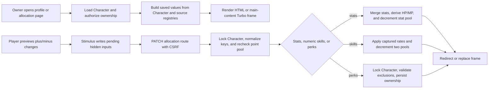

# frozen_string_literal: true
---
title: Character Progression Feature
description: Implementation handbook for Neverlands-based primary stats, numeric skills, boolean perks, point allocation, and public progression display.
status: Fully Implemented
updated: 2026-07-28
owners: Character Progression
template: feature-v1
---

# Character Progression

This document is the implementation contract for the current Character Progression feature. It explains the player profile, primary-stat allocation, numeric `Умения`, boolean `Навыки`, point pools, tiered skill gains, public progression display, UI ownership, persistence, authorization, known implementation limits, and test coverage.

It describes what exists now. It does not treat the complete observed Neverlands perk/profession catalog, unknown effect formulas, or familiar RPG progression conventions as shipped behavior.

## 1. Design authority and related documents

Neverlands is the sole game-design and visual reference for this feature. The local implementation adapts its dense player profile and explicit plus/minus/save allocation flow to Rails, HTML/Turbo, Stimulus, and the current English client.

When behavior is uncertain or conflicts with this document:

1. Re-observe Neverlands and record the evidence under `doc/design/reference/`.
2. Update the relevant progression design record.
3. Change implementation and coverage together.
4. Update this feature contract last.

Supporting documents:

- `doc/design/reference/neverlands_live_player.md` records the starter and returning-character profile, stat, `Умения`, and `Навыки` observations.
- `doc/design/reference/neverlands_skills.md` records the wiki character-development audit, complete level rows, exact derived formulas, and unresolved evidence boundaries.
- `doc/design/reference/neverlands.md` defines the Neverlands evidence-to-implementation rule.
- `doc/design/features/progression_stats_skills.md` normalizes the five primary stats, 29 numeric skills, captured tier rates, point pools, and launch-safe perk subset.
- `doc/design/features/professions.md` keeps profession access/counters outside ordinary allocation until one activity is fully captured.
- `doc/design/features/items_inventory_equipment.md` defines equipment modifiers consumed by effective stats and skills.
- `doc/design/features/combat.md` owns combat effects after progression values are handed off.
- `doc/design/launch_mvp_plan.md` defines the launch progression boundary.
- `doc/features/game_shell.md` owns the persistent shell in which profile and allocation pages are shown.
- `doc/features/world.md` consumes effective Wanderer when authoring a timed adjacent movement offer.
- `doc/features/shop_economy.md` consumes progression-backed requirement values for Shop item presentation without granting purchase or equip authority.

### 1.1 Cross-feature relationships

| Related feature | Relationship | Ownership and handoff |
|---|---|---|
| `doc/features/game_shell.md` | The shell links to the player profile and renders profile/allocation surfaces in its main content context. | Character Progression owns saved allocations and profile values; Game Shell owns only shared navigation, framing, and header presentation. |
| `doc/features/world.md` | World consumes the effective Wanderer value for its bounded adjacent-travel duration. | Character Progression owns saved skill allocation and effective skill access; World owns the `30..25` second formula, command snapshot, authorization, timer, and movement completion. |
| `doc/features/shop_economy.md` | Shop rows display item requirements against progression-backed character values. | Character Progression owns stat/skill values; Shop owns catalog presentation and trade eligibility, while Inventory owns later equip enforcement. |

## 2. Feature summary

An authenticated player begins at level `0`, gains configured combat experience from solo PvE victories, receives exact table-authored level grants, and can allocate saved points on three distinct Neverlands-shaped surfaces: five primary stats, 29 numeric skills, and binary perks. Each page shows current values and remaining points, lets the browser preview reversible pending additions, and submits one explicit save. Saved additions cannot be removed through the normal allocation UI.

The `Character` record is authoritative for saved allocations and point balances. `allocated_stats`, `passive_skills`, and `perks` are JSONB maps; `stat_points_available`, `combat_skill_points`, `peace_skill_points`, and `perk_points` are separate non-negative counters. The browser never grants points or finalizes an allocation.

Numeric skill identities and four-band progression rates come from the captured Neverlands registry. Boolean perks remain deliberately narrow: only source ID `7`, `Больше силы`/`More Strength`, is selectable. Ownership adds `floor(level / 2)` effective Strength from the exact wiki rule.

The MVP currently contains:

- five primary stats with base value `1` and additive saved allocations;
- a finite table of complete source rows `0..27` for thresholds, stat/skill/perk/NV grants, per-fight XP caps, and source NPC-group limits;
- exact `Health × 5` base HP, `Knowledge × 7` base MP, and `Strength × 5 + Health × 10 + level × 10` mass formulas;
- 29 source-backed numeric skills from `0` to `100` with combat and peace point pools;
- one selectable binary perk with a separate point pool and captured exclusion infrastructure;
- solo configured-NPC XP award through idempotent fight finalization, capped by the current level row;
- public HTML and JSON display of numeric skills and owned perks;
- owner-only allocation enforced by Devise, current-character resolution, and `CharacterPolicy`.

## 3. MVP goals and non-goals

### Goals

- Reproduce the captured profile-to-stats/skills/perks navigation and explicit save model.
- Keep primary stats, numeric skills, and binary perks as separate persisted concepts and point pools.
- Apply captured 25-level numeric-skill tier rates exactly and cap each skill at `100`.
- Keep browser previews reversible while making the server authoritative for every save.
- Keep XP/grant data finite and catalog-authored; do not extrapolate incomplete level rows or invent group distribution.
- Expose only safe public progression facts and reserve mutation controls for the owning player.

### Non-goals

- Applying numeric-skill effects beyond the explicitly implemented World-owned Wanderer travel formula, or inventing profession or prerequisite formulas.
- Rendering or selecting the remaining observed `Навыки` merely because their source labels are known.
- Free respec, saved progression builds, skill trees, classes, specializations, or generic ability unlock graphs.
- Owning equipment, combat, movement, recovery, inventory, or profession mechanics that consume progression values.
- Group PvE XP distribution, XP loss, fame/valor awards, or levels beyond the complete row `27`.
- Recreating Neverlands CGI routes, frames, Russian player-facing copy, or token formats.

## 4. Player experience

### 4.1 Entry conditions

The public profile is available at `/player/:name` by case-insensitive active character name in the minimal public layout. A signed-in owner sees the same profile inside the persistent game shell and reaches Stats, Skills, and Perks from the profile's internal subnavigation. Allocation routes require an authenticated user, an active playable character, and ownership of the requested `Character`.

The profile is not an account dashboard. It shows the gameplay character, equipment summary, vitals, progress, record, numeric skill summary, and owned perks. Only the owner sees primary-stat detail and progression mutation links.

### 4.2 Primary surface

Each allocation page uses the compact Neverlands player-subpage language:

- character name and level;
- the same equipment paper doll, location, and money summary as the profile left column;
- a visible remaining-point counter;
- dense rows grouped by stat or captured skill category;
- plus and minus controls for pending changes;
- an explicit Reset button;
- one disabled-until-changed Save button;
- profile, Stats, Skills, and Perks navigation.

Numeric skills render as `[NNN/100]` and show the gain for the next spend. Perks render as `Yes` or `No`. Existing owned perks remain `Yes` and do not expose a normal removal control.

### 4.3 Player actions and feedback

On Stats, the player distributes pending additions among Strength, Dexterity, Luck, Health, and Knowledge. On Skills, each click spends a preview point from the correct combat or peace pool and applies the captured rate for the current 25-level band. On Perks, the player can preview an unowned captured perk if a new-perk point exists.

Save submits only pending additions. HTML success redirects back with `Stats saved`, `Skills saved`, or `Perks saved`. Turbo success replaces the affected allocation frame and updates the shared flash. Invalid, empty, over-budget, unknown, conflicting, or duplicate perk selections show an error and preserve valid persisted state.

### 4.4 Exit and integration behavior

Profile and allocation pages return to one another through player-context buttons and can return to the World map. Effective stats and skills are read by inventory requirements, vitals, combat, and other game systems, but those systems own their downstream behavior and must not infer missing progression formulas.

No progression-specific gameplay resume context is stored. Leaving a page preserves saved character state, while unsaved browser previews are discarded.

## 5. Feature topology and authored content

The feature is an authored catalog and state graph rather than spatial topology.

| Runtime key or group | Player-facing name | Connections or actions | Implemented content |
|---|---|---|---|
| `primary_stats` | Stats | Preview, reset, save | Strength, Dexterity, Luck, Health, Knowledge; base `1` each |
| `combat` | Combat skills | Spend combat points | Source IDs `0` through `11` |
| `magic` | Magic skills | Spend combat points | Source IDs `12` through `15` |
| `resistance` | Resistance skills | Spend combat points | Source IDs `16` through `20` |
| `peace_world` | Peace/world skills | Spend peace points | Source IDs `22`, `23`, `24`, `26`, `27`, `30`, `33`, `34` |
| `more_strength` | More Strength | Spend one perk point; persist `Yes` | Boolean perk source ID `7`; adds `floor(level / 2)` effective Strength |

Numeric skills use captured four-value rate strings. The rate selected for a spend is based on the saved/current value before that spend:

| Band | Current numeric skill | Rate position |
|---|---:|---:|
| 1 | `0..24` | first value |
| 2 | `25..49` | second value |
| 3 | `50..74` | third value |
| 4 | `75..99` | fourth value |

### 5.1 Coordinate, key, or identity terminology

- **Primary-stat key** — normalized local identity such as `strength`, `dexterity`, `luck`, `vitality`, or `intelligence`; player labels map Health to `vitality` and Knowledge to `intelligence`.
- **Numeric-skill source ID** — stable Neverlands `Умения` identity retained in `PassiveSkillRegistry`; local symbolic keys are used in persisted JSONB.
- **Perk source ID** — stable Neverlands `Навыки` identity retained in `PerkRegistry`; only source ID `7` has a launch-selectable local key.
- **Base value** — saved character allocation before equipment modifiers.
- **Effective value** — base character value plus supported equipment modifiers, capped where the implementation defines a cap.

Relationships must come from the source-backed registries. Categories, display order, translated names, or CSS grouping never create prerequisites, exclusions, effects, or point-pool ownership.

## 6. Feature surfaces and contained behavior

### 6.1 Implementation status

| Surface or behavior | Entry point | MVP status | Owning implementation |
|---|---|---|---|
| Public player profile | `GET /player/:name` | Interactive/read-only by viewer | `PlayersController` and profile view |
| XP and level grants | Shared solo-PvE fight finalization | Interactive downstream entry | `NpcExperienceAwarder`, `LevelUpService`, and progression catalog |
| Primary-stat allocation | `GET/PATCH /characters/:id/stats` | Interactive | `CharactersController` and `Character` |
| Numeric-skill allocation | `GET/PATCH /characters/:id/skills` | Interactive | `CharactersController`, registry, and formula |
| Boolean perk allocation | `GET/PATCH /characters/:id/perks` | Interactive subset | `PerkAllocation` and `PerkRegistry` |
| Remaining observed perks/professions | No local route/control | Deferred outside this handbook boundary | Evidence and design documents only |
| Wanderer movement effect | World movement-offer creation | Interactive downstream consumer | `Game::Movement::TravelTime` |
| Other skill/perk gameplay effects without captured formulas | No mutation | Deferred | Downstream owning feature after evidence |

### 6.2 Primary stats

The five primary stats begin at base value `1`. Saved additions are merged into `allocated_stats`, and the submitted total is deducted from `stat_points_available`. Each submitted field is normalized through the allowlisted aliases and clamped to `0..100` for one request. Unknown keys are ignored. A request must spend at least one point and cannot exceed the point pool reloaded under the character row lock.

`Character#stats` adds `floor(level / 2)` Strength for owned `more_strength`, then supported equipment modifiers, and returns a `Game::Systems::StatBlock`. Saved Health and Knowledge recalculate base HP/MP at `5` and `7` per point without healing; effective Strength, Health, and level derive inventory mass. Saved additions are permanent through the normal UI; minus removes only an unsaved preview.

### 6.3 Numeric skills

The numeric registry contains 29 captured `Умения`, each with a source ID, local key, English/source labels, category, combat-or-peace pool, maximum `100`, and exact four-band rate. One spend consumes one point from the assigned pool and may add more than one numeric level according to the current band.

Multiple pending spends are applied sequentially so crossing `25`, `50`, or `75` changes the rate used by later spends. The final value is capped at `100`; requested spends after the cap do not consume points. Unknown skill keys do not consume points. Equipment bonuses contribute to `passive_skill_level`.

World is the only current numeric-skill effect consumer: it snapshots effective Wanderer into a clean adjacent duration of `30 - floor(wanderer * 5 / 100)` seconds, bounded to `25..30`. Character Progression does not own that movement rule. Every other downstream numeric-skill effect remains `0`/unimplemented until separately captured.

### 6.4 Boolean perks and deferred behavior boundary

`more_strength` is the only rendered selectable perk. Saving it consumes one `perk_points`, stores `"more_strength" => true`, and makes it non-removable through the normal UI. `PerkAllocation` rejects empty/duplicate ownership, unknown keys, insufficient points, and any captured mutually exclusive combination under a character row lock.

The complete observed `Навыки` labels and saved yes/no rows are evidence, not local capabilities. Perk source ID `7` adds one effective Strength per two levels, rounded down, from the audited wiki rule; it does not rewrite saved allocations. Prerequisite gates, reset behavior, all profession mechanics, and every other perk effect remain deferred.

## 7. Authoritative data and presentation model

| Record or component | Responsibility | Important contract |
|---|---|---|
| `Character` | Saved point pools, allocations, level, experience, and effective accessors | Point pools are non-negative; saved JSONB maps default to empty objects |
| `Game::Progression::Catalog` | Complete source rows `0..27` | Thresholds and all grants are validated, contiguous, and never extrapolated |
| `LevelUpService` | Award XP and table-authored level grants | Locks/reloads Character; grants pools and NV without refilling vitals |
| `StatAllocationService` | Spend primary-stat points and recalculate base vitals | Locks/reloads Character and preserves current HP/MP except max clamp |
| `SkillAllocationService` | Spend combat/peace points using tier rates | Locks/reloads Character and charges only actual pre-cap spends |
| `PassiveSkillRegistry` | Numeric-skill identities, categories, pools, caps, and captured rates | Only captured IDs/rates are present; no invented effects/prerequisites |
| `SkillProgressionFormula` | Apply and reverse one preview spend | Four numeric rates, 25-level bands, and `0..100` boundary |
| `PerkRegistry` | Launch perk identity and captured exclusion table | Only named/captured launch entries are selectable |
| `PerkAllocation` | Validate and persist new perk ownership | Locks the character, spends only new selections, and rejects conflicts |
| `CharacterPolicy` | Owner-only progression authorization | Signed-in user must own the requested character |
| Stimulus allocation controllers | Pending browser preview | May alter hidden inputs and display only; never saved authority |

### 7.1 Source of truth

The `characters` table is authoritative for character state. Point counters and JSONB maps determine saved allocation; `config/gameplay/character_progression.yml` is authoritative for complete level thresholds/grants; the NV wallet/ledger is authoritative for level currency grants. Registries define valid content identity; they do not grant ownership or points. Profile values are rebuilt from the saved character, registries, exact derived formulas, and supported equipment modifiers on every request.

Missing JSON keys mean zero numeric skill, no stat addition, or unowned perk. An absent/unknown perk key is not rendered through the registry-backed profile payload.

### 7.2 Validation and state lifecycle

- Stats move from available points to additive `allocated_stats` entries.
- Numeric skill spends move points from exactly one pool to saved levels capped at `100`.
- Perks move points from `perk_points` to permanent boolean ownership.
- Negative point pools are rejected by `Character` validation.
- Level-up walks each crossed catalog row, grants that row's stat/combat/peace/perk/NV values, records one wallet transaction, and stops before incomplete level `28`.
- A new database-created character starts at level `0` with `15/10/2/1` allocation pools and `5/7` HP/MP maxima.
- The public profile exposes effective numeric skill levels and owned launch-registry perks, but not private account data.

### 7.3 Presentation versus authority

Plus/minus state, displayed counters, hidden inputs, category grouping, translated names, source IDs rendered in the DOM, and disabled-button CSS are presentation/input only. The server reparses allowlisted keys and checks point balances on save.

Stat, numeric-skill, perk, and XP/level transitions lock and reload the character row before checking or changing point pools. Stale competing allocation requests therefore see the current balance; a losing over-budget request leaves state unchanged.

## 8. Runtime architecture



### 8.1 Load and render

`CharactersController` loads the requested `Character`, resolves the signed-in active character, and calls `CharacterPolicy#manage_progression?`. Stats are composed from base, saved additions, and equipment. Skills are composed from `PassiveSkillRegistry` and `SkillProgressionFormula`. Perks are composed from `PerkRegistry` and the saved perk map.

`PlayersController` separately loads a public character by case-insensitive name with equipment and position. It renders safe HTML or JSON. Owner-only controls are decided from the authenticated viewer character.

### 8.2 Accept or execute action

Stats and skills accept allowlisted hashes, convert values to integers, clamp each pending spend to `0..100`, and delegate to locked allocation services. Each service reloads the row, rejects an empty or over-budget total, and writes one atomic update. Stats merge additions and derive base HP/MP without a refill. Skills apply each actual spend sequentially and do not charge requests beyond a skill's `100` cap.

Perks convert truthy selection fields to keys, then `PerkAllocation` normalizes and deduplicates them. Under `Character#with_lock`, it removes already-owned choices, checks the current perk pool and exclusions, merges new ownership, and decrements the pool.

### 8.3 Complete, redirect, or hand off

HTML success redirects to the same allocation page with a notice. Turbo success replaces only `stat-allocation`, `skill-allocation`, or `perk-allocation` and updates `flash`. Allocation errors update the flash for Turbo or redirect through the configured fallback for HTML.

After save, inventory requirements, vitals, profile, combat, and World may read the new values. World applies a new Wanderer value only when it authors the next movement offer; an already-offered or active command retains its persisted duration. Each downstream feature owns its own validation and formula behavior.

### 8.4 Concurrency behavior

Stat, numeric-skill, and perk allocation use a character row lock, so duplicate or concurrent requests re-evaluate current ownership, cap, and point balances. Level-up uses the same boundary before applying XP and grants, then records a single NV ledger adjustment inside the transaction.

The client disables Save until a preview exists, but that is usability only and cannot prevent replay. Server locks and stale-competing-request service specs protect the balance. XP is awarded only from the match's separately idempotent finalization marker.

## 9. HTTP and Turbo contract

| Method and path | Purpose | Success | Failure |
|---|---|---|---|
| `GET /player/:name` | Public profile by character name | HTML profile or JSON public payload | `404` for unknown character |
| `GET /characters/:id/stats` | Render owner stat allocation | Stats page/frame | Authentication redirect, owner denial, or `404` |
| `PATCH /characters/:id/stats` | Save pending stat additions | Redirect or Turbo frame/flash replacement | Error redirect/flash; no intended mutation |
| `GET /characters/:id/skills` | Render captured numeric skills | Skills page/frame | Authentication redirect, owner denial, or `404` |
| `PATCH /characters/:id/skills` | Save numeric skill spends | Redirect or Turbo frame/flash replacement | Error redirect/flash; no intended mutation |
| `GET /characters/:id/perks` | Render launch-safe binary perks | Perks page/frame | Authentication redirect, owner denial, or `404` |
| `PATCH /characters/:id/perks` | Save new perk ownership | Redirect or Turbo frame/flash replacement | Allocation error redirect/flash; state preserved |

The allocation feature is authenticated HTML/Turbo. The public profile also offers an unversioned read-only JSON representation for internal/public consumption. There is no separately versioned progression API, so Swagger/rswag and blueprint coverage are not applicable.

## 10. Client-side and CSS ownership

`stat_allocation_controller.js`, `skill_allocation_controller.js`, and `perk_allocation_controller.js` own only:

- pending plus/minus previews;
- remaining-point display during the current page visit;
- hidden form values submitted to Rails;
- Reset and Save enabled/disabled presentation;
- numeric-skill tier preview using server-rendered captured rate strings.

They must not:

- grant points, persist values, or decide ownership;
- introduce a skill/perk key absent from the server registry;
- apply gameplay effects or prerequisites;
- authorize another character or bypass the final server check.

`app/assets/stylesheets/player_inventory.css` owns the live-measured 470px paper-doll column, dense profile/allocation tables, internal subnavigation, point counters, row states, and controls. `app/assets/stylesheets/application.css` is reset-only; shared controls and shell styling are owned by the ordered `tokens.css`, `primitives.css`, and `shell.css` modules.

Accessibility behavior:

- plus, minus, Reset, Save, and navigation are native buttons/links;
- disabled Save and maximum-skill controls use actual `disabled` state;
- text counters and `Yes`/`No` labels expose status without relying only on color;
- Turbo replaces the named allocation frame and updates a visible flash message.

## 11. Persistence and login resume

Saved progression lives entirely on `Character` and survives reload, navigation, logout, and login. The feature stores no pending allocation draft and no feature-specific resume URL. Unsaved Stimulus preview state disappears on reload or when leaving the page.

On login or return:

- World/City resume restores the last safe gameplay surface;
- opening Profile rebuilds saved stats, skills, perks, and remaining pools;
- returning to an allocation page starts with no pending additions;
- unknown or removed registry entries are not made interactive by stale browser state.

Arbitrary saved browser fields, translated labels, or profile URLs do not grant progression ownership. The requested character ID is authorized on every allocation request.

## 12. Authorization, trust boundaries, and concurrency

- Devise protects all Stats, Skills, and Perks routes.
- `CurrentCharacterContext` resolves the signed-in user's playable character.
- `CharacterPolicy#manage_progression?` requires ownership of the requested character.
- `CharactersController` allowlists/normalizes stat and skill inputs; locked services recheck separate point pools.
- `PerkAllocation` validates launch-registry membership, points, duplicate ownership, and exclusions under a row lock.
- CSRF-backed forms protect HTML/Turbo mutations.
- Public profile JSON omits account email, private session state, formula detail, and private owner-only stat panels.
- DOM counters, hidden inputs, disabled states, source labels, and Stimulus state never confer authority.
- Concurrent Stats/Skills saves serialize on the Character row; client-side button disabling is not part of that guarantee.

## 13. Failure and boundary behavior

| Condition | Required behavior |
|---|---|
| Anonymous allocation request | Redirect to sign-in; no allocation mutation |
| Foreign character | Redirect to root with ownership error; no mutation |
| Missing character | Return `404` |
| Empty, nil, zero, or all-negative allocation | Show `No stats selected`, `No skills selected`, or perk allocation error |
| Submitted amount above available pool | Reject with the matching insufficient-points message |
| Negative or extreme field value | Convert/clamp per request; reject if the resulting total is empty or over budget |
| Unknown stat/skill mixed with valid keys | Ignore unknown key; valid known allocation may proceed |
| Unknown perk | Reject the entire perk save |
| Already-owned perk only | Reject as `No new perks selected`; do not spend another point |
| Conflicting captured perks | Reject the entire perk save under lock |
| Numeric skill reaches `100` | Cap at `100`; no further visible spend is enabled |
| Equipment changes effective Wanderer | Rebuild effective display; World uses it only for the next authored offer, never to rewrite an active command |
| Equipment changes another effective skill | Rebuild effective display; no uncaptured formula is applied |
| Missing public character name | Return `404`, not an account-profile fallback |
| Simultaneous/stale Stats or Skills saves | Serialize under the Character row lock; recheck current pools and reject an over-budget request without a lost update |
| XP below next threshold | Add XP with no grant or level change |
| XP crosses several rows | Apply every complete row once and aggregate one NV ledger adjustment |
| XP at level `27` | Persist XP but do not invent a level `28` threshold or grant |
| Multi-player PvE winning side | Award no XP until the Neverlands group distribution formula is captured |
| Deferred profession/perk action | Render no control and create no inferred effect |

## 14. Acceptance criteria

- The owner can allocate and permanently save additions to all five primary stats.
- The owner can spend the correct combat or peace pool across all 29 captured numeric skills.
- Numeric skill spends use the captured four-band rate and never exceed `100`.
- The owner can spend one perk point to acquire `more_strength`; another save cannot reacquire it, and effective Strength gains `floor(level / 2)`.
- A level-0 starter receives exact catalog grants when configured solo-PvE XP crosses one or more complete thresholds.
- Health/Knowledge allocation recalculates base maxima at `5/7` per point without healing, and mass uses the exact `5/10/10` formula.
- Stat, skill, perk, and level transitions recheck the character under a row lock.
- Another user and an anonymous user cannot mutate a character's progression.
- Profile HTML and JSON expose numeric skills and owned launch-registry perks without private account data.
- Browser preview/reset behavior never mutates saved state before PATCH succeeds.
- Saved progression survives logout/login; pending browser preview does not.
- Effective Wanderer is available to World, which owns and tests the bounded `30..25` second movement effect.
- Uncaptured perks, professions, prerequisites, respec, and effects remain unavailable.

## 15. Test strategy and required coverage

Tests are part of the feature contract. Progression changes require applicable model, request, policy, service/formula, factory, view/system, and integration coverage. There is no separately versioned public API requiring Swagger/rswag or blueprint specs.

| Coverage category | Representative guarantees |
|---|---|
| Success | Stat merge/vital derivation, dual-pool tiered skill spend, More Strength effect, profile rendering/JSON, XP thresholds, complete level grants, and NV ledger award |
| Failure | Empty/over-budget allocation, unknown perk, insufficient perk points, conflict, maximum skill, invalid XP, and safe flash response |
| Edge/null/boundary | Level `0/27/28`, nil/negative/zero XP, nil hashes, negative/extreme inputs, exact pool exhaustion, `24/25/49/50/74/75/99/100` bands, duplicate perk ownership, and stale competing spends |
| Authorization | Anonymous request, foreign character, policy owner, public read-only profile, and current-character scoping |

`spec/factories/characters.rb` must retain starter, fatigue, point-pool, saved stat/skill, perk ownership, maximum/boundary, and foreign-ownership traits when exercised.

Focused verification command:

```bash
bundle exec rspec \
  spec/models/character_spec.rb \
  spec/models/inventory_spec.rb \
  spec/policies/character_policy_spec.rb \
  spec/lib/game/progression/catalog_spec.rb \
  spec/lib/game/formulas/skill_progression_formula_spec.rb \
  spec/lib/game/skills/passive_skill_registry_spec.rb \
  spec/lib/game/skills/passive_skill_calculator_spec.rb \
  spec/lib/game/skills/perk_registry_spec.rb \
  spec/services/game/skills/perk_allocation_spec.rb \
  spec/services/characters/stat_allocation_service_spec.rb \
  spec/services/characters/skill_allocation_service_spec.rb \
  spec/services/game/movement/travel_time_spec.rb \
  spec/services/players/progression/level_up_service_spec.rb \
  spec/requests/characters_spec.rb \
  spec/requests/characters/skills_spec.rb \
  spec/requests/players_spec.rb \
  spec/system/skill_allocation_spec.rb \
  spec/system/perk_allocation_spec.rb
```

There is no dedicated view spec for each allocation partial; request and system specs cover rendered behavior. Service coverage includes stale competing request regression for Stats and Skills. Shared fight-finalization coverage protects the sole current XP caller and its idempotent reward marker.

## 16. Responsible for Implementation Files

### Requirements and design evidence

- `doc/features/character_progression.md`
- `doc/design/features/progression_stats_skills.md`
- `doc/design/features/professions.md`
- `doc/design/reference/neverlands_live_player.md`
- `doc/design/reference/neverlands_skills.md`
- `doc/design/reference/neverlands.md`
- `doc/design/launch_mvp_plan.md`

### Routes and controllers

- `config/routes.rb`
- `app/controllers/characters_controller.rb`
- `app/controllers/players_controller.rb`
- `app/controllers/concerns/current_character_context.rb`

### Models and policies

- `app/models/character.rb`
- `app/policies/character_policy.rb`

### Services, registries, and formulas

- `app/lib/game/formulas/skill_progression_formula.rb`
- `app/lib/game/progression/catalog.rb`
- `app/lib/game/skills/passive_skill_registry.rb`
- `app/lib/game/skills/passive_skill_calculator.rb`
- `app/lib/game/skills/perk_registry.rb`
- `app/services/game/skills/perk_allocation.rb`
- `app/services/characters/stat_allocation_service.rb`
- `app/services/characters/skill_allocation_service.rb`
- `app/services/players/progression/level_up_service.rb`

### Views, helpers, client behavior, styling, and assets

- `app/views/players/show.html.erb`
- `app/views/shared/_player_context_buttons.html.erb`
- `app/views/shared/_player_subnavigation.html.erb`
- `app/views/shared/_player_equipment_summary.html.erb`
- `app/views/shared/_equipment_paperdoll.html.erb`
- `app/views/shared/_equipment_paperdoll_slot.html.erb`
- `app/views/characters/stats.html.erb`
- `app/views/characters/_stat_allocation.html.erb`
- `app/views/characters/skills.html.erb`
- `app/views/characters/_skill_allocation.html.erb`
- `app/views/characters/perks.html.erb`
- `app/views/characters/_perk_allocation.html.erb`
- `app/javascript/controllers/stat_allocation_controller.js`
- `app/javascript/controllers/skill_allocation_controller.js`
- `app/javascript/controllers/perk_allocation_controller.js`
- `app/assets/stylesheets/application.css`
- `app/assets/stylesheets/player_inventory.css`

### Content, configuration, seeds, and schema

- `db/schema.rb`
- `config/gameplay/character_progression.yml`
- `db/migrate/20251121150000_create_characters_and_privacy_settings.rb`
- `db/migrate/20260720090000_add_perks_to_characters.rb`

### Integrated feature entry points

- `app/services/game/inventory/requirement_checker.rb`
- `app/services/characters/vitals_service.rb`
- `app/services/game/movement/travel_time.rb`
- `app/services/arena/npc_experience_awarder.rb`

Character Progression owns saved stats, numeric skills, perks, and their allocation. Inventory owns equipment and item requirements; Vitals/Combat own their downstream formulas; World owns the bounded Wanderer movement formula. Those features may consume only implemented progression values and must capture Neverlands evidence before adding another effect.

### Factories

- `spec/factories/characters.rb`
- `spec/factories/users.rb`

### Specs

- `spec/models/character_spec.rb`
- `spec/models/inventory_spec.rb`
- `spec/policies/character_policy_spec.rb`
- `spec/lib/game/formulas/skill_progression_formula_spec.rb`
- `spec/lib/game/skills/passive_skill_registry_spec.rb`
- `spec/lib/game/skills/passive_skill_calculator_spec.rb`
- `spec/lib/game/skills/perk_registry_spec.rb`
- `spec/lib/game/progression/catalog_spec.rb`
- `spec/services/characters/stat_allocation_service_spec.rb`
- `spec/services/characters/skill_allocation_service_spec.rb`
- `spec/services/game/skills/perk_allocation_spec.rb`
- `spec/services/game/movement/travel_time_spec.rb`
- `spec/services/players/progression/level_up_service_spec.rb`
- `spec/requests/characters_spec.rb`
- `spec/requests/characters/skills_spec.rb`
- `spec/requests/players_spec.rb`
- `spec/system/skill_allocation_spec.rb`
- `spec/system/perk_allocation_spec.rb`

## 17. Safe extension checklist

Before extending Character Progression:

1. Capture the corresponding Neverlands profile/allocation behavior and formula.
2. Add source IDs, labels, rates, prerequisites, exclusions, and effects only when directly evidenced.
3. Keep primary stats, numeric skills, boolean perks, and profession counters separate.
4. Keep the server authoritative for current points, valid keys, maximum values, and ownership.
5. Preserve row locking and stale competing-request regression coverage for Stats/Skills saves.
6. Do not fold equipment bonuses into saved base numeric-skill levels.
7. Keep uncaptured effects at zero/unavailable rather than inventing a plausible RPG formula.
8. Add success, failure, edge/null/boundary, and authorization coverage where applicable.
9. Update status, non-goals, acceptance criteria, responsible files, focused checks, and version history here.

## 18. Version history

| Date | Change |
|---|---|
| 2026-07-21 | Created the canonical implementation handbook for primary stats, numeric skills, the launch-safe binary perk subset, point allocation, profile exposure, and known concurrency/effect boundaries. |
| 2026-07-21 | Documented World as the sole current numeric-skill effect consumer through the bounded effective-Wanderer travel formula and added reciprocal ownership/coverage references. |
| 2026-07-27 | Promoted the bounded feature to Fully Implemented: added level-0 defaults, complete source rows `0..27`, catalog XP/grants/NV, locked stat/skill mutations, exact HP/MP/mass and More Strength formulas, solo capped NPC XP integration, and boundary coverage. |
| 2026-07-28 | Aligned owner profile and all allocation pages to the live Neverlands two-column paper-doll/table composition, separated shell context actions from internal profile navigation, and retained the minimal public profile layout. |
