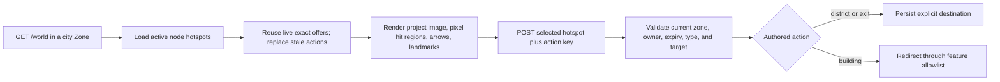

# frozen_string_literal: true
---
title: City Feature
description: Implementation handbook for the observed five-district Forpost graph, illustrated navigation, buildings, gate handoff, responsive panning, and persisted context.
status: Fully Implemented
updated: 2026-09-09
owners: City world context and city UI
template: feature-v1
---

# City

This document is the implementation contract for the current Forpost City. It covers the five-node graph observed on 2026-07-28, its native 1250 × 600 scene, building hovers, district arrows, server-authored actions, outdoor handoff, persistence, responsive behavior, and Shop integration.

A visible landmark is not automatically an implemented service. The City navigation surface may expose presentation-only buildings without inventing their economy, transport, treatment, legal, profession, or quest behavior.

## 1. Design authority and related documents

Domain navigation: `doc/domains/city.md`.

Neverlands is the sole game-design and visual/interaction reference for City. Local code recreates that contract using project-owned artwork, CSS, semantic HTML, and suitable ASCII/plain-text controls. Neverlands runtime images, logos, identity text, administration copy, and decorative assets are evidence only and must not be shipped. A prohibited image control must be replaced by a styled text equivalent such as `X` or `>`, not silently omitted.

When live behavior and this handbook disagree, re-observe once in the existing session, record the evidence, then update catalog, seeds, presentation, tests, and this handbook as one change.

Related documents:

- `doc/design/reference/city/observations/2026-07-28_city_movement_and_services.md` — current five-district observation plus historical captures.
- `doc/design/reference/world/observations/2026-09-09_starter_routes.md` — both Forpost gates, the Residential-to-Law route, and reciprocal outdoor entry.
- `doc/design/reference/economy/observations/2026-05-21_lavka_shop.md` — Shop hierarchy and controls.
- `doc/design/reference/shell/observations/2026-07-28_game_shell_and_mvp_surfaces.md` — persistent shell and responsive acceptance.
- `doc/design/reference/social/observations/2026-09-07_cell_chat_and_presence_boundaries.md` — separate City, Shop, and Arena-room audiences.
- `doc/design/areas/cities_and_buildings.md` — design-area summary.
- `doc/design/launch_mvp_plan.md` — 1:1 UI/UX parity matrix.
- `doc/features/world.md` — outdoor cells, movement, offers, and gate entry.
- `doc/features/shop_economy.md` — Shop catalog and transactions after entry.

### 1.1 Cross-feature relationships

| Related feature | Relationship | Ownership and handoff |
|---|---|---|
| `doc/features/world.md` | Central Square round-trips through `[6,8]`; Law Quarter round-trips through `[11,9]`. | World owns outdoor coordinates and shared offer acceptance. City owns the exact node and illustrated exit hotspot. |
| `doc/features/game_shell.md` | City replaces the outdoor center while retaining the same character, presence, chat, and navigation frame. | Shell owns persistent framing; City owns only the 1250 × 600 navigation surface. |
| `doc/features/shop_economy.md` | Central Square exposes the active Shop hotspot and validates entry/return. | City owns availability and location. Shop owns catalog, buy/sell, wallet, and saved Shop filters. |
| `doc/features/arena_combat.md` | Central Square exposes the active Arena hotspot without the stale level-23 gate. | City owns entry availability. Arena owns lobby, matchmaking, and combat. |

## 2. Feature summary

Forpost is a graph of five city `Zone` records. Each node uses sentinel coordinate `[0,0]`; `CharacterPosition.zone` is the authoritative district. A district click accepts a fresh character-owned `WorldActionOffer`, persists the destination zone immediately, and renders the next scene without a movement timer.

Every node uses one project-owned `city.png` at its native 1536 × 1024 size behind a 1250 × 600 crop. `CityCatalog` supplies the baseline seed declaration; persisted `Zone.metadata.city_presentation` supplies each runtime image offset, focal point, and presentation-only landmark, while `CityHotspot` supplies action bounds, optional percentage polygon, and arrow direction. Central Square bounds and polygons follow visible buildings in the project image. The same CSS polygon clips pointer hit testing and the brightened hover/focus crop; no Neverlands city image is bundled.

The current slice contains:

- five districts and eight explicit directed links;
- 15 seeded actionable hotspots: eight routes, five buildings, and two verified outdoor exits;
- active Arena, Shop, Hospital, Market, and Airship Station entry points;
- source-shaped CSS/text arrows, hover/focus highlighting, and pointer-following tooltips;
- responsive native-size panning centered on an authored district focal point;
- exact district and safe interior context persistence.

## 3. MVP goals and non-goals

### Goals

- Reproduce the current five-district Forpost graph and 1250 × 600 city-image navigation language.
- Make the illustration and its overlaid hit regions the primary city UI.
- Match building hover, tooltip, and district-arrow behavior with project-owned primitives.
- Use fresh server offers for every route, feature, and verified exit.
- Keep desktop scene geometry native and make it touch-pannable on narrow clients.
- Preserve the exact current district across reload, building return, and login resume.
- Render observed unavailable landmarks honestly without inventing actions.

### Non-goals

- A generic town grid, city movement timer, pathfinding avatar, or inferred reverse routes.
- Copying Neverlands city/Shop images, tooltips as bitmaps, logos, or identity prose.
- Treating presentation geometry, arrow visibility, or labels as authorization.
- Inventing services for Auction, Bank, Clan Hall, schools, prison, temple, or other landmarks.
- Assigning an unobserved outdoor destination to another city exit.
- Preserving the superseded nine-node `city2_*` topology as current Forpost behavior.

## 4. Player experience

### 4.1 Entering City

The verified `outpost_gate` outdoor building enters `main` / Central Square at `[0,0]`. A new playable character with no position also starts there. Existing characters on one of the five retained nodes keep that exact district and coordinate.

The matching Central Square `west_gate` action exits to Outpost Surroundings
`[6,8]`, whose source coordinate is `[1000,1000]`. The second outdoor building,
`outpost_east_gate` at `[11,9]` (source `[1005,1001]`), enters `forpost4` / Law
Quarter `[0,0]`; its `east_gate` hotspot returns to that exact outdoor cell.
The verified district route is Central Square → Residential Quarter → Law
Quarter. Business Quarter is not the intermediate district. Seeds retain both
verified gates and remove superseded gate declarations.

An existing database must run `bin/rails db:seed` after receiving a City catalog
change. The seed is an idempotent authored-content sync: it updates retained
zone metadata, replaces legacy hotspots, removes retired City tile/spawn rows,
cancels live capabilities for retired actions, and moves a character stranded
on a removed `city2_*`-only node to Central Square `[0,0]`. Do not use
`db:seed:replant` for this upgrade because it destroys unrelated development
data.

### 4.2 City scene

The scene contract is:

- viewport: up to 1250 × 600, white page background, thin native scrollbars;
- canvas: fixed 1250 × 600 at every breakpoint;
- project image: fixed 1536 × 1024, positioned by node-specific pixel offsets;
- action geometry: native-pixel bounding boxes, with optional percentage
  vertices inside each box; the fixed scene and boxes never scale;
- routes: large gold CSS/text arrows inside authored hit areas;
- tooltip: 12px Arial, white background, 1px gray border, pointer/focus relative
  and clamped inside the visible panned viewport.

On desktop the whole scene is visible when space allows. At `820px` and `390px`, the viewport pans the unscaled scene and initially centers the persisted focal point. The page itself must not gain horizontal overflow.

Decorative building entrances have a separate shared image contract. The Shop
uses `shared/building_entrance`: a centered 25:12 image scaled to the main
pane plus player/navigation top bar height and contained on narrow screens.
Its [technical specifications](../ARTWORK.md#decorative-building-entrance-image-specifications)
apply to future decorative entrance images as well. That consumer does not
render the City navigation canvas or change its fixed hotspot geometry.

### 4.3 Hover, pointer, touch, and keyboard

- Pointer enter/focus reveals a brightened crop of the project city image for
  buildings and landmarks. Central Square's building silhouettes exclude the
  surrounding street from both hit testing and highlighting; there is no
  decorative rectangular inset border.
- Route hover/focus brightens the CSS/text arrow.
- District arrows stack above overlapping gate hit areas. In Law, the
  Residential arrow overlaps the large east-exit rectangle; pointer activation
  must follow the visible arrow rather than silently leave the city. Native
  hit-testing and a real pointer click are covered by
  `spec/system/city_pointer_navigation_spec.rb`.
- Pointer movement repositions the tooltip with a 15px offset and clamps it
  inside the visible viewport, including after horizontal/vertical panning.
  Keyboard focus anchors to the visible part of a clipped building. Long
  labels wrap within the available viewport width.
- Every actionable region is a real form button with an accessible name.
- Presentation-only landmarks and blocked actions are focusable semantic regions with text tooltips and no form.
- Touch users pan the viewport and activate the same server-rendered buttons; no separate mobile map is introduced.

`CityHotspot.action_params.polygon` and landmark `polygon` metadata contain
3–32 numeric percentage `[x,y]` points within `0..100`, enclosing nonzero area.
Model validations reject malformed polygons before persistence; rendering
also validates before emitting CSS. Polygon data changes presentation only;
current server offers, position and feature permissions still decide entry.

**Remaining [IMPL] artwork gap:** the four other districts reuse cropped
Central Square artwork. Their many separate building identities and rectangular
hover crops are not full visual parity. Original district scenes and aligned
silhouettes are still needed. Central Square's gate and workshop are partially
cropped by the retained illustration; their targets match the visible portions.

### 4.4 District movement

1. The current render reuses live exact-action City offers at the same persisted position, preserving their keys and expiry deadlines.
2. The player activates a route button and submits hotspot ID plus opaque action key.
3. The server resolves the hotspot only from the current zone and validates the exact offer.
4. `CharacterPosition` moves to the explicit destination zone at `[0,0]`.
5. The offer completes and World renders the destination scene with new offers.

There is no interpolation, pending movement command, browser-authored destination, or geometry-derived adjacency.

A repeated or second-tab read does not invalidate a still-visible live action.
Expired, consumed, changed, or obsolete offers are never reactivated; a newly
available action receives a new key. Acceptance still revalidates the current
position, hotspot, ownership, status, and expiry.

### 4.5 Building entry and return

An `open_feature` action leaves `CharacterPosition` unchanged and redirects only through `CityHotspot::FEATURE_ROUTES`. Shop is on Central Square in the current graph. City/building pages return through `/world`, which renders the same persisted district. Direct URL entry is revalidated against the current active hotspot.

Arena HTML room entry additionally persists the selected accessible room id.
The room's optional `zone_id` must match the current city; existing unbound
rooms still require valid City Arena entry. A fresh login can restore that
saved room without the old entry cookie. JSON previews do not select a room,
and a generic lobby does not invent a default selection. Arena owns these
access checks and the active-fight redirect.

The shared presence/local-chat partition distinguishes the city node from
validated Shop, read-only building, and selected Arena-room contexts. Presence
includes only recent open sessions and the playable character; its bounded
list, full count, and refresh lifecycle belong to `doc/features/game_shell.md`.
Shop, Arena, and read-only City interiors rebuild presence after saving entry
context. `CityBuildingsController#show` renders the new building's label,
count, and player list in its first authorized response. Arena room Enter
links refresh the full shell so the presence panel changes with the room.
City-building entry holds the character lock across fresh access validation, position
reload, context persistence, presence preparation, and rendering. A city
transition that wins the lock first prevents entry through the old building
URL and preserves the newer position and room/chat context.

## 5. Feature topology and authored content

| Runtime node | Player-facing title | Directed links | Actionable buildings / exit |
|---|---|---|---|
| `main` | Central Square | Business Quarter, Residential Quarter | Arena, Shop, Hospital, City Exit |
| `forpost1` | Residential Quarter | Central Square, Knowledge Quarter, Law Quarter | Airship Station, Market |
| `forpost2` | Knowledge Quarter | Residential Quarter | None |
| `forpost3` | Business Quarter | Central Square | None |
| `forpost4` | Law Quarter | Residential Quarter | City Exit |

The directionality is explicit. Code must not infer a reverse link, shortest path, or adjacency from scene geometry.

### 5.1 Presentation-only landmarks

| District | Landmarks with hover/focus presentation only |
|---|---|
| Central | Tavern, Workshop, Guard Tower |
| Residential | Clan Hall, Post, City Hall |
| Knowledge | Magic School, Library, General School, Military School |
| Business | Auction, Souvenir Shop, Dealer House, Obelisk, Temple, Bank |
| Law | Law Abode, Prison, Gallows |

These labels preserve RPG-domain meaning but do not copy source-platform identity text. No mutation or interior is implied.

### 5.2 Gate handoff

| City action | Outdoor destination | Captured source coordinate | Status |
|---|---:|---:|---|
| Central City Exit | Outpost Surroundings `[6,8]` | `[1000,1000]` | Interactive and seeded |
| Law City Exit | Outpost Surroundings `[11,9]` | `[1005,1001]` | Interactive and seeded; outdoor entry restores Law Quarter |

## 6. Feature surfaces and contained behavior

### 6.1 Interaction status

| Destination | District | Status | Owner |
|---|---|---|---|
| Arena | Central | Interactive, required level `0` | Arena controllers/services/UI |
| Shop | Central | Interactive | Shop catalog, transactions, wallet/inventory, and Shop UI |
| Hospital | Central | Read-only interior | City building catalog |
| Market | Residential | Stall information and Merchant license qualification | City building catalog; Shop-owned qualification service |
| Airship Station | Residential | Origin-specific route table; configured journey handoff, default routes unavailable | `doc/features/airship_travel.md` |
| All other observed landmarks | Their illustrated district | Hover/focus only | City presentation |

### 6.2 Deferred building behavior

The completed September 8 Forpost-to-Oktal capture now supports the separate
Airship lifecycle in `doc/features/airship_travel.md`. Station access preserves
the district until boarding. While aboard, ground City links and direct
building URLs are rejected; explicit arrival landing saves the destination
station. The normal Forpost table has the captured 350/150/150 NV fares, but
paid offers require complete destination, dated schedule, and path content.
No additional populated region is seeded.

Building names, visible tabs, prices, routes, or “entry forbidden” states captured historically are evidence, not active offers. Do not add a transaction, schedule, treatment, rent, processing recipe, legal action, or profession rule until its complete current flow is captured and scoped in its owning feature.

## 7. Authoritative data and presentation model

| Component | Responsibility | Contract |
|---|---|---|
| `Zone` | Durable district and runtime scene presentation | Stable city/node keys, title, image offset, focus, and presentation-only landmarks live in metadata. |
| `CharacterPosition` | Exact current district | Zone and `[0,0]` survive reload/login. |
| `CityCatalog` | Baseline declaration used by seeds | Five source-backed nodes, links, features, two gates, dimensions, offsets, boxes, arrows, focus, and landmarks; runtime does not require a second action lookup here. |
| `CityHotspot` | Persisted action and presentation definition | Zone-scoped type, destination/feature, active state, required level, native pixel box, direction, and z-order. |
| `WorldActionOffer` | Short-lived per-character capability | Exact node/position/target, opaque key, expiry, and status. |
| `ResumeContext` | Safe last-surface routing | Stores allowlisted context; never replaces authoritative position. |

### 7.1 Graph versus presentation

City zones are not local grids. Seeds remove city `MapTileTemplate` rows and
materialize catalog declarations into `Zone` plus `CityHotspot`. Runtime graph
navigation comes from active hotspot records. Pixel boxes, image offsets, and
directions are persisted presentation metadata and never decide availability
or destination.

### 7.2 Hotspot types

| Hotspot/action | World action | Result |
|---|---|---|
| `district` / `enter_zone` | `city_transition` | Move to explicit city zone. |
| `exit` / `enter_zone` | `exit_city` | Move to explicit outdoor cell. |
| `building` / `open_feature` | `enter_city_building` | Redirect through the feature allowlist without moving. |

All current Forpost actions use required level `0`, including Arena as observed with a level-16 account. Inactive, characterless, or under-level records receive no offer and expose their block reason only.

### 7.3 Persisted graph reconciliation

`CityCatalog` is the baseline authored declaration and `db/seeds.rb` is its one
persisted materialization pipeline. `Zone` and `CityHotspot` are runtime truth.
A graph replacement must reconcile both declarations and already-stored state;
adding a second runtime catalog or presentation-only compatibility graph is not
allowed.

The current sync performs these changes together:

- retained zone names receive their canonical `main` / `forpost1..4` metadata;
- current hotspots are upserted and every stale hotspot across old Forpost
  zones is retired;
- open or accepted offers tied to retired zones/actions are cancelled;
- characters on removed-only nodes are recovered to Central Square `[0,0]`;
- obsolete City spawn/tile rows and retired outdoor gate buildings are
  removed; the verified west/east gate rows are reconciled to their exact
  destinations;
- a second seed run makes no further state change.

### 7.4 Admin management surface

For task-oriented City node/hotspot examples and the safe extension pattern for
additional management resources, use `doc/guides/managing_game_content.md`.
This handbook remains authoritative for City runtime and content lifecycle.

The admin-only `/manage/cities` CRUD edits city `Zone` records and JSON scene
metadata. `/manage/city_hotspots` edits the same routes, building entries,
exits, destinations, feature keys, required levels, active state, pixel boxes,
directions, and z-order consumed by `WorldController` and
`CityActionOfferBuilder`. `/manage/audit_events` exposes their immutable
mutation history.

Changes are visible on the next City render. Editing or deleting a hotspot
cancels its offered/accepted capabilities in the same transaction as the
content change and audit event. A city node referenced by positions, hotspots,
incoming routes, or gates cannot be deleted until those dependencies are moved
or removed. JSON must parse as an object, and feature navigation remains
restricted by `CityHotspot::FEATURE_ROUTES`. Successful writes redirect with
`303 See Other`; audit actor, record identity, and action vocabulary also have
database constraints.

`/manage` changes the database only. Running `bin/rails db:seed` later restores
the source-backed Forpost baseline from `CityCatalog`; promote an intentional
baseline edit into the catalog/seeds and coverage rather than relying on one
environment's managed override.

## 8. Runtime architecture



### 8.1 Render

`WorldController#prepare_city_view` supplies the current position and scoped
hotspots to `CityActionOfferBuilder`. Under the character lock, the builder
reloads the persisted position and available hotspots. A stale requested
zone/cell returns no offers without cancelling those issued at the newer
position.

The builder returns live offers matching the exact character, zone/cell,
hotspot, action type, and authored context (city node key, hotspot key,
feature, and hotspot revision). Reuse preserves the original key and deadline.
Expired, consumed, or changed actions receive replacements; other offered
capabilities for that character are cancelled. Serialized repeated reads
converge on the same live keys.

The partial renders persisted Zone scene metadata and every
active persisted hotspot, but only offered hotspots become form buttons.
Persisted presentation-only landmarks render separately and never create
offers. A catalog fallback remains only for pre-sync legacy rows missing the
new metadata; seeded and managed records take precedence.

### 8.2 Accept

`CityHotspotService` accepts only a current-zone hotspot and a matching character-owned offer. Zone transitions require an explicit destination. Building actions require an allowlisted route. Success completes the offer; failure preserves position and fails the capability.

Relocation holds the character and hotspot locks, writes the new position,
clears the previous saved interior/room, and synchronizes local-chat entry in
the same transaction. A failed transition preserves all three. Even an
unbound Arena room is cleared when the character leaves its current node.

### 8.3 Responsive initialization

`nl_city_map_controller.js` waits for layout, then centers the scroll viewport on the node focal point. Resize repeats that centering. The controller also owns tooltip text, movement, clamping, and cleanup; it does not own graph or authorization decisions.

## 9. HTTP and Turbo contract

| Method/path | Purpose | State change |
|---|---|---|
| `GET /world` | Render exact current City node and live offers | Reuses exact live keys/deadlines, replaces stale actions, and cancels obsolete offers; does not move. |
| `POST /world/interact_hotspot` | Accept route/building/exit capability | May move position or redirect to a feature. |
| `GET /city/buildings/:building_key` | Render an allowlisted interior or origin-specific airship station | Saves context; the station prepares/reuses server-owned boarding offers without charging or boarding. |
| `GET /shop` | Render Shop from Central Square | Shop owns later mutations. |
| `GET /arena` | Render Arena from Central Square | Arena owns later behavior. |
| `GET/POST/PATCH/DELETE /manage/cities` | Admin-only city-node CRUD | Atomically changes persisted City data and writes an audit event. |
| `GET/POST/PATCH/DELETE /manage/city_hotspots` | Admin-only route/building/exit CRUD | Atomically changes the existing action owner and cancels stale targeted offers. |
| `GET /manage/audit_events` and `GET /manage/audit_events/:id` | Review immutable content changes | Read-only bounded HTML. |

City has no public JSON API; blueprint and Swagger/rswag coverage do not apply.

## 10. Client-side and CSS ownership

`app/assets/stylesheets/world.css` owns City viewport/canvas dimensions, project-image positioning, CSS hover crops, route arrows, tooltips, focus states, and responsive panning. It must not introduce source runtime image URLs or brand-specific copy.

`app/javascript/controllers/nl_city_map_controller.js` owns only centering and tooltip presentation. Forms, IDs, action keys, labels, blocked reasons, and routes are server-rendered.

`app/assets/stylesheets/manage.css` and the server-rendered `manage` layout own
the separate admin interface. It composes shared control tokens, uses local
table/nav overflow on narrow screens, and never joins the persistent gameplay
shell or turns browser geometry into game authority.

## 11. Persistence and login resume

District changes persist immediately in `CharacterPosition`. Returning from Shop/Arena/buildings shows the same node. Saved interior context is resumed only while its current-node hotspot remains active and accessible; otherwise login falls back to World without relocating the character.

An Arena room also revalidates its saved integer id, active state,
level/alignment, and optional city binding. Invalid or foreign-city rooms
cannot be recovered through an old session marker. Position changes reset
interior context atomically; building entry itself does not move coordinates.

## 12. Authorization, trust boundaries, and concurrency

- Authentication and the current playable character are required.
- Hotspots are loaded only from the authoritative current zone.
- Offers are character-owned, expiring, status-tracked capabilities for one exact target and position.
- Browser geometry, labels, hidden IDs, arrow direction, and tooltip content grant no authority.
- Destination zones/coordinates and feature routes come from server-authored records/allowlists.
- Accepted actions complete atomically at the service boundary; stale/replayed keys fail.
- Read-only building entry revalidates current-node access under the same
  character lock used by city movement, then saves context and renders the
  corresponding presence without a relocation window between those steps.
- `ManagePolicy` requires the explicit admin role; moderator, GM, player, and
  anonymous sessions cannot read or mutate management records.
- Management controllers allowlist fields and parse JSON server-side.
  `Manage::ContentMutation` commits the content change, stale-offer
  cancellation, and immutable audit event atomically.

## 13. Failure and boundary behavior

| Condition | Required behavior |
|---|---|
| Unknown/missing node presentation | Render bounded project-image fallback; do not infer routes. |
| No offer / blocked hotspot | Show tooltip/accessible reason without a submit action. |
| Missing, expired, foreign, mismatched, or wrong-node offer | Reject and preserve position. |
| Repeated or second-tab City read | Preserve exact live keys and deadlines so an already-visible action remains usable. |
| Builder's requested position is stale after relocation | Return no offers without cancelling newer-position offers. |
| Missing destination/unknown feature | Fail without movement or arbitrary redirect. |
| City relocation wins before building entry | Reject the old-node building and preserve the newer position, gameplay context, and local-chat context. |
| Narrow viewport | Pan the fixed canvas; no page-level horizontal clipping. |
| Law Quarter City Exit | Accept the current offer to `[11,9]`; the reciprocal outdoor entrance restores `forpost4`, not Central Square. |
| Missing project image | Preserve controls/labels; never fall back to a Neverlands URL. |
| Existing `city2_*` persisted graph | Run the convergent seed sync; retained nodes keep their identity, removed-only positions recover to Central Square, and obsolete actions cannot remain interactive. |
| Invalid management JSON or hotspot/zone value | Render HTTP 422 with errors; write no content or audit event. |
| City node still has positions/routes/buildings | Refuse deletion and preserve the complete graph. |
| Managed hotspot changes while an offer exists | Cancel the stale targeted offer in the same transaction; render a fresh offer from the new record. |

## 14. Acceptance criteria

- Five districts and eight directed links match the 2026-07-28 observation.
- Shop, Arena, and Hospital are on Central Square; Market and Airship Station are Residential.
- Desktop scene is exactly 1250 × 600 with native-pixel hit geometry.
- Buildings/landmarks highlight on hover/focus and show compact pointer-following tooltips.
- District routes use large project-owned, CSS-styled ASCII `>` arrows with observed direction.
- `820px` and `390px` clients pan a centered fixed canvas without body overflow.
- Only current server offers create form actions; presentation-only landmarks cannot mutate.
- Central and Law exits round-trip through their respective `[6,8]` and `[11,9]` outdoor cells; retired gate declarations are removed.
- An existing nine-node database converges to the five-node graph without stranding a character or leaving a live obsolete exit capability.
- No Neverlands city/Shop image, logo, signature, administration copy, or asset URL is shipped.
- `/manage` edits the same `Zone` and `CityHotspot` records rendered by City;
  actions are audited, responsive, dependency-safe, and do not create a
  parallel graph.

## 15. Test strategy and required coverage

Coverage includes catalog graph/geometry, polygon validation and seed persistence,
seed convergence/idempotency, rendered action capability fields, blocked and
landmark semantics, building pointer/keyboard highlight and tooltip bounds,
district/building/gate navigation, wrong/foreign/stale offers, login context,
and desktop/mobile geometry.

`spec/services/game/world/city_hotspot_service_spec.rb`,
`spec/services/chat/local_context_transition_spec.rb`, and
`spec/requests/arena_room_context_spec.rb` cover atomic position/context changes, room-preview
non-mutation, foreign-city denial, and fresh-login room restoration.
`spec/requests/city_buildings_spec.rb` covers first-response label/count/list
and chat scope for Hospital, Market, Airship, Junk Dealer, and Numismatics,
plus denied-entry context preservation and a real city relocation that wins
before the entry lock.
`spec/system/arena_room_presence_spec.rb` verifies immediate
room-audience replacement through both Arena Enter links without automatic
presence refresh.
`spec/services/game/world/city_action_offer_builder_spec.rb` covers live-key
reuse, unchanged deadlines, expiry boundaries, consumed/changed actions,
competing reads, and stale-position preservation.
`spec/system/city_navigation_spec.rb` exercises the district-to-Shop flow with
an additional same-session World read before clicking the still-visible Shop
action, then returns through City to the exact outdoor gate.
`spec/system/city_building_hover_spec.rb` covers building pointer/focus
presentation and visible tooltip bounds after panning at a 390px viewport.

Focused verification:

```bash
bundle exec rspec \
  spec/services/game/world/city_catalog_spec.rb \
  spec/services/game/world/city_action_offer_builder_spec.rb \
  spec/models/open_world_seed_spec.rb \
  spec/views/world/_city_view_spec.rb \
  spec/requests/city_navigation_spec.rb \
  spec/requests/city_buildings_spec.rb \
  spec/requests/manage/content_management_spec.rb \
  spec/policies/manage_policy_spec.rb \
  spec/services/manage/content_mutation_spec.rb \
  spec/system/city_navigation_spec.rb \
  spec/system/city_building_hover_spec.rb \
  spec/system/arena_room_presence_spec.rb \
  spec/system/manage_content_spec.rb \
  spec/system/responsive_neverlands_ui_spec.rb
```

Run `bin/feature-doc-audit doc/features/city.md doc/features/shop_economy.md` and `bin/verify full` for broad City/Shop changes.

## 16. Responsible for Implementation Files

### Requirements and evidence

- `doc/features/city.md`
- `doc/features/shop_economy.md`
- `doc/design/reference/city/observations/2026-07-28_city_movement_and_services.md`
- `doc/design/reference/economy/observations/2026-05-21_lavka_shop.md`
- `doc/design/areas/cities_and_buildings.md`
- `doc/design/launch_mvp_plan.md`

### Runtime and persistence

- `app/services/game/world/city_catalog.rb`
- `app/services/game/world/city_hotspot_service.rb`
- `app/services/game/world/city_action_offer_builder.rb`
- `app/models/city_hotspot.rb`
- `app/models/zone.rb`
- `app/models/character_position.rb`
- `app/models/world_action_offer.rb`
- `app/controllers/world_controller.rb`
- `app/controllers/city_buildings_controller.rb`
- `app/controllers/concerns/arena_entry_gate.rb`
- `app/services/game/world/resume_context.rb`
- `app/services/chat/local_context.rb`
- `app/queries/game/world/presence.rb`
- `db/seeds.rb`

### Admin authoring and audit

- `config/routes.rb`
- `app/controllers/manage/application_controller.rb`
- `app/controllers/manage/dashboard_controller.rb`
- `app/controllers/manage/cities_controller.rb`
- `app/controllers/manage/city_hotspots_controller.rb`
- `app/controllers/manage/audit_events_controller.rb`
- `app/policies/manage_policy.rb`
- `app/models/management_audit_event.rb`
- `app/services/manage/content_mutation.rb`
- `app/queries/manage/paginated_relation.rb`
- `app/helpers/manage_helper.rb`
- `app/views/layouts/manage.html.erb`
- `app/views/manage/`
- `app/assets/stylesheets/manage.css`
- `db/migrate/20260729120000_create_management_audit_events.rb`

### Presentation

- `app/views/world/_city_view.html.erb`
- `app/helpers/world_helper.rb`
- `app/javascript/controllers/nl_city_map_controller.js`
- `app/assets/stylesheets/world.css`
- `app/assets/images/city.png` — project-owned artwork only
- `app/views/shop/show.html.erb`
- `app/assets/stylesheets/shop.css`

### Coverage

- `spec/services/game/world/city_catalog_spec.rb`
- `spec/models/open_world_seed_spec.rb`
- `spec/services/game/world/city_hotspot_service_spec.rb`
- `spec/services/chat/local_context_transition_spec.rb`
- `spec/requests/arena_room_context_spec.rb`
- `spec/views/world/_city_view_spec.rb`
- `spec/requests/city_navigation_spec.rb`
- `spec/requests/city_buildings_spec.rb`
- `spec/system/arena_room_presence_spec.rb`
- `spec/system/city_navigation_spec.rb`
- `spec/system/city_building_hover_spec.rb`
- `spec/system/responsive_neverlands_ui_spec.rb`
- `spec/factories/management_audit_events.rb`
- `spec/models/management_audit_event_spec.rb`
- `spec/policies/manage_policy_spec.rb`
- `spec/queries/manage/paginated_relation_spec.rb`
- `spec/services/manage/content_mutation_spec.rb`
- `spec/requests/manage/content_management_spec.rb`
- `spec/routing/manage_routing_spec.rb`
- `spec/system/manage_content_spec.rb`

## 17. Safe extension checklist

1. Capture the complete current state in the existing authenticated session.
2. Record route/building names, exact geometry, hover/focus behavior, and state variants.
3. Separate actionable services from presentation-only landmarks.
4. Add server-authored graph/feature data and convergent seeds.
5. Use project-owned CSS/HTML/text/assets only.
6. Preserve native desktop geometry and add responsive acceptance.
7. Add success, failure, authorization, stale-capability, and boundary coverage.
8. Update evidence, parity matrix, and feature contracts in the same change.
9. Use `/manage` for a scoped persisted override or inspection; promote
   baseline changes into `CityCatalog`, seeds, and this contract. Add future
   management resources through explicit namespaced controllers and allowlisted
   forms rather than arbitrary model reflection.

## 18. Version history

- 2026-07-29: fixed existing-database City Exit interaction by making the one seed pipeline reconcile the complete historical `city2_*` graph, retire stale hotspots/offers/gates, preserve retained-node positions, recover removed-node positions to Central Square, and prove convergence plus idempotency.
- 2026-07-29: added admin-only responsive City node/action CRUD, dependency-safe atomic audit records, stale-offer cancellation, runtime precedence for managed `Zone` scene metadata plus `CityHotspot` geometry/direction, and the task-oriented cross-feature management-guide link. `CityCatalog` remains the source-backed seed declaration, not a parallel runtime graph.
- 2026-07-28: replaced the stale nine-node/760 × 255 model with the freshly observed five-district/1250 × 600 Forpost graph; moved Shop/Hospital to Central and Market/Airship to Residential; removed stale Arena and South/East gate assumptions; added exact pixel hotspots, presentation landmarks, CSS hover crops, large route arrows, centered responsive panning, Shop scene/control alignment, seed cleanup, tests, and updated evidence.
- 2026-07-27: documented the earlier nine-node implementation before fresh live verification superseded it.
