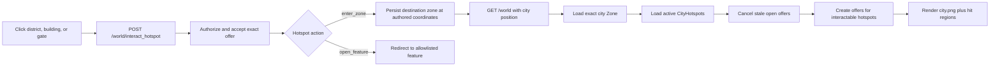

# frozen_string_literal: true
---
title: City Feature
description: Implementation handbook for the Neverlands-inspired Forpost node graph, illustrated city navigation, gates, buildings, and persisted interior context.
status: Fully Implemented
updated: 2026-07-27
owners: City world context and city UI
template: feature-v1
---

# City

This document is the implementation contract for the current City feature. It describes Forpost's nine-node graph, the illustrated Neverlands-style navigation surface, server-offered district/building/gate actions, current building contents, outdoor handoff, saved context, authorization, seeds, and coverage.

It distinguishes fully interactive destinations from source-captured read-only surfaces. A visible building is not automatically a completed economy, transport, treatment, or profession system.

## 1. Design authority and related documents

Neverlands is the sole game-design and visual reference for City. The implementation uses the observed Forpost graph and interaction model; it must not regress to a generic town grid, a fantasy dashboard, or invented city facilities.

If an observed city detail and this document disagree:

1. Re-observe Neverlands and preserve the evidence in `doc/design/reference/`.
2. Correct the design record.
3. Update catalog, seed, UI, service behavior, and tests as one change.
4. Update this implementation contract after the shipped behavior is accurate.

Supporting documents:

- `doc/design/reference/neverlands_live_city_movement.md` — live node, gate, and building observations.
- `doc/design/reference/neverlands_live_game_shell_ui.md` — persistent shell and visual behavior.
- `doc/design/reference/neverlands_live_lavka_shop.md` — General Shop observations.
- `doc/design/areas/cities_and_buildings.md` — city-area design record.
- `doc/design/launch_mvp_plan.md` — MVP city topology and boundary.
- `doc/features/world.md` — outdoor cells, gate entrances, authoritative position, and shared action offers.
- `doc/features/game_shell.md` — persistent frame in which the city-node surface is rendered.
- `doc/features/shop_economy.md` — interactive General Shop behavior reached from the Trading Quarter.

### 1.1 Cross-feature relationships

| Related feature | Relationship | Ownership and handoff |
|---|---|---|
| `doc/features/world.md` | Outdoor entrances reach authored Forpost nodes and three city gates return to explicit outdoor cells. | World owns outdoor cells, gate destinations, and the shared action-offer boundary; City owns node navigation and city hotspot availability. |
| `doc/features/game_shell.md` | City replaces the World center while retaining shared character, presence, navigation, and chat chrome. | City owns the illustrated node surface and transitions; Game Shell owns only the surrounding persistent frame. |
| `doc/features/shop_economy.md` | The Trading Quarter exposes the interactive General Shop and validates entry before redirect. | City owns node presence, hotspot offer, level/access gate, and exit; Shop owns catalog, buying, selling, NV, and Shop resume parameters. |

## 2. Feature summary

Forpost is implemented as a graph of nine city nodes, not as a tile map. Each node is a separate `Zone` with one sentinel coordinate, `[0, 0]`. The current `CharacterPosition.zone` selects the scene; a district transition immediately replaces that zone with the explicitly authored destination node.

Every node uses the retained `city.png` illustration in a 760 × 255 scene. `CityCatalog` chooses the image crop and exact invisible hit region for each observed district route, building, or gate. The browser provides tooltip positioning only. A hotspot is actionable only when the server has issued a fresh character-owned `WorldActionOffer` for that exact node.

The MVP city contains:

- 9 city nodes and 22 directed district links;
- West, South, and East gates to exact outdoor cells;
- interactive Arena and General Shop integrations;
- read-only captured Market, Junk Dealer, Numismatics Shop, Oktal Airship Station, and Hospital surfaces;
- exact node/interior persistence across logout and login.

## 3. MVP goals and non-goals

### Goals

- Reproduce the observed Forpost node graph and city-image navigation language.
- Make the illustration itself the primary navigation surface.
- Use server-authored offers for district transitions, building entry, and city exit.
- Persist the exact node on every transition.
- Enter only features actually present in the current node.
- Exit through the three observed gates to explicit outdoor coordinates.
- Provide accessible keyboard controls for invisible polygon hit areas.
- Preserve an allowlisted shop or captured-building context across logout/login.
- Show observed but not-yet-interactive interiors honestly as read-only.

### Non-goals

- A generic city tile grid or timed walking between city nodes.
- A North gate; the live capture exposes West, South, and East gates.
- Free placement, pathfinding, wandering avatars, or coordinates within a district scene.
- Invented buildings, services, district links, gate rules, or building levels.
- Market listing, stall rental, sale, or tax mutations.
- Junk Dealer stock copied from another shop.
- Numismatics listings, buying, or selling.
- Airship ticket purchase, schedule simulation, boarding, or inter-region transport.
- Hospital purchase, healing, room entry, bed use, or pharmacy processing.
- Treating presentation geometry as authorization.
- Building a separate city movement engine while the observed model is immediate node navigation.

## 4. Player experience

### 4.1 Entering City

The character reaches Forpost from an explicit `TileBuilding` on an outdoor cell:

- West Gate enters Central Square (`city2_1`).
- South Gate enters Stables (`city2_7`).
- East Gate enters Guild Square (`city2_8`).

The entrance service persists the destination city zone at `[0, 0]`, then redirects to the canonical World route. `WorldController#show` sees a city zone and renders the City view inside the same persistent game layout.

For a new playable character with no `CharacterPosition`, Central Square at `[0, 0]` is the only MVP bootstrap spawn. Existing characters are never relocated there merely because they logged in.

### 4.2 City scene

The visible city is one 760 × 255 scene using `app/assets/images/city.png`. Per-node presentation data controls:

- the illustration's `object-position`;
- polygon regions over visible buildings;
- rectangular regions at district/gate edges;
- arrow marker position and direction;
- hover/focus tooltip text.

Hotspot controls are visually transparent so the illustration remains the UI, matching the observed Neverlands simplicity. Unavailable hotspots remain non-mutating semantic regions with the block reason in their accessible label.

### 4.3 Mouse and keyboard behavior

- Pointer users click the polygon/box over the illustrated destination.
- Hover and pointer movement show a compact tooltip clamped inside the scene.
- Building polygons also receive a 24px keyboard proxy centered on the polygon centroid.
- The full pointer polygon is removed from the tab order and hidden from assistive technology to avoid duplicate controls.
- Route markers are visual hints only and are never authority.
- Submission uses ordinary forms with Turbo disabled because a node/building transition replaces the current main surface.

### 4.4 Moving between districts

City movement is immediate. Clicking a server-offered district route:

1. accepts the exact hotspot offer;
2. persists the destination node zone at `[0, 0]`;
3. marks the offer complete;
4. redirects to World, which renders the new scene and rotates offers.

There is no city movement timer, interpolation, pending command, or client-side zone mutation.

### 4.5 Entering a building

An `open_feature` hotspot does not change `CharacterPosition`. After acceptance, it redirects only to an allowlisted feature route:

- Arena: `/arena`;
- General Shop: `/shop`;
- captured read-only buildings: `/city/buildings/:building_key`.

Arena and General Shop own their established feature behavior. The City feature owns whether the current node exposes entry and whether the player is authorized to follow that entry.

Every captured building page includes a **City** return link to `/world`. Returning renders the same persisted node.

## 5. Feature topology and authored content

City node identifiers are captured Neverlands keys. The Rails zone names are internal persistence labels; player-facing titles come from catalog metadata.

| Node | Player-facing title | Directed exits | Features and gates |
|---|---|---|---|
| `city2_1` | Central Square | Residential Quarter, Trading Quarter | Arena (level 23), West Gate |
| `city2_2` | Trading Quarter | Central Square, Industrial Quarter | General Shop, Market, Junk Dealer, Numismatics Shop, Oktal Airship Station |
| `city2_3` | Residential Quarter | Central Square, Industrial Quarter, Knowledge Quarter | Hospital |
| `city2_4` | Industrial Quarter | Trading Quarter, Residential Quarter, Business Quarter, Stables | None |
| `city2_5` | Business Quarter | Industrial Quarter, Guild Square | None |
| `city2_6` | Knowledge Quarter | Residential Quarter, Park, Stables | None |
| `city2_7` | Stables | Industrial Quarter, Knowledge Quarter, Guild Square | South Gate |
| `city2_8` | Guild Square | Business Quarter, Stables | East Gate |
| `city2_9` | Park | Knowledge Quarter | None |

The directionality above is explicit authored data. Code must not infer a reverse link, shortest path, or adjacency from scene geometry.

### 5.1 Gate handoff

| City action | Outdoor destination | Captured source coordinate |
|---|---:|---:|
| West Gate from Central Square | Outpost Surroundings `[7, 0]` | `[1019, 1025]` |
| South Gate from Stables | Outpost Surroundings `[10, 3]` | `[1022, 1028]` |
| East Gate from Guild Square | Outpost Surroundings `[13, 2]` | `[1025, 1027]` |

City exit and outdoor entry are two sides of the same authored gate topology. Update both `CityHotspot` seeds and outdoor `TileBuilding` seeds when an observed gate changes.

## 6. Feature surfaces and contained behavior

### 6.1 Interaction status

| Destination | Node | MVP status | Owning behavior |
|---|---|---|---|
| Arena | Central Square | Interactive; requires character level 23 | Existing Arena controllers/services/UI. |
| General Shop | Trading Quarter | Interactive | Existing Shop catalog, purchase/sale services, wallet/inventory rules, and Shop UI. |
| Market | Trading Quarter | Read-only capture | City building catalog and table partial. |
| Junk Dealer | Trading Quarter | Read-only capture | City building catalog and shop-shell partial. |
| Numismatics Shop | Trading Quarter | Read-only capture | City building catalog and commodity partial. |
| Oktal Airship Station | Trading Quarter | Read-only capture | City building catalog and routes partial. |
| Hospital | Residential Quarter | Read-only capture | City building catalog and hospital partial. |

Read-only pages deliberately expose no purchase, sale, processing, healing, rental, or boarding forms.

### 6.2 Market

The Market describes player listings and rented stalls. The captured tier table is:

| Stall | Merchant skill | Mass | 30-day rent | Sale tax |
|---|---:|---:|---:|---:|
| Newspaper display | 0 | 100 | 400 NV | 15% |
| Small | 200 | 250 | 500 NV | 5% |
| Medium | 400 | 450 | 750 NV | 4% |
| Spacious | 600 | 700 | 1,000 NV | 3% |
| Large | 800 | 1,000 | 1,250 NV | 2% |
| Huge | 1,000 | 2,000 | 1,500 NV | 1% |

These are presentation data, not live offers, balances, rental records, or transaction rules.

### 6.3 Junk Dealer

The observed modes are **Buy goods**, **Licenses**, **Sell goods**, and **For beginners**. Stock was not captured, so the MVP does not copy General Shop items or expose mutation controls.

### 6.4 Numismatics Shop

The captured commodity book identifies **Ancient Alvian Coin**. The MVP has no listings and no buy/sell controls.

### 6.5 Oktal Airship Station

The captured route rows are Forpost at 150 NV and Khalgan Fair at 200 NV. Departure schedule, ticket purchase, boarding, travel, and destination-region state are deferred. “Schedule unavailable” is an explicit read-only state, not a simulated timetable.

### 6.6 Hospital

The captured tabs are **Shop**, **Rest room**, **Hospital bed**, and **Pharmacy**. The read-only treatment shop displays:

| Item | Resource | Price | Observed stock |
|---|---|---:|---:|
| Beginner healer bag | 10 light injuries | 300 NV | 33 |
| Skilled healer bag | 10 medium injuries | 750 NV | 28 |
| Experienced healer bag | 10 heavy injuries | 1,500 NV | 143 |
| Combat first-aid kit | 1 combat injury | 7,000 NV | 1 |

The capture observed Rest room and Hospital bed as “Entry forbidden” for a full-health character. Pharmacy appeared to be resource processing. The MVP documents these observations but implements no inferred health gate, healing transaction, recovery timer, or processing recipe.

## 7. Authoritative data and presentation model

| Component | Responsibility | Important contract |
|---|---|---|
| `Zone` | Durable city node | Each catalog node is a `city` zone seeded as 10 × 10; current MVP position is `[0,0]`. `metadata.city_node_key` connects persistence to catalog. |
| `CharacterPosition` | Current node | The zone is authoritative and survives sessions. City transitions update it immediately. |
| `CityCatalog` | Source-backed Forpost graph and geometry | Defines nine nodes, links, features, gates, scene dimensions, image positions, polygons, boxes, and route markers. |
| `CityHotspot` | Persisted available transition or feature entry | Scoped to one zone; active flag, kind, action type, destination/feature, level gate, and sort order. |
| `WorldActionOffer` | One character's current city capability | Exact node/coordinate/type/hotspot, opaque key, status, and 10-minute expiry. |
| `CityBuildingCatalog` | Read-only observed interior data | Strict allowlist of captured building keys and their presentation records. |
| `ResumeContext` | Safe last-surface routing | Stores only allowlisted context names and sanitized params; position remains separate authoritative state. |

### 7.1 Graph versus grid

Although each city node is persisted as a `Zone`, the City feature is not a local map:

- city `MapTileTemplate` rows are removed by seeds;
- no city movement destinations are built from coordinate offsets;
- node links come only from `CityCatalog` and seeded `CityHotspot` records;
- presentation geometry is never used to calculate graph connectivity;
- the sentinel `[0,0]` coordinate lets the shared exact-position offer model remain consistent.

### 7.2 Hotspot types

| `hotspot_type` | `action_type` | Resulting world action type | Behavior |
|---|---|---|---|
| `district` | `enter_zone` | `city_transition` | Persist explicit destination city zone and coordinate. |
| `exit` | `enter_zone` | `exit_city` | Persist explicit outdoor zone and gate coordinate. |
| `building` | `open_feature` | `enter_city_building` | Redirect to allowlisted route without changing position. |

`required_level` is currently used by the Arena entry (level 23). Ordinary district, building, and gate hotspots have no invented level gate; they store `0` so the Wiki-backed level-zero starter can navigate Forpost. Inactive, characterless, or under-level hotspots do not receive offers and render their block reason.

## 8. Runtime architecture



### 8.1 Render city

`WorldController#prepare_city_view` creates `CityHotspotService` for the character's current city zone, loads active hotspots in `z_index` order, and invokes `CityActionOfferBuilder`.

The builder cancels the character's prior open offers, filters with `can_interact?`, and creates a fresh random-key offer for each remaining hotspot. Offer metadata records city node, hotspot key, and optional feature key for diagnosis; the polymorphic target and exact position remain the enforceable relationship.

### 8.2 Accept hotspot

`POST /world/interact_hotspot` first loads the hotspot only from the current position zone. It then authorizes and accepts the submitted `WorldActionOffer` using the same exact-position capability contract as outdoor actions.

After acceptance, `CityHotspotService`:

- for `enter_zone`, requires an explicit destination zone and valid authored destination coordinate, then updates the existing `CharacterPosition`;
- for `open_feature`, resolves only `CityHotspot::FEATURE_ROUTES` and returns the allowlisted redirect;
- otherwise returns an error without changing position.

The offer is completed on success or failed on service failure. A page refresh rotates remaining open offers, preventing stale-key reuse.

### 8.3 Open captured interior

`CityBuildingsController#show` applies two independent allowlists:

1. `CityBuildingCatalog.fetch` must recognize the route key.
2. The character's current city node must still expose an active, interactable hotspot whose feature matches the key.

Typing a valid building URL while standing in another node or outdoors redirects to World. A successfully opened interior records an allowlisted `city_building` resume context.

## 9. HTTP and Turbo contract

| Method and path | Purpose | State change | Failure behavior |
|---|---|---|---|
| `GET /` or `GET /world` | Render the exact current city node | Rotates short-lived offers and remembers World context; does not move | Authentication redirect or unavailable-zone response. |
| `POST /world/interact_hotspot` | Accept district, building, or gate offer | May change `CharacterPosition`, or redirect to a feature | Flash error; offer fails; position remains unchanged. |
| `GET /city/buildings/:building_key` | Show allowlisted captured read-only interior | Remembers safe interior context only | Redirect for unknown, inaccessible, inactive, wrong-node, or outdoor access. |
| `GET /shop` | Open General Shop from Trading Quarter | Shop owns subsequent mutations | Shop access rules apply. |
| `GET /arena` | Open Arena from Central Square at required level | Arena owns subsequent mutations | Arena entry rules apply. |

There is no public City JSON API. Swagger/rswag and blueprint documentation are intentionally outside this authenticated HTML/Turbo feature.

## 10. Client-side and CSS ownership

`nl_city_map_controller.js` owns only tooltip presentation:

- populate tooltip text from server-rendered data;
- show on hover/focus and hide on exit/blur;
- position beside the pointer or focused proxy;
- clamp the tooltip to the scene bounds.

It does not determine accessibility, destinations, required level, or available actions. Forms and offers are server rendered.

`app/assets/stylesheets/nl/world.css` owns both World and City scene styling because both contexts occupy the same Neverlands map surface. City-specific rules define scene dimensions, image cropping, transparent hit areas, proxies, route markers, unavailable state, tooltips, and read-only building tables. The retained `city.png`, `arena.png`, and `gate.png` assets must not be removed as cleanup; they are source-backed UI assets or integration assets.

## 11. Persistence and login resume

Two pieces of state serve different purposes:

- `CharacterPosition` remembers where the character is: exact city node or outdoor cell.
- the character's allowlisted gameplay context remembers which safe surface to reopen: `world`, `shop`, or `city_building`.

On login:

- a character who logged out on a city scene returns to that exact node;
- a character who logged out in General Shop returns to Shop only if the current node still exposes an accessible Shop hotspot;
- a character who logged out in a captured read-only building returns to that building only if the current node still exposes the matching accessible hotspot;
- invalid, removed, inactive, wrong-node, or arbitrary saved context falls back to World without relocating the character.

Saved routes are generated from allowlisted names and normalized parameters. Arbitrary persisted/browser URLs are never followed.

## 12. Authorization, trust boundaries, and concurrency

- Devise authentication protects city and building routes.
- `CurrentCharacterContext` scopes all behavior to the signed-in user's active playable character.
- `CityActionOfferBuilder` creates capabilities only for that character and exact current node.
- `WorldActionOfferPolicy` verifies ownership.
- `AcceptAction` locks and rechecks status, expiry, exact zone/coordinate, type, and hotspot target.
- `CityHotspotService` loads the hotspot from the current zone and validates destination coordinates.
- `FEATURE_ROUTES` prevents arbitrary redirect targets.
- `CityBuildingCatalog` prevents arbitrary template/catalog keys.
- Building access is recalculated from the current persisted node on every request.
- Scene polygons, route markers, hidden ids, metadata labels, and request URLs never confer authority.

## 13. Failure and boundary behavior

| Condition | Required behavior |
|---|---|
| Anonymous request | Redirect to authentication; no state mutation. |
| Missing or foreign hotspot id | Return “Location not found”/reject; do not move. |
| Expired, consumed, cancelled, or foreign action key | Reject; do not navigate or move. |
| Offer created in another node | Reject exact-position mismatch. |
| Hotspot inactive or character under required level | No offer; render unavailable reason. |
| Destination zone absent | Fail as unconfigured transition. |
| Destination coordinate null, negative, or out of bounds | Fail; do not change position. |
| Feature key absent from route allowlist | Fail as unavailable. |
| Read-only building key absent from catalog | Redirect to World. |
| Valid building requested from wrong node/outdoors | Redirect to World. |
| Browser changes polygon/CSS geometry | No effect on server availability or destination. |
| Logout in node or accessible interior | Resume exact node/safe interior. |
| Saved interior becomes inaccessible | Resume World at unchanged persisted position. |

## 14. Acceptance criteria

- The player can navigate all nine seeded nodes through exactly the 22 authored directed links.
- The city uses `city.png` as the navigation surface with cataloged per-node crops and hit regions.
- Pointer and keyboard users can activate every server-offered building polygon.
- A level-zero starter can use ordinary district, building, and gate hotspots; the Arena remains unavailable until its observed level-23 requirement is met.
- Central Square exposes Arena, Residential Quarter, Trading Quarter, and West Gate according to the catalog and level gate.
- Trading Quarter exposes the five documented building destinations and its two district links.
- Residential Quarter exposes Hospital and its three district links.
- West, South, and East gates exit to their exact outdoor cells; no North gate is shown.
- District and gate transitions update position immediately and use no movement timer.
- General Shop and Arena hand off to their dedicated feature implementations.
- Market, Junk Dealer, Numismatics Shop, Airship Station, and Hospital show the documented read-only content with no mutation controls.
- Direct building URLs are rejected unless the current node exposes the matching active accessible hotspot.
- Logout/login preserves exact node and safe accessible shop/building context.
- Anonymous, foreign, stale, expired, wrong-node, and under-level actions cannot mutate position or enter a protected surface.

## 15. Test strategy and required coverage

Tests are part of the City contract. Changes must cover applicable model, request, policy, service, factory, view/system, seed, and asset behavior. Blueprint and Swagger/rswag specs are intentionally not applicable because City is an authenticated HTML/Turbo feature.

| Coverage category | Representative guarantees |
|---|---|
| Success | Catalog topology, offer creation, node transition, each gate, building entry, read-only rendering, City return, persisted node/interior resume. |
| Failure | Unknown hotspot/building, expired or mismatched offer, inactive/under-level hotspot, missing destination, invalid coordinates, inaccessible saved context. |
| Edge/null/boundary | Character absent, position absent, destination zero coordinate, invalid destination bounds, fallback scene presentation, empty captured listings/schedule. |
| Authorization | Anonymous requests, another character's offer, wrong-node direct URL, outdoor direct URL, policy ownership. |

Factories must retain edge traits for city/outdoor zones, active/inactive and level-gated hotspots, hotspot action types, valid/invalid destinations, and offered/expired/foreign action offers where used.

Focused verification command:

```bash
bundle exec rspec \
  spec/models/character_gameplay_context_spec.rb \
  spec/models/city_hotspot_spec.rb \
  spec/models/zone_spec.rb \
  spec/models/character_position_spec.rb \
  spec/models/world_action_offer_spec.rb \
  spec/models/tile_building_spec.rb \
  spec/models/open_world_seed_spec.rb \
  spec/policies/world_action_offer_policy_spec.rb \
  spec/services/game/world/city_catalog_spec.rb \
  spec/services/game/world/city_action_offer_builder_spec.rb \
  spec/services/game/world/city_hotspot_service_spec.rb \
  spec/services/game/world/city_building_catalog_spec.rb \
  spec/services/game/world/resume_context_spec.rb \
  spec/services/game/world/accept_action_spec.rb \
  spec/services/game/world/tile_building_service_spec.rb \
  spec/requests/city_navigation_spec.rb \
  spec/requests/city_buildings_spec.rb \
  spec/requests/login_resume_spec.rb \
  spec/requests/world_spec.rb \
  spec/routing/city_buildings_routing_spec.rb \
  spec/routing/world_routing_spec.rb \
  spec/views/world/_city_view_spec.rb \
  spec/views/world/show_spec.rb \
  spec/views/layouts/game_spec.rb \
  spec/views/shared/_nl_players_list_spec.rb \
  spec/system/city_navigation_spec.rb \
  spec/system/login_resume_spec.rb \
  spec/assets/city_image_assets_spec.rb
```

Run the complete suite before release because City integrates World position, Shop, Arena, inventory/economy, game shell, and authentication resume.

## 16. Responsible for Implementation Files

### Requirements and design evidence

- `doc/features/city.md`
- `doc/design/areas/cities_and_buildings.md`
- `doc/design/launch_mvp_plan.md`
- `doc/design/reference/neverlands_live_city_movement.md`
- `doc/design/reference/neverlands_live_game_shell_ui.md`
- `doc/design/reference/neverlands_live_lavka_shop.md`
- `doc/features/world.md`

### Routes and controllers

- `config/routes.rb`
- `app/controllers/application_controller.rb`
- `app/controllers/concerns/current_character_context.rb`
- `app/controllers/world_controller.rb`
- `app/controllers/city_buildings_controller.rb`

### Models and policy

- `app/models/character.rb`
- `app/models/zone.rb`
- `app/models/spawn_point.rb`
- `app/models/character_position.rb`
- `app/models/city_hotspot.rb`
- `app/models/world_action_offer.rb`
- `app/models/tile_building.rb`
- `app/policies/world_action_offer_policy.rb`

### City services

- `app/services/game/world/city_catalog.rb`
- `app/services/game/world/city_action_offer_builder.rb`
- `app/services/game/world/city_hotspot_service.rb`
- `app/services/game/world/city_building_catalog.rb`
- `app/services/game/world/accept_action.rb`
- `app/services/game/world/resume_context.rb`
- `app/services/game/world/tile_building_service.rb`

### Views, client behavior, styling, and assets

- `app/views/layouts/game.html.erb`
- `app/views/shared/_nl_players_list.html.erb`
- `app/views/world/show.html.erb`
- `app/views/world/_city_view.html.erb`
- `app/views/world/city_view.html.erb`
- `app/views/city_buildings/show.html.erb`
- `app/views/city_buildings/_market.html.erb`
- `app/views/city_buildings/_shop_shell.html.erb`
- `app/views/city_buildings/_numismatics.html.erb`
- `app/views/city_buildings/_airship.html.erb`
- `app/views/city_buildings/_hospital.html.erb`
- `app/javascript/controllers/nl_city_map_controller.js`
- `app/javascript/controllers/game_layout_controller.js`
- `app/assets/stylesheets/nl/world.css`
- `app/assets/stylesheets/nl/shell.css`
- `app/assets/images/city.png`
- `app/assets/images/arena.png`
- `app/assets/images/gate.png`

### Integrated interactive feature entry points

- `app/controllers/shop_controller.rb`
- `app/services/game/shop/catalog.rb`
- `app/services/game/shop/purchase.rb`
- `app/services/game/shop/sale.rb`
- `app/assets/stylesheets/nl/shop.css`
- `app/controllers/arena_controller.rb`
- `app/controllers/concerns/arena_entry_gate.rb`
- `app/assets/stylesheets/nl/arena.css`

The Shop and Arena internals remain owned by their feature contracts and specs. City owns the source node, offer, entry gate, and redirect integration.

### Seeds and schema

- `db/seeds.rb`
- `db/schema.rb`
- `db/migrate/20251218132823_create_city_hotspots.rb`

### Factories

- `spec/factories/spawn_points.rb`
- `spec/factories/zones.rb`
- `spec/factories/character_positions.rb`
- `spec/factories/city_hotspots.rb`
- `spec/factories/world_action_offers.rb`
- `spec/factories/tile_buildings.rb`

### Specs

- `spec/models/character_gameplay_context_spec.rb`
- `spec/models/city_hotspot_spec.rb`
- `spec/models/zone_spec.rb`
- `spec/models/character_position_spec.rb`
- `spec/models/world_action_offer_spec.rb`
- `spec/models/tile_building_spec.rb`
- `spec/models/open_world_seed_spec.rb`
- `spec/policies/world_action_offer_policy_spec.rb`
- `spec/services/game/world/city_catalog_spec.rb`
- `spec/services/game/world/city_action_offer_builder_spec.rb`
- `spec/services/game/world/city_hotspot_service_spec.rb`
- `spec/services/game/world/city_building_catalog_spec.rb`
- `spec/services/game/world/accept_action_spec.rb`
- `spec/services/game/world/resume_context_spec.rb`
- `spec/services/game/world/tile_building_service_spec.rb`
- `spec/requests/city_navigation_spec.rb`
- `spec/requests/city_buildings_spec.rb`
- `spec/requests/login_resume_spec.rb`
- `spec/requests/world_spec.rb`
- `spec/routing/city_buildings_routing_spec.rb`
- `spec/routing/world_routing_spec.rb`
- `spec/views/world/_city_view_spec.rb`
- `spec/views/world/show_spec.rb`
- `spec/views/layouts/game_spec.rb`
- `spec/views/shared/_nl_players_list_spec.rb`
- `spec/system/city_navigation_spec.rb`
- `spec/system/login_resume_spec.rb`
- `spec/assets/city_image_assets_spec.rb`

## 17. Safe extension checklist

Before extending City:

1. Capture the exact Neverlands node, facility, states, labels, and visual interaction.
2. Decide whether it is a node transition, gate, existing feature entry, or new feature boundary.
3. Update the catalog graph and presentation geometry explicitly; never infer links from layout.
4. Seed an active hotspot only when its destination or allowlisted feature exists.
5. Keep fresh character-owned offers and exact-node revalidation for every mutation.
6. Keep unimplemented interiors read-only; do not expose decorative controls that imply mutations.
7. Preserve accessibility when adding polygon hit regions.
8. Add success, failure, edge/null/boundary, and authorization coverage where applicable.
9. Update this document's topology, interior status, acceptance criteria, responsible files, and version history.

## 18. Version history

| Date | Change |
|---|---|
| 2026-07-21 | Created the implementation handbook for the shipped Forpost node graph, city scene, gates, interiors, resume behavior, and coverage. |
| 2026-07-21 | Added reciprocal ownership and handoff references for World, Game Shell, and Shop and Economy. |
| 2026-07-27 | Adopted the canonical `feature-v1` structure and aligned ordinary city navigation with the source-backed level-zero starter while retaining the observed level-23 Arena gate. |
