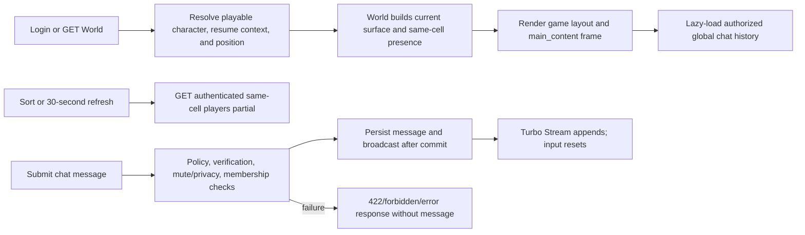

# frozen_string_literal: true
---
title: Game Shell Feature
description: Implementation handbook for the Neverlands-based persistent game frame, compact vitals, location presence, global chat, and shell preferences.
status: Partially Implemented
updated: 2026-07-21
owners: Game Shell and Social Presence
template: feature-v1
---

# Game Shell

This document is the implementation contract for the current Game Shell feature. It explains the persistent top status bar, main Turbo frame, floating same-location player list, bottom global chat strip, layout preferences, authentication, login resume integration, client ownership, known limits, and test coverage.

It describes what exists now. It does not turn every visible Neverlands toolbar control, chat mode, presence action, or familiar browser-game shell convention into shipped behavior.

## 1. Design authority and related documents

Neverlands is the sole game-design and visual reference for this feature. The local implementation adapts its compact framed game client, bracketed character/vitals state, text-link toolbar, floating nearby-player panel, and bottom chat strip to Rails, Turbo, Stimulus, and the current English client.

When behavior is uncertain or conflicts with this document:

1. Re-observe Neverlands and record the evidence under `doc/design/reference/`.
2. Update the relevant shell/social design record.
3. Change implementation and coverage together.
4. Update this feature contract last.

Supporting documents:

- `doc/design/reference/neverlands_live_game_shell_ui.md` records the live frame layout, toolbar, location/presence block, and chat strip.
- `doc/design/reference/neverlands_chat.md` records earlier chat observations and explicitly separated unknowns.
- `doc/design/reference/neverlands_live_player.md` records the player/vitals presentation linked from the shell.
- `doc/design/areas/game_client_layout.md` defines shared client-layout ownership.
- `doc/design/features/social_chat_presence.md` defines chat, membership, ignore, and presence behavior.
- `doc/design/features/character_vitals.md` defines authoritative vitals consumed by the header.
- `doc/design/launch_mvp_plan.md` defines the shell/social MVP boundary.
- `doc/features/world.md` owns outdoor/city world content and the same-cell presence query.
- `doc/features/city.md` owns city-node content rendered in the main frame.
- `doc/features/character_progression.md` owns the linked player profile.
- `doc/features/shop_economy.md` owns the Shop surface loaded from City.

### 1.1 Cross-feature relationships

| Related feature | Relationship | Ownership and handoff |
|---|---|---|
| `doc/features/world.md` | World bootstraps the game layout and supplies current location and exact-cell presence results. | World owns map/city dispatch and position queries; Game Shell owns their persistent frame and presence presentation. |
| `doc/features/city.md` | City renders its illustrated node surface in the shell's central frame. | City owns node content, navigation, and hotspot mutations; Game Shell owns only surrounding shared controls. |
| `doc/features/character_progression.md` | Character navigation opens the profile and allocation surfaces, while the header presents current identity/vitals. | Character Progression owns allocations/profile values; Game Shell owns links, frame placement, and compact header presentation. |
| `doc/features/shop_economy.md` | The Shop occupies the central gameplay surface after a City handoff. | Shop owns catalog and economic mutations; Game Shell owns shared navigation, presence, chat, and flash presentation. |

## 2. Feature summary

After login, the player opens the World through a persistent Neverlands-shaped game frame. The top bar shows their name, level, server-rendered HP/MP, Character and Inventory links, city state, and an exit control. The center is a `main_content` Turbo frame. A floating panel shows players at the exact current location with four sorting choices and optional 30-second refresh. A slim bottom bar lazy-loads recent global chat, sends messages, focuses input through Say, and displays server-rendered time.

The server owns identity, character state, location presence, social verification, channel visibility, message persistence, ignore filtering, and authorization. The browser owns only main-frame navigation, presence sort/refresh preferences, chat focus/scroll/reset, and notification presentation.

The full game layout is selected by `WorldController`; World is the authenticated shell bootstrap and renders outdoor or city content inside it. Links marked for `main_content` can replace the central surface without replacing the shell. Direct requests to feature endpoints may use their normal application layout, so the shell is not an independent route or a universal controller layout.

The MVP currently contains:

- a source-shaped authenticated top/main/presence/chat frame around World and City;
- exact-cell presence, four server allowlisted sorts, recent-session total, and optional 30-second browser refresh;
- lazy global-chat history, Turbo Stream delivery, message creation, policies, membership, mute/privacy, and ignore handling;
- local browser persistence for presence sorting/refresh plus server persistence for character location and gameplay resume;
- English player-facing copy while Neverlands remains the design authority.

## 3. MVP goals and non-goals

### Goals

- Keep the primary game surface compact and continuously oriented around character, place, nearby players, and chat.
- Load owned feature pages inside a stable main Turbo frame where their response supports it.
- Keep presence and chat data authenticated, server-scoped, and policy-authorized.
- Preserve browser-only presentation preferences without treating them as account/game state.
- Resume the player's authoritative World, City, or supported building/shop context after login.

### Non-goals

- Recreating Neverlands framesets, CGI URLs, browser quirks, Russian copy, or every top/bottom icon.
- Inventing manual refresh, transliteration, smile pickers, chat font/color controls, private-mode toggles, or uncaptured commands.
- Making presence into movement authority, a precise global-online system, or a remote-player locator.
- Treating client-side HP/MP interpolation as authoritative regeneration.
- Owning World, City, Inventory, Profile, Shop, Arena, or Combat domain mutations rendered in the main frame.

## 4. Player experience

### 4.1 Entry conditions

Every game request requires Devise authentication. On sign-in, the application ensures a playable character and resolves an allowlisted resume path. World is the default entry and the only controller currently selecting `layout "game"`; it ensures the character has an authoritative position before rendering the shell.

Chat additionally requires a user verified for social features. A global channel must exist for the lazy message frame and inline form to appear; otherwise the shell renders the loading placeholder without a submission form.

### 4.2 Primary surface

The top bar shows `name[level]`, a red HP bar, `[current/max | current/max]` HP/MP text, Character and Inventory links, an inert `City` label when the current zone is a city, and `X` logout. The main content fills the available center.

The bottom-right presence panel shows the current zone name, same-cell count, recent-session total, `a-z`, `z-a`, `0-33`, and `33-0` sorts, and a checked refresh toggle. The bottom chat bar shows Say, recent global messages, one text input, and server-rendered `HH:MM:SS` time.

### 4.3 Player actions and feedback

The player can open Character or Inventory in `main_content`, sort nearby players, enable/disable automatic presence refresh, press Say to focus chat, submit a nonblank message with Enter, follow profile links, and exit after confirmation.

Chat success clears/refocuses the inline input and arrives through the channel Turbo Stream. HTML chat success redirects with a notice; JSON success returns created status. Validation, mute, privacy, or authorization failures return an inline `422`, HTML error surface, JSON error, redirect, or forbidden response as appropriate.

### 4.4 Exit and integration behavior

Logout ends the authenticated game view. Login returns through `Game::World::ResumeContext`, which selects World, a supported City building, or Shop from server-sanitized context; exact cell/node position remains owned by World/City.

When central navigation hands off, the destination feature owns its content and mutation rules. Game Shell continues to own only the frame, shared navigation, current vitals presentation, presence presentation, global compact chat, flashes, and client preferences.

## 5. Feature topology and authored content

The feature is a fixed shell region graph plus social channel types.

| Region or key | Player-facing name | Connections or actions | Implemented content |
|---|---|---|---|
| `top_bar` | Character status/navigation | Profile, Inventory, City state, logout | Name, level, HP/MP, compact text controls |
| `main_content` | Current feature surface | Turbo-frame navigation/handoff | World/City bootstrap and compatible feature pages |
| `players_panel` | Nearby players | Four sorts, refresh toggle, profile links | Exact zone/x/y list excluding current player; maximum 10 |
| `bottom_bar` | Chat/status | Say, Enter submit, streamed history | Global channel, compact messages, input, time |
| `global`, `local`, `system` | Public channel types | Read subject to policy; post except system | Public policy scope |
| `whisper` | Membership channel | Member read/post with privacy checks | Participant metadata and membership |
| `arena` | Arena channel | Public-style access/post | Channel type exists; arena owns match integration |

### 5.1 Coordinate, key, or identity terminology

- **Main content frame** — DOM identity `main_content`; a navigation target, not domain authority.
- **Exact location** — authoritative `zone_id`, `x`, and `y` on `CharacterPosition`; presence uses all three.
- **Recent session** — an unsigned-out `UserSession` seen within the last five minutes; used only for the displayed total.
- **Channel ID/type** — server record identity and enum controlling scope/membership rules.
- **Layout preference** — browser-local `playersSort` and `autoRefresh`, stored under `browser_rpg_layout`.

DOM placement, displayed location text, a player-list row, local storage, or a submitted channel ID never grants location, identity, membership, or posting authority.

## 6. Feature surfaces and contained behavior

### 6.1 Implementation status

| Surface or behavior | Entry point | MVP status | Owning implementation |
|---|---|---|---|
| Persistent game layout | `GET /world` | Interactive | `layouts/game` through `WorldController` |
| Main feature frame | `turbo-frame#main_content` | Interactive integration | Game layout and destination controller/view |
| Same-cell presence | `GET /world/players` | Interactive/read-only | World query and shared list partial |
| Compact global chat | lazy `GET /chat_channels/:id` | Interactive | Chat controllers/views/services |
| Chat creation | `POST /chat_channels/:chat_channel_id/chat_messages` | Interactive | Policy and `MessageDispatcher` |
| Inline HP/MP | Every shell render | Server-rendered; client interpolation incomplete | Shared vitals partial and Stimulus controller |
| Remaining captured shell controls | No route/control | Deferred | Evidence only |

### 6.2 Header, main frame, and vitals

World renders outdoor or city content into the layout's single main Turbo frame. Character and Inventory links target that frame. City displays as disabled context rather than a generic exit; city movement remains inside the City surface. The logout `X` submits Devise sign-out after confirmation.

The vitals partial calculates clamped display percentages from authoritative character values and renders current/max HP and MP. It also supplies values to `nl-vitals`. The current Stimulus target contract does not match the rendered partial for empty bars, MP bars, or live text, so visible client interpolation is incomplete and must not be relied on as implemented regeneration.

### 6.3 Presence and layout preferences

Presence includes other positioned characters with the same zone, x, and y; excludes the current character; applies one of four server allowlisted sorts; and limits the result to 10. Unknown sorts fall back to alphabetical ascending. The total count uses distinct users with a session seen in the last five minutes and is broader than the current cell.

`game-layout` stores sort and automatic-refresh preferences in local storage. When enabled, it fetches the same authenticated partial every 30 seconds. A failed refresh logs a warning and leaves the last rendered list in place.

### 6.4 Compact chat and deferred behavior boundary

The lazy compact frame loads at most the latest 200 channel messages in chronological display order after policy scope and ignore filtering. It subscribes to the channel Turbo Stream, shows an explicit empty state, escapes rendered bodies, and replaces case-insensitive `script` text with `[removed]` before display.

Message creation strips surrounding whitespace, rejects blank bodies, ensures social verification, blocks system-channel posting and active mutes, checks whisper privacy, ensures membership where required, persists the message, and broadcasts after commit. There is no implemented maximum message length, command execution, transliteration, smile picker, formatting palette, manual presence refresh, or captured private-only toggle.

## 7. Authoritative data and presentation model

| Record or component | Responsibility | Important contract |
|---|---|---|
| `Character` and `CharacterPosition` | Header identity/vitals and exact presence location | Current signed-in character is authoritative |
| `UserSession` | Recent online-total signal | Recent means unsigned-out and seen within five minutes |
| `ChatChannel` and `ChatChannelMembership` | Channel type, visibility, creator, membership | Public types versus member-required whisper |
| `ChatMessage` | Persisted sender/body/visibility/metadata | Body present; broadcasts only after commit |
| `IgnoreListEntry` and `Chat::IgnoreFilter` | Initial-history visibility and whisper privacy | System/self messages retain explicit behavior |
| `ChatChannelPolicy` and `ChatMessagePolicy` | Read/post authorization | Verified social user plus public/member rules |
| `Game::World::ResumeContext` | Allowlisted login destination | Never follows arbitrary persisted URLs |
| Stimulus/local storage | Shell interaction preferences | Presentation only; never character/session authority |

### 7.1 Source of truth

Database character, position, session, channel, membership, message, and ignore records are authoritative. The World controller builds current location/presence. Chat policy scope selects visible channels, then `IgnoreFilter` removes blocked historical messages for the current viewer.

If there is no global channel, compact chat has no source URL or form. If no other characters are present, the list renders its empty state. Missing layout preferences fall back to alphabetical sort and automatic refresh enabled.

### 7.2 Validation and state lifecycle

- Channel names/slugs are required and slug is unique; missing slugs are generated on create.
- Channel types are `global`, `local`, `whisper`, `system`, and `arena`.
- Global/local/arena/system do not require membership for read policy; whisper does.
- System chat is read-only; verified users may post only to policy-accessible writable channels.
- Chat bodies are stripped and must be nonblank; no maximum length is currently enforced.
- History loads at most 200 messages; presence loads at most 10 co-located characters.
- The automatic presence timer is 30 seconds; recent total uses a five-minute session window.

### 7.3 Presentation versus authority

Turbo-frame targets, sort links, refresh checkbox state, local-storage values, displayed counts, DOM channel data, notification text, and the client clock rendering are presentation/input only. Server endpoints apply sort allowlists, current-position queries, policy scope, message authorization, and domain validation.

Client-side vitals values are a display snapshot. Server character/vitals services remain authoritative for regeneration, damage, healing, maximums, and persistence.

## 8. Runtime architecture



### 8.1 Load and render

`ApplicationController#after_sign_in_path_for` resolves a safe gameplay path. `WorldController#show` ensures current character/position, prepares World or City, remembers World context, and renders with the game layout. The layout renders current data, a server-built presence partial, and a lazy compact frame for the first global channel.

### 8.2 Accept or execute action

Presence refresh submits only a sort key; World applies its constant allowlist and exact-location scope. Chat creation loads the channel, authorizes a new message against it, permits only body, and delegates to `MessageDispatcher`, which rechecks social/mute/privacy/membership state before creation.

### 8.3 Complete, redirect, or hand off

Presence returns an HTML partial that replaces only the list. Chat Turbo success returns an empty successful response while the after-commit broadcast appends the message; HTML redirects and JSON returns `201`. Errors return `422` surfaces, and authorization uses the shared forbidden handler.

Feature navigation hands central ownership to the target controller/view. Login resume hands destination selection to Resume Context and exact position rendering to World/City.

### 8.4 Concurrency behavior

Chat creation uses normal database persistence and after-commit broadcasting. It has no idempotency key; repeated valid submits create repeated messages, which is current chat semantics. Membership creation relies on database uniqueness for a channel/user pair. Presence reads a point-in-time query and a refresh may replace an older list with a newer response; no gameplay state is mutated.

## 9. HTTP and Turbo contract

| Method and path | Purpose | Success | Failure |
|---|---|---|---|
| `GET /world` | Bootstrap authenticated shell and current World/City surface | Full game-layout HTML or full HTML for Turbo redirect recovery | Login/active-character failure path |
| `GET /world/players` | Refresh exact-cell presence | Shared players-list HTML partial | Authentication/active-position failure |
| `GET /chat_channels/:id` | Render full or compact authorized channel history | HTML page or `chat_messages` frame without layout | Redirect/forbidden/not found |
| `POST /chat_channels/:chat_channel_id/chat_messages` | Persist an authorized message | Turbo `200`, HTML redirect, or JSON `201` | Turbo/HTML/JSON `422`, or authorization failure |
| `DELETE /users/sign_out` | Exit authenticated shell | Devise sign-out redirect | Shared authentication behavior |

The shell is HTML/Turbo-first. Chat exposes a small internal JSON response but no separately versioned public API or serializer contract, so blueprint and Swagger/rswag coverage are not applicable.

## 10. Client-side and CSS ownership

`app/javascript/controllers/game_layout_controller.js` owns only:

- presence sort selection and 30-second partial refresh;
- browser persistence of sort/refresh preferences;
- Say-to-chat focus;
- transient client notification rendering.

`app/javascript/controllers/chat_controller.js` and `app/javascript/controllers/chat_input_controller.js` own scroll behavior, Enter submission, successful reset/focus, and presentation-only username helpers. `app/javascript/controllers/nl_vitals_controller.js` receives display values, but its current target mismatch means live visible regeneration is incomplete.

They must not:

- decide authoritative location, channel access, mute/privacy, or identity;
- persist messages, vitals, presence, or gameplay resume state directly;
- invent channel capabilities or trust local-storage sort values;
- treat an interpolated vital as a server mutation.

`app/assets/stylesheets/nl/shell.css` and `app/assets/stylesheets/nl/chat_presence.css` own the fixed bars, central frame, floating presence, compact messages, input, flashes, and responsive shell behavior. Tokens/primitives provide the shared Neverlands visual vocabulary.

Accessibility behavior:

- primary navigation uses links, message sending uses a form, and refresh uses a labeled checkbox;
- the City state uses `aria-current="page"` rather than a false action;
- Say moves keyboard focus to the chat input;
- textual names, levels, counts, vitals, flashes, and empty states do not rely on color alone.

## 11. Persistence and login resume

Character identity/vitals, exact position, gameplay context, sessions, channels, memberships, messages, and ignore relationships persist in the database. Sort/refresh preferences persist only in browser local storage under `browser_rpg_layout`; they are not synchronized across devices or accounts.

On login or return:

- a valid Shop context resumes Shop after access revalidation;
- a valid supported City-building context resumes that building;
- invalid/removed context falls back to World;
- World renders the character's persisted exact outdoor cell or city node;
- shell preferences load independently from local storage and cannot redirect the player.

The shell does not store unsent chat input, current central-frame scroll state, notification history, or client-interpolated vitals.

## 12. Authorization, trust boundaries, and concurrency

- Devise authentication protects shell, World presence, channels, messages, and sign-out.
- `CurrentCharacterContext` scopes World/header/presence behavior to the signed-in user's active character.
- `ChatChannelPolicy` scopes readable channels to verified users and public/member access.
- `ChatMessagePolicy` authorizes posting to writable public/member channels; `MessageDispatcher` rechecks mute/privacy/membership.
- Exact location and presence come from server positions, never submitted labels or DOM rows.
- Sort keys, resume contexts, and central destinations use server routes/allowlists.
- After-commit broadcast prevents uncommitted messages from appearing as persisted.
- Local storage, Turbo targets, displayed counts, and client vitals never confer authority.
- Destination features reauthenticate and revalidate their own domain access after main-frame handoff.

## 13. Failure and boundary behavior

| Condition | Required behavior |
|---|---|
| Anonymous shell/presence/chat request | Redirect to login; expose no private game state or mutation. |
| Missing playable character/position | Shared bootstrap/failure path; do not invent a displayed location. |
| No global channel | Render shell without a chat form/source; do not invent a channel. |
| Unknown presence sort | Fall back to alphabetical ascending. |
| No nearby players | Render stable empty list and count zero. |
| Presence refresh network/server failure | Keep prior list and log a warning; no gameplay mutation. |
| Blank/whitespace chat body | Return `422`; create no message. |
| Unverified, unauthorized, muted, system-channel, or privacy-blocked post | Reject without message/broadcast. |
| More than 200 history rows | Show only latest 200 in chronological display order. |
| More than 10 co-located players | Show only first 10 under selected server sort. |
| Ignored relationship | Filter initial history; whisper privacy is rejected. |
| Repeated valid chat submission | Creates another message; chat requests are not idempotent. |
| Malformed local-storage JSON | Warn and use default presentation preferences. |
| Vitals Stimulus target mismatch | Server-rendered values remain visible; do not claim live interpolation. |
| Unsupported captured shell control | Do not render a working-looking generic substitute. |

## 14. Acceptance criteria

- World and City render inside the compact top/main/presence/chat game layout after authentication.
- The header shows current character identity, level, server-rendered vitals, implemented navigation, city state, and logout.
- Presence includes only other characters at the exact zone/x/y, supports four allowlisted sorts, and caps at 10.
- Automatic presence refresh runs at 30 seconds only when enabled and remembers browser-local preference.
- Compact global chat loads at most 200 authorized/filtered messages and appends persisted messages through Turbo Streams.
- Blank, muted, privacy-blocked, system-channel, unauthorized, and anonymous chat actions create nothing.
- Login resume selects only an allowlisted supported surface and preserves World/City-owned exact location.
- Unimplemented source controls and live client-vitals interpolation are not represented as complete behavior.
- Central feature navigation never transfers game authority to DOM state or local storage.

## 15. Test strategy and required coverage

Tests are part of the feature contract. Changes require applicable model, request, policy, service, factory, view/system, session, client/CSS, and integrated World coverage. Blueprint and Swagger/rswag do not apply to this authenticated HTML/Turbo shell.

| Coverage category | Representative guarantees |
|---|---|
| Success | Layout regions, current player/vitals, exact-cell presence/sorts, chat history/send/broadcast, membership, and resume integration. |
| Failure | Blank/muted/privacy/system posts, missing global channel, refresh failure behavior, and missing current state. |
| Edge/null/boundary | Zero nearby players, 10-player cap, 200-message history, unknown sort, five-minute session boundary, malformed preferences, and vitals zero maximum. |
| Authorization | Anonymous routes, unverified social user, inaccessible membership channel, foreign channel/message attempt, and current-character presence scope. |

Factories must retain edge traits for channel types/membership, message visibility, verified/unverified users, recent/stale/signed-out sessions, exact/different position, ignored relationships, and vital boundaries when exercised.

Focused verification command:

```bash
bundle exec rspec \
  spec/models/chat_message_spec.rb \
  spec/models/user_session_spec.rb \
  spec/services/chat/message_dispatcher_spec.rb \
  spec/requests/chat_channels_spec.rb \
  spec/requests/chat_messages_spec.rb \
  spec/requests/world_spec.rb \
  spec/views/layouts/game_spec.rb \
  spec/views/shared/_nl_players_list_spec.rb \
  spec/views/shared/_nl_vitals_bar_spec.rb \
  spec/system/social_ui_spec.rb
```

Policy behavior is currently exercised through request/system coverage; dedicated `ChatChannelPolicy` and `ChatMessagePolicy` specs are a justified gap for future policy changes. There is no dedicated full-shell browser system spec; the layout view spec and social system spec divide that coverage today. Run the complete suite before release because the shell integrates authentication, sessions, World/City, character state, Turbo Streams, and social persistence.

## 16. Responsible for Implementation Files

### Requirements and design evidence

- `doc/features/game_shell.md`
- `doc/design/areas/game_client_layout.md`
- `doc/design/features/social_chat_presence.md`
- `doc/design/features/character_vitals.md`
- `doc/design/reference/neverlands_live_game_shell_ui.md`
- `doc/design/reference/neverlands_chat.md`
- `doc/design/reference/neverlands_live_player.md`
- `doc/design/launch_mvp_plan.md`

### Routes and controllers

- `config/routes.rb`
- `app/controllers/application_controller.rb`
- `app/controllers/world_controller.rb`
- `app/controllers/chat_channels_controller.rb`
- `app/controllers/chat_messages_controller.rb`
- `app/controllers/concerns/current_character_context.rb`

### Models and policies

- `app/models/character.rb`
- `app/models/character_position.rb`
- `app/models/user.rb`
- `app/models/user_session.rb`
- `app/models/chat_channel.rb`
- `app/models/chat_channel_membership.rb`
- `app/models/chat_message.rb`
- `app/models/ignore_list_entry.rb`
- `app/policies/chat_channel_policy.rb`
- `app/policies/chat_message_policy.rb`

### Services

- `app/services/game/world/resume_context.rb`
- `app/services/auth/user_session_manager.rb`
- `app/services/chat/message_dispatcher.rb`
- `app/services/chat/ignore_filter.rb`
- `app/services/chat/errors.rb`

### Views, helpers, client behavior, styling, and assets

- `app/views/layouts/game.html.erb`
- `app/views/shared/_nl_players_list.html.erb`
- `app/views/shared/_nl_vitals_bar.html.erb`
- `app/views/chat_channels/show.html.erb`
- `app/views/chat_channels/compact_messages.html.erb`
- `app/views/chat_messages/_chat_message.html.erb`
- `app/views/chat_messages/_form.html.erb`
- `app/helpers/chat_messages_helper.rb`
- `app/javascript/controllers/game_layout_controller.js`
- `app/javascript/controllers/chat_controller.js`
- `app/javascript/controllers/chat_input_controller.js`
- `app/javascript/controllers/nl_vitals_controller.js`
- `app/assets/stylesheets/nl/controls.css`
- `app/assets/stylesheets/nl/tokens.css`
- `app/assets/stylesheets/nl/primitives.css`
- `app/assets/stylesheets/nl/shell.css`
- `app/assets/stylesheets/nl/chat_presence.css`

### Content, configuration, seeds, and schema

- `db/seeds.rb`
- `db/schema.rb`
- `db/migrate/20251121090100_create_user_sessions.rb`
- `db/migrate/20251121135236_create_chat_channels.rb`
- `db/migrate/20251121135259_create_chat_messages.rb`
- `db/migrate/20251125103725_create_social_structures.rb`

### Integrated feature entry points

- `app/views/world/show.html.erb`
- `app/views/world/city_view.html.erb`
- `app/services/game/world/resume_context.rb`

World owns exact position, outdoor/city content, and the presence query; destination controllers own content loaded into `main_content`. Game Shell owns their common frame and social presentation, not their mutations.

### Factories

- `spec/factories/users.rb`
- `spec/factories/characters.rb`
- `spec/factories/character_positions.rb`
- `spec/factories/zones.rb`
- `spec/factories/user_sessions.rb`
- `spec/factories/chat_channels.rb`
- `spec/factories/chat_messages.rb`

### Specs

- `spec/models/chat_message_spec.rb`
- `spec/models/user_session_spec.rb`
- `spec/services/chat/message_dispatcher_spec.rb`
- `spec/requests/chat_channels_spec.rb`
- `spec/requests/chat_messages_spec.rb`
- `spec/requests/world_spec.rb`
- `spec/views/layouts/game_spec.rb`
- `spec/views/shared/_nl_players_list_spec.rb`
- `spec/views/shared/_nl_vitals_bar_spec.rb`
- `spec/system/social_ui_spec.rb`

## 17. Safe extension checklist

Before extending Game Shell:

1. Capture the exact Neverlands control, layout, label, refresh behavior, chat response, and state.
2. Decide whether Shell, World/City, Chat, Vitals, or the loaded feature owns it.
3. Add only the smallest server/client contract needed for captured behavior.
4. Keep identity, exact position, channel access, messages, and vitals server-authoritative.
5. Do not derive capabilities from DOM placement, local storage, display text, or submitted channel/location labels.
6. Repair and test the vitals DOM/controller contract before claiming live interpolation.
7. Preserve keyboard focus, semantic controls, readable text feedback, and compact Neverlands styling.
8. Add success, failure, edge/null/boundary, authorization, policy, and browser coverage where applicable.
9. Update status, non-goals, acceptance criteria, responsible files, focused checks, and version history here.

## 18. Version history

| Date | Change |
|---|---|
| 2026-07-21 | Created the implementation handbook for the persistent game frame, exact-cell presence, compact global chat, browser preferences, and resume integration. |
