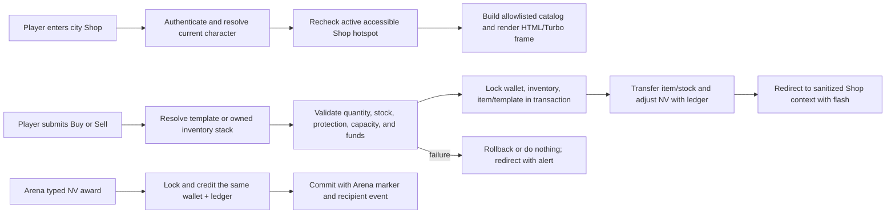

# frozen_string_literal: true
---
title: Shop and Economy Feature
description: Implementation handbook for the Neverlands-based city shop, NV wallet, catalog buying, inventory selling, and transaction ledger.
status: Partially Implemented
updated: 2026-09-09
owners: Shop and Economy
template: feature-v1
---

# Shop and Economy

This document is the implementation contract for the current Shop and Economy feature. It explains City and linked-village Shop access, catalog modes and filters, NV payments, stock and inventory mutations, resale pricing, login resume, UI ownership, security, concurrency, and test coverage.

It describes what exists now. It does not treat every captured Neverlands city counter, license rule, novice service, or generic marketplace mechanic as shipped behavior.

## 1. Design authority and related documents

Domain navigation: `doc/domains/economy.md`.

Neverlands is the sole game-design and visual reference for this feature. The local implementation adapts the observed Shop density, item rows, tabs, filters, NV prices, mass/slot summaries, and explicit buy/sell actions to Rails and the current English client. Source runtime images, logos, project identity, and service/administration prose are evidence only; the shipped scene uses project-owned CSS, generic game wording, and styled ASCII/text category tokens instead of copied icon bitmaps.

When behavior is uncertain or conflicts with this document:

1. Re-observe Neverlands and record the evidence under `doc/design/reference/`.
2. Update the relevant shop/economy design record.
3. Change implementation and coverage together.
4. Update this feature contract last.

Supporting documents:

- `doc/design/reference/economy/observations/2026-05-21_lavka_shop.md` records the live shop tabs, filters, tables, quantities, stock, prices, requirements, and status strip.
- `doc/design/reference/inventory/observations/2026-06-01_inventory_items_and_shop_rows.md` records source inventory and item presentation used by selling and capacity feedback.
- `doc/design/reference/city/observations/2026-07-28_city_movement_and_services.md` records how the city exposes building entry and exit.
- `doc/design/reference/shell/observations/2026-07-28_game_shell_and_mvp_surfaces.md` records the compact surrounding interface.
- `doc/design/reference/world/observations/2026-09-07_forpost_grid_and_action_audit.md` records village Shop entry, its separate presence label, and return to the village square.
- `doc/design/reference/world/observations/2026-09-09_starter_landmarks_and_art.md` records mine item-card previews and resource exchange section controls; no economic operation was submitted.
- `doc/design/reference/world/observations/2026-09-09_mine_exchange_wiki.md` preserves the adjacent official-wiki inputs without promoting older exchange rules to verified live behavior.
- `doc/design/reference/economy/observations/evidence_needed_mine_exchange_operations.md` owns the missing mine/exchange economic captures.
- `doc/design/reference/social/observations/2026-08-23_chat_game_event_timeline.md` records the supplied Neverlands item and `24 NV` search-result rows; the row proves the result form but not a production NPC identity or probability.
- `doc/design/features/economy_trading_shops.md` defines the local economy and shop boundary.
- `doc/design/areas/cities_and_buildings.md` owns the authored building topology.
- `doc/design/launch_mvp_plan.md` defines the MVP trading/economy boundary.
- `doc/features/world.md` owns exact position and the safe World fallback used by Shop resume validation.
- `doc/features/city.md` owns entry to the Shop building.
- `doc/features/character_progression.md` owns the stats and skills displayed as item requirements.
- `doc/features/game_shell.md` owns the persistent frame surrounding the shop.
- `doc/features/player_inventory.md` owns carried stacks and equipment after a trade.
- `doc/features/arena_combat.md` owns NPC loot eligibility and resolution before an NV wallet credit.

### 1.1 Cross-feature relationships

Airship boarding uses the same NV wallet and immutable adjustment ledger.
`doc/features/airship_travel.md` owns route/offer validation, journey creation,
the surrounding transaction, and retry protection. Its `airship_boarding`
debit references the journey, route, and boarding offer; predeparture
disembarkation does not refund the fare. While aboard, direct Shop access is
unavailable even when the flight passes over a Shop's ground cell. No Shop
stock or inventory ticket item is introduced by this handoff.

| Related feature | Relationship | Ownership and handoff |
|---|---|---|
| `doc/features/world.md` | Shop uses World-owned resume context and falls back to World when a saved Shop is no longer accessible. | World/City own exact location and safe destination selection; Shop owns only its allowlisted surface context and transactions. |
| `doc/features/city.md` | Central Square exposes and authorizes entry to the Shop. | City owns the node, hotspot offer, level/access check, and return; Shop owns behavior after the entry handoff. |
| `doc/features/character_progression.md` | Shop item rows present requirements derived from character stats/skills. | Character Progression owns the values; Shop may display them but does not decide equipment eligibility or mutate progression. |
| `doc/features/game_shell.md` | Shop can render as the central gameplay surface inside the persistent shell. | Shop owns catalog/trade responses; Game Shell owns shared framing, navigation, presence, chat, and flashes. |
| `doc/features/player_inventory.md` | Shop purchases add carried stacks and Shop sales remove eligible stacks. | Shop owns exchange value/stock transactions; Player Inventory owns the resulting stack, mass, durability, and equipment rules. |
| `doc/features/arena_combat.md` | A successful typed NPC currency award credits the same NV wallet used by Shop. | Arena Combat owns the loot roll, per-NPC retry marker, and award source metadata; Shop and Economy own wallet locking, non-negative balance, and the immutable adjustment ledger. |

## 2. Feature summary

An authenticated player standing inside an accessible city Shop can browse server-authored item templates, filter the dense Neverlands-style table, buy positive-priced items with NV, switch to Sell, and sell eligible non-broken inventory stacks back to the shop. The screen shows wallet balance, wiki-derived carried-mass maximum, slot use, item properties, requirements, stock, unit prices, quantity controls, and result flashes.

The server is authoritative. `CurrencyWallet` owns the account's NV balance,
`CurrencyTransaction` records each adjustment, `Inventory` owns carried
items/capacity, `ItemTemplate` owns price and shop stock, and the current
character's city context controls Shop access. The wallet is also the authority
for source-backed NV awarded by NPC combat; the Arena transition supplies the
reason/source metadata but does not bypass wallet invariants. Catalog parameters
and browser controls never confer purchase, sale, or reward authority.

The implemented catalog includes Buy, Licenses, Sell, and Novice modes plus
seven category choices. Licenses and Novice are catalog filters using the same
ordinary purchase flow; they do not implement timed license grants, profession
permissions or distinct novice transactions. The later mine capture records
displayed license durations, but those read-only World previews do not
establish activation/expiry behavior or enable mine purchases.

The MVP currently contains:

- City or exact-cell linked-village Shop access and safe login resume;
- source-shaped modes, categories, numeric filters, and dense item tables;
- transactional buy and sell operations with wallet, inventory, capacity, durability, and stock handling;
- one non-negative decimal NV wallet per user and an immutable adjustment ledger
  shared by Shop transfers and typed NPC-loot credits;
- authenticated current-character scoping and safe rejection of foreign inventory item IDs.

## 3. MVP goals and non-goals

### Goals

- Reproduce the captured Neverlands shop layout and deliberate buy/sell interaction.
- Keep NV, inventory contents, capacity, and shop stock server-authoritative.
- Make each successful purchase or sale atomic across the affected records.
- Make every NPC-loot NV credit atomic with its source resolution marker and
  player-facing projection while retaining Economy's wallet/ledger authority.
- Preserve only allowlisted catalog context when the player reloads or logs back in.
- Revalidate city Shop availability and record ownership for every request.

### Non-goals

- Inventing license effects, durations, prerequisites, or novice-only services that were not observed.
- Player-to-player markets, auctions, barter, banking, exchange rates, credit, refunds, or generic merchant reputation.
- Making the captured Market, Junk Dealer, Numismatics Exchange, Hospital Shop, Pharmacy, or Airship Station transactional here.
- Activating mine item/license purchases or Resource Exchange queries,
  listings, transactions and storage from their read-only World lobby controls.
- Treating displayed equipment requirements as purchase prohibitions; inventory/equipment owns whether an item can be equipped.
- Exposing a separately versioned public shop API, blueprint serializer, or Swagger/rswag contract.

## 4. Player experience

### 4.1 Entry conditions

The player enters through an active, level-accessible Shop hotspot in their current city node or an authored Shop feature in the linked village at their exact outdoor cell. `GET /shop` rechecks that context; direct access from an ordinary outdoor cell or an unavailable hotspot redirects to World with an alert.

An inventory and wallet are created with safe defaults if the current character/user does not yet have them. Authentication and an active playable character are required before shop state is loaded or remembered.

### 4.2 Primary surface

The current Shop starts with a project-owned CSS illustration using the observed 1250 × 600 scene ratio. Beneath it, one centered 800px frame contains a compact status/return row, four equal approximately 21px mode tabs (Buy Goods, Licenses, Sell Goods, and For Beginners), a 61px icon-category strip, and a 30px level/price filter row. Local categories are All, Weapons, Armor, Jewelry, Elixirs, Resources, and Misc; the mechanics are not expanded merely to fill every source icon slot.

On tablet/mobile the decorative scene scales because it owns no action geometry. The frame remains within the main content; category and table regions own their own horizontal overflow instead of widening the page.

Buy-like modes render dense item rows with name, properties, requirements, stock, NV price, quantity, and an action. Sell renders carried stacks with item state, quantity, calculated unit return, and a sell action. The surrounding header, vitals, nearby players, and chat belong to Game Shell.

### 4.3 Player actions and feedback

The player can change mode/category/filter query parameters, choose a quantity, and submit Buy or Sell. Quantities are normalized to `1..99` at the controller boundary. Successful mutations redirect back to the sanitized shop view and show `Bought: ...` or `Sold: ...`; failures redirect without partial mutation and show the domain message.

Buying checks a positive-priced template, availability, limited stock, NV balance, inventory slots, carried mass, and stack limits. Selling checks current-character ownership, quantity, protected/equipped/bound state, and positive resale value. Unmet equipment requirements remain visible information and are enforced later by the inventory/equipment feature.

### 4.4 Exit and integration behavior

The player returns to the City through the shared building/city navigation. The Shop remembers sanitized mode, category, and numeric filter strings as gameplay context, so logout/login or a direct return resumes the same Shop screen while that Shop remains accessible.

For the linked Frontier Village Shop, both visible Village return controls use
the active same-cell parent resolved by `Game::World::ResumeContext`, returning
to Village Square. The square's separate Leave hotspot returns outdoors. No
browser return URL controls this destination. Shop's presence projection uses
its own room context and refreshes after the saved Shop context changes.
City Shop and village Shop remain separate audiences even though both display
Shop. The shared query scopes the persisted zone/cell and room, includes only
recent open sessions and the playable character, and supplies a bounded list
with the full count. Ordinary chat uses that same partition; Shell owns its
polling and login-scoped browser history.
Direct Shop GET and trade requests also enforce the persisted outdoor
travel/Look boundary under the character lock. A rejected request preserves
the wallet, inventory, stock, and saved room. Purchase's existing transaction
uses a savepoint so its rescued failures still roll back if the request already
holds that lock.

City owns the building node before entry and after exit. Inventory owns stacking, capacity, equipment state, and later item use. Character Progression owns requirement values. Shop and Economy own only catalog eligibility, exchange mutations, wallet adjustments, stock, and shop presentation.

## 5. Feature topology and authored content

The feature uses an authored catalog/state graph rather than spatial cells.

| Runtime key | Player-facing name | Connections or actions | Implemented content |
|---|---|---|---|
| `buy` | Buy | Category/filter, quantity, purchase | Positive-priced non-license item templates |
| `licenses` | Licenses | Category/filter, quantity, purchase | Templates whose key starts with or name contains `license` |
| `sell` | Sell | Quantity, protected-state check, sale | Current character's inventory stacks |
| `novice` | Novice | Category/filter, quantity, purchase | Required level at most `5` and integer price at most `250` |
| `all` | All | No category restriction | Every template eligible for the selected mode |
| `weapons`, `armor`, `jewelry` | Equipment groups | Filter by normalized equipment slot | Captured dense equipment rows |
| `consumables`, `materials`, `misc` | Elixirs, Resources, Misc | Filter by item type/fallback | Non-equipment catalog groups |

### 5.1 Coordinate, key, or identity terminology

- **Item-template ID** — server database identity submitted for purchase; it must resolve inside the positive-priced buyable scope.
- **Inventory-item ID** — owned stack identity submitted for sale; it is resolved only through the current character's inventory.
- **Mode/category key** — allowlisted presentation/filter key; invalid values fall back to `buy` and `all`.
- **NV** — the source-backed single currency stored in the current user's wallet.
- **Shop stock** — unlimited or limited quantity stored by the item template and rechecked during purchase.

Catalog order, row position, item label, CSS class, displayed price, and query parameters never establish ownership or availability.

## 6. Feature surfaces and contained behavior

### 6.1 Implementation status

| Surface or behavior | Entry point | MVP status | Owning implementation |
|---|---|---|---|
| Shop frame/catalog | `GET /shop` | Interactive | `ShopController` and `Game::Shop::Catalog` |
| Catalog purchase | `POST /shop/buy` | Interactive | `Game::Shop::Purchase` |
| Inventory sale | `POST /shop/sell` | Interactive | `Game::Shop::Sale` |
| NV wallet and ledger | Shop services and authoritative internal callers | Interactive persistence | `CurrencyWallet`, `CurrencyTransaction`, and `Economy::WalletService` |
| Licenses mode | `GET /shop?mode=licenses` | Catalog-interactive only | Ordinary catalog/purchase flow |
| Novice mode | `GET /shop?mode=novice` | Catalog-interactive only | Low-level/low-price filter |
| Other captured city counters/interiors | City building routes | Read-only or deferred | City feature |
| Mine Shop / Resource Exchange lobby sections | Exact-cell linked-location pages | Read-only; economic operations deferred | World owns the shipped lobbies; Economy owns the operation gaps in §6.5 |

### 6.2 Buying and stock

Only `ItemTemplate` rows with `base_price > 0` are buyable. Normal Buy excludes license-like templates; Licenses contains only them; Novice contains entries with required level at most `5` and integer base price at most `250`. Category and optional level/price filters narrow the results.

Purchase price is the template's integer `base_price` multiplied by normalized quantity. The transaction locks the template, inventory, and wallet; rechecks limited stock; debits NV through the wallet ledger; adds items through `Game::Inventory::Manager`; and decrements limited stock. Capacity uses `effective Strength × 5 + effective Health × 10 + level × 10`; capacity or funds failure rolls the transaction back.

### 6.3 Selling and NV accounting

The base resale price is 20 percent of integer base price, rounded to two decimals with a minimum of `1` NV. If maximum durability is positive, the unit return is prorated by current/max durability and rounded to two decimals. This local formula is consistent with captured examples but is not evidence for unobserved item classes.

Sale locks the inventory and stack, removes the requested quantity or destroys an exhausted stack, reduces carried weight without going below zero, increments limited shop stock, and credits the wallet ledger. Equipped, bound, protected, reserved, otherwise discard-protected, or zero-durability items cannot be sold.

Wallet balances and ledger amounts are decimal values. Every adjustment is non-zero, records a reason and resulting balance, and cannot leave the wallet negative.

Sample-account bootstrap grants initial NV once per wallet through
`Seeds::StarterWalletGrant.call(user:, amount:, metadata:)`. It holds the
wallet row lock while checking for the stable `seed.initial_nv` ledger reason
and calling the existing wallet adjustment service. New grants also record
`seed_grant_key: starter_initial_nv_v1`. Repeated or concurrent seed calls
create no second credit. Historical entries without that metadata marker
still count as completion, preserving current balances and old ledger rows;
this does not repair historical duplicate grants or reset spent balances.

NPC currency loot uses the same boundary with reason `combat.npc_loot` and
source metadata for match, character, NPC participation/template, loot-entry
index, and stable event key. Arena persists the wallet adjustment inside the
same outer transaction as its per-NPC `loot_resolution` marker and recipient
event. A retry sees that marker and does not create a second credit or ledger
row. Item loot never enters the wallet; Inventory remains its authority.

### 6.4 Deferred behavior boundary

License rows do not grant a captured license object, timer, profession permission, or alternate currency. Novice is only an authored catalog filter. There is no bargain flow, buyback, refund, repair, appraisal, player order, remote shopping, or transaction-history UI.

The current forms do not use a one-time server-issued action capability. CSRF, authentication, location/ownership checks, transactions, and locks protect each request, but repeating a still-valid submission performs another purchase or sale. Idempotency/replay prevention must not be claimed.

### 6.5 Mine Shop and Resource Exchange gap ownership

World ships the mine and exchange's cell entry, read-only sections, Nature
return and lobby resume. Mine previews contain captured item/license details
with disabled purchase controls; exchange tabs contain selectors and a disabled
Choose control. They do not grant ordinary Shop access or run an economic
query. [The World handbook](world.md) remains their runtime owner.

| Remaining Economy work | Known runtime gap | Evidence needed before implementation |
|---|---|---|
| Mine item/license acquisition | `[IMPL]` Purchases, stock changes, NV debit and item/license receipt are absent for this lobby. Main Shop's Licenses mode does not provide them. | `[EVIDENCE]` Capture confirmation, successful acquisition, quantity/stock/funds/capacity/eligibility denials and repeat handling. Displayed prices/durations are already recorded; sampled stock is not a fixed rule. |
| Exchange queries and listings | `[IMPL]` Choose, populated/empty listing results and listing refresh are absent. Switching a read-only section is not a resource query. | `[EVIDENCE]` Submit the observed selectors and capture actual results, row identities, filtering, refresh and stale state. |
| Exchange transactions and settlement | `[IMPL]` Orders/trades, settlement and their wallet/resource mutations are absent. | `[EVIDENCE]` Confirm the live operation model, requirements, timing, fees if present, cancellation/expiry, failure and retry outcomes. Older wiki descriptions do not establish current settlement rules. |
| Exchange storage operations | `[IMPL]` Resource deposit, withdrawal or claiming is absent; the exact operation model is not inferred from the tab name. | `[EVIDENCE]` Observe ownership, quantity/capacity if applicable, success, failure, persistence and repeated requests. |

The canonical [capture backlog](../design/reference/economy/observations/evidence_needed_mine_exchange_operations.md)
links the preserved live/wiki observations. These are later operation tasks,
not unfinished starter-map entry/return work. Recording them here does not
change the launch plan's delivery boundary.

After acquisition, mining-license use/effects, tools, digging/extraction,
yields and proficiency belong to [Professions](../domains/professions.md).
The separate descent/underground-cell travel backlog belongs to
[Dungeons](../domains/dungeons.md). Economy must not grant those capabilities
because an item card or a lobby is visible.

## 7. Authoritative data and presentation model

| Record or component | Responsibility | Important contract |
|---|---|---|
| `CurrencyWallet` | One user's NV balance | Unique per user and non-negative |
| `CurrencyTransaction` | Audit one wallet adjustment | Non-zero amount, reason, metadata, and non-negative `balance_after` |
| `ItemTemplate` | Catalog identity, price, requirements, stack/durability, stock | Buyable only when positive-priced; limited stock cannot underflow |
| `Inventory` and `InventoryItem` | Current character's derived mass capacity and owned stacks | Sale scope, broken/protected state, and `Character#carrying_capacity` authority |
| `Game::Shop::Catalog` | Authored modes, categories, filters, and resale formula | Presentation eligibility only; does not transfer value |
| `Game::World::ResumeContext` | Current Shop availability, parent interior, and safe resume | Rechecks the active City hotspot or exact outdoor linked-village Shop feature; browser URLs never choose the parent |
| `Economy::WalletService` | Atomic positive/negative NV adjustment | Locks the wallet, rejects negative result, and records one ledger row |

### 7.1 Source of truth

The wallet, ledger, item templates, inventory, stacks, character position, City hotspots, and linked-location `TileBuilding` records are authoritative. Catalog arrays define valid presentation modes/categories. Missing inventory or wallet records are bootstrapped for the current owner with empty/zero state.

The browser receives calculated rows and submits only IDs, quantities, and catalog context. Services reload/lock the affected records and apply authoritative price, stock, capacity, protected-state, and balance rules.

### 7.2 Validation and state lifecycle

- A user has at most one wallet and its balance cannot be negative.
- A transaction amount cannot be zero and `balance_after` cannot be negative.
- Buy quantity is normalized to `1..99`; service calls also reject non-positive quantities.
- Sale quantity cannot exceed the current stack and cannot target a foreign/missing stack.
- Limited stock is checked before and after the template lock.
- Invalid mode/category keys fall back safely; only six filter keys are retained for the redirect/resume context.
- Decimal wallet storage is forward-only at the precision migration because reverting to integer would lose fractional sale values.
- NPC-loot credits require a positive integer NV amount at the Arena boundary;
  the wallet retains decimal storage for all economy ingress/egress.

### 7.3 Presentation versus authority

Displayed prices, totals, stock, requirements, mass, slots, hidden IDs, confirmation text, filter fields, and saved gameplay-context parameters are presentation/input only. The server recalculates prices and rechecks all mutation invariants.

Numeric filters are converted with `to_i`; a direct request may therefore contain negative or malformed strings, but these only affect which rows are displayed. They never change price, ownership, stock, or wallet state.

## 8. Runtime architecture



### 8.1 Load and render

`ShopController` authenticates, resolves the active character, calls `ResumeContext#shop_available?`, creates missing inventory/wallet records, and builds `Game::Shop::Catalog` from request parameters. The view renders buy-like or sell rows and the controller remembers sanitized context only after successful access.

The request first reconciles due outdoor travel/Look under the character lock
and rejects active work before reading or changing the Shop. After successful
entry, context and local-chat room are saved together, then presence is rebuilt
for that Shop. The parent Village control is derived from the same persisted
entrance cell rather than retained request parameters.

### 8.2 Accept or execute action

Buy resolves the submitted template inside the positive-priced buyable scope. Sell resolves the submitted stack through the current inventory. The controller normalizes quantity and delegates; domain services validate, start a database transaction, take row locks, recalculate authoritative values, update inventory/stock, and call the wallet service.

### 8.3 Complete, redirect, or hand off

Both mutations use an HTML redirect to the Shop with a notice or alert. Submitted mode/category/filter values are allowlisted into the return URL. Sell forces `mode=sell`. The next GET rebuilds all displayed state from persisted records.

### 8.4 Concurrency behavior

Wallet adjustment locks the wallet. Purchase also locks template and inventory; sale locks inventory and the selected stack. Database transactions make the value transfer atomic and stale limited stock/funds fail safely. Requests are not idempotent, and there is no consumed capability or request key preventing a deliberate/replayed second valid trade.

NPC-loot ingress is not a Shop request. Arena locks its participant records,
calls the same wallet adjustment boundary under its transaction, and persists a
per-NPC resolution marker. That producer-owned marker, not the timeline event,
is the idempotency authority for the credit.

## 9. HTTP and Turbo contract

| Method and path | Purpose | Success | Failure |
|---|---|---|---|
| `GET /shop` | Render selected shop mode/category/filters | HTML or `main_content` Turbo-frame-compatible shop surface | Login redirect or World redirect when Shop is unavailable |
| `POST /shop/buy` | Buy a catalog template | Atomic purchase; redirect with notice | No/rolled-back mutation; redirect with alert |
| `POST /shop/sell` | Sell an owned inventory stack | Atomic sale; redirect to Sell with notice | No/rolled-back mutation; redirect to Sell with alert |

The feature is authenticated HTML/Turbo navigation with ordinary form redirects. It has no separately versioned public JSON API, so blueprint and Swagger/rswag coverage are not applicable.

## 10. Client-side and CSS ownership

The Shop uses server-rendered forms and links; it has no shop-specific Stimulus controller. Browser behavior is limited to native numeric inputs, confirmation prompts, Turbo navigation, and the shared shell.

It must not:

- calculate an authoritative price or balance;
- decide ownership, stock, protected state, or capacity;
- grant a license or novice privilege;
- persist a trade without server validation.

`app/assets/stylesheets/shop.css` owns the project-created CSS Shop illustration, 1250 × 600 scene ratio, centered 800px frame, compact tabs, 61px category strip, filters, status strip, locally scrollable item tables, property/requirement cells, quantity controls, and responsive overflow. Shared framing remains owned by Game Shell.

Accessibility behavior:

- mode/category controls are real links and mutations are real forms;
- quantity/filter fields retain associated labels or contextual table headings;
- confirmation prompts precede value-changing submissions;
- server flashes provide textual success/failure feedback without color-only meaning.

## 11. Persistence and login resume

Wallet balances, ledger entries (including `combat.npc_loot` credits), inventory
stacks, carried weight, shop stock, and character gameplay context persist in
the database. The Shop context stores only `mode`, `category`, `min_level`,
`max_level`, `min_price`, and `max_price`; mode/category are normalized before
storage.

On login or return:

- a valid saved Shop context resumes the same allowlisted catalog view;
- Shop access is rechecked against the active accessible City hotspot or the
  exact outdoor cell's active supported village and Shop feature;
- invalid mode/category values fall back to Buy/All;
- an unavailable/removed Shop falls back to World without changing the authoritative location;
- arbitrary return URLs or templates are neither stored nor followed.

City/World own exact location persistence. Shop owns the safe interior surface
context after either entry path. Village return restores Village Square and
its separate Leave action returns outdoors, preserving the region and cell.
Relocation clears stale Shop context with the position transition.

## 12. Authorization, trust boundaries, and concurrency

- Devise authentication protects every Shop route.
- `CurrentCharacterContext` scopes behavior to the signed-in user's active playable character.
- `ResumeContext#shop_available?` revalidates the City hotspot's level/access
  rules or the supported active linked-village feature at the exact cell.
- Purchase resolves only positive-priced server templates; Sale resolves only through the current inventory.
- Wallet, inventory, item/template row locks and transactions protect each value transfer.
- Arena may credit NV only through the wallet's public adjustment boundary;
  its participant locks and processing marker protect duplicate NPC rewards.
- Mode, category, redirect filters, and resume parameters use explicit allowlists.
- Submitted price, wallet balance, stock, requirements, weight, and item labels are never trusted.
- Inventory and City recheck their own invariants at each cross-feature handoff.
- No policy class is needed for these non-REST domain records because current-character scoping occurs before service invocation; adding cross-character/admin shop access would require an explicit policy.

## 13. Failure and boundary behavior

| Condition | Required behavior |
|---|---|
| Anonymous request | Redirect to login; do not read or update gameplay context. |
| No active character | Use the shared active-character failure path; no trade. |
| Not inside an accessible Shop | Redirect to World with an alert; preserve location. |
| Missing/foreign template or inventory item | Reject as unbuyable/not found; no value transfer. |
| Quantity zero, negative, malformed, or above `99` | Controller normalizes to `1..99`; services reject non-positive direct calls. |
| Insufficient NV | No item/stock change; redirect with `Not enough NV.` |
| Inventory mass/slot overflow | Roll back debit and item/stock changes; show capacity error. |
| Limited stock changes after render | Recheck under template lock and fail without partial mutation. |
| Sale exceeds current stack | Reject; wallet, stack, weight, and stock remain unchanged. |
| Equipped/bound/protected/reserved item | Reject with `This item cannot be sold.` |
| Unequipped item at zero durability | Reject with `Broken items cannot be sold.`; preserve stack, stock, weight, and wallet. |
| Zero/non-positive price | Template is not buyable/sellable; no transaction. |
| Invalid mode/category/filter | Fall back or filter presentation only; never mutate domain state. |
| Repeated valid submission | Performs another valid trade; one-time replay protection is not implemented. |
| Retried processed NPC-loot award | Preserve the existing wallet/ledger state; create no second credit. |
| NPC-loot event publication fails before commit | Roll back its wallet credit, ledger row, and Arena resolution marker together. |
| Unsupported license/novice effect | Do not grant or render an implied mechanic. |

## 14. Acceptance criteria

- A player in the authored City Shop can browse Buy, Licenses, Sell, and Novice modes in the compact source-shaped UI.
- Mode/category/filter selection changes only eligible rendered rows and safe saved context.
- A valid purchase atomically debits NV, records a ledger entry, adds inventory quantity/weight, and decrements limited stock.
- A valid sale atomically removes owned quantity/weight, credits decimal NV, records a ledger entry, and restores limited stock.
- A successful NPC NV award atomically credits the same wallet, records a
  `combat.npc_loot` transaction with source metadata, and is not duplicated on
  retry; a failed outer award transaction leaves no credit.
- A zero-durability item cannot be sold, and purchase/loot capacity uses the
  same derived character mass maximum.
- Price, ownership, stock, protected state, capacity, and wallet balance are recalculated server-side.
- Logout/login resumes a valid Shop surface without trusting an arbitrary URL or changing exact city location.
- License and novice source mechanics beyond filtering/ordinary purchase remain explicitly unimplemented.
- Insufficient funds, capacity, stale stock, invalid quantity, and protected/foreign item failures cause no partial transfer.
- Anonymous and out-of-Shop requests cannot trade or persist Shop context.
- The current empty-catalog shell matches the observed scene/control hierarchy at desktop and remains usable without document overflow at `820px` and `390px`.
- No Neverlands Shop illustration, icon bitmap, logo, signature, administration copy, or source asset URL is shipped.

## 15. Test strategy and required coverage

Tests are part of the feature contract. Shop changes require applicable model, request, service, factory, view/system, seed/config, and inventory integration coverage. A dedicated policy spec is not applicable until a Shop policy exists; request coverage must still prove authentication and current-character scoping. Blueprint and Swagger/rswag do not apply because no public API exists.

| Coverage category | Representative guarantees |
|---|---|
| Success | Shop render, classification, buy, sale, durability proration, Shop and NPC-loot wallet/ledger persistence, inventory/stock changes, and resume context. |
| Failure | Insufficient funds, capacity, missing item, protected item, unavailable Shop, invalid wallet adjustment, and rolled-back NPC-loot projection. |
| Edge/null/boundary | Zero/negative/decimal amounts, full/partial stacks, zero durability sale rejection, derived mass boundary, unlimited/limited stock, absent inventory/wallet, quantity limits, and invalid filters. |
| Authorization | Anonymous access, foreign inventory item, active-character ownership, City or linked-village availability, and active outdoor travel/Look denial. |

Factories must retain edge traits for stock state, stack/protected/equipped/bound state, capacity boundaries, durability, positive/zero price, city Shop availability, and ownership when exercised.

Focused verification command:

```bash
bundle exec rspec \
  spec/models/currency_wallet_spec.rb \
  spec/models/currency_transaction_spec.rb \
  spec/services/economy/wallet_service_spec.rb \
  spec/services/arena/npc_loot_awarder_spec.rb \
  spec/requests/shop_spec.rb
```

`Game::Shop::Catalog`, `Purchase`, and `Sale` currently rely mainly on request/integration coverage; dedicated service specs are a justified coverage gap for future behavior changes. Run the complete suite before release because the feature mutates shared inventory, economy, city context, authentication, and shell state.

## 16. Responsible for Implementation Files

### Requirements and design evidence

- `doc/features/shop_economy.md`
- `doc/design/features/economy_trading_shops.md`
- `doc/design/areas/cities_and_buildings.md`
- `doc/design/reference/economy/observations/2026-05-21_lavka_shop.md`
- `doc/design/reference/economy/observations/evidence_needed_mine_exchange_operations.md`
- `doc/design/reference/inventory/observations/2026-06-01_inventory_items_and_shop_rows.md`
- `doc/design/reference/city/observations/2026-07-28_city_movement_and_services.md`
- `doc/design/reference/shell/observations/2026-07-28_game_shell_and_mvp_surfaces.md`
- `doc/design/reference/social/observations/2026-08-23_chat_game_event_timeline.md`
- `doc/design/launch_mvp_plan.md`

### Routes and controllers

- `config/routes.rb`
- `app/controllers/shop_controller.rb`
- `app/controllers/concerns/current_character_context.rb`
- `app/controllers/concerns/outdoor_action_availability.rb`

### Models and policies

- `app/models/character.rb`
- `app/models/currency_wallet.rb`
- `app/models/currency_transaction.rb`
- `app/models/item_template.rb`
- `app/models/inventory.rb`
- `app/models/inventory_item.rb`

### Services

- `app/services/game/shop/catalog.rb`
- `app/services/game/shop/purchase.rb`
- `app/services/game/shop/sale.rb`
- `app/services/economy/wallet_service.rb`

### Views, helpers, client behavior, styling, and assets

- `app/helpers/shop_helper.rb`
- `app/views/shop/show.html.erb`
- `app/views/shop/_buy_table.html.erb`
- `app/views/shop/_sell_table.html.erb`
- `app/assets/stylesheets/shop.css`
- `app/assets/stylesheets/controls.css`

### Content, configuration, seeds, and schema

- `db/seeds.rb`
- `db/seeds/shop_inventory.rb`
- `db/seeds/starter_wallets.rb`
- `db/seeds/starter_wallet_grant.rb`
- `db/schema.rb`
- `db/migrate/20251121090002_create_item_templates.rb`
- `db/migrate/20251121142307_create_economy_and_trading.rb`
- `db/migrate/20260721090000_ensure_decimal_currency_columns.rb`
- `db/migrate/20251121150000_create_characters_and_privacy_settings.rb`

### Integrated feature entry points

- `app/models/city_hotspot.rb`
- `app/models/tile_building.rb`
- `app/services/game/world/resume_context.rb`
- `app/queries/game/world/presence.rb`
- `app/services/chat/local_context.rb`
- `app/services/game/world/city_catalog.rb`
- `app/views/city_buildings/_shop_shell.html.erb`
- `app/services/game/inventory/manager.rb`
- `app/services/arena/npc_loot_awarder.rb`
- `app/services/chat/event_publisher.rb`

City/World/Resume Context own building access and exact-location resume before the
Shop. Inventory Manager owns stacking and capacity during item handoff. Arena
owns NPC loot eligibility and the retry marker. Shop and Economy own exchange
eligibility plus wallet/ledger invariants, not later equipment/use behavior or
combat reward eligibility.

### Factories

- `spec/factories/users.rb`
- `spec/factories/characters.rb`
- `spec/factories/character_positions.rb`
- `spec/factories/zones.rb`
- `spec/factories/city_hotspots.rb`
- `spec/factories/item_templates.rb`
- `spec/factories/inventories.rb`
- `spec/factories/inventory_items.rb`

### Specs

- `spec/models/currency_wallet_spec.rb`
- `spec/models/starter_wallet_seed_spec.rb`
- `spec/models/currency_transaction_spec.rb`
- `spec/services/economy/wallet_service_spec.rb`
- `spec/services/arena/npc_loot_awarder_spec.rb`
- `spec/requests/shop_spec.rb`
- `spec/requests/outdoor_action_availability_spec.rb`
- `spec/requests/world_location_presence_spec.rb`
- `spec/services/game/world/resume_context_spec.rb`
- `spec/system/world_village_resume_spec.rb`

## 17. Safe extension checklist

`doc/guides/managing_game_content.md` documents how a future explicit
`ItemTemplate` management adapter must preserve Shop catalog, price, stock, and
owned-inventory boundaries. The example does not mark that route as shipped.

Before extending Shop and Economy:

1. Capture the exact Neverlands counter, row, control, response, and currency behavior.
2. Decide whether City, Shop, Inventory, or Character Progression owns the transition.
3. Add only the catalog/model/service behavior needed for that evidence.
4. Recalculate every value and revalidate current-character ownership server-side.
5. Lock all records participating in an atomic transfer and define replay behavior.
6. Never grant a license, novice benefit, or market mechanic from labels alone.
7. Preserve the dense Neverlands table language and accessible form semantics.
8. Add success, failure, edge/null/boundary, and authorization coverage, including service specs for changed trade logic.
9. Update status, non-goals, acceptance criteria, responsible files, focused checks, and version history here.

## 18. Version history

| Date | Change |
|---|---|
| 2026-07-21 | Created the implementation handbook for the city Shop, catalog filters, buying, selling, NV wallet, stock, and safe resume behavior. |
| 2026-07-27 | Aligned Shop capacity with the wiki mass formula and made zero-durability sale rejection explicit in implementation, request coverage, failure rules, and file ownership. |
| 2026-07-28 | Moved current Shop access to Central Square; added the project-owned CSS scene, measured 800px control frame, four mode tabs, icon category strip, compact filters, local table overflow, responsive acceptance, and source-asset/text boundary. |
| 2026-07-29 | Linked the cross-feature management guide's future explicit `ItemTemplate` adapter while retaining Shop ownership of catalog visibility, price, stock, and transaction invariants. |
| 2026-08-23 | Documented the source-backed NPC NV ingress: Arena owns typed loot eligibility/idempotency, while the existing Economy wallet service atomically credits the user's persisted balance and immutable `combat.npc_loot` ledger row before Shell feedback. |
