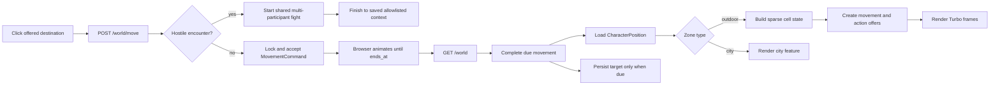

# frozen_string_literal: true
---
title: World Feature
description: Implementation handbook for the Neverlands-inspired open world, cells, movement, cell content, actions, and persisted player location.
status: Fully Implemented
updated: 2026-07-21
owners: Game world, movement, and world UI
template: feature-v1
---

# World

This document is the implementation contract for the current World feature. It explains the player-visible behavior, authoritative server state, sparse 1,000 × 1,000 region model, cell composition, timed travel, cell actions, UI ownership, security boundaries, seeds, and test coverage.

It describes what exists now. It does not turn deferred Neverlands mechanics into requirements by implication.

## 1. Design authority and related documents

Neverlands is the sole game-design reference for this feature. The local implementation adapts the observed behavior to Rails, Turbo, Stimulus, and the current English-only client; it must not be expanded with generic legacy-RPG conventions.

When behavior is uncertain or conflicts with this document:

1. Re-observe Neverlands and record the evidence in `doc/design/reference/`.
2. Update the relevant design note.
3. Change implementation and coverage together.
4. Update this feature contract last so it continues to describe shipped behavior.

Supporting documents:

- `doc/design/reference/neverlands_live_movement.md` — live movement observations.
- `doc/design/reference/neverlands_live_outdoor_npc_resource.md` — observed outdoor cell, NPC, and resource behavior.
- `doc/design/reference/neverlands_live_game_shell_ui.md` — persistent game-shell observations.
- `doc/design/areas/world_map.md` — world-area design record.
- `doc/design/features/movement.md` — movement design record.
- `doc/design/launch_mvp_plan.md` — MVP boundary and seeded topology.
- `doc/features/city.md` — city nodes, hotspots, and interior surfaces reached through the World context.
- `doc/features/character_progression.md` — persisted Wanderer value consumed when World authors a movement offer.
- `doc/features/game_shell.md` — persistent frame and presentation of the current World surface and same-cell presence.
- `doc/features/shop_economy.md` — Shop resume context that reuses World-owned position and safe fallback behavior.

### 1.1 Cross-feature relationships

| Related feature | Relationship | Ownership and handoff |
|---|---|---|
| `doc/features/city.md` | Outdoor entrances hand the character to a city node; city gates hand the character back to explicit outdoor cells. | World owns outdoor cells, entrance availability, and exact outdoor position; City owns its node graph and city hotspots after entry. |
| `doc/features/character_progression.md` | World reads the character's effective Wanderer level when it authors adjacent movement offers. | Character Progression owns saved/base/equipment-backed skill values; World owns the travel-time formula, command snapshot, timer, and completion lifecycle. |
| `doc/features/game_shell.md` | World bootstraps the game layout and supplies current location and same-cell player data. | World owns position queries and the central map/city payload; Game Shell owns the persistent frame, nearby-player presentation, and compact chat. |
| `doc/features/shop_economy.md` | World-owned resume context validates a saved Shop surface and falls back to World when it is unavailable. | World/City retain exact location authority; Shop owns allowlisted catalog context and exchange behavior after entry. |

## 2. Feature summary

The MVP has one outdoor region, **Outpost Surroundings**, with local coordinates from `[0, 0]` through `[999, 999]`. A character occupies exactly one cell in exactly one `Zone`. The region is sparse: cells do not require one million database rows. An in-bounds cell without an explicit template exists as ordinary, passable outdoor terrain.

The player sees a Neverlands-style 5 × 5 map viewport centered on the current cell. The server offers up to eight adjacent destinations. Clicking an offered cell starts a 25-to-30-second move based on the character's effective Wanderer level; the map animates in the browser, but the server remains authoritative and changes the persisted coordinate only when the command becomes due and is completed.

A cell may compose several independent concerns:

- terrain, passability, and an optional source-backed `100 x 100` art override;
- one hidden materialized hostile encounter anchor whose source metadata can create several NPC fight participants;
- an active city entrance;
- one or more explicitly authored local actions;
- other players whose persisted position exactly matches the cell.

Every state-changing click is backed by a short-lived, character-owned server offer. Coordinates, action type, and target are revalidated when the offer is accepted. DOM data and submitted identifiers are never authority.

## 3. MVP goals and non-goals

### Goals

- Represent a Neverlands-scale 1,000 × 1,000 region without materializing every cell.
- Persist the exact player zone and coordinate across logout and login.
- Offer eight-direction timed movement with a single active command.
- Reduce clean adjacent travel from 30 to 25 whole seconds across effective Wanderer levels `0..100`.
- Render only the small local map window required by the client.
- Compose hidden NPC, entrance, local-action, cell-art, and player-presence state at a cell.
- Render a configured source-backed image-cell slice before falling back to the
  regional coordinate-derived terrain slice.
- Keep outdoor NPC identity and placement absent from the map and action strip
  until the hidden encounter interrupts an action.
- Enter the three observed Forpost gates through explicit authored destinations.
- Interrupt offered movement, entrance, local, Character, and Inventory actions when the current source-backed hostile encounter attacks.
- Start the shared combat flow with every authored NPC encounter member on one side.
- Return from the explicit result step to the allowlisted interrupted World, Character, or Inventory destination.
- Keep all world mutation server-authoritative and authorization-covered.
- Match the compact Neverlands map language: fixed cell size, red available-cell borders, central cursor, walking indicator, and countdown.

### Non-goals

- Multiple outdoor regions or region-to-region travel.
- Rendering or downloading the entire 1,000 × 1,000 region.
- Procedural biomes, pathfinding, fog of war, or minimap discovery.
- Terrain-, encumbrance-, fatigue-, effect-, profession-, or non-Wanderer skill-based travel-time modifiers.
- Claiming to reproduce Neverlands' complete hidden travel-time formula; the live server has produced `32`- and `49`-second values under unisolated conditions.
- Automatic movement queues or click-to-path travel.
- Generic building types, levels, keys, item gates, or invented entrance rules.
- Implementing deferred `fish`, `drink`, or `dig` actions.
- Inventing gathering rewards for `Look Around` before Neverlands evidence and the corresponding inventory/economy design exist.
- Random encounter rolls, generic encounter tables, or procedural NPC group composition beyond explicit Neverlands-backed cell metadata.
- Invented building, lake, fishing, resource, or other special-location art
  without a captured Neverlands image-cell.
- Client-authoritative position changes.

## 4. Player experience

### 4.1 World screen

The authenticated root route opens `WorldController#show` in the persistent `game` layout. The controller dispatches by the current zone type:

- `outdoor` renders the world map and cell actions described here;
- `city` renders the city scene described in `doc/features/city.md`.

The outdoor screen consists of three Turbo frames:

- `available-actions` — actions for the exact current cell;
- `game-map` — the clipped map viewport and movement state;
- `location-info` — semantic cell metadata retained for accessibility and diagnostics, visually suppressed in the faithful UI.

The surrounding game shell owns navigation, character status, presence, inventory access, and chat. World partials do not recreate those systems.

### 4.2 Map presentation

- Logical cell size: `100px × 100px`.
- Visible viewport: `500px × 500px`, or 5 × 5 cells.
- Rendered buffer: 7 × 7 cells where bounds permit, clipped to create a one-cell animation gutter.
- Default terrain source: `app/assets/images/world/forpost-terrain.png`, a 1,000 × 1,000 sheet sliced with the cell coordinate modulo 10.
- Explicit cell art: a `MapTileTemplate` may select a validated catalog key and
  sheet coordinate; the configured art replaces the default slice for that
  exact cell while remaining fixed at `100 x 100`.
- Current position: a fixed 100 × 100 overlay in the center of the viewport.
- Available destination: red 2px border, matching the observed Neverlands selection language.
- Active movement: the map layer translates toward the target while the cursor remains centered.
- Countdown: a compact red capsule one cell above the cursor.

Cells outside the logical zone can be present only as inert render-buffer placeholders at an edge. They never receive movement offers.

### 4.3 Actions on the current cell

The compact action strip displays only visible actions the server offered for the current state:

- **Enter** — accessible active city entrance on the current cell.
- **Look Around** — implemented `resource_search` local action on the current cell.

Outdoor NPC presence, name, level, and HP are not rendered on the map or in the
action strip. The source-backed encounter remains hidden until it interrupts a
movement, entrance, local, Character, or Inventory action.

No cell actions are available while movement is active. Deferred authored actions remain unavailable rather than displaying controls that imply working gameplay.

Before an offered wilderness movement, entrance, or local action completes, World checks the authoritative current cell for its live hostile encounter. The persistent shell's **Character** and **Inventory** actions pass through the same check. An attack replaces the intended action with the shared fight screen; after the explicit result step, the player returns to the saved allowlisted destination. Arbitrary submitted URLs are never accepted as return targets.

### 4.4 Players here

The player list is scoped to active characters at the exact zone and `[x, y]`, excludes the current character, and is capped at 10 entries. Supported orders are name A–Z/Z–A and level ascending/descending. The list is refreshed through `GET /world/players`; it is presence information, not authority for interaction.

## 5. Feature topology and authored content

The MVP topology is one sparse `1,000 × 1,000` outdoor region. Coordinates are local to that `Zone`; missing in-bounds tile rows are ordinary passable cells, while explicit records add authored terrain/art, hidden NPC, entrance, or local-action content. Adjacency never implies a city destination or building identity—those relationships are explicit records.

### 5.1 Region and cell identity

- **Local coordinate** — stored in `CharacterPosition`, movement records, and tile records in this app.
- **Captured source coordinate** — records where the corresponding behavior was observed in Neverlands.
- **Sparse tile** — an explicit override/content row; it is not required for an ordinary in-bounds cell to exist.
- **Cell-art key** — a server-configured stable reference to a project-owned
  `100 x 100` image or one slice in a larger art sheet. Records never store an
  arbitrary asset path.
- **Cell composition** — terrain/art/passability plus independently materialized hidden NPC, entrance, local-action, and exact-cell presence layers.

### 5.2 Forpost entrances

| Entrance | Local coordinate | Captured source coordinate | Destination |
|---|---:|---:|---|
| West Gate | `[7, 0]` | `[1019, 1025]` | Forpost Central Square (`city2_1`) at `[0, 0]` |
| South Gate | `[10, 3]` | `[1022, 1028]` | Forpost Stables (`city2_7`) at `[0, 0]` |
| East Gate | `[13, 2]` | `[1025, 1027]` | Forpost Guild District (`city2_8`) at `[0, 0]` |

Each gate is an explicit active `TileBuilding`. There is no North gate in the captured live topology.

### 5.3 Captured outdoor content

The explicit cell at local `[7, 7]` corresponds to captured Neverlands coordinate `[1001, 999]`. It stores the validated `forpost_terrain` cell-art slice, supplies the authored outdoor observation/resource context, and materializes a hidden hostile Plague Rat encounter anchor from `config/gameplay/outdoor_npcs.yml` with level, health, damage, experience, respawn, loot, and `encounter_count: 2` metadata. Starting its fight creates two distinct Plague Rat participations on side B, matching the captured paired-rat ambush.

The config is evidence-backed content input. `TileNpcService` owns materialized runtime state; changing YAML alone is not an authorization mechanism. Local and source coordinates must never be mixed in services or requests.

## 6. Feature surfaces and contained behavior

### 6.1 Implementation status

| Surface or behavior | Entry point | MVP status | Owning implementation |
|---|---|---|---|
| Outdoor map | `GET /world` in an outdoor zone | Interactive | `WorldController`, `MapState`, World views |
| Adjacent timed movement | `POST /world/move` | Interactive | `TravelTime`, `AcceptMove`, `CompleteMove` |
| Hidden current-cell NPC attack | Interruption of a visible wilderness action | Interactive handoff | World validation, then Arena combat lifecycle |
| Current-cell city entrance | `POST /world/enter_building` | Interactive handoff | World entrance service, then City |
| `Look Around` | `POST /world/perform_local_action` | Interactive observation/ambush handoff | World local-action pipeline |
| Character/Inventory world-shell actions | `POST /world/context` | Interactive navigation/ambush handoff | World allowlist and hostile interruption pipeline |
| Wilderness result return | `POST /arena_matches/:id/finish` after a World fight | Interactive handoff | Arena finishes the result; World resolves the saved allowlisted destination |
| `fish`, `drink`, and `dig` | Authored identifiers only | Deferred | No offer or mutation is exposed |

### 6.2 Movement and map behavior

The server authors up to eight adjacent offers with opaque keys and a snapshotted `25..30` second duration. The browser marks only those cells, submits one offer, fixes the cursor in the center, translates the buffered map underneath it, and shows the server-derived countdown. Position remains the source cell until `CompleteMove` finalizes a due command.

### 6.3 Cell composition and handoffs

Cell art, hidden NPC, entrance, implemented local-action, and exact-cell player layers can coexist. Each visible tile mutation receives its own short-lived owned offer. World validates the current coordinate and target, then checks the hidden hostile encounter before handing combat to Arena or city navigation to City. The fight keeps a World-authored allowlisted return context; Arena owns resolution, participant defeat, surrender, and the result screen, then hands the finish action back to that context.

### 6.4 Deferred behavior boundary

The client exposes no generic building, pathfinding, terrain-speed, gathering-reward, or long-distance travel framework. Source-recognized action identifiers remain inert until their successful Neverlands flows, rewards, requirements, and interruption behavior are captured and implemented with tests.

## 7. Authoritative data and presentation model

| Record | Responsibility | Important contract |
|---|---|---|
| `Zone` | Coordinate space and location type | Positive width/height; MVP types are `outdoor` and `city`; outdoor bounds are checked server-side. |
| `CharacterPosition` | Durable location of one character | One row per character; active character only; coordinate must be inside its zone. This is the source of truth across sessions. |
| `MapTileTemplate` | Sparse explicit terrain/cell override | Stores a zone-name key, coordinate, passability, optional validated cell-art reference, and authored local actions. Missing in-bounds rows default to passable outdoor cells. |
| `MovementCommand` | Offered or active timed move | Captures source, target, direction, status, action key, offer expiry, and movement timestamps. |
| `WorldActionOffer` | Capability for one cell mutation | Character-owned, short-lived action tied to exact zone, coordinate, type, and polymorphic target. |
| `TileNpc` | Materialized state of a configured outdoor NPC | Tracks live/defeated state and respawn timing at an exact cell. |
| `TileBuilding` | Explicit outdoor entrance | MVP building type is only `city`; stores exact authored destination zone and coordinate. |

### 7.1 Sparse-cell rule

`MapTileTemplate` is an override table, not the region itself. Cell resolution follows this order:

1. Reject coordinates outside `Zone` bounds.
2. Use the explicit tile template when one exists.
3. Otherwise return an ordinary passable outdoor cell.
4. Resolve valid configured cell art or use the regional coordinate fallback.
5. Independently compose hidden active NPC state, visible entrance/local
   actions, and exact-cell players.

This rule is required for a 1,000 × 1,000 MVP region. Code must not create a tile row merely because a character viewed or traversed a coordinate.

### 7.2 Cell-art schema

`config/gameplay/world_cell_art.yml` maps a stable key to a project-owned asset,
fixed `100 x 100` cell dimensions, and sheet columns/rows. An explicit tile may
store only:

```yaml
source_map: m_1001_999
cell_art:
  key: forpost_terrain
  column: 7
  row: 7
```

`MapTileTemplate` requires `source_map`, a configured key, and in-range integer
sheet coordinates. `CellArtCatalog` rejects missing files, paths outside
`app/assets/images/world`, non-100px cells, path traversal, and invalid sheet
dimensions. A dedicated future special-cell image uses a one-column/one-row
catalog definition; no schema migration or arbitrary database asset path is
needed.

#### Add a source-backed art asset

Use this workflow only after the corresponding Neverlands cell artwork or live
appearance has been captured:

1. Put the project-owned image below `app/assets/images/world/`. Do not use a
   remote URL or copy a path into database metadata.
2. Add one stable key to `config/gameplay/world_cell_art.yml`. Treat that key as
   persisted identity: renaming it requires updating every stored tile reference.
3. Set `cell_width` and `cell_height` to `100`. For a sheet, set `columns` and
   `rows` to the number of 100px slices in the physical bitmap.
4. Store only the catalog key and a zero-based `column`/`row` in the sparse
   `MapTileTemplate.metadata["cell_art"]` value.
5. Keep `source_map` and `source_coordinates` beside the art reference so local
   coordinates cannot be mistaken for captured Neverlands coordinates.
6. Add or update catalog, model, seed, rendering, and player-flow coverage that
   applies to the changed content.

The shipped regional sheet demonstrates the catalog form:

```yaml
forpost_terrain:
  asset: world/forpost-terrain.png
  cell_width: 100
  cell_height: 100
  columns: 10
  rows: 10
  source_reference: neverlands_live_movement
```

Its physical size is `1000 x 1000`, so column and row values are each `0..9`.
The catalog validates configured dimensions and bounds but deliberately does
not decode the bitmap at runtime; asset specs must confirm that the physical
file still matches `columns * 100` by `rows * 100`.

#### Configure a dedicated 100px cell

A verified building, gate, lake, fishing place, or other special location may
use its own `100 x 100` file. Its catalog entry has `columns: 1` and `rows: 1`,
and its sparse tile reference uses `column: 0` and `row: 0`. The commented
example in `config/gameplay/world_cell_art.yml` shows the exact shape; it must
remain commented until the referenced asset and evidence exist.

The tile metadata shape is the same for a dedicated image and a sheet slice:

```yaml
source_map: m_1019_1025
source_coordinates: [1019, 1025]
cell_art:
  key: forpost_terrain
  column: 9
  row: 5
```

Ordinary in-bounds cells need no database row and use the coordinate-derived
regional slice. A missing runtime override also falls back to that slice. An
explicit `MapTileTemplate` with malformed cell-art metadata is rejected instead
of persisting an ambiguous reference.

Application code should resolve presentation through the catalog instead of
reading YAML directly:

```ruby
presentation = Game::World::CellArtCatalog.resolve(tile.metadata["cell_art"])
```

`resolve` returns `nil` for an unsafe or unknown reference, allowing the map
renderer to use its regional fallback. A successful result supplies the
allowlisted asset, background offsets, and full sheet dimensions needed by CSS.
Use `valid_reference?` at a content-validation boundary such as
`MapTileTemplate`; do not use either method to decide passability or available
actions.

#### Art does not create gameplay

Cell art is presentation only. It does not make a cell blocked, enterable,
fishable, searchable, or hostile. Author those concerns independently through
`passable`, `TileBuilding`, validated `local_actions`, or the outdoor NPC config.
The layers may coexist at one coordinate and the server remains authoritative
for which actions are offered.

Do not repurpose retained `city.png`, `gate.png`, or other large scene art as a
wilderness cell merely because its subject matches. Use it only after the exact
Neverlands map appearance is verified and the asset is prepared as a 100px cell
or a correctly indexed 100px sheet. `CellArtCatalog` caches the YAML during the
process lifetime; restart the app after catalog changes, or call
`Game::World::CellArtCatalog.reload!` in a development console or isolated spec.

### 7.3 Local-action schema

Authored `local_actions` are validated structured data. Supported definitions are:

| Kind | Neverlands source id | Runtime action | Implemented |
|---|---|---|---|
| `resource_search` | `look` | `search_resources` | Yes |
| `fishing` | `fis` | `fish` | No |
| `drinking` | `dri` | `drink` | No |
| `digging` | `dig` | `dig` | No |

Invalid kinds, source-id mismatches, duplicates, and malformed array/object shapes are rejected. Only implemented definitions become `WorldActionOffer` rows. `Look Around` currently returns the authored observation message; it deliberately grants no invented item or currency reward.

## 8. Runtime architecture



The important boundary is that JavaScript animates an accepted command; it does not complete the command or write the position.

### 8.1 World load

`Game::Movement::MapState` first asks `CompleteMove` to finalize any due command. It then:

1. returns the active movement state without new destinations when a command is still moving;
2. otherwise cancels stale open movement offers;
3. evaluates all eight direction offsets against bounds and passability;
4. persists fresh `MovementCommand` offers with random action keys and a 10-minute offer TTL;
5. returns the map state used to render the viewport.

`WorldController` separately resolves current-cell content and rotates
`WorldActionOffer` rows for visible entrances and implemented local actions.
It materializes hostile NPC state for interruption without serializing the NPC
name, marker, stats, or a manual attack action into the map surface.

### 8.2 Travel duration

`Game::Movement::TravelTime` snapshots the duration into every offered command:

```text
wanderer = clamp(character.passive_skill_level(:wanderer), 0, 100)
reduction_seconds = floor(wanderer * 5 / 100)
travel_seconds = clamp(30 - reduction_seconds, 25, 30)
```

The whole-second bands are `0..19 => 30`, `20..39 => 29`, `40..59 => 28`, `60..79 => 27`, `80..99 => 26`, and `100 => 25`. `passive_skill_level` is the effective value, including supported equipment bonuses and capped at `100`.

The command keeps its offered duration even if the character's skill or equipment changes afterward. Acceptance uses that persisted value for `ends_at`, reload uses the same value/timestamps, and the Stimulus controller presents it. Direction and tile metadata currently do not change the result.

This is an explicit MVP slice, not a claim about the complete Neverlands formula. The 2026-07-21 live follow-up observed Wanderer `100` alongside source durations of `32` and `49`, proving other source inputs exist but not isolating them well enough to implement.

### 8.3 Start movement

`POST /world/move` submits direction, target coordinate, and action key. `AcceptMove`:

1. completes any command already due;
2. rejects a second active movement;
3. finds an offered command owned by the current character;
4. locks it and validates TTL, direction, source position, submitted target, bounds, and current passability;
5. changes it from `offered` to `moving`;
6. records `started_at` and `ends_at` using the persisted offer duration;
7. cancels sibling offers.

The character remains on the source cell during the 25-to-30-second interval. Turbo responses refresh the relevant map/action frames; HTML requests redirect to the canonical world screen.

### 8.4 Complete movement

On a subsequent world-state load, `CompleteMove` locks the due command and position. It applies the target only if:

- the character still occupies the command source;
- the target is still in bounds and passable;
- the command is the current due `moving` command.

Success updates `CharacterPosition`, advances the command to `completed`, and increments the position turn marker. A moved source or newly invalid target produces a failed command instead of teleporting the character.

### 8.5 Accept a cell action

Visible entrance use and local actions follow the same capability pattern:

1. The render pass creates a `WorldActionOffer` for the current character and exact current cell.
2. The form submits its opaque action key and expected target identifiers.
3. `WorldActionOfferPolicy` verifies ownership.
4. `Game::World::AcceptAction` locks the row and revalidates status, expiry, position, action type, and target.
5. The domain service performs the action.
6. The offer becomes `completed` or `failed`; subsequent rendering creates a fresh offer if the action is still possible.

Changing an HTML id, reusing another character's key, replaying an expired key, or moving away invalidates the action.

### 8.6 Hostile interruption

`Game::World::InterruptAction` resolves the live hostile encounter from the authoritative outdoor position. `WorldController` invokes it for movement, entrance, and implemented local actions, while `WorldContextActionsController` invokes it for the World shell's Character and Inventory destinations. City positions and already-active combat do not start another encounter.

On interruption, `StartNpcFight` locks the character and encounter anchor, returns an existing active match on a duplicate request, and otherwise creates one player participation plus the source-authored number of NPC participations. The paired-rat cell creates a `team_battle` with two independently targetable NPC records. Match metadata records the source cell, encounter count, and normalized `world`, `profile`, or `inventory` return context. The outdoor map does not implement a separate combat engine.

Arena's shared processor lets each living NPC on the opposing side act, performs defeat and loot per NPC, and ends the fight only after an entire side is defeated. Surrender follows the same participant rule for PvE and PvP side sizes. `ArenaMatchesController#finish` clears the player's combat flag and resolves World-fight return metadata through `CombatReturnContext`; invalid persisted context falls back to the unchanged world cell.

## 9. HTTP and Turbo contract

| Method and path | Purpose | Success | Failure |
|---|---|---|---|
| `GET /` or `GET /world` | Render the current persisted context | Outdoor map or city scene | Authentication redirect; bootstrap spawn only when position is absent. |
| `GET /world/players` | Exact-cell player list | HTML partial/Turbo-compatible response | Authentication redirect. |
| `POST /world/move` | Accept one offered adjacent move | Turbo map/action refresh or HTML redirect | No position change; error message and restored current map. |
| `POST /world/enter_building` | Enter the offered outdoor city entrance | Position changes to explicit destination and redirects to world | Offer fails; position remains unchanged. |
| `POST /world/perform_local_action` | Execute an offered implemented cell action | Observation result or hostile fight transition | Offer fails; no reward/state invention. |
| `POST /world/context` | Open Character or Inventory from the wilderness shell | Allowlisted destination or hostile fight transition with saved return context | Unsupported context returns to World; no arbitrary URL is followed. |
| `POST /world/interact_hotspot` | Shared city hotspot action | See `doc/features/city.md` | See city contract. |
| `POST /arena_matches/:id/finish` | Finish a completed wilderness result | Marks the participant result viewed, exits combat, and returns to saved World/Character/Inventory context | Reject active fight or non-participant; malformed context falls back to World. |

There is no separately versioned public World API. HTML/Turbo is the
player-facing contract. Hidden hostile encounters transition through the same
server redirect flow as the interrupted action; there is no manual outdoor-NPC
attack endpoint. Swagger/rswag and blueprint documentation are intentionally
outside this feature.

## 10. Client-side and CSS ownership

`nl_world_map_controller.js` owns only presentation and submission behavior:

- ignores cells without `data-available="true"`;
- disables remaining offers after a click;
- submits the server-authored hidden form;
- derives remaining time from server `ends_at`;
- translates the map by a fraction of one cell;
- updates the countdown;
- revisits the canonical world route when the timer reaches zero.

It must not calculate reachable destinations, invent an action key, change coordinates, or mark a command complete. Those remain service responsibilities.

`app/assets/stylesheets/nl/world.css` owns the clipped 5 × 5 viewport, buffered
100px cells, red offered-cell border, fixed center marker, walking state, and
timer placement. `Game::World::CellArtCatalog` owns the allowlisted asset and
sheet dimensions. The renderer uses an explicit valid cell-art reference first
and otherwise slices `app/assets/images/world/forpost-terrain.png` by
coordinate. Neither presentation path defines passability or content.

Available cells remain native buttons with labels, while movement status is exposed as text as well as motion. The location-information frame retains semantic metadata even when visually suppressed. A reduced-motion client may minimize interpolation, but it must preserve the same server timer and completion reload.

## 11. Persistence and login resume

`CharacterPosition` is durable and is not cleared on logout. On login, `Game::World::ResumeContext` chooses a safe route while preserving that record:

- an outdoor cell resumes the world at exactly that zone and coordinate;
- a city node resumes that exact city-zone record;
- an accessible shop or captured city building may resume its interior route;
- an invalid saved interior context falls back to the world without relocating the character.

The only location bootstrap is for a playable character with no position row: Central Square in Forpost at `[0, 0]`. A normal login never respawns or recenters an existing character.

A wilderness fight does not move `CharacterPosition`. Its match metadata stores only an allowlisted logical return context. Finishing an interrupted move, entrance, or local action returns to World; an interrupted Character or Inventory shell action returns to that requested surface. Logout cannot erase the outdoor cell, and an invalid return value cannot redirect away from the application.

## 12. Authorization, trust boundaries, and concurrency

- Devise authentication protects every World route.
- `CurrentCharacterContext` selects only the signed-in user's playable active character.
- `WorldActionOfferPolicy` authorizes action-offer ownership.
- Services revalidate exact zone, coordinate, action type, target, status, and expiry under locks.
- Movement uses character-owned `MovementCommand` rows and rejects concurrent active moves.
- Database state, not DOM geometry, hidden labels, or JavaScript state, decides availability.
- Cell records store a configured art key and sheet coordinate, never an
  arbitrary asset path, URL, CSS size, or client-provided image value.
- Building destinations come from active authored `TileBuilding` records, never arbitrary request URLs or coordinates.
- NPC interruption requires a current, live, hostile, same-cell materialization;
  no NPC identity or attack capability is accepted from the browser.
- Encounter size is source metadata constrained to `1..8`; the captured paired-rat cell uses `2`.
- `StartNpcFight` locks the character before the encounter anchor and reuses an existing active fight, preventing double-clicked or concurrent starts from creating overlapping combat.
- Repeated NPC templates use participation ids for targeting and broadcasts; a template id is not unique inside a multi-NPC fight.
- Post-fight destinations are logical allowlisted contexts, never request-provided or persisted URLs.
- Missing/invalid offers do not leak another character's capability.

## 13. Failure and boundary behavior

| Condition | Required behavior |
|---|---|
| Coordinate below zero or at/above zone width/height | No offer; direct submissions are rejected. |
| Missing in-bounds tile template | Ordinary passable outdoor cell. |
| Missing cell-art override | Render the coordinate-derived Forpost terrain slice. |
| Unknown, malformed, null-coordinate, or out-of-range cell-art override | Reject persisted content; runtime resolution safely uses the terrain fallback. |
| Missing out-of-bounds render-buffer cell | Inert visual placeholder only. |
| Impassable explicit tile | No destination offer; revalidated on acceptance and completion. |
| Active movement | No new movement or cell-action offers. |
| Expired, cancelled, failed, or consumed key | Reject without state mutation. |
| Foreign character key | Reject without revealing or applying the action. |
| Character moved since offer creation | Reject as wrong source/current cell. |
| Submitted direction/target differs from offer | Reject as mismatch. |
| Target becomes impassable before completion | Fail command; do not update position. |
| Deferred local action definition | Do not create an offer. |
| `Look Around` with no hostile interruption | Return authored message; grant no invented reward. |
| Valid wilderness action with a live hostile encounter | Do not complete its intended domain transition; start or reuse the shared fight and preserve its allowlisted destination. |
| First NPC defeated in a multi-NPC fight | Award/log that participant's loot check; keep the encounter anchor and fight live while another opposing participant survives. |
| Final NPC defeated | Mark the encounter anchor defeated and complete the fight-level result. |
| Player surrenders | Defeat only that participant; finish only when the participant's entire side is defeated. |
| Duplicate fight start | Return the character's existing active match; do not create another match or participant set. |
| Invalid/foreign post-fight context | Fall back to the unchanged World cell; never follow the submitted value as a URL. |
| No persisted position | Bootstrap once to Forpost Central Square. |

## 14. Acceptance criteria

- A character can traverse any offered in-bounds adjacent cell, including diagonals.
- A move lasts the server-authored 25-to-30 seconds for the effective Wanderer boundary, and only one move may be active.
- Wanderer `0`, `20`, and `100` produce `30`, `29`, and `25` seconds respectively; missing or malformed-negative skill data cannot exceed the 30-second base.
- The UI animates the accepted move and reloads authoritative state at completion.
- The region supports local coordinates through `[999, 999]` without precreating every cell.
- Explicit impassable cells and all logical edges are enforced server-side.
- Source-backed `100 x 100` cell-art overrides render at their configured sheet
  slice and ordinary cells retain the coordinate-derived terrain fallback.
- Exact-cell hidden NPC state, visible entrance/local action, and player-presence composition resolves correctly without revealing the NPC on the outdoor map.
- West, South, and East gates enter their explicit Forpost node.
- Hostile same-cell interaction starts the shared NPC fight implementation.
- Movement, entrance, local, Character, and Inventory wilderness actions can be replaced by the same hostile encounter check.
- The captured Plague Rat encounter remains invisible on the map, then the fight renders and resolves two independently targetable NPCs; both living NPCs can act, the first defeat does not end the fight, and each defeated NPC receives its own loot check.
- The shared fight surface renders complete 1x1, 1xMany, and ManyxMany side rosters for PvE/PvP and applies surrender to one participant at a time.
- Finishing a wilderness result returns to World, Character, or Inventory according to validated match metadata; invalid metadata falls back to World.
- Logout/login preserves exact outdoor coordinates.
- Anonymous, expired, stale, mismatched, remote, and foreign-character actions cannot mutate state.

## 15. Test strategy and required coverage

Tests are part of the feature contract. Changes must cover the applicable model, request, policy, service, factory, view/system, and seed layers. Blueprint and Swagger/rswag coverage are intentionally not applicable because this is not a JSON API.

| Coverage category | Representative guarantees |
|---|---|
| Success | Map load, configured cell-art slice/fallback, hidden NPC presentation, eight-direction offer, Wanderer-timed acceptance/completion, cell composition, gate/local/context interruption, multi-NPC fight, participant surrender, context return, persisted resume. |
| Failure | Unknown/malformed cell art, invalid key/context, expired offer, wrong direction/target, impassable destination, concurrent movement, stale source, inactive entrance/NPC, surrender after completion. |
| Edge/null/boundary | Cell-art key/source/column/row null, negative, zero, and sheet edge; Wanderer `nil`/negative/`0`/`19`/`20`/`100`; encounter count `nil`/`0`/`2`/oversized; repeated NPC template ids; first/final participant defeat; 1x1/1xMany/ManyxMany sides; invalid saved return context; map edges. |
| Authorization | Anonymous request, foreign movement/action offer, current-character scoping, World-offer policy ownership, combat participant policy. |

Factories must retain edge traits for status, expiry, coordinates, passability, action types, and active/inactive content when those states are exercised.

Focused verification command:

```bash
bundle exec rspec \
  spec/helpers/world_helper_spec.rb \
  spec/models/character_gameplay_context_spec.rb \
  spec/models/character_position_spec.rb \
  spec/models/zone_spec.rb \
  spec/models/map_tile_template_spec.rb \
  spec/models/movement_command_spec.rb \
  spec/models/world_action_offer_spec.rb \
  spec/models/tile_building_spec.rb \
  spec/models/tile_npc_spec.rb \
  spec/models/open_world_seed_spec.rb \
  spec/policies/world_action_offer_policy_spec.rb \
  spec/services/game/movement \
  spec/services/game/world/accept_action_spec.rb \
  spec/services/game/world/action_offer_builder_spec.rb \
  spec/services/game/world/cell_art_catalog_spec.rb \
  spec/services/game/world/tile_state_resolver_spec.rb \
  spec/services/game/world/perform_local_action_spec.rb \
  spec/services/game/world/interrupt_action_spec.rb \
  spec/services/game/world/combat_return_context_spec.rb \
  spec/services/game/world/start_npc_fight_spec.rb \
  spec/services/game/world/tile_building_service_spec.rb \
  spec/services/game/world/tile_npc_service_spec.rb \
  spec/services/game/world/outdoor_npc_config_spec.rb \
  spec/requests/world_spec.rb \
  spec/requests/open_world_regions_spec.rb \
  spec/requests/world_context_actions_spec.rb \
  spec/requests/arena_matches_spec.rb \
  spec/requests/login_resume_spec.rb \
  spec/routing/world_routing_spec.rb \
  spec/views/world \
  spec/views/layouts/game_spec.rb \
  spec/views/shared/_nl_players_list_spec.rb \
  spec/system/world_map_spec.rb \
  spec/system/world_interactions_spec.rb \
  spec/system/login_resume_spec.rb \
  spec/assets/city_image_assets_spec.rb \
  spec/assets/world_cell_art_assets_spec.rb
```

Run the complete suite before release because the world hands off to combat, city, shop, inventory, shell, presence, and login-resume behavior.

## 16. Responsible for Implementation Files

### Requirements and design evidence

- `doc/features/world.md`
- `doc/design/areas/world_map.md`
- `doc/design/features/movement.md`
- `doc/design/launch_mvp_plan.md`
- `doc/design/reference/neverlands_live_movement.md`
- `doc/design/reference/neverlands_live_outdoor_npc_resource.md`
- `doc/design/reference/neverlands_live_game_shell_ui.md`

### Routes and controllers

- `config/routes.rb`
- `app/controllers/application_controller.rb`
- `app/controllers/concerns/current_character_context.rb`
- `app/controllers/world_controller.rb`
- `app/controllers/world_context_actions_controller.rb`

### Models and policy

- `app/models/character.rb`
- `app/models/zone.rb`
- `app/models/spawn_point.rb`
- `app/models/character_position.rb`
- `app/models/map_tile_template.rb`
- `app/models/movement_command.rb`
- `app/models/world_action_offer.rb`
- `app/models/tile_building.rb`
- `app/models/tile_npc.rb`
- `app/models/npc_template.rb`
- `app/policies/world_action_offer_policy.rb`

### Movement services

- `app/services/game/movement/directions.rb`
- `app/services/game/movement/travel_time.rb`
- `app/services/game/movement/tile_provider.rb`
- `app/services/game/movement/movement_validator.rb`
- `app/services/game/movement/movement_violation_error.rb`
- `app/services/game/movement/command_queue.rb`
- `app/services/game/movement/map_state.rb`
- `app/services/game/movement/accept_move.rb`
- `app/services/game/movement/complete_move.rb`
- `app/services/game/movement/respawn_service.rb`

### World-content services

- `app/services/game/world/action_offer_builder.rb`
- `app/services/game/world/accept_action.rb`
- `app/services/game/world/cell_art_catalog.rb`
- `app/services/game/world/tile_state_resolver.rb`
- `app/services/game/world/tile_building_service.rb`
- `app/services/game/world/outdoor_npc_config.rb`
- `app/services/game/world/tile_npc_service.rb`
- `app/services/game/world/perform_local_action.rb`
- `app/services/game/world/interrupt_action.rb`
- `app/services/game/world/combat_return_context.rb`
- `app/services/game/world/start_npc_fight.rb`
- `app/services/game/world/resume_context.rb`

### Views, client behavior, styling, and assets

- `app/helpers/world_helper.rb`
- `app/views/layouts/game.html.erb`
- `app/views/shared/_nl_players_list.html.erb`
- `app/views/world/show.html.erb`
- `app/views/world/_map.html.erb`
- `app/views/world/_actions.html.erb`
- `app/views/world/_location_info.html.erb`
- `app/javascript/controllers/game_layout_controller.js`
- `app/javascript/controllers/nl_world_map_controller.js`
- `app/assets/stylesheets/nl/world.css`
- `app/assets/stylesheets/nl/shell.css`
- `app/assets/stylesheets/nl/chat_presence.css`
- `app/assets/images/world/forpost-terrain.png`
- `app/assets/images/gate.png`

### Integrated NPC-combat entry

- `app/models/arena_match.rb`
- `app/models/arena_participation.rb`
- `app/controllers/arena_matches_controller.rb`
- `app/helpers/arena_helper.rb`
- `app/services/arena/combat_processor.rb`
- `app/services/arena/combat_broadcaster.rb`
- `app/services/arena/npc_combat_ai.rb`
- `app/views/arena_matches/show.html.erb`
- `app/views/arena_matches/_fighter_card.html.erb`
- `app/javascript/controllers/arena_match_controller.js`
- `app/assets/stylesheets/nl/arena.css`

World owns same-cell hostile validation and match creation. Arena owns the combat lifecycle after `StartNpcFight` hands off the created match.

### Content, seeds, and schema

- `config/gameplay/world_cell_art.yml`
- `config/gameplay/outdoor_npcs.yml`
- `db/seeds.rb`
- `db/schema.rb`

### Factories

- `spec/factories/characters.rb`
- `spec/factories/spawn_points.rb`
- `spec/factories/zones.rb`
- `spec/factories/character_positions.rb`
- `spec/factories/map_tile_templates.rb`
- `spec/factories/movement_commands.rb`
- `spec/factories/world_action_offers.rb`
- `spec/factories/tile_buildings.rb`
- `spec/factories/tile_npcs.rb`
- `spec/factories/arena_matches.rb`
- `spec/factories/arena_participations.rb`

### Specs

- `spec/helpers/world_helper_spec.rb`
- `spec/models/character_gameplay_context_spec.rb`
- `spec/models/character_position_spec.rb`
- `spec/models/zone_spec.rb`
- `spec/models/map_tile_template_spec.rb`
- `spec/models/movement_command_spec.rb`
- `spec/models/world_action_offer_spec.rb`
- `spec/models/tile_building_spec.rb`
- `spec/models/tile_npc_spec.rb`
- `spec/models/open_world_seed_spec.rb`
- `spec/policies/world_action_offer_policy_spec.rb`
- `spec/services/game/movement/`
- `spec/services/game/world/accept_action_spec.rb`
- `spec/services/game/world/action_offer_builder_spec.rb`
- `spec/services/game/world/cell_art_catalog_spec.rb`
- `spec/services/game/world/tile_state_resolver_spec.rb`
- `spec/services/game/world/tile_building_service_spec.rb`
- `spec/services/game/world/outdoor_npc_config_spec.rb`
- `spec/services/game/world/tile_npc_service_spec.rb`
- `spec/services/game/world/perform_local_action_spec.rb`
- `spec/services/game/world/interrupt_action_spec.rb`
- `spec/services/game/world/combat_return_context_spec.rb`
- `spec/services/game/world/start_npc_fight_spec.rb`
- `spec/requests/world_spec.rb`
- `spec/requests/open_world_regions_spec.rb`
- `spec/requests/world_context_actions_spec.rb`
- `spec/requests/arena_matches_spec.rb`
- `spec/services/arena/combat_processor_spec.rb`
- `spec/services/arena/npc_combat_ai_spec.rb`
- `spec/models/arena_match_auto_end_spec.rb`
- `spec/policies/arena_match_policy_spec.rb`
- `spec/system/arena_match_ui_layout_spec.rb`
- `spec/requests/login_resume_spec.rb`
- `spec/routing/world_routing_spec.rb`
- `spec/views/world/`
- `spec/views/layouts/game_spec.rb`
- `spec/views/shared/_nl_players_list_spec.rb`
- `spec/system/world_map_spec.rb`
- `spec/system/world_interactions_spec.rb`
- `spec/system/login_resume_spec.rb`
- `spec/assets/city_image_assets_spec.rb`
- `spec/assets/world_cell_art_assets_spec.rb`

## 17. Safe extension checklist

Before extending the World feature:

1. Capture the corresponding Neverlands behavior and UI.
2. State whether the change affects sparse cell resolution, movement, cell composition, or another feature reached from the cell.
3. Keep server offers and exact-position revalidation for every new mutation.
4. Do not place game authority in CSS geometry, Stimulus state, or submitted labels.
5. Add only the models/services needed for the captured MVP behavior.
6. Update seeds/config only for explicit authored content; use the cell-art
   workflow in section 7.2 for presentation overrides.
7. Add success, failure, edge/null/boundary, and authorization coverage where applicable.
8. Update this document's non-goals, acceptance criteria, responsible files, and version history.

## 18. Version history

| Date | Change |
|---|---|
| 2026-07-21 | Created the implementation handbook for the shipped MVP open world, sparse cells, movement lifecycle, outdoor interactions, persistence, and coverage. |
| 2026-07-21 | Added reciprocal ownership and handoff references for City, Game Shell, and Shop resume integration. |
| 2026-07-21 | Added the bounded effective-Wanderer travel formula, live variable-duration/resume evidence, reciprocal Character Progression ownership, and boundary/request coverage. |
| 2026-07-21 | Closed the observed hostile-NPC gaps: the paired-rat cell now creates two independently targetable participants, every living NPC acts, defeat/loot remains participant-level, wilderness actions share interruption, surrender works across side sizes, duplicate starts are guarded, and finish returns to an allowlisted interrupted context. |
| 2026-07-21 | Fixed the Neverlands image-cell contract at `100 x 100`, added validated source-backed per-cell art slices with coordinate fallback, and removed outdoor NPC markers/names/manual Attack controls while preserving hidden encounter interruption. |
| 2026-07-21 | Added the operational cell-art authoring guide for catalog entries, sheet and dedicated-image references, sparse tile metadata, cache reloads, fallback behavior, evidence, and independent gameplay layers. |
| 2026-07-21 | Closed cell-art coverage gaps for invalid catalog definitions, physical sheet geometry, exact sheet boundaries, seed references, and HTTP render/fallback integration. |
