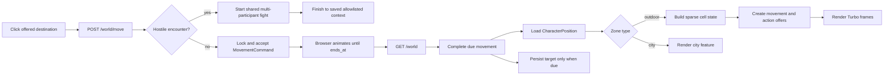

# frozen_string_literal: true
---
title: World Feature
description: Implementation handbook for the Neverlands-based open world, cells, movement, cell content, actions, and persisted player location.
status: Fully Implemented
updated: 2026-09-01
owners: Game world, movement, and world UI
template: feature-v1
---

# World

This document is the implementation contract for the current World feature. It explains the player-visible behavior, authoritative server state, sparse 1,000 × 1,000 region model, cell composition, timed travel, cell actions, UI ownership, security boundaries, seeds, and test coverage.

It describes what exists now. It does not turn deferred Neverlands mechanics into requirements by implication.

## 1. Design authority and related documents

Domain navigation: `doc/domains/world.md`.

Neverlands is the sole game-design reference for this feature. The local implementation adapts the observed behavior to Rails, Turbo, Stimulus, and the current English-only client; it must not be expanded with generic legacy-RPG conventions.

When behavior is uncertain or conflicts with this document:

1. Re-observe Neverlands and record the evidence in `doc/design/reference/`.
2. Update the relevant design note.
3. Change implementation and coverage together.
4. Update this feature contract last so it continues to describe shipped behavior.

Supporting documents:

- `doc/design/reference/world/observations/2026-05-09_overworld_movement.md` — live movement observations.
- `doc/design/reference/world/observations/2026-05-20_outdoor_npc_resource.md` — observed outdoor cell, NPC, and resource behavior.
- `doc/design/reference/combat/observations/2026-08-26_wilderness_two_orc_group_fight.md` — current multi-NPC handoff, per-NPC search, and return evidence.
- `doc/design/reference/combat/observations/2026-08-26_wilderness_passive_goblin_fight.md` — current passive same-cell bot-attack and return evidence.
- `doc/design/reference/combat/observations/2026-08-26_wilderness_shield_npc_fight.md` — current north/back movement, exact-cell return, and action-interruption evidence.
- `doc/design/reference/combat/observations/2026-09-01_wilderness_bandit_group_variation_and_magic.md` — current same-return-context variable group and passive-interval evidence.
- `doc/design/reference/social/observations/2026-08-23_chat_game_event_timeline.md` — supplied item/NV search-result evidence used to bound the typed loot handoff without inventing an NPC assignment.
- `doc/design/reference/shell/observations/2026-07-28_game_shell_and_mvp_surfaces.md` — persistent game-shell observations.
- `doc/design/areas/world_map.md` — world-area design record.
- `doc/design/features/movement.md` — movement design record.
- `doc/design/features/professions.md` — explicit evidence boundary for future cell-based gathering.
- `doc/design/launch_mvp_plan.md` — MVP boundary and seeded topology.
- `doc/features/city.md` — city nodes, hotspots, and interior surfaces reached through the World context.
- `doc/features/character_progression.md` — persisted Wanderer value consumed when World authors a movement offer.
- `doc/features/game_shell.md` — persistent frame and presentation of the current World surface and same-cell presence.
- `doc/features/shop_economy.md` — Shop resume context that reuses World-owned position and safe fallback behavior.
- `doc/features/player_inventory.md` — allowlisted Inventory destination used by wilderness context actions and post-fight return.
- `doc/features/arena_combat.md` — shared match lifecycle after a World-owned hostile handoff.

### 1.1 Cross-feature relationships

| Related feature | Relationship | Ownership and handoff |
|---|---|---|
| `doc/features/city.md` | Outdoor entrances hand the character to a city node; city gates hand the character back to explicit outdoor cells. | World owns outdoor cells, entrance availability, and exact outdoor position; City owns its node graph and city hotspots after entry. |
| `doc/features/character_progression.md` | World reads the character's effective Wanderer level when it authors adjacent movement offers. | Character Progression owns saved/base/equipment-backed skill values; World owns the travel-time formula, command snapshot, timer, and completion lifecycle. |
| `doc/features/game_shell.md` | World bootstraps the game layout and supplies current location and same-cell player data. | World owns position queries and the central map/city payload; Game Shell owns the persistent frame, nearby-player presentation, and compact chat. |
| `doc/features/shop_economy.md` | World-owned resume context validates a saved Shop surface and falls back to World when it is unavailable. | World/City retain exact location authority; Shop owns allowlisted catalog context and exchange behavior after entry. |
| `doc/features/player_inventory.md` | Outdoor Inventory requests may be replaced by the current hidden hostile encounter and resumed after fight completion. | World owns interruption and allowlisted return context; Player Inventory owns carried/equipment state and destination rendering. |
| `doc/features/arena_combat.md` | A hidden same-cell hostile encounter creates the shared match and later returns through World metadata. | World owns encounter eligibility, match-creation handoff, authored NPC loot-table input, and allowlisted return context; Arena Combat owns match resolution, per-NPC typed item/NV loot persistence, logs, and Finish after creation. |

## 2. Feature summary

The MVP has one outdoor region, **Outpost Surroundings**, with local coordinates from `[0, 0]` through `[999, 999]`. A character occupies exactly one cell in exactly one `Zone`. The region is sparse: cells do not require one million database rows. An in-bounds cell without an explicit template exists as ordinary, passable outdoor terrain.

The player sees the fresh live-measured Neverlands nearby-cell surface centered on the current cell: at the `1326 × 817` parity viewport it exposes 13 × 7 fixed 100px cells inside a clipped `1302 × 702` owner. The server renders a 15 × 9 one-cell buffer so travel can slide terrain beneath the fixed cursor. The server offers up to eight adjacent destinations. Clicking an offered cell starts a server-authored move; captured clean steps were `24` seconds and a captured destination-specific step was `32` seconds. The local `24..30` Wanderer fallback applies only when the destination has no exact authored duration. The map animates in the browser, but the server remains authoritative and changes the persisted coordinate only when the command becomes due and is completed. Completion applies the command's snapshotted `1..2` fatigue gain. One point recovers every three minutes; at effective fatigue `86%+`, Move, Look, and Enter are withheld and rejected until recovery.

A cell may compose several independent concerns:

- terrain, passability, and an optional source-backed `100 x 100` art override;
- one hidden materialized hostile encounter anchor whose source metadata can create several NPC fight participants;
- an active city or linked-location entrance;
- one or more explicitly authored local actions;
- other players whose persisted position exactly matches the cell.

Every state-changing click is backed by a short-lived, character-owned server offer. Coordinates, action type, and target are revalidated when the offer is accepted. DOM data and submitted identifiers are never authority.

While the outdoor surface remains open, the game shell also performs a bounded
passive check for the persisted same-cell hostile. The first check is immediate;
the server then persists a due time fingerprinted by zone, coordinate, and NPC
anchor and returns only the remaining retry delay. The endpoint accepts no NPC,
coordinate, timer, or probability input. The provisional local `10..30`-second
due range is a delivery choice, not a claim about Neverlands' still-unknown
passive timer, probability, or opponent-selection weights.

Current source evidence now confirms that one outdoor return context can yield
different selected groups (`1x3 -> 1x1 -> 1x1 -> 1x2`) with mixed identities
and levels. It also bounds two source idle intervals to approximately
`230..278` and `127..187` seconds. The shipped local path remains one explicit
authored anchor/composition because the complete eligible pool, weights,
probability, cooldown, and delay distribution are still unobserved.

## 3. MVP goals and non-goals

### Goals

- Represent a Neverlands-scale 1,000 × 1,000 region without materializing every cell.
- Persist the exact player zone and coordinate across logout and login.
- Offer eight-direction timed movement with a single active command.
- Preserve an exact positive `travel_seconds` authored on a destination cell;
  otherwise use the bounded `30..24` effective-Wanderer fallback.
- Persist wilderness fatigue, recover it from server time, and gate the three
  named source actions at the exact `86%` boundary.
- Render only the small local map window required by the client.
- Compose hidden NPC, entrance, local-action, cell-art, and player-presence state at a cell.
- Render a configured evidence-backed, project-owned image-cell slice before
  falling back to the coordinate-derived project-owned regional sheet slice.
- Keep outdoor NPC identity and placement absent from the map and top-context row
  until the hidden encounter interrupts an action.
- Enter the one verified Forpost gate through its explicit authored destination.
- Enter the captured Frontier Village from its exact world cell without
  replacing the persisted outdoor coordinate, then use offered Shop/exit
  hotspots in its fixed `760 × 255` CSS-built scene.
- Interrupt offered movement, entrance, local, Character, and Inventory actions when the current source-backed hostile encounter attacks.
- Deliver the same source-backed hidden encounter while the character remains
  on the outdoor surface, without a manual NPC Attack control or client-supplied
  target.
- Start the shared combat flow with every authored NPC encounter member on one side.
- Return from the explicit result step to the allowlisted interrupted World, Character, or Inventory destination.
- Keep all world mutation server-authoritative and authorization-covered.
- Match the compact Neverlands map language: fixed cell size, red available-cell borders, central cursor, walking indicator, and countdown.

### Non-goals

- Multiple outdoor regions or region-to-region travel.
- Rendering or downloading the entire 1,000 × 1,000 region.
- Procedural biomes, pathfinding, fog of war, or minimap discovery.
- Terrain-, encumbrance-, fatigue-, effect-, profession-, or non-Wanderer skill-based travel-time modifiers; fatigue gates actions but does not alter duration.
- Claiming to reproduce Neverlands' complete hidden travel-time formula; the live server has produced `32`- and `49`-second values under unisolated conditions.
- Automatic movement queues or click-to-path travel.
- Generic building/location types, levels, keys, item gates, or invented entrance rules.
- Mines, exchanges, portals, or other world-linked locations that have not
  been captured and added as validated persisted cell content.
- Implementing deferred `fish`, `drink`, or `dig` actions.
- Inventing gathering rewards for `Look Around` before Neverlands evidence and the corresponding inventory/economy design exist.
- Generic encounter tables, equal-weight assumptions, or procedural NPC group
  composition beyond explicit Neverlands-backed cell metadata. Source evidence
  now confirms variable same-context groups, but the shipped path remains
  explicit until the eligible pool/weights and timing rule are captured.
- Invented building, lake, fishing, resource, or other special-location art
  without captured visual evidence and a project-owned implementation asset.
- Copying Neverlands terrain images, sprites, markers, cursors, branding,
  administration text, or project/service prose into runtime UI.
- Client-authoritative position changes.

## 4. Player experience

### 4.1 World screen

The authenticated root route opens `WorldController#show` in the persistent `game` layout. The controller dispatches by the current zone type:

- `outdoor` renders the world map and cell actions described here;
- `city` renders the city scene described in `doc/features/city.md`.

An outdoor `location` entrance redirects to its allowlisted interior route
without changing `CharacterPosition`. The captured Frontier Village is the
only such location in the current boundary. Its Shop and exit regions are
fresh short-lived server offers; Shop owns commerce after handoff, and exit
returns to the same persisted cell.

The outdoor screen keeps contextual actions in the persistent top bar and uses
three Turbo frames:

- `available-actions` — actions for the exact current cell;
- `game-map` — the nearby-cell map surface and movement state;
- `location-info` — semantic cell metadata retained for accessibility and diagnostics, visually suppressed in the faithful UI.

`available-actions` is mounted in the shell's top-context row, not as a second
body toolbar. This preserves the source hierarchy while keeping Turbo updates
scoped to the current cell.

The surrounding game shell owns navigation, character status, presence, inventory access, and chat. World partials do not recreate those systems.

### 4.2 Map presentation

- Logical cell size: `100px × 100px`.
- Visible desktop surface: `1302px × 702px`, exposing 13 × 7 fixed-size cells
  at the fresh `1326 × 817` shell viewport.
- Server render window: horizontal radius 7 and vertical radius 4, producing a
  15 × 9 buffer where bounds permit; the owner clips one full cell on each
  side and edge placeholders remain inert.
- Default presentation: exact 100px slices from the project-owned
  `world/forpost-terrain.png` sheet; authored project-owned catalog art may
  still override an exact cell.
- Explicit cell art: a `MapTileTemplate` may select a validated catalog key and
  sheet coordinate; the configured art replaces the default slice for that
  exact cell while remaining fixed at `100 x 100`.
- Current position: a fixed 100 × 100 overlay in the center of the viewport.
- Available destination: thin dark-red 1px border, matching the observed Neverlands selection language.
- Active movement: the map layer translates toward the target while the cursor remains centered.
- Countdown: a compact red capsule one cell above the cursor.

Below the native desktop width, the 1302px map becomes an internally scrollable
viewport rather than shrinking its fixed 100px cells.
`nl_world_map_controller.js` centers that viewport on the current-cell cursor
on connect and resize. At tablet/mobile widths the viewport height is clamped
for two-axis touch panning. This deliberate
internal overflow is not whole-page responsive overflow and does not influence
server reachability.

Cells outside the logical zone can be present only as inert render-buffer placeholders at an edge. They never receive movement offers.

### 4.3 Actions on the current cell

The compact top-context row displays only visible actions the server offered for the current state:

- **Enter** — accessible active city or linked-location entrance on the current cell.
- **Look Around** — implemented `resource_search` local action on the current cell.

Outdoor NPC presence, name, level, and HP are not rendered on the map or in the
top-context row. The source-backed encounter remains hidden until it interrupts a
movement, entrance, local, Character, or Inventory action.

No cell actions are available while movement is active. Deferred authored actions remain unavailable rather than displaying controls that imply working gameplay.

At effective fatigue `86%` or higher, the top-context row explains that Move,
Look, and Enter are unavailable. The current map/cell still renders. City node
navigation is not a wilderness action and is not blocked by this rule.

Before an offered wilderness movement, entrance, or local action completes, World checks the authoritative current cell for its live hostile encounter. The persistent shell's **Character** and **Inventory** actions pass through the same check. An attack replaces the intended action with the shared fight screen; after the explicit result step, the player returns to the saved allowlisted destination. Arbitrary submitted URLs are never accepted as return targets.

The outdoor shell immediately asks the same server owner for encounter state.
When an alive hostile exists on the exact authoritative cell, the server
creates or reuses a persisted due time and returns its remaining milliseconds.
The browser schedules only that response and asks again when due. A positive
response stops the timer and replaces the current page with the existing or
newly created shared fight; a failed check uses a bounded local retry. Reloading
cannot reroll or accelerate the persisted due time. Moving to another cell,
entering a city, or losing the live hostile invalidates the old schedule.

### 4.4 Players here

The player list is scoped to active characters at the exact zone and `[x, y]`, excludes the current character, and is capped at 10 entries. Supported orders are name A–Z/Z–A and level ascending/descending. The list is refreshed through `GET /world/players`; it is presence information, not authority for interaction.

## 5. Feature topology and authored content

The MVP topology is one sparse `1,000 × 1,000` outdoor region. Coordinates are local to that `Zone`; missing in-bounds tile rows are ordinary passable cells, while explicit records add authored terrain/art, hidden NPC, entrance, or local-action content. Adjacency never implies a city destination or building identity—those relationships are explicit records.

### 5.1 Region and cell identity

- **Local coordinate** — stored in `CharacterPosition`, movement records, and tile records in this app.
- **Captured source coordinate** — records where the corresponding behavior was observed in Neverlands.
- **Sparse tile** — an explicit override/content row; it is not required for an ordinary in-bounds cell to exist.
- **Cell-art key** — a server-configured stable reference to a project-owned
  `100 x 100` image or one slice in a larger art sheet. Records never store an
  arbitrary asset path.
- **Cell composition** — terrain/art/passability plus independently materialized hidden NPC, entrance, local-action, and exact-cell presence layers.

### 5.2 Forpost entrance

| Entrance | Local coordinate | Captured source coordinate | Destination |
|---|---:|---:|---|
| Central Square exit | `[7, 0]` | `[1019, 1025]` | Forpost Central Square (`main`) at `[0, 0]` |

The gate is the active `outpost_gate` `TileBuilding`. Seeds remove the stale
South/East gate rows from the superseded city topology. The illustrated Law
Quarter exit remains a non-mutating city landmark until its outdoor handoff is
captured; it must not be inferred as another outdoor entrance.

For an existing database, `bin/rails db:seed` synchronizes both sides of this
pair and retires the historical South/East entrances plus their stale City
hotspots/offers. The operation preserves characters on retained City nodes and
recovers only characters stranded in removed-only nodes to Central Square
`[0,0]`; it never resets an outdoor `CharacterPosition`.

### 5.3 Captured linked location

The local `[4, 6]` cell carries source metadata for the observed village
entrance at `[998, 998]`. This is traceability metadata, not a claimed global
coordinate conversion. Its `frontier_village_entrance` is an explicit active
`TileBuilding` with `building_type: location`. Its unique `building_key` is the
stable route key; the same persisted row owns the location scene dimensions,
presentation kind, labels, active feature definitions, and polygon points.

Entering it keeps the character at the same outdoor coordinate. The interior
uses the observed native `760 × 255` geometry, rebuilt as project-owned CSS
shapes rather than a Neverlands image. The observed Trading Post and exit
polygons are semantic buttons backed by fresh `open_location_feature` offers
from the existing `ActionOfferBuilder`.
The former hands off to Shop; the latter returns to World. Closing the browser
inside the village or linked Shop preserves `[4, 6]`; login resumes that
allowlisted surface only while the same active entrance still exists there.

This completes the captured village slice only. Stock exchanges, mines, and
other cell-linked location families remain unavailable until their own live
states, actions, and failure rules are captured.

### 5.4 Captured outdoor content

The explicit cell at local `[7, 7]` corresponds to captured Neverlands coordinate `[1001, 999]`. It stores the validated `forpost_terrain` cell-art slice, supplies the authored outdoor observation/resource context, and materializes a hidden hostile Plague Rat encounter anchor from `config/gameplay/outdoor_npcs.yml` with level, health, damage, experience, respawn, loot, and `encounter_count: 2` metadata. Starting its fight creates two distinct Plague Rat participations on side B, matching the captured paired-rat ambush.

Neverlands observations confirm current-coordinate encounter availability, not
this exact persistence schema: `m_1001_999` produced the hidden paired-rat
fight, restored the same map, and produced another attack on Inventory; later
`937,1008` flows restored that coordinate around repeated bot attacks after a
north/back movement pair. `TileNpc` as one persisted encounter anchor and its
explicit composition metadata are the local server-authoritative model. Exact
Neverlands per-cell rosters, selection weights, and internal storage remain
evidence gaps.

The later `m_1008_1007` chain confirms the source behavior is broader than that
local schema: one return context selected group sizes `3`, `1`, `1`, and `2`,
including mixed Bandit/Robber identities and levels `7..9`. This is a known
runtime parity gap, but the source still does not expose enough pool/weight data
to replace the explicit local composition safely.

The config is evidence-backed seed input. `db/seeds.rb` reconciles the
persisted placement and `TileNpcService` reads that DB state only; changing YAML
alone is neither a runtime mutation nor an authorization mechanism. Local and
source coordinates must never be mixed in services or requests.

## 6. Feature surfaces and contained behavior

### 6.1 Implementation status

| Surface or behavior | Entry point | MVP status | Owning implementation |
|---|---|---|---|
| Outdoor map | `GET /world` in an outdoor zone | Interactive | `WorldController`, `MapState`, World views |
| Adjacent timed movement | `POST /world/move` | Interactive | `TravelTime`, `AcceptMove`, `CompleteMove` |
| Wilderness fatigue | Movement completion and World load | Interactive constraint | `Characters::FatigueService`, movement/action offer services |
| Hidden current-cell NPC attack | Interruption of a visible wilderness action | Interactive handoff | World validation, then Arena combat lifecycle |
| Passive current-cell NPC attack | `POST /world/encounter_check` while waiting outdoors | Interactive handoff | `PassiveEncounterCheck`, then shared Arena combat lifecycle |
| Current-cell city entrance | `POST /world/enter_building` | Interactive handoff | World entrance service, then City |
| Current-cell linked-location entrance | `POST /world/enter_building` | Interactive handoff | World entrance service, then allowlisted World Location |
| Frontier Village scene | `GET /world/locations/:building_key` | Interactive | `TileBuilding`, `TileStateResolver`, `WorldLocationsController`, World CSS |
| Village Trading Post / exit | `POST /world/locations/:building_key/features` | Interactive handoff | Persisted building feature + shared owned offer, then Shop or unchanged World cell |
| `Look Around` | `POST /world/perform_local_action` | Interactive observation/ambush handoff | World local-action pipeline |
| Character/Inventory world-shell actions | `POST /world/context` | Interactive navigation/ambush handoff | World allowlist and hostile interruption pipeline |
| Wilderness result return | `POST /arena_matches/:id/finish` after a World fight | Interactive handoff | Arena finishes the result; World resolves the saved allowlisted destination |
| `fish`, `drink`, and `dig` | Authored identifiers only | Deferred | No offer or mutation is exposed |

### 6.2 Movement and map behavior

The server authors up to eight adjacent offers with opaque keys and a
snapshotted duration. An exact positive `travel_seconds` in destination
metadata wins; otherwise the current bounded Wanderer fallback produces
`24..30` seconds. Acceptance also snapshots a `1..2` fatigue gain so
reload/retry cannot reroll it. The browser marks only those cells, submits one
offer, fixes the cursor in the center, translates the buffered map underneath
it, and shows the server-derived countdown. Position remains the source cell
until `CompleteMove` finalizes a due command and applies the stored fatigue
gain.

### 6.3 Cell composition and handoffs

Cell art, hidden NPC, entrance, implemented local-action, and exact-cell player
layers can coexist. Each visible tile mutation receives its own short-lived
owned offer. World validates the current coordinate and target, then checks the
hidden hostile encounter before handing combat to Arena, city navigation to
City, or an outdoor location to its allowlisted scene. A location scene
revalidates the unchanged entrance cell and rotates separate feature offers on
every render. The fight keeps a World-authored allowlisted return context;
Arena owns resolution, participant defeat, surrender, and the result screen,
then hands the finish action back to that context.

### 6.4 Deferred behavior boundary

The client exposes no generic building, pathfinding, terrain-speed, gathering-reward, or long-distance travel framework. Source-recognized action identifiers remain inert until their successful Neverlands flows, rewards, requirements, and interruption behavior are captured and implemented with tests.

## 7. Authoritative data and presentation model

| Record | Responsibility | Important contract |
|---|---|---|
| `Zone` | Coordinate space and location type | Positive width/height; MVP types are `outdoor` and `city`; outdoor bounds are checked server-side. |
| `CharacterPosition` | Durable location of one character | One row per character; active character only; coordinate must be inside its zone. This is the source of truth across sessions. |
| `MapTileTemplate` | Sparse explicit terrain/cell override | Stores a zone-name key, coordinate, passability, optional validated cell-art reference, and authored local actions. Missing in-bounds rows default to passable outdoor cells. |
| `MovementCommand` | Offered or active timed move | Captures source, target, direction, status, action key, offer expiry, and movement timestamps. |
| `Character` fatigue fields | Persisted fatigue and recovery anchor | Effective value is time-derived, clamped `0..100`, and gates only source-named wilderness actions. |
| `WorldActionOffer` | Capability for one cell mutation | Character-owned, short-lived action tied to exact zone, coordinate, type, and polymorphic target. |
| `TileNpc` | Persisted state of an outdoor NPC placement | Tracks exact-cell identity, live/defeated state, and respawn timing. Runtime resolution never recreates a deleted placement from config. |
| `TileBuilding` | Explicit outdoor entrance and linked-location content owner | `city` stores an authored destination zone/coordinate; `location` stores validated scene/feature metadata on the same movable/deactivatable DB row and preserves the outdoor coordinate. |

### 7.1 Sparse-cell rule

`MapTileTemplate` is an override table, not the region itself. Cell resolution follows this order:

1. Reject coordinates outside `Zone` bounds.
2. Use the explicit tile template when one exists.
3. Otherwise return an ordinary passable outdoor cell.
4. Resolve valid configured cell art or use the regional coordinate fallback.
5. Independently compose hidden active NPC state, visible entrance/local
   actions, and exact-cell players.

This rule is required for a 1,000 × 1,000 MVP region. Code must not create a tile row merely because a character viewed or traversed a coordinate.

### 7.2 Cell-art schema

`config/gameplay/world_cell_art.yml` maps a stable key to a project-owned asset,
fixed `100 x 100` cell dimensions, and sheet columns/rows. An explicit tile may
store only:

```yaml
source_map: m_1001_999
cell_art:
  key: forpost_terrain
  column: 7
  row: 7
```

`MapTileTemplate` requires `source_map`, a configured key, and in-range integer
sheet coordinates. `CellArtCatalog` rejects missing files, paths outside
`app/assets/images/world`, non-100px cells, path traversal, and invalid sheet
dimensions. A dedicated future special-cell image uses a one-column/one-row
catalog definition; no schema migration or arbitrary database asset path is
needed.

#### Add an evidence-backed, project-owned art asset

Use this workflow only after the corresponding live appearance has been
captured and a distinct project-owned asset has been created:

1. Put the project-owned image below `app/assets/images/world/`. Do not use a
   remote URL or copy a path into database metadata.
2. Add one stable key to `config/gameplay/world_cell_art.yml`. Treat that key as
   persisted identity: renaming it requires updating every stored tile reference.
3. Set `cell_width` and `cell_height` to `100`. For a sheet, set `columns` and
   `rows` to the number of 100px slices in the physical bitmap.
4. Store only the catalog key and a zero-based `column`/`row` in the sparse
   `MapTileTemplate.metadata["cell_art"]` value.
5. Keep `source_map` and `source_coordinates` beside the art reference so local
   coordinates cannot be mistaken for captured Neverlands coordinates.
6. Add or update catalog, model, seed, rendering, and player-flow coverage that
   applies to the changed content.

The shipped regional sheet demonstrates the catalog form:

```yaml
forpost_terrain:
  asset: world/forpost-terrain.png
  cell_width: 100
  cell_height: 100
  columns: 10
  rows: 10
  source_reference: neverlands_live_movement
```

Its physical size is `1000 x 1000`, so column and row values are each `0..9`.
The catalog validates configured dimensions and bounds but deliberately does
not decode the bitmap at runtime; asset specs must confirm that the physical
file still matches `columns * 100` by `rows * 100`.

#### Configure a dedicated 100px cell

A verified building, gate, lake, fishing place, or other special location may
use its own `100 x 100` file. Its catalog entry has `columns: 1` and `rows: 1`,
and its sparse tile reference uses `column: 0` and `row: 0`. The commented
example in `config/gameplay/world_cell_art.yml` shows the exact shape; it must
remain commented until the referenced asset and evidence exist.

The tile metadata shape is the same for a dedicated image and a sheet slice:

```yaml
source_map: m_1019_1025
source_coordinates: [1019, 1025]
cell_art:
  key: forpost_terrain
  column: 9
  row: 5
```

Ordinary in-bounds cells need no database row and use the coordinate-derived
regional slice. A missing runtime override also falls back to that slice. An
explicit `MapTileTemplate` with malformed cell-art metadata is rejected instead
of persisting an ambiguous reference.

Application code should resolve presentation through the catalog instead of
reading YAML directly:

```ruby
presentation = Game::World::CellArtCatalog.resolve(tile.metadata["cell_art"])
```

`resolve` returns `nil` for an unsafe or unknown reference, allowing the map
renderer to use its regional fallback. A successful result supplies the
allowlisted asset, background offsets, and full sheet dimensions needed by CSS.
Use `valid_reference?` at a content-validation boundary such as
`MapTileTemplate`; do not use either method to decide passability or available
actions.

#### Art does not create gameplay

Cell art is presentation only. It does not make a cell blocked, enterable,
fishable, searchable, or hostile. Author those concerns independently through
`passable`, `TileBuilding`, validated `local_actions`, or the outdoor NPC config.
The layers may coexist at one coordinate and the server remains authoritative
for which actions are offered.

Do not repurpose retained project-owned `city.png`, `gate.png`, or other large
scene art as a wilderness cell merely because its subject matches. Use it only
after the exact source appearance is verified and a distinct project-owned
asset is prepared as a 100px cell or a correctly indexed 100px sheet.
`CellArtCatalog` caches the YAML during the
process lifetime; restart the app after catalog changes, or call
`Game::World::CellArtCatalog.reload!` in a development console or isolated spec.

### 7.3 Local-action schema

Authored `local_actions` are validated structured data. Supported definitions are:

| Kind | Neverlands source id | Runtime action | Implemented |
|---|---|---|---|
| `resource_search` | `look` | `search_resources` | Yes |
| `fishing` | `fis` | `fish` | No |
| `drinking` | `dri` | `drink` | No |
| `digging` | `dig` | `dig` | No |

Invalid kinds, source-id mismatches, duplicates, and malformed array/object shapes are rejected. Only implemented definitions become `WorldActionOffer` rows. `Look Around` currently returns the authored observation message; it deliberately grants no invented item or currency reward.

### 7.4 Cell-content authoring and lifecycle

This is the operational source-of-truth guide for outdoor content. Design notes
describe the observed behavior; they do not introduce another catalog. Choose
the existing owner before editing data:

| Cell concern | Authored declaration | Persisted/materialized state | Runtime owner |
|---|---|---|---|
| Terrain, passability, art reference, and local resource/action definitions | `outdoor_tiles` in `db/seeds.rb` | `MapTileTemplate` | movement `TileProvider` plus current-cell `TileStateResolver` |
| City or linked-location entrance | `Game::World::CityCatalog::GATES` for the verified city pair; `tile_buildings` in `db/seeds.rb` for the persisted entrance attributes | `TileBuilding` | `TileBuildingService` and `TileStateResolver` |
| Hostile outdoor NPC placement/template input | `config/gameplay/outdoor_npcs.yml` | seed-materialized `NpcTemplate` and exact-cell `TileNpc` | `db/seeds.rb`, then DB-only `TileNpcService` and `TileStateResolver` |
| Visible current-cell capabilities | never hand-authored or seeded | short-lived `WorldActionOffer` | `ActionOfferBuilder`, `AcceptAction`, then the owning transition service |
| Hidden hostile interruption | never represented by a visible offer | current live `TileNpc` state | `InterruptAction`, `WorldEncounterChecksController`, and `StartNpcFight` |

`TileStateResolver` is the one composition point for the finalized cell.
`ActionOfferBuilder` derives capabilities from its result. Do not seed
`WorldActionOffer`, read seed/config files in controllers or views, or create a
`LocationCatalog`, resource catalog, or second NPC-placement service.

#### Rules shared by every authored cell change

1. Capture the Neverlands state and record its reference before adding gameplay
   content. Generic RPG expectations are not evidence.
2. Use the local `Zone` name and local `[x, y]` as runtime identity. Keep source
   map/coordinates only as traceability metadata.
3. Preserve stable keys (`building_key`, local-action `type`, and NPC `key`)
   while adjusting the same content. A replacement with different identity gets
   a new key and an explicit retirement of the old key.
4. For baseline source-backed content, change the declaration source and
   reconcile already-persisted state. For an intentional environment-local
   override, use `/manage`; a later seed run deliberately restores the baseline
   declaration and retires stale seed-owned rows.
5. Keep cleanup exact: stable key or exact zone/coordinate. Never delete every
   row absent from one partial seed list because separately authored layers may
   coexist in that zone.
6. Run the seed twice when `db/seeds.rb` changes and prove the second pass does
   not duplicate or resurrect retired content.

#### Add or adjust a building/entrance

The verified city pair is authored once in `CityCatalog::GATES`; `db/seeds.rb`
derives both its outdoor `MapTileTemplate` presentation metadata and its
`TileBuilding`. Do not add a second literal for that same gate. A linked
location such as the village is declared in the `tile_buildings` list with a
stable key. Its current persisted shape is equivalent to:

```ruby
{
  zone: outpost_surroundings.name,
  x: 4,
  y: 6,
  building_key: "frontier_village_entrance",
  building_type: "location",
  name: "Frontier Village",
  destination_zone: nil,
  destination_x: nil,
  destination_y: nil,
  icon: nil,
  required_level: 1,
  metadata: {
    "description" => "Enter the village from this world cell.",
    "source_map" => "m_998_998",
    "source_coordinates" => [998, 998],
    "landmark_kind" => "village",
    "location" => {
      "short_label" => "Village",
      "kind" => "village",
      "scene" => {"width" => 760, "height" => 255},
      "features" => [
        {
          "key" => "trading_post",
          "label" => "Trading Post",
          "action_type" => "open_feature",
          "feature" => "shop",
          "polygon" => [
            [237, 194], [205, 196], [141, 177], [86, 154], [85, 146],
            [108, 123], [189, 114], [219, 156], [221, 173], [238, 180]
          ]
        },
        {
          "key" => "exit",
          "label" => "Leave the village",
          "action_type" => "return_world",
          "polygon" => [
            [527, 235], [554, 238], [551, 245], [566, 243], [577, 239],
            [569, 227], [561, 218], [557, 224], [544, 213], [536, 210]
          ]
        }
      ]
    }
  }
}
```

The existing `find_or_initialize_by(building_key:)` upsert in `db/seeds.rb`
means changing `x`/`y` moves the same entrance, and changing scene/features
updates that same row. `TileBuilding` validates scene dimensions, feature keys,
allowlisted action types/routes, and polygons before the seed can persist it.
A building does not require a `MapTileTemplate` unless that cell also needs an
explicit terrain, passability, art, timing, or local-action override.

For a temporary runtime removal, explicitly set the exact persisted building
inactive in an idempotent retirement block after the active declarations:

```ruby
TileBuilding.where(building_key: %w[retired_building_key]).update_all(
  active: false,
  updated_at: Time.current
)
```

For permanent removal, delete the declaration and explicitly `destroy_all` only
the retired stable keys after verifying that no retained content or historical
relationship requires them. Merely deleting an entry from `tile_buildings`
does not remove an existing row. Replacing one building with a different
identity on the same cell must retire the old row before the new upsert because
`[zone, x, y]` is unique. Tests must cover the stale offer and saved-interior
fallback: moved, inactive, replaced, or removed entrances issue no capability
at the old cell and never relocate the character during fallback.

#### Add, adjust, deactivate, or remove a resource/local action

Local resource interactions live in the exact cell's
`MapTileTemplate.metadata["local_actions"]`; they are not separate resource
records. The shipped `Look Around` declaration demonstrates how the action
coexists with the same tile's presentation metadata:

```ruby
outdoor_tiles << {
  zone: outpost_surroundings.name,
  x: 7,
  y: 7,
  terrain_type: "outdoor",
  passable: true,
  metadata: {
    "source_map" => "m_1001_999",
    "source_coordinates" => [1001, 999],
    "cell_art" => {
      "key" => "forpost_terrain",
      "column" => 7,
      "row" => 7
    },
    "local_actions" => [
      {
        "type" => "resource_search",
        "source_id" => "look",
        "label" => "Look Around",
        "description" => "Search this cell for herbs or local resources."
      }
    ]
  }
}
```

Adjust the same hash and rerun seeds to replace that tile's authored metadata.
Set `"active" => false` to keep an observed action definition while withholding
its offer. To remove only the action, keep the tile declaration and remove the
action from its metadata so the seed overwrites the persisted row without it.
If the tile has no remaining override, add an exact cleanup such as
`MapTileTemplate.where(zone: zone_name, x: local_x, y: local_y).destroy_all`;
deleting the whole `outdoor_tiles` entry alone leaves the old row in an existing
database.

Only `resource_search` has a shipped outcome. Adding a different action requires
captured evidence plus an existing-owner change to
`MapTileTemplate::LOCAL_ACTION_DEFINITIONS`, `ActionOfferBuilder`,
`AcceptAction`, its transition service, UI, and coverage. Adding arbitrary JSON
to seeds must never make an unimplemented action interactive or invent a reward.

#### Add, move, adjust, or remove an outdoor NPC

Baseline NPC placement is declared in `config/gameplay/outdoor_npcs.yml`, not
in a new Ruby catalog. `db/seeds.rb` materializes it into the same `NpcTemplate`
and `TileNpc` records that `/manage` edits and runtime resolves. This minimal
declaration uses the current entry's required coordinate/template fields and
source-backed encounter metadata:

```yaml
outpost_surroundings:
  zone_name: "Outpost Surroundings"
  source_map: "m_1001_999"
  npcs:
    - key: plague_rat
      name: Plague Rat
      role: hostile
      level: 4
      x: 7
      y: 7
      hp: 100
      damage: 7
      xp: 35
      metadata:
        source_map: "m_1001_999"
        source_coordinates: [1001, 999]
        encounter_count: 2
      loot:
        - kind: item
          item: rat_tail
          source_name: "Rat Tail"
          # Local evidence hold, not a Neverlands probability claim.
          chance: 0.0
```

Loot entries use the Arena-owned typed award contract after World hands off the
match. `kind: item` resolves `item`, `item_key`, or `key` to an existing
`ItemTemplate`; every entry must declare `chance` as a `0..1` fraction or
`0..100` percent. Missing or invalid probabilities fail configuration loading
instead of silently becoming guaranteed drops. The source proves a Rat Tail
can drop but not its exact probability, so the production Plague Rat entry is
explicitly `0.0` to preserve the prior no-drop behavior until new Neverlands
evidence replaces that local hold. A future
`kind: currency` entry requires a positive integer `amount` and `currency: NV`.
The supplied `24 NV` search-result row does not identify a source NPC or drop
probability, so this production World declaration remains item-only until that
evidence exists.

`OutdoorNpcConfig` is cached; restart before running seeds after changing the
file or call `Game::World::OutdoorNpcConfig.reload!` in a development console
or isolated spec. Run `bin/rails db:seed` to reconcile the exact-cell `TileNpc`
and its `NpcTemplate`. `TileNpcService` then performs a DB-only lookup; deleting
a placement in `/manage` removes it immediately and it is not recreated during
World rendering. One anchor is supported per cell by the unique
`[zone, x, y]` index. Repeated copies of the same captured opponent use the
validated `encounter_count` metadata. Mixed and variable same-context groups
now have live evidence; implementing them requires an extension of this same
model/service pipeline after the complete eligible pool and weights are
captured, not a parallel encounter system or assumed equal weighting.

Seed-owned placement rows carry `metadata.seed_source: outdoor_npcs.yml`, so
the scoped seed cleanup can distinguish them from management-created content.
Apply baseline changes as follows:

| Change | Required persisted-state reconciliation |
|---|---|
| Add a new exact-cell entry | Add YAML plus config/seed coverage, then run `bin/rails db:seed`; the persisted placement is available on the next World render. |
| Move the same NPC key | Change YAML coordinates and run the seed; it upserts the new cell and deletes only stale rows marked with this seed source. |
| Change name, level, HP, damage, XP, loot, or respawn data | Change YAML and run the seed; explicit template/placement fields converge while active defeat/current-HP state is not reset unnecessarily. |
| Remove the NPC | Delete the YAML entry and run the seed; the exact stale seed-owned placement is destroyed. Keep `NpcTemplate` by default because combat history or another placement may reference it. |

An exact retirement cleanup is intentionally narrow:

```ruby
TileNpc.where(
  zone: "Outpost Surroundings",
  x: 7,
  y: 7,
  npc_key: "retired_npc_key"
).destroy_all
```

Do not use a broad `TileNpc.where.not(...)` cleanup without the seed-source
predicate: management-created placements and separately authored content may
coexist in the zone. Moving/removing an NPC must cover old/new coordinates,
config cache reload, seed reconciliation, DB-only lookup, hidden presentation,
interruption eligibility, and retained defeated state.

#### Required checks for cell-content changes

Update the declaration and its owning coverage together:

| Change | Minimum focused coverage |
|---|---|
| Tile/resource/local action | `map_tile_template_spec`, `open_world_seed_spec`, `tile_state_resolver_spec`, `action_offer_builder_spec`, relevant World request/system spec |
| Building or linked location | `tile_building_spec`, `open_world_seed_spec`, `tile_building_service_spec`, `action_offer_builder_spec`, `world_locations_spec`, resume/system coverage |
| Outdoor NPC | `outdoor_npc_config_spec`, `tile_npc_service_spec`, `tile_npc_spec`, resolver/interruption/combat handoff coverage |

For a seed change, run `RAILS_ENV=test bin/rails db:seed:replant`, then run it a
second time or retain the idempotency assertion in `open_world_seed_spec`.
Production content retirement must use an explicit deployment-safe data change;
the test replant command is never a production cleanup procedure.

### 7.5 Admin management surface

For task-oriented create/edit/deactivate/delete examples and the safe extension
pattern for additional management resources, use
`doc/guides/managing_game_content.md`. This handbook remains authoritative for
World runtime and content lifecycle behavior.

Administrators may manage the same persisted owners at `/manage`; this is an
authoring interface, not another world-state pipeline:

| Management route | Persisted owner | Purpose |
|---|---|---|
| `/manage/world_cells` | `MapTileTemplate` | Create/edit/delete sparse terrain, passability, cell-art metadata, and `local_actions` resource definitions. |
| `/manage/tile_buildings` | `TileBuilding` | Place, move, deactivate, edit, or remove outdoor gates and linked locations. |
| `/manage/npc_templates` | `NpcTemplate` | Maintain reusable explicit NPC identity/combat/reward metadata. |
| `/manage/tile_npcs` | `TileNpc` | Place, move, edit, or remove exact-cell NPC state. |
| `/manage/audit_events` | `ManagementAuditEvent` | Read the immutable administrator/action/record/change history. |

Forms expose typed fields plus JSON objects for extensible metadata. JSON must
parse as an object and still passes the owning model validations; the interface
cannot enable an unsupported local-action kind, unsafe art reference, invalid
linked-location polygon, or oversized encounter. Indexes are bounded to 50
rows per page and offer zone filters for cell-owned content.

Every successful create/update/delete and its audit event commit atomically.
Successful form mutations redirect with `303 See Other`, so Turbo and ordinary
HTML clients reconstruct the authoritative GET surface without replaying the
write method. Audit identity/action fields are protected by PostgreSQL null,
foreign-key, index, and action check constraints in addition to model feedback.
Updating or deleting a `MapTileTemplate` or `TileBuilding` cancels offered or
accepted `WorldActionOffer` rows targeting that record, preventing stale
browser capabilities from executing the previous definition. Failed JSON,
validation, foreign-key, or dependency changes write neither partial content
nor a false audit event. NPC templates and zones with dependent live content
must be unlinked explicitly before deletion.

Direct `/manage` changes are durable database changes and affect the next
World render. They do not edit `db/seeds.rb` or YAML. If the record is also
seed-owned, a later `bin/rails db:seed` intentionally reconciles it back to the
source-backed declaration. Promote a tested management experiment into the
appropriate seed/config plus handbook coverage before treating it as baseline
game content.

## 8. Runtime architecture



The important boundary is that JavaScript animates an accepted command; it does not complete the command or write the position.

### 8.1 World load

`Game::Movement::MapState` first asks `CompleteMove` to finalize any due command under the character lock. It then:

1. returns the active movement state without new destinations when a command is still moving;
2. otherwise cancels stale open movement offers;
3. derives effective fatigue and returns a `fatigued` locked state without destinations at `86%+`;
4. evaluates all eight direction offsets against bounds and passability;
5. persists fresh `MovementCommand` offers with random action keys and a 10-minute offer TTL;
6. returns the map state used to render the viewport.

`WorldController` separately resolves current-cell content and rotates
`WorldActionOffer` rows for visible entrances and implemented local actions.
It resolves persisted hostile NPC state for interruption without serializing
the NPC name, marker, stats, or a manual attack action into the map surface.

### 8.2 Travel duration

`Game::Movement::TravelTime` snapshots the duration into every offered command:

```text
if destination.metadata.travel_seconds is a positive integer:
  travel_seconds = destination.metadata.travel_seconds
else:
wanderer = clamp(character.passive_skill_level(:wanderer), 0, 100)
reduction_seconds = floor(wanderer * 6 / 100)
travel_seconds = clamp(30 - reduction_seconds, 24, 30)
```

The fallback whole-second bands are `0..16 => 30`, `17..33 => 29`,
`34..49 => 28`, `50..66 => 27`, `67..83 => 26`, `84..99 => 25`, and
`100 => 24`. `passive_skill_level` is the effective value, including supported
equipment bonuses and capped at `100`.

The command keeps its offered duration even if the character's skill,
equipment, or target metadata changes afterward. Acceptance uses that
persisted value for `ends_at`, reload uses the same value/timestamps, and the
Stimulus controller presents it. Terrain labels alone do not alter timing;
only an explicit positive destination `travel_seconds` does.

This is an explicit fallback, not a claim about the complete Neverlands
formula. The 2026-07-28 route observed several `24`-second steps and one
`32`-second step; the earlier follow-up observed `32` and `49`. Those values
prove destination/state inputs exist, so exact captured values belong in cell
metadata rather than an invented client formula.

### 8.3 Start movement

`POST /world/move` submits direction, target coordinate, and action key. `AcceptMove`:

1. completes any command already due;
2. locks the character and rejects a second active movement;
3. finds an offered command owned by the current character;
4. locks it and validates TTL, direction, source position, submitted target, bounds, and current passability;
5. rechecks that effective fatigue is below `86`;
6. changes it from `offered` to `moving` and snapshots a random `fatigue_gain` of `1..2` in command metadata;
7. records `started_at` and `ends_at` using the persisted offer duration;
8. cancels sibling offers.

The character remains on the source cell during the server-authored interval.
Turbo responses refresh the relevant map/action frames; HTML requests redirect
to the canonical world screen.

### 8.4 Complete movement

On a subsequent world-state load, `CompleteMove` locks the due command and position. It applies the target only if:

- the character still occupies the command source;
- the target is still in bounds and passable;
- the command is the current due `moving` command.

Success updates `CharacterPosition`, applies the stored fatigue gain at the authoritative `ends_at`, advances the command to `completed`, and increments the position turn marker. A moved source or newly invalid target produces a failed command without changing position or fatigue.

### 8.5 Accept a cell action

Visible entrance use and local actions follow the same capability pattern:

1. The render pass creates a `WorldActionOffer` for the current character and exact current cell.
2. The form submits its opaque action key and expected target identifiers.
3. `WorldActionOfferPolicy` verifies ownership.
4. `Game::World::AcceptAction` locks the row and revalidates status, expiry, position, action type, and target.
5. For an outdoor Enter or Look offer, acceptance rechecks effective fatigue below `86`.
6. The domain service performs the action.
7. The offer becomes `completed` or `failed`; subsequent rendering creates a fresh offer if the action is still possible.

Changing an HTML id, reusing another character's key, replaying an expired key, or moving away invalidates the action.

### 8.6 Hostile interruption

`Game::World::InterruptAction` resolves the live hostile encounter from the authoritative outdoor position. `WorldController` invokes it for movement, entrance, and implemented local actions, and `WorldContextActionsController` invokes it for the World shell's Character and Inventory destinations. `WorldEncounterChecksController` delegates passive delivery to `Game::World::PassiveEncounterCheck`, which resolves the same exact-cell NPC and hands due encounters to `StartNpcFight`. City positions and already-active combat do not start another encounter.

On interruption, `StartNpcFight` locks the character and encounter anchor, returns an existing active match on a duplicate request, and otherwise creates one player participation plus the source-authored number of NPC participations. The paired-rat cell creates a `team_battle` with two independently targetable NPC records. Match metadata records the source cell, encounter count, and normalized `world`, `profile`, or `inventory` return context. The outdoor map does not implement a separate combat engine.

Arena's shared processor lets each living NPC on the opposing side act,
performs defeat and typed loot resolution once per NPC, and ends the fight only
after an entire side is defeated. Item awards enter Inventory; any future
evidence-authored NV award enters the Economy wallet ledger. Surrender follows
the same participant rule for PvE and PvP side sizes.
`ArenaMatchesController#finish` clears the player's combat flag and resolves
World-fight return metadata through `CombatReturnContext`; invalid persisted
context falls back to the unchanged world cell.

The passive endpoint accepts an empty JSON body. It never accepts NPC identity,
coordinates, encounter count, return URL, timer, or chance from the browser.
`PassiveEncounterCheck` stores `zone_id`, `x`, `y`, `tile_npc_id`, and `due_at`
in character metadata under a bounded key. An early retry returns remaining
time; a mismatched cell/NPC or missing live hostile clears/replaces the old
schedule. The same character/anchor locks make concurrent due checks or retry
delivery reuse the active match rather than creating another fight.

## 9. HTTP and Turbo contract

| Method and path | Purpose | Success | Failure |
|---|---|---|---|
| `GET /` or `GET /world` | Render the current persisted context | Outdoor map or city scene | Authentication redirect; bootstrap spawn only when position is absent. |
| `GET /world/players` | Exact-cell player list | HTML partial/Turbo-compatible response | Authentication redirect. |
| `POST /world/move` | Accept one offered adjacent move | Turbo map/action refresh or HTML redirect | No position change; error message and restored current map. |
| `POST /world/enter_building` | Enter an offered outdoor city or linked-location entrance | City changes to its explicit destination; linked location preserves the cell and redirects to its allowlisted scene | Offer fails; position remains unchanged. |
| `GET /world/locations/:key` | Render an allowlisted linked-location scene from its exact entrance cell | CSS-built native-size scene plus fresh linked-feature offers | Unknown/stale/inactive/wrong-cell location returns to World. |
| `POST /world/locations/:key/features` | Accept a linked-location hotspot | Handoff to allowlisted Shop or unchanged World cell | Expired/foreign/mismatched/stale offer is rejected. |
| `POST /world/perform_local_action` | Execute an offered implemented cell action | Observation result or hostile fight transition | Offer fails; no reward/state invention. |
| `POST /world/context` | Open Character or Inventory from the wilderness shell | Allowlisted destination or hostile fight transition with saved return context | Unsupported context returns to World; no arbitrary URL is followed. |
| `POST /world/encounter_check` | Check the persisted outdoor cell for its hidden hostile without a manual action | JSON redirect to the existing/new shared fight, or `{interrupted: false}` | Authentication failure; bounded `422` on startup error with no partial match. |
| `POST /world/interact_hotspot` | Shared city hotspot action | See `doc/features/city.md` | See city contract. |
| `POST /arena_matches/:id/finish` | Finish a completed wilderness result | Marks the participant result viewed, exits combat, and returns to saved World/Character/Inventory context | Reject active fight or non-participant; malformed context falls back to World. |
| `GET/POST/PATCH/DELETE /manage/world_cells`, `/manage/tile_buildings`, `/manage/npc_templates`, `/manage/tile_npcs` | Admin-only persisted content CRUD | Atomically changes the existing resolver owners and records an audit event | Anonymous redirects to sign-in; non-admin is denied; invalid/dependent changes preserve state. |
| `GET /manage/audit_events` and `GET /manage/audit_events/:id` | Admin-only immutable audit history | Bounded HTML index/detail | No create/update/delete route exists. |

There is no separately versioned public World API. HTML/Turbo is the
player-facing contract. Hidden hostile encounters transition through the same
server redirect flow as the interrupted action; there is no manual outdoor-NPC
attack endpoint. Swagger/rswag and blueprint documentation are intentionally
outside this feature.

## 10. Client-side and CSS ownership

`nl_world_map_controller.js` owns only presentation and submission behavior:

- ignores cells without `data-available="true"`;
- disables remaining offers after a click;
- submits the server-authored hidden form;
- derives remaining time from server `ends_at`;
- translates the map by a fraction of one cell;
- updates the countdown;
- revisits the canonical world route when the timer reaches zero.

It must not calculate reachable destinations, invent an action key, change coordinates, or mark a command complete. Those remain service responsibilities.

`game_layout_controller.js` owns only passive encounter delivery while the
outdoor World body supplies an encounter URL. It checks immediately, posts an
empty CSRF-protected request, prevents overlap, and schedules the next request
from the server's `retry_after_ms`. A bounded 30-second client fallback applies
only after network/server failure. It stops on disconnect or positive handoff
and follows only the server response through Turbo. It does not select an
NPC/cell, generate or reroll a due time, roll probability, or decide combat
eligibility.

`app/assets/stylesheets/world.css` owns the `1302 × 702` visible nearby map
surface, 15 × 9 fixed-cell render buffer, project-owned 100px terrain-sheet
slices, thin red offered-cell border, fixed center marker, walking state, timer
placement, village map landmark, and the `760 × 255` CSS-built village scene.
`Game::World::CellArtCatalog` owns allowlisted project assets and sheet
dimensions. The renderer uses an explicit valid cell-art reference first and
otherwise uses the regional terrain sheet. Neither presentation path defines passability
or content.

The stylesheet also owns the responsive viewport bounds. The Stimulus
controller only centers the scroller on the rendered cursor and preserves
fixed cell geometry; it does not select destinations or change coordinates.

Available cells remain semantic buttons with labels, while movement status is exposed as text as well as motion. The location-information frame retains semantic metadata even when visually suppressed. A reduced-motion client may minimize interpolation, but it must preserve the same server timer and completion reload.

## 11. Persistence and login resume

`CharacterPosition` is durable and is not cleared on logout. On login, `Game::World::ResumeContext` chooses a safe route while preserving that record:

- an outdoor cell resumes the world at exactly that zone and coordinate;
- a city node resumes that exact city-zone record;
- an accessible shop or captured city building may resume its interior route;
- the Frontier Village may resume only while the same active allowlisted
  location entrance remains at the exact persisted outdoor coordinate;
- its linked Shop may resume under the same entrance-cell check;
- an invalid saved interior context falls back to the world without relocating the character.

The only location bootstrap is for a playable character with no position row: Central Square in Forpost at `[0, 0]`. A normal login never respawns or recenters an existing character.

A wilderness fight does not move `CharacterPosition`. Its match metadata stores only an allowlisted logical return context. Finishing an interrupted move, entrance, or local action returns to World; an interrupted Character or Inventory shell action returns to that requested surface. Logout cannot erase the outdoor cell, and an invalid return value cannot redirect away from the application.

## 12. Authorization, trust boundaries, and concurrency

- Devise authentication protects every World route.
- `CurrentCharacterContext` selects only the signed-in user's playable active character.
- `WorldActionOfferPolicy` authorizes action-offer ownership.
- Services revalidate exact zone, coordinate, action type, target, status, and expiry under locks.
- Movement serializes acceptance and completion on the character lock, then locks the command/position records, so sibling retries cannot create concurrent active moves or duplicate fatigue.
- Fatigue gain is snapshotted on acceptance and applied only by successful
  completion; Move/Look/Enter recheck the time-derived value server-side.
- Database state, not DOM geometry, hidden labels, or JavaScript state, decides availability.
- Cell records store a configured art key and sheet coordinate, never an
  arbitrary asset path, URL, CSS size, or client-provided image value.
- Building destinations come from active authored `TileBuilding` records,
  never arbitrary request URLs or coordinates. Linked-location scene geometry
  and features are validated metadata on that same record; feature navigation
  reuses the existing `CityHotspot` feature-route allowlist.
- NPC interruption requires a current, live, hostile, same-cell materialization;
  no NPC identity or attack capability is accepted from the browser.
- Passive encounter requests accept no gameplay parameters and reuse the same
  current-character, current-position, live-anchor, and active-match checks as
  action interruption.
- Encounter size is source metadata constrained to `1..8`; the captured paired-rat cell uses `2`.
- `StartNpcFight` locks the character before the encounter anchor and reuses an existing active fight, preventing double-clicked or concurrent starts from creating overlapping combat.
- Repeated NPC templates use participation ids for targeting and broadcasts; a template id is not unique inside a multi-NPC fight.
- Post-fight destinations are logical allowlisted contexts, never request-provided or persisted URLs.
- Missing/invalid offers do not leak another character's capability.
- `/manage` requires the explicit `admin` role through `ManagePolicy`;
  moderator, GM, player, anonymous, CSS, and submitted role values grant no
  access.
- Management fields use controller allowlists. JSON metadata is parsed
  server-side, mutations/audits share one transaction, and targeted stale
  capabilities are cancelled before commit. Successful writes use `303` HTML
  redirects; the audit table independently constrains actor, record identity,
  and the create/update/destroy action vocabulary.

## 13. Failure and boundary behavior

| Condition | Required behavior |
|---|---|
| Coordinate below zero or at/above zone width/height | No offer; direct submissions are rejected. |
| Missing in-bounds tile template | Ordinary passable outdoor cell. |
| Missing cell-art override | Render the coordinate-derived Forpost terrain slice. |
| Unknown, malformed, null-coordinate, or out-of-range cell-art override | Reject persisted content; runtime resolution safely uses the terrain fallback. |
| Missing out-of-bounds render-buffer cell | Inert visual placeholder only. |
| Impassable explicit tile | No destination offer; revalidated on acceptance and completion. |
| Active movement | No new movement or cell-action offers. |
| Effective fatigue below `86` | Move/Look/Enter can be offered when every other rule passes. |
| Effective fatigue `86..100` | Render the current cell and explanation, but issue/accept no wilderness Move, Look, or Enter. |
| Three minutes elapse | Effective fatigue recovers by one; the next state can offer actions again at `85`. |
| Movement fails before position update | Do not apply its snapshotted fatigue gain. |
| Expired, cancelled, failed, or consumed key | Reject without state mutation. |
| Foreign character key | Reject without revealing or applying the action. |
| Character moved since offer creation | Reject as wrong source/current cell. |
| Unknown linked-location key | Do not expose a scene or feature offer; return to the persisted World cell. |
| Inactive/removed linked-location entrance | Existing resume context and feature offers become unavailable; return to World without moving the character. |
| Linked-location feature does not match its offer | Fail the offer and preserve the outdoor coordinate. |
| Submitted direction/target differs from offer | Reject as mismatch. |
| Target becomes impassable before completion | Fail command; do not update position. |
| Deferred local action definition | Do not create an offer. |
| `Look Around` with no hostile interruption | Return authored message; grant no invented reward. |
| Valid wilderness action with a live hostile encounter | Do not complete its intended domain transition; start or reuse the shared fight and preserve its allowlisted destination. |
| Passive check with a live hostile encounter | Start or reuse the same shared fight and return only its application-local redirect path. |
| Passive check without an eligible hostile, from City, or after defeat | Return a negative result; do not create a match or alter position. |
| Passive check repeated while startup is active | Reuse the character's existing fight; do not duplicate match/participations. |
| First NPC defeated in a multi-NPC fight | Resolve/mark/log that participant's typed loot check once; keep the encounter anchor and fight live while another opposing participant survives. |
| Outdoor NPC loot entry omits or invalidates `chance` | Reject the developer-authored configuration at load; do not infer a probability or grant value. |
| Final NPC defeated | Mark the encounter anchor defeated and complete the fight-level result. |
| Player surrenders | Defeat only that participant; finish only when the participant's entire side is defeated. |
| Duplicate fight start | Return the character's existing active match; do not create another match or participant set. |
| Invalid/foreign post-fight context | Fall back to the unchanged World cell; never follow the submitted value as a URL. |
| No persisted position | Bootstrap once to Forpost Central Square. |
| Invalid management JSON or model value | Render the form with errors and HTTP 422; persist no content or audit event. |
| Managed content has dependents | Refuse deletion with a visible error; preserve the record, dependents, and audit history. |
| Admin edits/deletes offered target content | Cancel its live targeted offers atomically; the next World render resolves fresh DB state. |

## 14. Acceptance criteria

- A character can traverse any offered in-bounds adjacent cell, including diagonals.
- A move lasts its exact positive destination duration when authored, otherwise
  the bounded `24..30` Wanderer fallback; only one move may be active.
- A completed move adds its snapshotted `1..2` fatigue once; time recovers one per three minutes and the `86%` action gate is enforced on render and acceptance.
- Fallback Wanderer `0`, `20`, and `100` produce `30`, `29`, and `24` seconds
  respectively; missing or malformed-negative skill data cannot exceed the
  30-second base.
- The UI animates the accepted move and reloads authoritative state at completion.
- The region supports local coordinates through `[999, 999]` without precreating every cell.
- Explicit impassable cells and all logical edges are enforced server-side.
- Source-backed `100 x 100` cell-art overrides render at their configured sheet
  slice and ordinary cells retain the coordinate-derived terrain fallback.
- Exact-cell hidden NPC state, visible entrance/local action, and player-presence composition resolves correctly without revealing the NPC on the outdoor map.
- The verified Central Square gate round-trips through the explicit `[7, 0]`
  outdoor cell; stale or uncaptured gate rows do not become available.
- The captured village cell exposes Enter, preserves its exact coordinate,
  renders the `760 × 255` responsive/pannable CSS scene, and accepts only its
  fresh Trading Post and exit offers.
- Logout/login from the village or its linked Shop preserves the same entrance
  cell and resumes only while that entrance remains accessible.
- Hostile same-cell interaction starts the shared NPC fight implementation.
- Movement, entrance, local, Character, and Inventory wilderness actions can be replaced by the same hostile encounter check.
- Remaining on the outdoor surface can trigger the same source-backed
  same-cell encounter through a targetless passive check; the server persists
  the due time across early checks/reload, invalidates it when authoritative
  cell/NPC state changes, and overlapping/retried due checks reuse one active
  match.
- The captured Plague Rat encounter remains invisible on the map, then the fight renders and resolves two independently targetable NPCs; both living NPCs can act, the first defeat does not end the fight, and each defeated NPC receives one retry-safe typed-loot resolution. Only a successful explicit roll can add Inventory value; the unknown production Rat Tail probability remains disabled.
- The shared fight surface renders complete 1x1, 1xMany, and ManyxMany side rosters for PvE/PvP and applies surrender to one participant at a time.
- Finishing a wilderness result returns to World, Character, or Inventory according to validated match metadata; invalid metadata falls back to World.
- Logout/login preserves exact outdoor coordinates.
- Desktop preserves the `1302 × 702`, 13 × 7 visible surface backed by a
  15 × 9 render buffer; 820px and 390px viewports expose it through centered
  internal panning without scaling cells or causing whole-page horizontal
  overflow.
- Anonymous, expired, stale, mismatched, remote, and foreign-character actions cannot mutate state.
- Admin CRUD changes the same `MapTileTemplate`, `TileBuilding`, `NpcTemplate`,
  and `TileNpc` records used by `TileStateResolver`; mutations are audited,
  dependency-safe, responsive, and do not create a parallel catalog.

## 15. Test strategy and required coverage

Tests are part of the feature contract. Changes must cover the applicable model, request, policy, service, factory, view/system, and seed layers. Blueprint and Swagger/rswag coverage are intentionally not applicable because this is not a JSON API.

| Coverage category | Representative guarantees |
|---|---|
| Success | Map load, configured cell-art slice/fallback, hidden NPC presentation, eight-direction offer, exact/fallback timed completion, one-time fatigue gain/recovery, cell composition, gate/village/local/context/passive handoff, village Shop/exit offers, multi-NPC fight, participant surrender, context return, persisted resume, management CRUD/audit. |
| Failure | Unknown/malformed cell art or location key, invalid key/context, expired/mismatched feature offer, wrong direction/target, impassable destination, concurrent movement, fatigue-locked action, stale source, inactive entrance/NPC, passive City/defeated/no-hostile result, startup rollback, missing/invalid loot chance, surrender after completion, invalid JSON/dependent management deletion. |
| Edge/null/boundary | Cell-art key/source/column/row null, negative, zero, and sheet edge; authored travel `24/32`, fallback Wanderer `nil`/negative/`0`/`20`/`100`; fatigue `0/85/86/100`, three-minute recovery, and `1/2` gain; linked-location exact/wrong cell; encounter count `nil`/`0`/`2`/oversized; repeated NPC template ids; first/final participant defeat; 1x1/1xMany/ManyxMany sides; invalid saved return context; map edges; management pagination and 390px overflow. |
| Authorization | Anonymous request including passive encounter check, foreign movement/action offer, current-character scoping, World-offer policy ownership, combat participant policy, admin versus moderator/player management access. |
| Retry/concurrency | Duplicate movement completion, overlapping passive checks, existing-fight reuse, repeated NPC turn/Finish, per-NPC loot marker, and management mutation conflict. |

Factories must retain edge traits for status, expiry, coordinates, passability, action types, and active/inactive content when those states are exercised.

Focused verification command:

```bash
bundle exec rspec \
  spec/helpers/world_helper_spec.rb \
  spec/models/character_gameplay_context_spec.rb \
  spec/models/character_position_spec.rb \
  spec/models/zone_spec.rb \
  spec/models/map_tile_template_spec.rb \
  spec/models/movement_command_spec.rb \
  spec/models/world_action_offer_spec.rb \
  spec/models/tile_building_spec.rb \
  spec/models/tile_npc_spec.rb \
  spec/models/open_world_seed_spec.rb \
  spec/policies/world_action_offer_policy_spec.rb \
  spec/services/game/movement \
  spec/services/characters/fatigue_service_spec.rb \
  spec/services/game/world/accept_action_spec.rb \
  spec/services/game/world/action_offer_builder_spec.rb \
  spec/services/game/world/cell_art_catalog_spec.rb \
  spec/services/game/world/tile_state_resolver_spec.rb \
  spec/services/game/world/perform_local_action_spec.rb \
  spec/services/game/world/interrupt_action_spec.rb \
  spec/services/game/world/passive_encounter_check_spec.rb \
  spec/services/game/world/combat_return_context_spec.rb \
  spec/services/game/world/start_npc_fight_spec.rb \
  spec/services/game/world/tile_building_service_spec.rb \
  spec/services/game/world/tile_npc_service_spec.rb \
  spec/services/game/world/outdoor_npc_config_spec.rb \
  spec/services/game/loot_entry_spec.rb \
  spec/requests/world_spec.rb \
  spec/requests/world_locations_spec.rb \
  spec/requests/open_world_regions_spec.rb \
  spec/requests/world_context_actions_spec.rb \
  spec/requests/world_encounter_checks_spec.rb \
  spec/requests/world_npc_combat_lifecycle_spec.rb \
  spec/requests/arena_matches_spec.rb \
  spec/requests/login_resume_spec.rb \
  spec/routing/world_routing_spec.rb \
  spec/views/world \
  spec/views/layouts/game_spec.rb \
  spec/views/shared/_nl_players_list_spec.rb \
  spec/system/world_map_spec.rb \
  spec/system/world_interactions_spec.rb \
  spec/system/world_npc_encounter_spec.rb \
  spec/system/login_resume_spec.rb \
  spec/system/responsive_neverlands_ui_spec.rb \
  spec/assets/city_image_assets_spec.rb \
  spec/assets/world_cell_art_assets_spec.rb
```

Management-specific focused coverage:

```bash
bundle exec rspec \
  spec/models/management_audit_event_spec.rb \
  spec/policies/manage_policy_spec.rb \
  spec/queries/manage/paginated_relation_spec.rb \
  spec/services/manage/content_mutation_spec.rb \
  spec/requests/manage/content_management_spec.rb \
  spec/routing/manage_routing_spec.rb \
  spec/system/manage_content_spec.rb
```

`spec/system/responsive_neverlands_ui_spec.rb` protects fixed 100px cells, the
bounded scrollable viewport, current-cursor centering, the native village scene,
and page-overflow separation at narrow widths. Run the complete suite before
release because the world hands off to combat, city, shop, inventory, shell,
presence, and login-resume behavior.

## 16. Responsible for Implementation Files

### Requirements and design evidence

- `doc/features/world.md`
- `doc/design/areas/world_map.md`
- `doc/design/features/movement.md`
- `doc/design/features/professions.md`
- `doc/design/launch_mvp_plan.md`
- `doc/design/reference/world/observations/2026-05-09_overworld_movement.md`
- `doc/design/reference/world/observations/2026-05-20_outdoor_npc_resource.md`
- `doc/design/reference/combat/observations/2026-08-26_wilderness_two_orc_group_fight.md`
- `doc/design/reference/combat/observations/2026-08-26_wilderness_passive_goblin_fight.md`
- `doc/design/reference/combat/observations/2026-08-26_wilderness_shield_npc_fight.md`
- `doc/design/reference/combat/observations/2026-09-01_wilderness_bandit_group_variation_and_magic.md`
- `doc/design/reference/shell/observations/2026-07-28_game_shell_and_mvp_surfaces.md`
- `doc/design/reference/social/observations/2026-08-23_chat_game_event_timeline.md`

### Routes and controllers

- `config/routes.rb`
- `app/controllers/application_controller.rb`
- `app/controllers/concerns/current_character_context.rb`
- `app/controllers/world_controller.rb`
- `app/controllers/world_context_actions_controller.rb`
- `app/controllers/world_encounter_checks_controller.rb`
- `app/controllers/world_locations_controller.rb`

### Models and policy

- `app/models/character.rb`
- `app/models/zone.rb`
- `app/models/spawn_point.rb`
- `app/models/character_position.rb`
- `app/models/map_tile_template.rb`
- `app/models/movement_command.rb`
- `app/models/world_action_offer.rb`
- `app/models/tile_building.rb`
- `app/models/tile_npc.rb`
- `app/models/npc_template.rb`
- `app/policies/world_action_offer_policy.rb`

### Movement services

- `app/services/game/movement/directions.rb`
- `app/services/game/movement/travel_time.rb`
- `app/services/game/movement/tile_provider.rb`
- `app/services/game/movement/movement_validator.rb`
- `app/services/game/movement/movement_violation_error.rb`
- `app/services/game/movement/command_queue.rb`
- `app/services/game/movement/map_state.rb`
- `app/services/game/movement/accept_move.rb`
- `app/services/game/movement/complete_move.rb`
- `app/services/game/movement/respawn_service.rb`
- `app/services/characters/fatigue_service.rb`

### World-content services

- `app/services/game/world/action_offer_builder.rb`
- `app/services/game/world/accept_action.rb`
- `app/services/game/world/cell_art_catalog.rb`
- `app/services/game/world/tile_state_resolver.rb`
- `app/services/game/world/tile_building_service.rb`
- `app/services/game/world/outdoor_npc_config.rb`
- `app/services/game/loot_entry.rb`
- `app/services/game/world/tile_npc_service.rb`
- `app/services/game/world/perform_local_action.rb`
- `app/services/game/world/interrupt_action.rb`
- `app/services/game/world/passive_encounter_check.rb`
- `app/services/game/world/combat_return_context.rb`
- `app/services/game/world/start_npc_fight.rb`
- `app/services/game/world/resume_context.rb`

### Management authoring and audit

- `app/controllers/manage/application_controller.rb`
- `app/controllers/manage/dashboard_controller.rb`
- `app/controllers/manage/world_cells_controller.rb`
- `app/controllers/manage/tile_buildings_controller.rb`
- `app/controllers/manage/npc_templates_controller.rb`
- `app/controllers/manage/tile_npcs_controller.rb`
- `app/controllers/manage/audit_events_controller.rb`
- `app/policies/manage_policy.rb`
- `app/models/management_audit_event.rb`
- `app/services/manage/content_mutation.rb`
- `app/queries/manage/paginated_relation.rb`
- `app/helpers/manage_helper.rb`
- `app/views/layouts/manage.html.erb`
- `app/views/manage/`
- `app/assets/stylesheets/manage.css`

### Views, client behavior, styling, and assets

- `app/helpers/world_helper.rb`
- `app/views/layouts/game.html.erb`
- `app/views/shared/_nl_players_list.html.erb`
- `app/views/world/show.html.erb`
- `app/views/world/_map.html.erb`
- `app/views/world/_actions.html.erb`
- `app/views/world/_location_info.html.erb`
- `app/views/world_locations/show.html.erb`
- `app/javascript/controllers/game_layout_controller.js`
- `app/javascript/controllers/nl_world_map_controller.js`
- `app/javascript/controllers/nl_location_scene_controller.js`
- `app/assets/stylesheets/world.css`
- `app/assets/stylesheets/shell.css`
- `app/assets/stylesheets/chat_presence.css`
- `app/assets/images/world/forpost-terrain.png`
- `app/assets/images/gate.png`

### Integrated NPC-combat entry

- `app/models/arena_match.rb`
- `app/models/arena_participation.rb`
- `app/controllers/arena_matches_controller.rb`
- `app/helpers/arena_helper.rb`
- `app/services/arena/combat_processor.rb`
- `app/services/arena/npc_loot_awarder.rb`
- `app/services/arena/combat_broadcaster.rb`
- `app/services/arena/npc_combat_ai.rb`
- `app/views/arena_matches/show.html.erb`
- `app/views/arena_matches/_fighter_card.html.erb`
- `app/javascript/controllers/arena_match_controller.js`
- `app/assets/stylesheets/arena.css`

World owns same-cell hostile validation and match creation. Arena owns the combat lifecycle after `StartNpcFight` hands off the created match.

### Integrated City and Shop entry

- `app/models/city_hotspot.rb`
- `app/services/game/world/city_catalog.rb`

`CityCatalog::GATES` owns the verified reciprocal city/outdoor gate definition
used by World seeds. `CityHotspot.feature_route` owns the allowlist used to
validate and route a linked-location `open_feature`; City or Shop takes
ownership after the World capability is accepted.

### Content, seeds, and schema

- `config/gameplay/world_cell_art.yml`
- `config/gameplay/outdoor_npcs.yml`
- `db/seeds.rb`
- `db/schema.rb`
- `db/migrate/20251121090004_create_map_tile_templates.rb`
- `db/migrate/20251121150000_create_characters_and_privacy_settings.rb`
- `db/migrate/20251122120000_create_world_navigation_systems.rb`
- `db/migrate/20251124130000_create_movement_commands.rb`
- `db/migrate/20251128075552_create_tile_npcs.rb`
- `db/migrate/20251216091841_create_tile_buildings.rb`
- `db/migrate/20260509211000_create_world_action_offers.rb`
- `db/migrate/20260729120000_create_management_audit_events.rb`

### Factories

- `spec/factories/characters.rb`
- `spec/factories/spawn_points.rb`
- `spec/factories/zones.rb`
- `spec/factories/character_positions.rb`
- `spec/factories/map_tile_templates.rb`
- `spec/factories/movement_commands.rb`
- `spec/factories/world_action_offers.rb`
- `spec/factories/tile_buildings.rb`
- `spec/factories/tile_npcs.rb`
- `spec/factories/arena_matches.rb`
- `spec/factories/arena_participations.rb`
- `spec/factories/management_audit_events.rb`

### Specs

- `spec/helpers/world_helper_spec.rb`
- `spec/models/character_gameplay_context_spec.rb`
- `spec/models/character_position_spec.rb`
- `spec/models/zone_spec.rb`
- `spec/models/map_tile_template_spec.rb`
- `spec/models/movement_command_spec.rb`
- `spec/models/world_action_offer_spec.rb`
- `spec/models/tile_building_spec.rb`
- `spec/models/tile_npc_spec.rb`
- `spec/models/open_world_seed_spec.rb`
- `spec/policies/world_action_offer_policy_spec.rb`
- `spec/services/game/movement/`
- `spec/services/characters/fatigue_service_spec.rb`
- `spec/services/game/world/accept_action_spec.rb`
- `spec/services/game/world/action_offer_builder_spec.rb`
- `spec/services/game/world/cell_art_catalog_spec.rb`
- `spec/services/game/world/tile_state_resolver_spec.rb`
- `spec/services/game/world/tile_building_service_spec.rb`
- `spec/services/game/world/outdoor_npc_config_spec.rb`
- `spec/services/game/loot_entry_spec.rb`
- `spec/services/game/world/tile_npc_service_spec.rb`
- `spec/services/game/world/perform_local_action_spec.rb`
- `spec/services/game/world/interrupt_action_spec.rb`
- `spec/services/game/world/passive_encounter_check_spec.rb`
- `spec/services/game/world/combat_return_context_spec.rb`
- `spec/services/game/world/start_npc_fight_spec.rb`
- `spec/requests/world_spec.rb`
- `spec/requests/world_locations_spec.rb`
- `spec/requests/open_world_regions_spec.rb`
- `spec/requests/world_context_actions_spec.rb`
- `spec/requests/world_encounter_checks_spec.rb`
- `spec/requests/world_npc_combat_lifecycle_spec.rb`
- `spec/requests/arena_matches_spec.rb`
- `spec/services/arena/combat_processor_spec.rb`
- `spec/services/arena/npc_loot_awarder_spec.rb`
- `spec/services/arena/npc_combat_ai_spec.rb`
- `spec/models/arena_match_auto_end_spec.rb`
- `spec/policies/arena_match_policy_spec.rb`
- `spec/system/arena_match_ui_layout_spec.rb`
- `spec/system/responsive_neverlands_ui_spec.rb`
- `spec/requests/login_resume_spec.rb`
- `spec/routing/world_routing_spec.rb`
- `spec/views/world/`
- `spec/views/layouts/game_spec.rb`
- `spec/views/shared/_nl_players_list_spec.rb`
- `spec/system/world_map_spec.rb`
- `spec/system/world_interactions_spec.rb`
- `spec/system/world_npc_encounter_spec.rb`
- `spec/system/login_resume_spec.rb`
- `spec/assets/city_image_assets_spec.rb`
- `spec/assets/world_cell_art_assets_spec.rb`
- `spec/models/management_audit_event_spec.rb`
- `spec/policies/manage_policy_spec.rb`
- `spec/queries/manage/paginated_relation_spec.rb`
- `spec/services/manage/content_mutation_spec.rb`
- `spec/requests/manage/content_management_spec.rb`
- `spec/routing/manage_routing_spec.rb`
- `spec/system/manage_content_spec.rb`

## 17. Safe extension checklist

Before extending the World feature:

1. Capture the corresponding Neverlands behavior and UI.
2. State whether the change affects sparse cell resolution, movement, cell composition, or another feature reached from the cell.
3. Use section 7.4 to identify the declaration, persisted record, resolver, and
   transition owner. Extend that owner; do not create a parallel catalog,
   registry, resolver, or offer pipeline for the same cell concern.
4. Keep server offers and exact-position revalidation for every new mutation.
5. Do not place game authority in CSS geometry, Stimulus state, or submitted labels.
6. Add a new model/service only after recording why `MapTileTemplate`,
   `TileBuilding`, `TileNpc`, `TileStateResolver`, `ActionOfferBuilder`, and
   their existing transition services cannot own the captured responsibility.
7. Update seeds/config only for explicit authored content; use the cell-art
   workflow in section 7.2 and the complete content lifecycle in section 7.4.
8. Reconcile exact stale persisted rows for moved, deactivated, replaced, or
   removed content; deleting a declaration is not assumed to delete state.
9. Add success, failure, edge/null/boundary, authorization, seed/config, and
   idempotency coverage where applicable.
10. Update this document's non-goals, acceptance criteria, responsible files, and version history.
11. Use `/manage` for scoped DB authoring/inspection, not as a substitute for
    source evidence or baseline seed/config updates. Add a conventional
    namespaced controller and allowlisted form when another content owner is
    admitted; do not add reflection-based arbitrary-model CRUD.

## 18. Version history

| Date | Change |
|---|---|
| 2026-07-21 | Created the implementation handbook for the shipped MVP open world, sparse cells, movement lifecycle, outdoor interactions, persistence, and coverage. |
| 2026-07-21 | Added reciprocal ownership and handoff references for City, Game Shell, and Shop resume integration. |
| 2026-07-21 | Added the bounded effective-Wanderer travel formula, live variable-duration/resume evidence, reciprocal Character Progression ownership, and boundary/request coverage. |
| 2026-07-21 | Closed the observed hostile-NPC gaps: the paired-rat cell now creates two independently targetable participants, every living NPC acts, defeat/loot remains participant-level, wilderness actions share interruption, surrender works across side sizes, duplicate starts are guarded, and finish returns to an allowlisted interrupted context. |
| 2026-07-21 | Fixed the evidence-derived cell contract at `100 x 100`, added validated project-owned per-cell art slices with coordinate fallback, and removed outdoor NPC markers/names/manual Attack controls while preserving hidden encounter interruption. |
| 2026-07-21 | Added the operational cell-art authoring guide for catalog entries, sheet and dedicated-image references, sparse tile metadata, cache reloads, fallback behavior, evidence, and independent gameplay layers. |
| 2026-07-21 | Closed cell-art coverage gaps for invalid catalog definitions, physical sheet geometry, exact sheet boundaries, seed references, and HTTP render/fallback integration. |
| 2026-07-27 | Added the wiki-backed wilderness fatigue lifecycle: retry-safe `1..2` gain per completed step, one-point/three-minute recovery, the `86%` Move/Look/Enter gate, city exclusion, UI feedback, factories, and layered coverage. |
| 2026-07-28 | Historical intermediate pass: replaced the former fixed 5 × 5 presentation with a 9 × 7, 902 × 702 measurement; the later 13 × 7 capture below supersedes it. |
| 2026-07-28 | Added responsive internal panning below 940px and cursor centering on connect/resize while preserving fixed cells and server-authored movement offers. |
| 2026-07-28 | Removed copied source terrain, destination, and cursor images; replaced them with project-owned terrain art plus CSS/text controls while retaining the measured geometry and movement states. |
| 2026-07-28 | Superseded the earlier narrow measurement with the fresh 13 × 7 visible / 15 × 9 buffered desktop world, thin offered-cell borders, top-context actions, and captured `24`/`32`-second timing behavior. |
| 2026-07-28 | Added the captured Frontier Village entrance, CSS-built `760 × 255` interior, server-offered Trading Post/exit hotspots, exact-cell persistence, linked-Shop resume, responsive panning, and an explicit Not-Done boundary for uncaptured location families. |
| 2026-07-28 | Removed the parallel linked-location catalog. The existing DB-backed cell pipeline now owns the entire village: `TileBuilding` persists and validates scene/features, `TileStateResolver` composes it at the exact cell, and `ActionOfferBuilder` issues entrance/interior capabilities. Moving, replacing, or deactivating the row changes runtime availability immediately. |
| 2026-07-28 | Added the complete cell-content ownership and lifecycle guide: seed/config sources, persisted/materialized records, add/adjust/move/deactivate/remove examples for buildings, local resources/actions, and NPCs, scoped stale-data reconciliation, idempotency requirements, exhaustive schema migrations, and an explicit prohibition on parallel catalogs. Corrected the World contract to the one currently verified city gate. |
| 2026-07-29 | Hardened the existing City/World seed pipeline so historical nine-node databases converge to the verified West Gate pair without stale South/East entrances, live obsolete offers, or stranded City positions. |
| 2026-07-29 | Added admin-only responsive CRUD over the existing persisted World/City owners, atomic immutable mutation auditing, bounded pagination, validated JSON metadata, dependent-delete protection, stale-offer cancellation, and the task-oriented cross-feature management-guide link. Outdoor NPC config now materializes through the idempotent seed pipeline while runtime `TileNpcService` reads only managed DB state, so deletes and moves take effect without a parallel catalog or lazy respawn. |
| 2026-08-23 | Normalized the authored Plague Rat reward to the shared typed `kind: item` contract and documented the Arena-owned persistence/idempotency handoff. The observed standalone `24 NV` result remains unassigned until its NPC and probability are evidenced. |
| 2026-08-25 | Required explicit validated loot probabilities, preserved the pre-existing Plague Rat no-drop behavior as a documented `0.0` evidence hold, and corrected the World acceptance contract so a per-NPC resolution is not misreported as a guaranteed Inventory award. |
| 2026-08-26 | Added targetless passive delivery for the persisted source-backed same-cell hostile through the existing start pipeline: an immediate browser check follows a server-persisted coordinate/NPC-fingerprinted random due time, reload/early checks cannot accelerate it, cell/NPC changes invalidate it, overlapping due checks reuse one fight, and focused request/service/system coverage protects the boundary. The local `10..30` range does not claim Neverlands timing/probability. |
