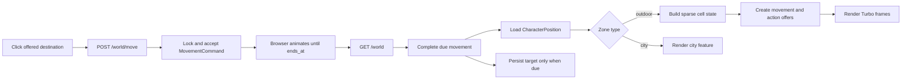

# frozen_string_literal: true
---
title: World Feature
description: Implementation handbook for the Neverlands-inspired open world, cells, movement, cell content, actions, and persisted player location.
status: Implemented MVP
updated: 2026-07-21
owners: Game world, movement, and world UI
---

# World

This document is the implementation contract for the current World feature. It explains the player-visible behavior, authoritative server state, sparse 1,000 × 1,000 region model, cell composition, timed travel, cell actions, UI ownership, security boundaries, seeds, and test coverage.

It describes what exists now. It does not turn deferred Neverlands mechanics into requirements by implication.

## 1. Design authority and related documents

Neverlands is the sole game-design reference for this feature. The local implementation adapts the observed behavior to Rails, Turbo, Stimulus, and the current English-only client; it must not be expanded with generic legacy-RPG conventions.

When behavior is uncertain or conflicts with this document:

1. Re-observe Neverlands and record the evidence in `doc/design/reference/`.
2. Update the relevant design note.
3. Change implementation and coverage together.
4. Update this feature contract last so it continues to describe shipped behavior.

Supporting documents:

- `doc/design/reference/neverlands_live_movement.md` — live movement observations.
- `doc/design/reference/neverlands_live_outdoor_npc_resource.md` — observed outdoor cell, NPC, and resource behavior.
- `doc/design/reference/neverlands_live_game_shell_ui.md` — persistent game-shell observations.
- `doc/design/areas/world_map.md` — world-area design record.
- `doc/design/features/movement.md` — movement design record.
- `doc/design/launch_mvp_plan.md` — MVP boundary and seeded topology.
- `doc/features/city.md` — city nodes, hotspots, and interior surfaces reached through the World context.
- `doc/features/game_shell.md` — persistent frame and presentation of the current World surface and same-cell presence.
- `doc/features/shop_economy.md` — Shop resume context that reuses World-owned position and safe fallback behavior.

### 1.1 Cross-feature relationships

| Related feature | Relationship | Ownership and handoff |
|---|---|---|
| `doc/features/city.md` | Outdoor entrances hand the character to a city node; city gates hand the character back to explicit outdoor cells. | World owns outdoor cells, entrance availability, and exact outdoor position; City owns its node graph and city hotspots after entry. |
| `doc/features/game_shell.md` | World bootstraps the game layout and supplies current location and same-cell player data. | World owns position queries and the central map/city payload; Game Shell owns the persistent frame, nearby-player presentation, and compact chat. |
| `doc/features/shop_economy.md` | World-owned resume context validates a saved Shop surface and falls back to World when it is unavailable. | World/City retain exact location authority; Shop owns allowlisted catalog context and exchange behavior after entry. |

## 2. Feature summary

The MVP has one outdoor region, **Outpost Surroundings**, with local coordinates from `[0, 0]` through `[999, 999]`. A character occupies exactly one cell in exactly one `Zone`. The region is sparse: cells do not require one million database rows. An in-bounds cell without an explicit template exists as ordinary, passable outdoor terrain.

The player sees a Neverlands-style 5 × 5 map viewport centered on the current cell. The server offers up to eight adjacent destinations. Clicking an offered cell starts a 30-second move; the map animates in the browser, but the server remains authoritative and changes the persisted coordinate only when the command becomes due and is completed.

A cell may compose several independent concerns:

- terrain and passability;
- one materialized hostile NPC;
- an active city entrance;
- one or more explicitly authored local actions;
- other players whose persisted position exactly matches the cell.

Every state-changing click is backed by a short-lived, character-owned server offer. Coordinates, action type, and target are revalidated when the offer is accepted. DOM data and submitted identifiers are never authority.

## 3. MVP goals and non-goals

### Goals

- Represent a Neverlands-scale 1,000 × 1,000 region without materializing every cell.
- Persist the exact player zone and coordinate across logout and login.
- Offer eight-direction timed movement with a single active command.
- Render only the small local map window required by the client.
- Compose NPC, entrance, local-action, and player presence state at a cell.
- Enter the three observed Forpost gates through explicit authored destinations.
- Start the existing NPC combat flow from a hostile cell.
- Keep all world mutation server-authoritative and authorization-covered.
- Match the compact Neverlands map language: fixed cell size, red available-cell borders, central cursor, walking indicator, and countdown.

### Non-goals

- Multiple outdoor regions or region-to-region travel.
- Rendering or downloading the entire 1,000 × 1,000 region.
- Procedural biomes, pathfinding, fog of war, or minimap discovery.
- Terrain-, encumbrance-, profession-, or skill-based travel-time modifiers.
- Automatic movement queues or click-to-path travel.
- Generic building types, levels, keys, item gates, or invented entrance rules.
- Implementing deferred `fish`, `drink`, or `dig` actions.
- Inventing gathering rewards for `Look Around` before Neverlands evidence and the corresponding inventory/economy design exist.
- Client-authoritative position changes.

## 4. Player experience

### 4.1 World screen

The authenticated root route opens `WorldController#show` in the persistent `game` layout. The controller dispatches by the current zone type:

- `outdoor` renders the world map and cell actions described here;
- `city` renders the city scene described in `doc/features/city.md`.

The outdoor screen consists of three Turbo frames:

- `available-actions` — actions for the exact current cell;
- `game-map` — the clipped map viewport and movement state;
- `location-info` — semantic cell metadata retained for accessibility and diagnostics, visually suppressed in the faithful UI.

The surrounding game shell owns navigation, character status, presence, inventory access, and chat. World partials do not recreate those systems.

### 4.2 Map presentation

- Logical cell size: `100px × 100px`.
- Visible viewport: `500px × 500px`, or 5 × 5 cells.
- Rendered buffer: 7 × 7 cells where bounds permit, clipped to create a one-cell animation gutter.
- Terrain source: `app/assets/images/world/forpost-terrain.png`, a 1,000 × 1,000 image sliced with the cell coordinate modulo 10.
- Current position: a fixed 100 × 100 overlay in the center of the viewport.
- Available destination: red 2px border, matching the observed Neverlands selection language.
- Active movement: the map layer translates toward the target while the cursor remains centered.
- Countdown: a compact red capsule one cell above the cursor.

Cells outside the logical zone can be present only as inert render-buffer placeholders at an edge. They never receive movement offers.

### 4.3 Actions on the current cell

The compact action strip displays only actions the server offered for the current state:

- **Attack** — live hostile NPC on the current cell.
- **Enter** — accessible active city entrance on the current cell.
- **Look Around** — implemented `resource_search` local action on the current cell.

No cell actions are available while movement is active. Deferred authored actions remain unavailable rather than displaying controls that imply working gameplay.

### 4.4 Players here

The player list is scoped to active characters at the exact zone and `[x, y]`, excludes the current character, and is capped at 10 entries. Supported orders are name A–Z/Z–A and level ascending/descending. The list is refreshed through `GET /world/players`; it is presence information, not authority for interaction.

## 5. Authoritative data model

| Record | Responsibility | Important contract |
|---|---|---|
| `Zone` | Coordinate space and location type | Positive width/height; MVP types are `outdoor` and `city`; outdoor bounds are checked server-side. |
| `CharacterPosition` | Durable location of one character | One row per character; active character only; coordinate must be inside its zone. This is the source of truth across sessions. |
| `MapTileTemplate` | Sparse explicit terrain/cell override | Stores a zone-name key, coordinate, passability, terrain metadata, and authored local actions. Missing in-bounds rows default to passable outdoor cells. |
| `MovementCommand` | Offered or active timed move | Captures source, target, direction, status, action key, offer expiry, and movement timestamps. |
| `WorldActionOffer` | Capability for one cell mutation | Character-owned, short-lived action tied to exact zone, coordinate, type, and polymorphic target. |
| `TileNpc` | Materialized state of a configured outdoor NPC | Tracks live/defeated state and respawn timing at an exact cell. |
| `TileBuilding` | Explicit outdoor entrance | MVP building type is only `city`; stores exact authored destination zone and coordinate. |

### 5.1 Sparse-cell rule

`MapTileTemplate` is an override table, not the region itself. Cell resolution follows this order:

1. Reject coordinates outside `Zone` bounds.
2. Use the explicit tile template when one exists.
3. Otherwise return an ordinary passable outdoor cell.
4. Independently compose active NPC, entrance, local actions, and exact-cell players.

This rule is required for a 1,000 × 1,000 MVP region. Code must not create a tile row merely because a character viewed or traversed a coordinate.

### 5.2 Local-action schema

Authored `local_actions` are validated structured data. Supported definitions are:

| Kind | Neverlands source id | Runtime action | Implemented |
|---|---|---|---|
| `resource_search` | `look` | `search_resources` | Yes |
| `fishing` | `fis` | `fish` | No |
| `drinking` | `dri` | `drink` | No |
| `digging` | `dig` | `dig` | No |

Invalid kinds, source-id mismatches, duplicates, and malformed array/object shapes are rejected. Only implemented definitions become `WorldActionOffer` rows. `Look Around` currently returns the authored observation message; it deliberately grants no invented item or currency reward.

## 6. Runtime architecture



The important boundary is that JavaScript animates an accepted command; it does not complete the command or write the position.

### 6.1 World load

`Game::Movement::MapState` first asks `CompleteMove` to finalize any due command. It then:

1. returns the active movement state without new destinations when a command is still moving;
2. otherwise cancels stale open movement offers;
3. evaluates all eight direction offsets against bounds and passability;
4. persists fresh `MovementCommand` offers with random action keys and a 10-minute offer TTL;
5. returns the map state used to render the viewport.

`WorldController` separately resolves current-cell content and rotates `WorldActionOffer` rows for the current NPC, entrance, and implemented local actions.

### 6.2 Start movement

`POST /world/move` submits direction, target coordinate, and action key. `AcceptMove`:

1. completes any command already due;
2. rejects a second active movement;
3. finds an offered command owned by the current character;
4. locks it and validates TTL, direction, source position, submitted target, bounds, and current passability;
5. changes it from `offered` to `moving`;
6. records `started_at` and `ends_at` using the server travel time;
7. cancels sibling offers.

The character remains on the source cell during the 30-second interval. Turbo responses refresh the relevant map/action frames; HTML requests redirect to the canonical world screen.

### 6.3 Complete movement

On a subsequent world-state load, `CompleteMove` locks the due command and position. It applies the target only if:

- the character still occupies the command source;
- the target is still in bounds and passable;
- the command is the current due `moving` command.

Success updates `CharacterPosition`, advances the command to `completed`, and increments the position turn marker. A moved source or newly invalid target produces a failed command instead of teleporting the character.

### 6.4 Accept a cell action

NPC attacks, entrance use, and local actions follow the same capability pattern:

1. The render pass creates a `WorldActionOffer` for the current character and exact current cell.
2. The form submits its opaque action key and expected target identifiers.
3. `WorldActionOfferPolicy` verifies ownership.
4. `Game::World::AcceptAction` locks the row and revalidates status, expiry, position, action type, and target.
5. The domain service performs the action.
6. The offer becomes `completed` or `failed`; subsequent rendering creates a fresh offer if the action is still possible.

Changing an HTML id, reusing another character's key, replaying an expired key, or moving away invalidates the action.

### 6.5 Hostile interruption

`PerformLocalAction` checks the live NPC state before resolving an implemented local action. If a hostile NPC occupies the same cell, the successful action result carries the interruption to `StartNpcFight`, which builds the shared arena combat records using the documented NPC stats. The outdoor map does not implement a separate combat engine.

## 7. HTTP and Turbo contract

| Method and path | Purpose | Success | Failure |
|---|---|---|---|
| `GET /` or `GET /world` | Render the current persisted context | Outdoor map or city scene | Authentication redirect; bootstrap spawn only when position is absent. |
| `GET /world/players` | Exact-cell player list | HTML partial/Turbo-compatible response | Authentication redirect. |
| `POST /world/move` | Accept one offered adjacent move | Turbo map/action refresh or HTML redirect | No position change; error message and restored current map. |
| `POST /world/enter_building` | Enter the offered outdoor city entrance | Position changes to explicit destination and redirects to world | Offer fails; position remains unchanged. |
| `POST /world/perform_local_action` | Execute an offered implemented cell action | Observation result or hostile fight transition | Offer fails; no reward/state invention. |
| `POST /world/interact_hotspot` | Shared city hotspot action | See `doc/features/city.md` | See city contract. |
| `POST /fight/npc` | Start combat with the offered current hostile NPC | HTML/Turbo redirects to the match; an internal JSON response exposes match id and redirect path | Reject stale, foreign, remote, or invalid target. |

There is no separately versioned public World API. HTML/Turbo is the player-facing contract; the NPC-fight JSON response is an internal integration response. Swagger/rswag and blueprint documentation are intentionally outside this feature.

## 8. Stimulus ownership

`nl_world_map_controller.js` owns only presentation and submission behavior:

- ignores cells without `data-available="true"`;
- disables remaining offers after a click;
- submits the server-authored hidden form;
- derives remaining time from server `ends_at`;
- translates the map by a fraction of one cell;
- updates the countdown;
- revisits the canonical world route when the timer reaches zero.

It must not calculate reachable destinations, invent an action key, change coordinates, or mark a command complete. Those remain service responsibilities.

## 9. Seeded MVP topology

`db/seeds.rb` creates the 1,000 × 1,000 **Outpost Surroundings** zone and only the explicit cell records needed for captured behavior.

### 9.1 Forpost entrances

| Entrance | Local coordinate | Captured source coordinate | Destination |
|---|---:|---:|---|
| West Gate | `[7, 0]` | `[1019, 1025]` | Forpost Central Square (`city2_1`) at `[0, 0]` |
| South Gate | `[10, 3]` | `[1022, 1028]` | Forpost Stables (`city2_7`) at `[0, 0]` |
| East Gate | `[13, 2]` | `[1025, 1027]` | Forpost Guild District (`city2_8`) at `[0, 0]` |

Each gate is an explicit active `TileBuilding`. There is no North gate in the captured live topology.

### 9.2 Captured outdoor content

The explicit cell at local `[7, 7]` corresponds to captured Neverlands coordinate `[1001, 999]`. It supplies the authored outdoor observation/resource context and materializes a hostile Plague Rat from `config/gameplay/outdoor_npcs.yml` with level, health, damage, experience, respawn, and loot metadata.

The config is evidence-backed content input. `TileNpcService` owns materialized runtime state; changing YAML alone is not an authorization mechanism.

### 9.3 Coordinate terminology

- **Local coordinate** is stored in `CharacterPosition`, movement records, and tile records in this app.
- **Captured source coordinate** records where the behavior was observed in Neverlands.

Do not mix the two coordinate systems in services or requests.

## 10. Persistence and login resume

`CharacterPosition` is durable and is not cleared on logout. On login, `Game::World::ResumeContext` chooses a safe route while preserving that record:

- an outdoor cell resumes the world at exactly that zone and coordinate;
- a city node resumes that exact city-zone record;
- an accessible shop or captured city building may resume its interior route;
- an invalid saved interior context falls back to the world without relocating the character.

The only location bootstrap is for a playable character with no position row: Central Square in Forpost at `[0, 0]`. A normal login never respawns or recenters an existing character.

## 11. Authorization, trust boundaries, and concurrency

- Devise authentication protects every World route.
- `CurrentCharacterContext` selects only the signed-in user's playable active character.
- `WorldActionOfferPolicy` authorizes action-offer ownership.
- Services revalidate exact zone, coordinate, action type, target, status, and expiry under locks.
- Movement uses character-owned `MovementCommand` rows and rejects concurrent active moves.
- Database state, not DOM geometry, hidden labels, or JavaScript state, decides availability.
- Building destinations come from active authored `TileBuilding` records, never arbitrary request URLs or coordinates.
- NPC actions require a current, live, hostile, same-cell materialization.
- Missing/invalid offers do not leak another character's capability.

## 12. Failure and boundary behavior

| Condition | Required behavior |
|---|---|
| Coordinate below zero or at/above zone width/height | No offer; direct submissions are rejected. |
| Missing in-bounds tile template | Ordinary passable outdoor cell. |
| Missing out-of-bounds render-buffer cell | Inert visual placeholder only. |
| Impassable explicit tile | No destination offer; revalidated on acceptance and completion. |
| Active movement | No new movement or cell-action offers. |
| Expired, cancelled, failed, or consumed key | Reject without state mutation. |
| Foreign character key | Reject without revealing or applying the action. |
| Character moved since offer creation | Reject as wrong source/current cell. |
| Submitted direction/target differs from offer | Reject as mismatch. |
| Target becomes impassable before completion | Fail command; do not update position. |
| Deferred local action definition | Do not create an offer. |
| `Look Around` with no hostile interruption | Return authored message; grant no invented reward. |
| No persisted position | Bootstrap once to Forpost Central Square. |

## 13. Acceptance criteria

- A character can traverse any offered in-bounds adjacent cell, including diagonals.
- A move lasts 30 server-measured seconds and only one move may be active.
- The UI animates the accepted move and reloads authoritative state at completion.
- The region supports local coordinates through `[999, 999]` without precreating every cell.
- Explicit impassable cells and all logical edges are enforced server-side.
- Exact-cell NPC, entrance, implemented local action, and player-presence composition renders correctly.
- West, South, and East gates enter their explicit Forpost node.
- Hostile same-cell interaction starts the shared NPC fight implementation.
- Logout/login preserves exact outdoor coordinates.
- Anonymous, expired, stale, mismatched, remote, and foreign-character actions cannot mutate state.

## 14. Test strategy and required coverage

Tests are part of the feature contract. Changes must cover the applicable model, request, policy, service, factory, view/system, and seed layers. Blueprint and Swagger/rswag coverage are intentionally not applicable because this is not a JSON API.

| Coverage category | Representative guarantees |
|---|---|
| Success | Map load, eight-direction offer, timed acceptance/completion, cell composition, gate entry, local observation, NPC fight, persisted resume. |
| Failure | Invalid key, expired offer, wrong direction/target, impassable destination, concurrent movement, stale source, inactive entrance/NPC. |
| Edge/null/boundary | Missing sparse tile, coordinate zero, `[999,999]`, negative/out-of-range coordinate, absent position bootstrap, deferred/malformed action definitions. |
| Authorization | Anonymous request, foreign movement/action offer, current-character scoping, policy ownership. |

Factories must retain edge traits for status, expiry, coordinates, passability, action types, and active/inactive content when those states are exercised.

Focused verification command:

```bash
bundle exec rspec \
  spec/helpers/world_helper_spec.rb \
  spec/models/character_gameplay_context_spec.rb \
  spec/models/character_position_spec.rb \
  spec/models/zone_spec.rb \
  spec/models/map_tile_template_spec.rb \
  spec/models/movement_command_spec.rb \
  spec/models/world_action_offer_spec.rb \
  spec/models/tile_building_spec.rb \
  spec/models/tile_npc_spec.rb \
  spec/models/open_world_seed_spec.rb \
  spec/policies/world_action_offer_policy_spec.rb \
  spec/services/game/movement \
  spec/services/game/world/accept_action_spec.rb \
  spec/services/game/world/action_offer_builder_spec.rb \
  spec/services/game/world/tile_state_resolver_spec.rb \
  spec/services/game/world/perform_local_action_spec.rb \
  spec/services/game/world/start_npc_fight_spec.rb \
  spec/services/game/world/tile_building_service_spec.rb \
  spec/services/game/world/tile_npc_service_spec.rb \
  spec/services/game/world/outdoor_npc_config_spec.rb \
  spec/requests/world_spec.rb \
  spec/requests/open_world_regions_spec.rb \
  spec/requests/world_npc_fights_spec.rb \
  spec/requests/login_resume_spec.rb \
  spec/routing/world_routing_spec.rb \
  spec/views/world \
  spec/views/layouts/game_spec.rb \
  spec/views/shared/_nl_players_list_spec.rb \
  spec/system/world_map_spec.rb \
  spec/system/world_interactions_spec.rb \
  spec/system/login_resume_spec.rb \
  spec/assets/city_image_assets_spec.rb
```

Run the complete suite before release because the world hands off to combat, city, shop, inventory, shell, presence, and login-resume behavior.

## 15. Responsible for Implementation Files

### Requirements and design evidence

- `doc/features/world.md`
- `doc/design/areas/world_map.md`
- `doc/design/features/movement.md`
- `doc/design/launch_mvp_plan.md`
- `doc/design/reference/neverlands_live_movement.md`
- `doc/design/reference/neverlands_live_outdoor_npc_resource.md`
- `doc/design/reference/neverlands_live_game_shell_ui.md`

### Routes and controllers

- `config/routes.rb`
- `app/controllers/application_controller.rb`
- `app/controllers/concerns/current_character_context.rb`
- `app/controllers/world_controller.rb`
- `app/controllers/world_npc_fights_controller.rb`

### Models and policy

- `app/models/character.rb`
- `app/models/zone.rb`
- `app/models/spawn_point.rb`
- `app/models/character_position.rb`
- `app/models/map_tile_template.rb`
- `app/models/movement_command.rb`
- `app/models/world_action_offer.rb`
- `app/models/tile_building.rb`
- `app/models/tile_npc.rb`
- `app/models/npc_template.rb`
- `app/policies/world_action_offer_policy.rb`

### Movement services

- `app/services/game/movement/directions.rb`
- `app/services/game/movement/travel_time.rb`
- `app/services/game/movement/tile_provider.rb`
- `app/services/game/movement/movement_validator.rb`
- `app/services/game/movement/movement_violation_error.rb`
- `app/services/game/movement/command_queue.rb`
- `app/services/game/movement/map_state.rb`
- `app/services/game/movement/accept_move.rb`
- `app/services/game/movement/complete_move.rb`
- `app/services/game/movement/respawn_service.rb`

### World-content services

- `app/services/game/world/action_offer_builder.rb`
- `app/services/game/world/accept_action.rb`
- `app/services/game/world/tile_state_resolver.rb`
- `app/services/game/world/tile_building_service.rb`
- `app/services/game/world/outdoor_npc_config.rb`
- `app/services/game/world/tile_npc_service.rb`
- `app/services/game/world/perform_local_action.rb`
- `app/services/game/world/start_npc_fight.rb`
- `app/services/game/world/resume_context.rb`

### Views, client behavior, styling, and assets

- `app/helpers/world_helper.rb`
- `app/views/layouts/game.html.erb`
- `app/views/shared/_nl_players_list.html.erb`
- `app/views/world/show.html.erb`
- `app/views/world/_map.html.erb`
- `app/views/world/_actions.html.erb`
- `app/views/world/_location_info.html.erb`
- `app/javascript/controllers/game_layout_controller.js`
- `app/javascript/controllers/nl_world_map_controller.js`
- `app/assets/stylesheets/nl/world.css`
- `app/assets/stylesheets/nl/shell.css`
- `app/assets/stylesheets/nl/chat_presence.css`
- `app/assets/images/world/forpost-terrain.png`
- `app/assets/images/gate.png`

### Integrated NPC-combat entry

- `app/models/arena_match.rb`
- `app/models/arena_participation.rb`
- `app/services/arena/combat_processor.rb`

World owns same-cell hostile validation and match creation. Arena owns the combat lifecycle after `StartNpcFight` hands off the created match.

### Content, seeds, and schema

- `config/gameplay/outdoor_npcs.yml`
- `db/seeds.rb`
- `db/schema.rb`

### Factories

- `spec/factories/spawn_points.rb`
- `spec/factories/zones.rb`
- `spec/factories/character_positions.rb`
- `spec/factories/map_tile_templates.rb`
- `spec/factories/movement_commands.rb`
- `spec/factories/world_action_offers.rb`
- `spec/factories/tile_buildings.rb`
- `spec/factories/tile_npcs.rb`

### Specs

- `spec/helpers/world_helper_spec.rb`
- `spec/models/character_gameplay_context_spec.rb`
- `spec/models/character_position_spec.rb`
- `spec/models/zone_spec.rb`
- `spec/models/map_tile_template_spec.rb`
- `spec/models/movement_command_spec.rb`
- `spec/models/world_action_offer_spec.rb`
- `spec/models/tile_building_spec.rb`
- `spec/models/tile_npc_spec.rb`
- `spec/models/open_world_seed_spec.rb`
- `spec/policies/world_action_offer_policy_spec.rb`
- `spec/services/game/movement/`
- `spec/services/game/world/accept_action_spec.rb`
- `spec/services/game/world/action_offer_builder_spec.rb`
- `spec/services/game/world/tile_state_resolver_spec.rb`
- `spec/services/game/world/tile_building_service_spec.rb`
- `spec/services/game/world/outdoor_npc_config_spec.rb`
- `spec/services/game/world/tile_npc_service_spec.rb`
- `spec/services/game/world/perform_local_action_spec.rb`
- `spec/services/game/world/start_npc_fight_spec.rb`
- `spec/requests/world_spec.rb`
- `spec/requests/open_world_regions_spec.rb`
- `spec/requests/world_npc_fights_spec.rb`
- `spec/requests/login_resume_spec.rb`
- `spec/routing/world_routing_spec.rb`
- `spec/views/world/`
- `spec/views/layouts/game_spec.rb`
- `spec/views/shared/_nl_players_list_spec.rb`
- `spec/system/world_map_spec.rb`
- `spec/system/world_interactions_spec.rb`
- `spec/system/login_resume_spec.rb`
- `spec/assets/city_image_assets_spec.rb`

## 16. Safe extension checklist

Before extending the World feature:

1. Capture the corresponding Neverlands behavior and UI.
2. State whether the change affects sparse cell resolution, movement, cell composition, or another feature reached from the cell.
3. Keep server offers and exact-position revalidation for every new mutation.
4. Do not place game authority in CSS geometry, Stimulus state, or submitted labels.
5. Add only the models/services needed for the captured MVP behavior.
6. Update seeds/config only for explicit authored content.
7. Add success, failure, edge/null/boundary, and authorization coverage where applicable.
8. Update this document's non-goals, acceptance criteria, responsible files, and version history.

## 17. Version history

| Date | Change |
|---|---|
| 2026-07-21 | Created the implementation handbook for the shipped MVP open world, sparse cells, movement lifecycle, outdoor interactions, persistence, and coverage. |
| 2026-07-21 | Added reciprocal ownership and handoff references for City, Game Shell, and Shop resume integration. |
